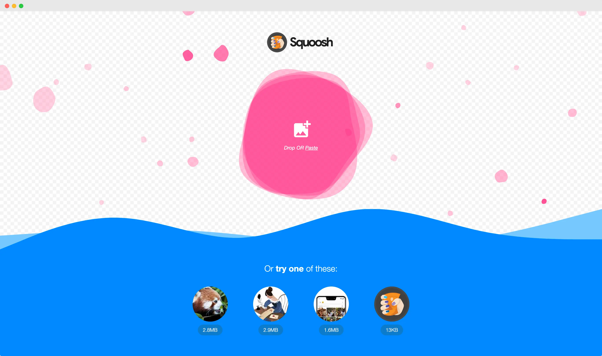
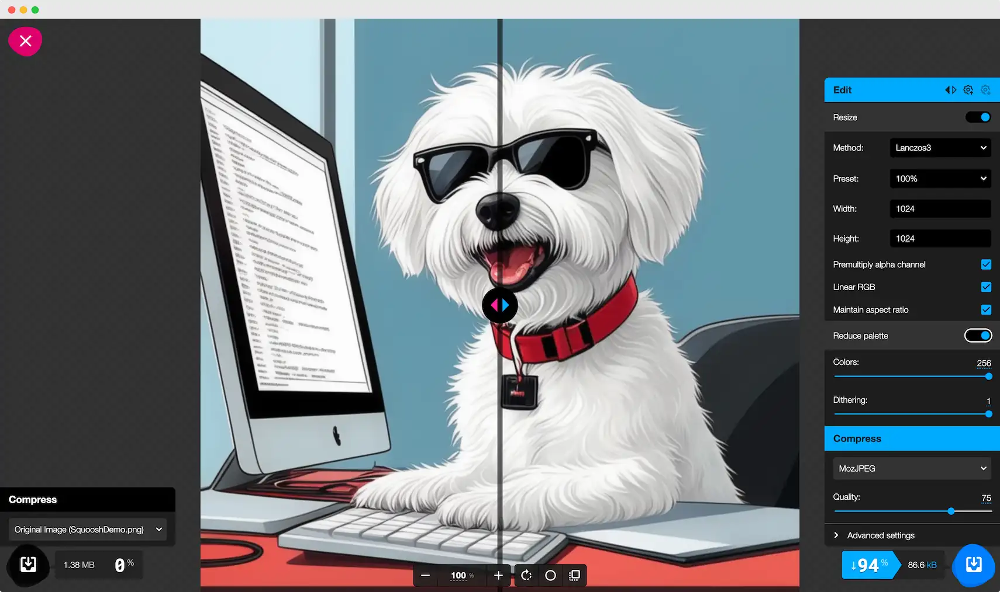

## はじめに

近年、Webサイトの表示速度の重要性が高まっています。表示速度が遅いと、ユーザーエクスペリエンスが低下し、サイトの離脱率が上昇してしまいます。表示速度を改善する方法の一つが、画像の最適化です。画像ファイルのサイズを減らすことで、Webサイトの読み込み時間を短縮できます。

画像圧縮ツールの中でも、Squooshは特に注目に値するオープンソースプロジェクトです。Squooshは、Google Chrome Labsによって開発されたWebベースの画像圧縮ツールであり、複数の画像フォーマットに対応しています。ユーザーはブラウザ上で直感的に操作できるインターフェースを通じて、画像の圧縮レベルを調整したり、リサイズしたりすることができます。

本記事では、Squooshの特徴や利点を詳しく解説し、実際の使用方法を紹介します。また、他の画像圧縮ツールとの比較を通じて、Squooshの優位性についても検討します。Webサイトのパフォーマンス改善に興味がある方は、ぜひSquooshを試してみてください。



https://squoosh.app/

## Squooshの特徴
### 1. Webベースのツールであること

Squooshは、ブラウザ上で動作するWebアプリケーションです。専用のソフトウェアをインストールする必要がなく、URLにアクセスするだけですぐに利用できます。また、画像の処理はすべてローカル環境で行われるため、クラウドサービスにデータをアップロードする必要がありません。

### 2. 複数の画像フォーマットに対応していること
Squooshは、JPEG、PNG、WebP、AVIFなど、主要な画像フォーマットに対応しています。アップロードされた画像のフォーマットを自動的に判別し、それぞれに適した圧縮設定を提示してくれます。ユーザーは出力フォーマットを選択することで、用途に応じた最適な画像を生成できます。

### 3. 圧縮レベルの調整が可能なこと
Squooshには、圧縮レベルを細かく調整できるスライダーが用意されています。画質と圧縮率のバランスを視覚的に確認しながら、最適な設定を見つけることができます。さらに、画像フォーマットごとに固有の圧縮オプションが提供されており、より高度な調整が可能です。

### 4. リサイズ機能の搭載
Squooshは、画像のリサイズ機能も内蔵しています。幅や高さを指定することで、アスペクト比を維持したままリサイズできます。また、不要な部分をトリミングして、画像を最適なサイズに調整することも可能です。この機能により、Webサイトやアプリケーションに最適な画像サイズを簡単に作成できます。


### 5. 使いやすいインターフェース

Squooshは、シンプルで直感的なユーザーインターフェースを備えています。画像のアップロードはドラッグ＆ドロップで行え、プレビュー画面では圧縮前後の画像を並べて比較できます。各機能や設定オプションが分かりやすく配置されているため、初心者でも迷うことなく操作できるでしょう。



## Squoosh CLI

Squooshは、Webアプリケーションとしてだけでなく、コマンドラインインターフェース（CLI）としても利用できます。Squoosh CLIを使うことで、画像の最適化をバッチ処理したり、自動化したりすることが可能です。

:::warning
Project no longer maintained

メンテナンス終了しているようなので注意が必要です
:::

### インストール方法

Squoosh CLIを使用するには、Node.jsがインストールされている必要があります。

Node.jsがインストールされていれば、以下のコマンドでSquoosh CLIをグローバルにインストールできます。

```
npm install -g @squoosh/cli
```

### 基本的な使い方

Squoosh CLIの基本的な使い方は以下の通りです。

```
squoosh-cli [options] <input> [output]
```

- `[options]`: 圧縮オプションを指定します。例えば、`--mozjpeg '{"quality":75}'`のように、使用するコーデックとそのオプションを指定します。
- `<input>`: 入力ファイルまたはディレクトリを指定します。
- `[output]`: 出力ファイルまたはディレクトリを指定します。省略した場合、入力ファイルは上書きされます。

### 使用例

以下は、Squoosh CLIを使用する具体的な例です。

1. JPEGファイルを圧縮する場合：
```
squoosh-cli --mozjpeg '{"quality":75}' image.jpg
```

2. PNGファイルを圧縮する場合：
```
squoosh-cli --oxipng '{"level":3}' image.png
```

3. ディレクトリ内のすべての画像を圧縮する場合：
```
squoosh-cli --mozjpeg '{"quality":75}' --oxipng '{"level":3}' images/ optimized/
```

Squoosh CLIには他にも多くのオプションがあります。詳細については、公式ドキュメント (https://www.npmjs.com/package/@squoosh/cli) を参照してください。

Squoosh CLIを活用することで、大量の画像を一括で最適化したり、ビルドプロセスに画像の最適化を組み込んだりすることができます。Webアプリケーションと組み合わせることで、より効率的な画像の最適化ワークフローを構築できるでしょう。

## Squooshの活用例

Squooshは、様々な場面で画像の最適化に役立ちます。ここでは、Squooshの代表的な活用例をいくつか紹介します。

### 1. Webサイトの表示速度改善
Webサイトに大容量の画像を使用していると、ページの読み込み時間が長くなり、ユーザーエクスペリエンスが低下します。Squooshを使って画像を圧縮することで、ファイルサイズを削減し、Webサイトの表示速度を改善できます。特にモバイルユーザーにとって、表示速度の向上は大きなメリットとなります。

### 2. モバイルアプリの容量削減
モバイルアプリに含まれる画像は、アプリの容量を大きく占めています。Squooshで画像を圧縮することで、アプリの容量を削減し、ダウンロード時間を短縮できます。また、端末のストレージ容量を節約できるため、ユーザーにとってもメリットがあります。

### 3. ストレージ容量の節約
大量の画像ファイルを保存していると、ストレージ容量を圧迫してしまいます。Squooshを使って画像を圧縮すれば、同じ枚数の画像を保存しつつ、ストレージ容量を節約できます。クラウドストレージを利用している場合は、費用の削減にもつながります。

### 4. ソーシャルメディアへの投稿
ソーシャルメディアに画像を投稿する際、ファイルサイズの制限に注意が必要です。Squooshで画像を圧縮すれば、制限内のサイズに収めつつ、高画質を維持できます。また、投稿した画像の読み込み速度が向上するため、フォロワーにとっても見やすくなります。

### 5. メールの添付ファイル
大容量の画像ファイルをメールに添付すると、送信に時間がかかったり、受信者の容量制限を超えてしまったりすることがあります。Squooshで画像を圧縮してからメールに添付すれば、このような問題を回避できます。また、受信者がダウンロードする際の時間も短縮されます。

## まとめ

Squooshは、Webベースのツールでありながら、多様な画像フォーマットに対応し、圧縮オプションの詳細な設定が可能です。また、リサイズ機能を内蔵しており、画像の最適化に必要な機能を一通り備えています。

Squooshの活用例として、Webサイトの表示速度改善、モバイルアプリの容量削減、ストレージ容量の節約、ソーシャルメディアへの投稿、メールの添付ファイルなどが挙げられます。画像を扱う様々な場面で、Squooshは効果的に活用できるでしょう。

今後、Squooshがオープンソースプロジェクトとして継続的に改善されていくことを期待しています。新たな機能の追加や、さらなる使いやすさの向上により、Squooshがより多くのユーザーに愛用されるツールになることを願っています。

画像の最適化は、Webサイトやアプリケーションのパフォーマンス改善に欠かせない作業です。Squooshを上手に活用して、ユーザーにとって快適な体験を提供していきましょう。

本記事がSquooshの理解と活用の一助となれば幸いです。
