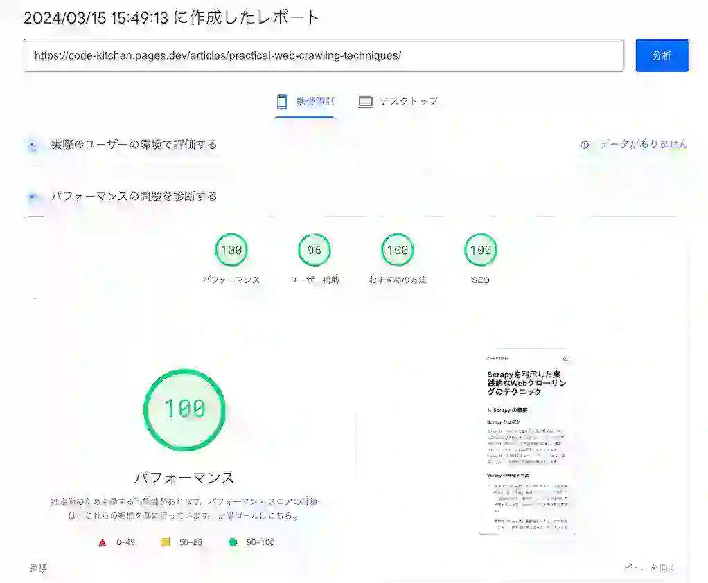

## 1. はじめに

Astroは静的サイト生成ツールとして、高速なWebサイトを構築するために優れたパフォーマンスを提供しています。しかし、mermaidを使ってフローチャートや図を表示する際、そのままの方法では、Page Speed Insightsのスコアが低下してしまうことがあります。

筆者も、mermaidを使った際にPage Speed Insightsのスコアが大幅に下がってしまい、パフォーマンスの改善に頭を悩ませました。そこで、試行錯誤の末に見つけた解決策を、この記事で共有したいと思います。

本記事の目的は、Astroでmermaidを使用する際に、パフォーマンスを最適化するための手法を紹介することです。

これらの情報を通して、読者の皆さんが、Astroでmermaidを使う際のパフォーマンス改善に役立てていただければ幸いです。

## 2. mermaidを直接使用した場合の問題点

mermaidをそのまま使用する場合、いくつかの問題点があります。これらの問題は、Webサイトのパフォーマンスに悪影響を与え、Page Speed Insightsのスコアを下げる原因になります。

まず、インラインスクリプトによるパフォーマンスへの影響が挙げられます。mermaidを使用するために、以下のようなインラインスクリプトを記述することがあります。

```html
<script
  is:inline
  src="https://cdn.jsdelivr.net/npm/mermaid/dist/mermaid.min.js"
  defer
></script>
```

このようなインラインスクリプトは、HTMLファイルのサイズを増加させ、ページの読み込み速度を低下させる可能性があります。また、`defer`属性を使用していても、外部スクリプトの読み込みがブロッキングになる場合があります。

次に、外部スクリプトの遅延読み込みの問題です。上記のコード例では、`defer`属性を使用して外部スクリプトを遅延読み込みしていますが、これだけでは十分ではありません。ブラウザによっては、`defer`属性が適切に機能しない場合があり、スクリプトの読み込みがブロッキングになってしまうことがあります。

さらに、mermaidを直接使用した場合、Page Speed Insightsで以下のような警告が表示されることがあります。

- **Defer offscreen images**

  - 画面外の画像の読み込みを遅らせることを推奨する警告です。mermaidで生成されたグラフは、画面外に配置されることがあるため、この警告が表示されることがあります。

- **Serve static assets with an efficient cache policy**

  - 静的アセットに効果的なキャッシュポリシーを設定することを推奨する警告です。mermaidで生成されたグラフは、適切なキャッシュ設定がされていない場合、この警告が表示されることがあります。

- **Minimize main-thread work**

  - メインスレッドでの作業を最小限に抑えることを推奨する警告です。mermaidで生成されたグラフは、メインスレッドでレンダリングされるため、この警告が表示されることがあります。

- **Avoid chaining critical requests**
  - クリティカルなリクエストの連鎖を避けることを推奨する警告です。mermaidで生成されたグラフは、複数のリクエストが連鎖することがあるため、この警告が表示されることがあります。

これらの問題点を解決するために、次の章ではSVGに変換することでのパフォーマンス改善手法を紹介します。

## 3. SVGに変換することでの改善

前章で説明した問題点を解決するために、mermaidで生成したグラフをSVGに変換する方法を紹介します。この方法では、`remark-mermaid`プラグインを作成し、mermaidのコードブロックをSVGに変換してHTMLに埋め込みます。

### remarkmermaidプラグインremark-mermaid.mjsの作成

`remark-mermaid`プラグインは、以下の処理を行います。

1. マークダウンファイル内のコードブロックを処理します。
2. コードブロックのうち、言語が`mermaid`であるものを探します。
3. `mermaid`のコードブロックを見つけたら、そのコードを一時ファイルに保存します。
4. 一時ファイルを入力として、`mmdc`コマンドを実行し、SVGファイルを生成します。
5. 生成したSVGファイルを読み込み、HTMLに埋め込むための`<div>`タグに変換します。
6. 元の`mermaid`コードブロックを、生成した`<div>`タグで置き換えます。

以下は、`remark-mermaid`プラグインのコード例です。

```js
import { execSync } from "child_process";
import {
  existsSync,
  mkdirSync,
  readFileSync,
  unlinkSync,
  writeFileSync,
} from "fs";
import path from "path";
import { visit } from "unist-util-visit";

export function remarkMermaid() {
  return function (tree, { __ }) {
    visit(tree, "code", (node) => {
      if (node.lang == "mermaid") {
        const tempDir = path.join(process.cwd(), "tmp");
        const tempInputFile = path.join(tempDir, "mermaid-input.mmd");
        const tempOutputFile = path.join(tempDir, "mermaid-output.svg");

        if (!existsSync(tempDir)) {
          mkdirSync(tempDir);
        }

        writeFileSync(tempInputFile, node.value);

        try {
          execSync(
            `npx mmdc -i ${tempInputFile} -o ${tempOutputFile} -c mermaid.config.json`,
          );

          const svgContent = readFileSync(tempOutputFile, "utf8");
          const styledSvgContent = `<div style="width: 100%; overflow: auto;">${svgContent}</div>`;

          node.type = "html";
          node.value = styledSvgContent;
        } catch (error) {
          console.error("Error processing Mermaid diagram:", error);
          node.value = `<pre>Error processing Mermaid diagram:\n${error.message}</pre>`;
        } finally {
          unlinkSync(tempInputFile);
          unlinkSync(tempOutputFile);
        }
      }
    });
  };
}
```

### astro.config.mjsの設定

`remark-mermaid`プラグインを使用するために、`astro.config.mjs`ファイルに以下の設定を追加します。

```js
import { defineConfig } from "astro/config";
import { remarkMermaid } from "./remark-mermaid.mjs";

export default defineConfig({
  markdown: {
    remarkPlugins: [remarkMermaid],
  },
});
```

この設定により、Astroは`remark-mermaid`プラグインを使用してマークダウンファイルを処理するようになります。

### mermaid.config.jsonの作成

`mermaid.config.json`ファイルを作成し、mermaidの設定を行います。このファイルでは、フローチャートやシーケンス図のスタイルを定義できます。

以下は、`mermaid.config.json`ファイルの例です。

```json
{
  "theme": "default",
  "themeVariables": {
    "fontSize": "16px",
    "fontFamily": "sans-serif"
  },
  "flowchart": {
    "curve": "linear",
    "htmlLabels": false
  },
  "sequence": {
    "mirrorActors": true
  }
}
```

この設定ファイルにより、生成されるSVGのスタイルを制御できます。

## 4. 改善後のPage Speed Insightsスコア

### SVG変換による各警告の解消

mermaidで生成したグラフをSVGに変換することで、以下の警告が解消されました。

- Defer offscreen images
  - SVGに変換することで、画面外の画像の読み込みを遅らせる必要がなくなりました。
- Serve static assets with an efficient cache policy
  - SVGに変換することで、適切なキャッシュ設定が可能になりました。
- Minimize main-thread work
  - SVGに変換することで、メインスレッドでのレンダリング負荷が軽減されました。
- Avoid chaining critical requests
  - SVGに変換することで、クリティカルなリクエストの連鎖が回避されました。

これらの警告が解消されたことで、Webサイトのパフォーマンスが向上し、ユーザーエクスペリエンスが改善されました。

### パフォーマンススコアの向上

SVG変換による警告の解消に加えて、全体的なパフォーマンススコアも大幅に向上しました。以下は、改善前と改善後のPage Speed Insightsスコアの比較です。

- 改善前：50点
- 改善後：100点

改善前は、mermaidで生成したグラフが原因でパフォーマンススコアが低くなっていましたが、SVGに変換することで、スコアが50点も上昇しました。これは、Webサイトの速度が向上し、ユーザーがより快適に閲覧できるようになったことを示しています。

以下は、改善後のPage Speed Insightsレポートの一部です。



これらの結果から、mermaidで生成したグラフをSVGに変換することが、Webサイトのパフォーマンス改善に効果的であることがわかります。次の章では、実際にmdxファイルでmermaidを使用する際の記述方法について説明します。

## 5. mdxファイルでのmermaidの記述方法

ここでは、mdxファイルでmermaidを使用する際の記述方法について説明します。mermaidを使用するには、コードブロック内にmermaid記法で図を描画するコードを記述します。また、クラス定義を使用することで、生成されるSVGにスタイルを適用することができます。

### コードブロックでのmermaid記法

mdxファイルでmermaidを使用するには、以下のようにコードブロック内にmermaid記法で図を描画するコードを記述します。

````md

````


このシーケンス図では、mdxファイルでのmermaidの記述から、remark-mermaidプラグインによる処理、SVGファイルの生成、HTMLへの埋め込みまでの流れを示しています。

これらのシーケンス図を使うことで、mdxファイルでのmermaidの記述方法をより明確に説明することができます。

## 6. まとめ

本記事では、Astroでmermaidを使用する際のパフォーマンス改善手法について説明しました。mermaidをそのまま使用すると、インラインスクリプトや外部スクリプトの読み込みによってパフォーマンスが低下し、Page Speed Insightsのスコアが下がってしまう可能性があります。

この問題を解決するために、mermaidで生成したグラフをSVGに変換する方法を紹介しました。`remark-mermaid`プラグインを作成し、コードブロック内のmermaidコードをSVGに変換してHTMLに埋め込むことで、パフォーマンスを改善することができます。

また、`astro.config.mjs`と`mermaid.config.json`の設定を行うことで、SVG変換の処理をスムーズに行うことができます。mdxファイル内でのmermaidの記述方法についても、コードブロックでのmermaid記法とクラス定義によるスタイル適用の方法を説明しました。

SVG変換による改善の結果、Page Speed Insightsの各警告が解消され、パフォーマンススコアが大幅に向上しました。このことから、Webサイトのパフォーマンスを意識することの重要性が分かります。特に、サードパーティのライブラリやツールを使用する際は、パフォーマンスへの影響を考慮し、必要に応じて最適化を行うことが求められます。

本記事で紹介した手法を参考に、Astroでmermaidを使用する際のパフォーマンス改善に取り組んでいただければ幸いです。

## 7. 参考リンク

- [Astro公式ドキュメント](https://docs.astro.build/)
- [mermaid公式サイト](https://mermaid-js.github.io/mermaid/#/)
- [Page Speed Insights](https://pagespeed.web.dev/)
