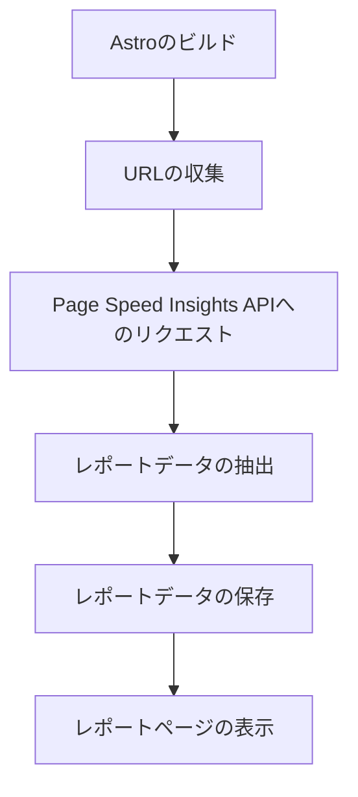

## 1. はじめに

近年、Webサイトのパフォーマンスは、ユーザーエクスペリエンスや検索エンジンのランキングに大きな影響を与えるようになっています。高速で応答性の良いWebサイトは、ユーザーの満足度を高め、コンバージョン率の向上にもつながります。一方、遅いWebサイトは、ユーザーを失望させ、離脱率の増加を招く可能性があります。

このような状況の中、Webサイトのパフォーマンスを継続的に管理することが非常に重要になっています。定期的にパフォーマンスを測定し、問題を特定して改善することで、ユーザーにとって最適な体験を提供し、ビジネスの成果を向上させることができます。

しかし、手動でパフォーマンスをチェックするのは、時間がかかり、労力も要します。特に、多くのページを持つWebサイトの場合、すべてのページを個別にチェックするのは現実的ではありません。ここで、自動化されたパフォーマンスモニタリングの必要性が出てきます。

Google の Page Speed Insights は、Webページの速度とパフォーマンスを分析するための無料のツールです。このツールを使用することで、ページの読み込み時間、インタラクティブ性、視覚的安定性などの重要な指標を測定し、改善のための具体的な提案を得ることができます。

ただし、Page Speed Insights を手動で使用するだけでは、継続的なパフォーマンス管理は難しいでしょう。そこで、静的サイトジェネレータである Astro に Page Speed Insights を組み込み、自動化されたパフォーマンスモニタリングを実現する方法を探ります。これにより、Webサイトのパフォーマンスを定期的にチェックし、問題をいち早く発見して改善に役立てることができるでしょう。

## 2. Page Speed Insights とは

Page Speed Insights (PSI) は、Google が提供するWeb ページのパフォーマンス分析ツールです。このツールは、特定のURL に対して、モバイルとデスクトップの両方の環境でページの速度とユーザーエクスペリエンスを測定し、改善のための提案を提供します。

PSI は、主に以下の指標を使用してページのパフォーマンスを評価します。

1. **First Contentful Paint (FCP)**: ページが読み込み始めてから、最初のテキストや画像が表示されるまでの時間を測定します。この指標は、ユーザーにとってページが応答し始めたと感じる時間を表します。

2. **Largest Contentful Paint (LCP)**: ページの主要なコンテンツが表示されるまでの時間を測定します。この指標は、ユーザーがページの主要な部分を見ることができるようになるまでの時間を表します。

3. **First Input Delay (FID)**: ユーザーが最初にページとインタラクションを行ってから、ブラウザがそのインタラクションに応答できるようになるまでの時間を測定します。この指標は、ページの操作性とインタラクティブ性を表します。

4. **Cumulative Layout Shift (CLS)**: ページの読み込み中に発生する予期しないレイアウトのシフト（要素の移動）を数値化します。この指標は、ページの視覚的安定性を表します。

これらの指標に加えて、PSI は、ページの速度に影響を与える要因についても詳細な情報を提供します。例えば、サーバーの応答時間、リソースのサイズ、未使用の JavaScript など、改善の余地がある箇所を特定し、具体的な最適化の提案を行います。

PSI のレポートを活用することで、Web サイトのパフォーマンスを総合的に評価し、ユーザーエクスペリエンスの向上につなげることができます。例えば、以下のような改善策を検討できます。

- 画像の最適化と圧縮
- 不要な JavaScript と CSS の削除
- クリティカルレンダリングパスの最適化
- キャッシュとCDN の活用
- サーバーサイドレンダリングの導入

これらの改善策を実施することで、ページの読み込み速度を向上させ、ユーザーにとってより快適なWeb サイトを提供することができるでしょう。

PSI は、単発的なパフォーマンスチェックだけでなく、継続的なモニタリングにも活用できます。定期的にPSI を実行し、指標の変化を追跡することで、パフォーマンスの傾向を把握し、改善の効果を確認できます。次のセクションでは、Astro でのレポートページ追加の目的について説明し、PSI を活用した自動化の利点を探ります。

## 3. Astro でのレポートページ追加の目的

Astro は、モダンな静的サイトジェネレータであり、React、Vue、Svelte などの人気のあるフレームワークとの統合が可能です。Astro を使用することで、高速でSEO フレンドリーな静的Web サイトを構築できます。また、Astro の柔軟性により、ビルドプロセスをカスタマイズし、追加の機能を組み込むことができます。

この柔軟性を活かして、Astro に Page Speed Insights のレポートページを追加する主な目的は以下の通りです。

1. **複数ページのパフォーマンスを一括で確認したい**

Web サイトが多くのページで構成されている場合、それぞれのページのパフォーマンスを個別にチェックするのは非常に時間がかかります。レポートページを追加することで、Web サイトの全ページのパフォーマンス指標を一覧で確認できるようになります。これにより、パフォーマンスの問題がある箇所を素早く特定し、改善の優先順位を決定できます。

2. **定期的なパフォーマンスのモニタリングを行いたい**

Web サイトのパフォーマンスは、時間の経過とともに変化する可能性があります。新しいコンテンツの追加、機能の更新、外部リソースの変更などによって、パフォーマンスが低下することがあります。定期的にパフォーマンスをモニタリングすることで、このような変化を早期に発見し、適切な対策を講じることができます。

Astro にレポートページを追加することで、ビルドプロセスの一部としてパフォーマンスの測定を自動化できます。これにより、Web サイトの更新ごとにパフォーマンスをチェックし、継続的なモニタリングを実現できます。

3. **Astro の柔軟性を活かしたレポートページの実装**

Astro の柔軟なアーキテクチャを活用することで、レポートページを自由にカスタマイズできます。例えば、以下のような機能を追加できます。

- パフォーマンス指標のグラフや図表の表示
- 経時的な変化の追跡とトレンドの可視化
- 改善のための提案や優先順位の表示
- レポートのエクスポートとメール通知

これらの機能を組み込むことで、より詳細で実用的なパフォーマンスレポートを生成できます。また、Astro のコンポーネントベースのアプローチにより、レポートページの見た目やレイアウトを柔軟にカスタマイズできます。

以上の目的を達成するために、次のセクションでは、Astro でのレポートページの実装手順について説明します。

## 4. レポートページの実装手順

### 4.1 必要なパッケージのインストール

まず、以下のパッケージをプロジェクトにインストールします。

- `node-fetch`: Page Speed Insights API にHTTP リクエストを送信するために使用します。
- `tsx`: TypeScript のスクリプトを実行するために使用します。

以下のコマンドを実行して、これらのパッケージをインストールします。

```bash
npm install node-fetch tsx
```

### 4.2 レポートページの作成

次に、`src/pages/speed-insights/index.astro` ファイルを作成し、レポートページを実装します。

```astro
---
import Layout from "../../layouts/Layout.astro";
import reportData from "../../../public/insights/data.json";

interface ReportData {
  url: string;
  id: string;
  score: number;
}

const reports: Record<string, Record<string, number>> = {};

reportData.forEach((data: ReportData) => {
  const { url, id, score } = data;
  if (!reports[url]) {
    reports[url] = {};
  }
  reports[url][id] = score;
});
---

<Layout>
  <h1>PageSpeed Insights Report</h1>
  <table>
    <thead>
      <tr>
        <th>URL</th>
        <th>Performance</th>
        <th>Accessibility</th>
        <th>Best Practices</th>
        <th>SEO</th>
      </tr>
    </thead>
    <tbody>
      {
        Object.entries(reports).map(([url, scores]) => (
          <tr>
            <td>{url}</td>
            <td>{scores.performance ?? "-"}</td>
            <td>{scores.accessibility ?? "-"}</td>
            <td>{scores["best-practices"] ?? "-"}</td>
            <td>{scores.seo ?? "-"}</td>
          </tr>
        ))
      }
    </tbody>
  </table>
</Layout>
```

このコードでは、`public/insights/data.json` ファイルからレポートデータを読み込み、表形式でパフォーマンススコアを表示します。

### 4.3 データ取得スクリプトの作成

次に、`src/scripts/speed-insights.ts` ファイルを作成し、Page Speed Insights からデータを取得するスクリプトを実装します。

```typescript
import fs from "fs/promises";
import fetch from "node-fetch";
import path from "path";

interface PageSpeedApiResponse {
  captchaResult: string;
  kind: string;
  id: string;
  loadingExperience: LoadingExperience;
  originLoadingExperience: OriginLoadingExperience;
  lighthouseResult: LighthouseResult;
  analysisUTCTimestamp: string;
}

interface LoadingExperience {
  id: string;
  metrics: LoadingExperienceMetrics;
  overall_category: string;
  initial_url: string;
}

interface LoadingExperienceMetrics {
  FIRST_CONTENTFUL_PAINT_MS: Metric;
  FIRST_INPUT_DELAY_MS: Metric;
}

interface Metric {
  percentile: number;
  distributions: Distribution[];
  category: string;
}

interface Distribution {
  min: number;
  max?: number;
  proportion: number;
}

interface OriginLoadingExperience {
  id: string;
  metrics: OriginLoadingExperienceMetrics;
  overall_category: string;
  initial_url: string;
}

interface OriginLoadingExperienceMetrics {
  FIRST_CONTENTFUL_PAINT_MS: Metric;
  FIRST_INPUT_DELAY_MS: Metric;
}

interface LighthouseResult {
  requestedUrl: string;
  finalUrl: string;
  lighthouseVersion: string;
  userAgent: string;
  fetchTime: string;
  environment: Environment;
  runWarnings: any[];
  configSettings: ConfigSettings;
  audits: Audits;
  categories: Categories;
  categoryGroups: CategoryGroups;
  i18n: I18n;
}

interface Environment {
  networkUserAgent: string;
  hostUserAgent: string;
  benchmarkIndex: number;
}

interface ConfigSettings {
  emulatedFormFactor: string;
  locale: string;
  onlyCategories: string[];
}

interface Audits {
  [key: string]: Audit;
}

interface Audit {
  id: string;
  title: string;
  description: string;
  score: number;
  scoreDisplayMode: string;
  displayValue?: string;
  details?: AuditDetails;
}

interface AuditDetails {
  headings: any[];
  type: string;
  items: any[];
  overallSavingsMs: number;
}

type CategoryId =
  | "performance"
  | "accessibility"
  | "best-practices"
  | "seo"
  | "pwa";
type Strategy = "mobile" | "desktop";

interface Categories {
  [key: string]: Category;
}

interface Category {
  id: CategoryId;
  title: string;
  score: number;
  auditRefs: AuditRef[];
}

interface AuditRef {
  id: string;
  weight: number;
  group: string;
}

interface CategoryGroups {
  [key: string]: CategoryGroup;
}

interface CategoryGroup {
  title: string;
  description: string;
}

interface I18n {
  rendererFormattedStrings: RendererFormattedStrings;
}

interface RendererFormattedStrings {
  varianceDisclaimer: string;
  opportunityResourceColumnLabel: string;
  opportunitySavingsColumnLabel: string;
  errorMissingAuditInfo: string;
  errorLabel: string;
  warningHeader: string;
  auditGroupExpandTooltip: string;
  passedAuditsGroupTitle: string;
  notApplicableAuditsGroupTitle: string;
  manualAuditsGroupTitle: string;
  toplevelWarningsMessage: string;
  scorescaleLabel: string;
  crcLongestDurationLabel: string;
  crcInitialNavigation: string;
  lsPerformanceCategoryDescription: string;
  labDataTitle: string;
}

interface ReportData {
  url: string;
  id: CategoryId;
  score: number;
}

const base_url: string = "https://code-kitchen.tech";

const getUrlsFromAstroBuild = async (): Promise<string[]> => {
  const distDir = path.join(process.cwd(), "dist");
  const articleDir = path.join(distDir, "articles");
  const files = await fs.readdir(articleDir);

  const urls: string[] = [];

  for (const file of files) {
    const articlePath = path.join(articleDir, file, "index.html");
    try {
      await fs.access(articlePath);
      const url = `${base_url}/articles/${file}/`;
      urls.push(url);
    } catch (error) {
      console.warn(`Skipping ${file} directory, index.html not found.`);
    }
  }

  return urls;
};

const fetchPageSpeedData = async (
  url: string,
  categoryId: CategoryId,
  apiKey: string,
  strategy: Strategy = "mobile",
): Promise<PageSpeedApiResponse> => {
  const apiUrl = `https://www.googleapis.com/pagespeedonline/v5/runPagespeed?url=${encodeURIComponent(
    url,
  )}&key=${apiKey}&category=${categoryId}&strategy=${strategy}`;
  const response = await fetch(apiUrl);
  return response.json() as Promise<PageSpeedApiResponse>;
};

const extractReportData = (
  response: PageSpeedApiResponse,
  categoryId: CategoryId,
): ReportData => {
  if (
    !response.lighthouseResult.categories ||
    !response.lighthouseResult.categories[categoryId]
  ) {
    throw new Error(
      `Category '${categoryId}' not found in the response for URL: ${response.id}`,
    );
  }

  return {
    url: response.id,
    id: response.lighthouseResult.categories[categoryId]["id"],
    score: response.lighthouseResult.categories[categoryId]["score"],
  };
};

const saveReportData = async (reportsData: ReportData[]): Promise<void> => {
  await fs.writeFile(
    "public/insights/data.json",
    JSON.stringify(reportsData, null, 2),
  );
};

const main = async (): Promise<void> => {
  const urls = await getUrlsFromAstroBuild();
  const apiKey = process.env.GOOGLE_PAGE_SPEED_INSIGHTS_API_KEY;
  const categoryIds: CategoryId[] = [
    "performance",
    "accessibility",
    "best-practices",
    "seo",
    // 'pwa',
  ];

  if (!apiKey) {
    console.error(
      "GOOGLE_PAGE_SPEED_INSIGHTS_API_KEY is not defined in the environment variables.",
    );
    process.exit(1);
  }

  const fetchTasks: Promise<ReportData | null>[] = [];

  for (const url of urls) {
    for (const categoryId of categoryIds) {
      const fetchTask = fetchPageSpeedData(url, categoryId, apiKey)
        .then((response) => extractReportData(response, categoryId))
        .catch((error) => {
          console.error(`Error fetching data for URL: ${url}`, error);
          return null;
        });

      fetchTasks.push(fetchTask);
    }
  }

  const reportsDataWithNull = await Promise.all(fetchTasks);
  const reportsData: ReportData[] = reportsDataWithNull.filter(
    (reportData): reportData is ReportData => reportData !== null,
  );

  await saveReportData(reportsData);
};

main().catch((error) => {
  console.error("Error:", error);
  process.exit(1);
});
```

このスクリプトでは、以下の処理を行います。

1. Astro のビルド出力からURLを収集します。
2. 各URLとカテゴリIDに対してPage Speed Insights APIにリクエストを送信します。
3. APIレスポンスからレポートデータを抽出します。
4. レポートデータを`public/insights/data.json`ファイルに保存します。

### 4.4 npm スクリプトの追加

最後に、`package.json` ファイルに `speed-insights` スクリプトを追加します。

```json
{
  "scripts": {
    "build": "astro build",
    "speed-insights": "npm run build && tsx src/scripts/speed-insights.ts"
  }
}
```

この`speed-insights`スクリプトを実行すると、Astroのビルドが実行され、その後にデータ取得スクリプトが実行されます。

以上の手順により、Astroにレポートページを追加し、Page Speed Insightsからデータを取得して表示することができます。

## 5. 処理の流れ

ここでは、Mermaid を使用してレポートページの生成プロセスを視覚的に表現します。以下の図は、Astro でのビルドからレポートページの表示までの流れを示しています。



1. **Astro のビルド**

- Astro の `npm run build` コマンドを実行すると、プロジェクトのビルドが開始されます。
- ビルドプロセスでは、ページのコンパイル、静的ファイルの生成、最適化などが行われます。

2. **URL の収集**

- ビルドが完了すると、`getUrlsFromAstroBuild` 関数が実行されます。
- この関数は、Astro のビルド出力ディレクトリ（通常は `dist` ディレクトリ）からページの URL を収集します。
- 収集された URL は、Page Speed Insights API にリクエストを送信するために使用されます。

3. **Page Speed Insights API へのリクエスト**

- 収集された各 URL に対して、`fetchPageSpeedData` 関数が実行されます。
- この関数は、Google Page Speed Insights API にリクエストを送信し、指定された URL のパフォーマンスデータを取得します。
- リクエストには、API キーとカテゴリ ID（パフォーマンス、アクセシビリティ、ベストプラクティス、SEO）が含まれます。

4. **レポートデータの抽出**

- Page Speed Insights API からのレスポンスを受け取ると、`extractReportData` 関数が実行されます。
- この関数は、API レスポンスからレポートデータを抽出し、必要な情報（URL、カテゴリ ID、スコア）を取得します。
- 抽出されたデータは、`ReportData` インターフェースに従って構造化されます。

5. **レポートデータの保存**

- 抽出されたレポートデータは、`saveReportData` 関数を使用して保存されます。
- レポートデータは、`public/insights/data.json` ファイルに JSON 形式で書き込まれます。
- このファイルは、レポートページからデータを読み込むために使用されます。

6. **レポートページの表示**

- Astro プロジェクトの `src/pages/speed-insights/index.astro` ファイルは、レポートページのテンプレートを定義します。
- このファイルは、`public/insights/data.json` からレポートデータを読み込み、表形式でパフォーマンススコアを表示します。
- レポートページは、Astro のビルド出力に含まれ、ウェブサーバーによって提供されます。

この一連の流れにより、Astro のビルドプロセスにレポートページの生成が統合され、Web サイトのパフォーマンスを自動的にモニタリングできるようになります。

## 6. 本番デプロイ時の prebuild と postbuild の問題

本番環境でのデプロイ時に、`prebuild`や`postbuild`スクリプトを使用してPage Speed Insightsのデータを取得する際には、いくつかの問題が発生する可能性があります。ここでは、それらの問題と対策について説明します。

### 6.1 API キーの管理

Page Speed Insights APIを使用するには、APIキーが必要です。しかし、APIキーを直接コードに埋め込むことは、セキュリティ上のリスクがあります。APIキーが漏洩した場合、悪意のあるユーザーがAPIを不正に利用する可能性があります。

この問題に対処するには、以下の方法が考えられます。

- **環境変数の利用**: APIキーを環境変数として設定し、コード内で環境変数から読み込むようにします。デプロイ時に、CI/CDシステムやデプロイツールを使用して、環境変数をセットします。

- **シークレット管理サービスの活用**: AWS Secrets Manager、GCP Secret Manager、HashiCorp Vaultなどのシークレット管理サービスを使用して、APIキーを安全に保存および取得します。これらのサービスは、暗号化されたシークレットの保存と、アクセス制御を提供します。

### 6.2 ビルド時間の増大

Page Speed Insightsからデータを取得するには、APIリクエストを送信し、レスポンスを待つ必要があります。これには一定の時間がかかるため、`prebuild`や`postbuild`スクリプトでデータを取得すると、ビルド時間が長くなる可能性があります。

ビルド時間を短縮するためには、以下の最適化が考えられます。

- **データ取得の並列化**: 複数のURLに対してPage Speed Insightsのデータを取得する場合、並列でAPIリクエストを送信することで、全体のデータ取得時間を短縮できます。`Promise.all()`を使用して、複数のリクエストを同時に実行できます。

- **キャッシュの活用**: 一度取得したPage Speed Insightsのデータをキャッシュに保存し、次回のビルド時に再利用することで、データ取得のオーバーヘッドを減らすことができます。ただし、キャッシュが古くなった場合のデータの更新方法について検討が必要です。

### 6.3 デプロイ環境での実行

`prebuild`や`postbuild`スクリプトは、デプロイ環境で実行されます。デプロイ環境によっては、Node.jsの実行環境が整っていない場合があります。また、スクリプトの実行に必要なパッケージがインストールされていない可能性もあります。

この問題に対処するには、以下の方法が考えられます。

- **コンテナ化**: Dockerなどのコンテナ技術を使用して、アプリケーションとその依存関係をパッケージ化します。コンテナ化することで、一貫した実行環境を確保できます。

- **サーバーレス関数の利用**: AWS Lambda、Google Cloud Functions、Azure Functionsなどのサーバーレス関数を使用して、`prebuild`や`postbuild`スクリプトを実行します。サーバーレス関数は、必要なときにのみ起動し、スケーラビリティと可用性に優れています。

これらの問題と対策を考慮し、デプロイ環境に適した方法を選択することが重要です。また、セキュリティ、パフォーマンス、コストなどの要件に基づいて、最適な構成を検討する必要があります。

以上が、「本番デプロイ時のprebuildとpostbuildの問題」セクションの内容です。APIキーの管理、ビルド時間の増大、デプロイ環境での実行に関する問題と対策について説明しました。

## 7. レポートページの活用

Page Speed Insightsのレポートページを導入することで、Webサイトのパフォーマンスを継続的に監視し、改善につなげることができます。ここでは、レポートページの活用方法について説明します。

### 7.1 定期的なパフォーマンスのモニタリング

レポートページを定期的に確認することで、Webサイトのパフォーマンスの状況を把握できます。以下のようなモニタリングが可能です。

- **経時的な変化の追跡**: レポートページを定期的にチェックすることで、パフォーマンススコアの推移を追跡できます。スコアの急激な低下があれば、原因を調査し、適切な対策を講じることができます。

- **異常値の検出**: レポートページで、特定のページのスコアが他のページと比較して著しく低い場合、そのページに問題がある可能性があります。早期に異常を検出し、改善に着手することが重要です。

- **ベンチマーキング**: 自社のWebサイトのスコアを、競合他社や業界標準と比較することで、相対的なパフォーマンスの位置づけを把握できます。これにより、改善の優先度を判断するための指標が得られます。

### 7.2 パフォーマンス改善箇所の特定

レポートページから、パフォーマンスの改善が必要な箇所を特定できます。以下のような情報に着目します。

- **低スコアのページ**: レポートページで、特定のページのスコアが低い場合、そのページに改善の余地があります。ページの構成、リソースの最適化、サーバーサイドの処理などを見直すことで、スコアの向上を図ることができます。

- **カテゴリ別のスコア**: パフォーマンス、アクセシビリティ、ベストプラクティス、SEOなど、カテゴリ別のスコアを確認することで、それぞれの領域における改善点を特定できます。各カテゴリの詳細なレポートを参照し、具体的な改善策を検討します。

- **ページの比較**: レポートページで、異なるページのスコアを比較することで、パフォーマンスの差異を把握できます。高スコアのページから学ぶべき点や、低スコアのページに共通する問題点を見つけることができます。

### 7.3 改善施策の効果測定

パフォーマンス改善のための施策を実施した後、レポートページを使って効果を測定できます。以下のような方法が考えられます。

- **前後の比較**: 改善施策の実施前と実施後のスコアを比較することで、施策の効果を定量的に評価できます。スコアの上昇幅や、改善されたカテゴリを確認し、施策の有効性を判断します。

- **A/Bテスト**: 異なる改善施策を別のページやグループに適用し、レポートページでそれぞれのスコアを比較することで、施策の効果を検証できます。より効果的な施策を特定し、全体への適用を検討します。

- **長期的な監視**: 改善施策の効果は、時間の経過とともに変化する可能性があります。レポートページを使って長期的にパフォーマンスを監視し、施策の持続的な効果を確認します。必要に応じて、追加の施策や調整を行います。

レポートページを有効に活用することで、Webサイトのパフォーマンスを継続的に改善し、ユーザーエクスペリエンスの向上につなげることができます。定期的なモニタリング、改善箇所の特定、施策の効果測定を通じて、パフォーマンスの最適化に取り組むことが重要です。

## 8. まとめ

本記事では、Astroを使ってPage Speed Insightsのレポートページを実装し、Webサイトのパフォーマンスを管理する方法について説明しました。

### 8.1 Astroを使ったPage Speed Insightsレポートページの実装

Astroの柔軟性を活かし、Page Speed InsightsのレポートページをWebサイトに組み込む方法を紹介しました。以下のようなステップで実装を行いました。

1. 必要なパッケージのインストール
2. レポートページの作成
3. データ取得スクリプトの作成
4. npmスクリプトの追加

これにより、Astroのビルドプロセスと連携し、自動的にPage Speed Insightsのデータを取得してレポートページに表示できるようになりました。

### 8.2 WebサイトのパフォーマンスにおけるレポートページでのPSI活用

Page Speed Insightsのレポートページを導入することで、Webサイトのパフォーマンスを継続的に監視し、改善につなげることができます。以下のような活用方法が挙げられます。

- 定期的なパフォーマンスのモニタリング
- パフォーマンス改善箇所の特定
- 改善施策の効果測定

レポートページを有効に活用することで、Webサイトのパフォーマンスを可視化し、データに基づいた意思決定を行うことができます。

### 8.3 今後のパフォーマンス改善に向けた取り組み

Page Speed Insightsのレポートページを起点として、今後のパフォーマンス改善に向けた取り組みが期待されます。以下のような点に注力することが考えられます。

- レポートページの拡張: より詳細な情報の表示、経時的な変化の可視化、改善提案の提示など、レポートページの機能を拡張することで、パフォーマンス分析の精度を高めることができます。

- パフォーマンスバジェットの設定: レポートページのデータを基に、パフォーマンスの目標値（パフォーマンスバジェット）を設定し、それを満たすための施策を実施することで、継続的なパフォーマンス改善が可能になります。

- チーム全体での取り組み: パフォーマンス改善は、開発者だけでなく、デザイナー、コンテンツ制作者、マーケターなど、チーム全体で取り組むべき課題です。レポートページを共有し、パフォーマンスへの意識を高めることが重要です。

- 他のツールとの連携: Page Speed Insights以外にも、Lighthouse、WebPageTest、New Relicなど、パフォーマンス分析に役立つツールがあります。これらのツールと連携することで、より多角的なパフォーマンス分析が可能になります。

Astroを使ったPage Speed Insightsのレポートページの実装は、Webサイトのパフォーマンス管理における第一歩です。レポートページを起点として、継続的なパフォーマンス改善に取り組むことが、ユーザーエクスペリエンスの向上とビジネスの成功につながります。
