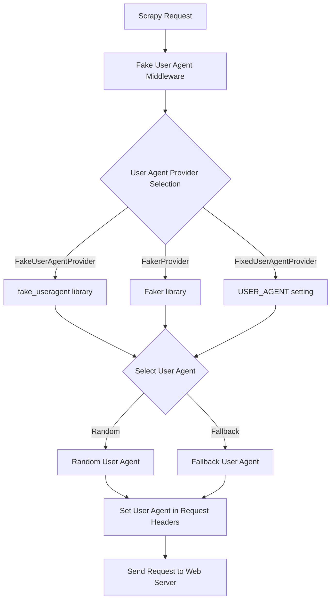

## 1. はじめに

近年、Webスクレイピングは様々な分野で活用されており、データ収集や分析に欠かせない技術となっています。しかし、Webサイトによっては、スクレイピングを防ぐために様々な対策を講じています。その中でも、User-Agentによる制限は一般的な手法の1つです。

User-Agentとは、Webブラウザやスクレイピングツールがサーバーに送信するHTTPリクエストヘッダーの一部で、クライアントのソフトウェアやバージョンなどの情報を含んでいます。Webサイトは、User-Agentを分析することで、スクレイピングツールからのアクセスを識別し、ブロックすることができます。

このような状況下で、スクレイピングを円滑に行うためには、User-Agentを適切に管理する必要があります。scrapy-fake-useragentは、Pythonの人気スクレイピングフレームワークであるScrapyに対して、User-Agentをランダムに切り替える機能を提供するライブラリです。

本記事では、scrapy-fake-useragentの概要と目的について説明し、インストール方法や設定、動作原理など、詳細な情報を提供します。また、コード例を交えながら、実際の使用方法や利点、注意点などについても解説していきます。

scrapy-fake-useragentを活用することで、Webサイトからのブロックを回避し、効率的なスクレイピングを実現できるでしょう。

## 2. scrapy-fake-useragentパッケージの詳細

scrapy-fake-useragentライブラリは、実在する様々なWebブラウザやデバイス、オペレーティングシステムのUser-Agent情報を提供しています。リクエストごとにUser-Agentをランダムに選択し、設定します。

scrapy-fake-useragentの主な機能は以下の通りです：

1. User-Agentのランダム化：リクエストごとに、User-Agentをランダムに選択し、設定します。
2. User-Agentのローテーション：設定されたUser-Agentリストを順番に使用し、ローテーションします。

scrapy-fake-useragentのパッケージ構成は、以下の様になっています：

```bash
scrapy-fake-useragent(master): tree -L 3
.
├── CHANGELOG.rst
├── LICENSE.txt
├── README.rst
├── dev-requirements.txt
├── pytest.ini
├── requirements.txt
├── scrapy_fake_useragent
│   ├── __init__.py
│   ├── middleware.py
│   └── providers.py
├── setup.cfg
├── setup.py
├── tests
│   ├── __init__.py
│   ├── conftest.py
│   ├── test_random_ua_middleware
│   │   ├── __init__.py
│   │   ├── test_fallback_setting.py
│   │   ├── test_load_providers.py
│   │   └── test_providers
│   └── test_retry_middleware.py
└── tox.ini
```

scrapy_fake_useragentに着目します。

```bash
scrapy_fake_useragent/
├── __init__.py
├── middleware.py
└── providers.py
```

1. `__init__.py`:

- `scrapy_fake_useragent`モジュールの初期化ファイルです。
- モジュールがパッケージとして認識されるために必要です。
- モジュールレベルの定数や関数、クラスなどを定義することができます。

2. `middleware.py`:

- Scrapyのミドルウェアクラスを定義するファイルです。
- `RandomUserAgentMiddleware`クラスは、リクエストにランダムなUser-Agentを設定するミドルウェアです。
- `RetryUserAgentMiddleware`クラスは、リトライ時にランダムなUser-Agentを設定するミドルウェアです。
- これらのミドルウェアクラスは、Scrapyのリクエスト/レスポンス処理パイプラインに組み込まれます。

3. `providers.py`:

- User-Agentを提供するプロバイダークラスを定義するファイルです。
- `BaseProvider`クラスは、すべてのプロバイダークラスの基底クラスです。
- `FixedUserAgentProvider`クラスは、設定で指定された固定のUser-Agentを提供します。
- `FakeUserAgentProvider`クラスは、`fake_useragent`ライブラリを使用してランダムな実際のUser-Agentを提供します。
- `FakerProvider`クラスは、`Faker`ライブラリを使用してランダムなUser-Agentを生成します。
- これらのプロバイダークラスは、ミドルウェアクラスからUser-Agentを取得するために使用されます。

これらのファイルを組み合わせることで、`scrapy_fake_useragent`モジュールは以下の機能を提供します。

1. ランダムなUser-Agentを設定するためのミドルウェア。
2. リトライ時にランダムなUser-Agentを設定するためのミドルウェア。
3. 様々なUser-Agentプロバイダーの選択肢と柔軟性。

このモジュールをScrapyプロジェクトに組み込むことで、リクエストに対してランダムなUser-Agentを設定し、Webサイトからのスクレイピングをよりスムーズに行うことができます。また、設定ファイルを通じてカスタマイズ可能であり、独自のUser-Agentプロバイダーを追加することもできます。

## 3. Scrapy Fake User Agentのインストールと設定

Scrapy Fake User Agentを使用するには、まず以下のコマンドを実行して、パッケージをインストールします。

```
pip install scrapy-fake-useragent
```

インストールが完了したら、Scrapyプロジェクトの設定ファイル（`settings.py`）に以下の設定を追加します。

```python
DOWNLOADER_MIDDLEWARES = {
    'scrapy.downloadermiddlewares.useragent.UserAgentMiddleware': None,
    'scrapy.downloadermiddlewares.retry.RetryMiddleware': None,
    'scrapy_fake_useragent.middleware.RandomUserAgentMiddleware': 400,
    'scrapy_fake_useragent.middleware.RetryUserAgentMiddleware': 401,
}
```

この設定では、Scrapyデフォルトの`UserAgentMiddleware`と`RetryMiddleware`を無効化し、代わりに`RandomUserAgentMiddleware`と`RetryUserAgentMiddleware`を有効化しています。ミドルウェアの優先度は400と401に設定されています。

以上の設定を行うことで、Scrapy Fake User Agentを使用する準備が整います。

## 4. User-Agentの設定オプション

Scrapy Fake User Agentは、様々な方法でUser-Agentを設定できます。以下に、実際に使用される設定オプションを説明します。

### プロキシごとのUser-Agent割り当て

`RANDOM_UA_PER_PROXY`設定を使用することで、プロキシごとにUser-Agentを割り当てることができます。デフォルトは`False`です。

```python
RANDOM_UA_PER_PROXY = True
```

### User-Agentプロバイダーの指定

`FAKEUSERAGENT_PROVIDERS`設定を使用して、使用するUser-Agentプロバイダーを指定できます。デフォルトは`None`で、`FakeUserAgentProvider`が使用されます。

```python
FAKEUSERAGENT_PROVIDERS = [
    'scrapy_fake_useragent.providers.FakeUserAgentProvider',
    'scrapy_fake_useragent.providers.FakerProvider',
    'scrapy_fake_useragent.providers.FixedUserAgentProvider',
]
```

### 固定のUser-Agent文字列

`USER_AGENT`設定を使用して、`FixedUserAgentProvider`で使用される固定のUser-Agent文字列を設定できます。デフォルトは空の文字列です。

```python
USER_AGENT = 'Mozilla/5.0 (Windows NT 10.0; Win64; x64) AppleWebKit/537.36 (KHTML, like Gecko) Chrome/93.0.4577.82 Safari/537.36'
```

### FakeUserAgentProviderのUser-Agentの種類

`FAKE_USERAGENT_RANDOM_UA_TYPE`設定を使用して、`FakeUserAgentProvider`で使用するUser-Agentの種類を指定できます。デフォルトは`random`です。

```python
FAKE_USERAGENT_RANDOM_UA_TYPE = 'chrome'
```

### FakeUserAgentProviderのフォールバック値

`FAKEUSERAGENT_FALLBACK`設定を使用して、`FakeUserAgentProvider`で選択したUser-Agentの種類が失敗した場合のフォールバック値を設定できます。デフォルトは空の文字列です。

```python
FAKEUSERAGENT_FALLBACK = 'Mozilla/5.0 (Windows NT 10.0; Win64; x64) AppleWebKit/537.36 (KHTML, like Gecko) Chrome/93.0.4577.82 Safari/537.36'
```

### FakerProviderのUser-Agentの種類

`FAKER_RANDOM_UA_TYPE`設定を使用して、`FakerProvider`で使用するUser-Agentの種類を指定できます。デフォルトは`user_agent`です。

```python
FAKER_RANDOM_UA_TYPE = 'chrome'
```

これらの設定オプションを適切に組み合わせることで、スクレイピングの要件に合わせてUser-Agentを柔軟に管理できます。

## 5. Scrapy Fake User Agentの動作原理

Scrapy Fake User Agentは、ScrapyのリクエストにランダムなUser-Agentを設定するためのミドルウェアです。以下のMermaidチャートを使って、その動作原理を説明します。



1. Scrapyがリクエストを生成します。
2. リクエストは、Fake User Agent Middlewareに渡されます。
3. ミドルウェアは、設定されたUser-Agentプロバイダーを選択します。

- `FakeUserAgentProvider`: `fake_useragent`ライブラリを使用してUser-Agentを取得します。
- `FakerProvider`: `Faker`ライブラリを使用してUser-Agentを生成します。
- `FixedUserAgentProvider`: `USER_AGENT`設定で指定された固定のUser-Agentを使用します。

4. 選択されたプロバイダーからUser-Agentを取得します。

- ランダムなUser-Agentが選択されます。
- 選択されたUser-Agentが利用できない場合は、フォールバックのUser-Agentが使用されます。

5. 選択されたUser-Agentがリクエストのヘッダーに設定されます。
6. User-Agentが設定されたリクエストがWebサーバーに送信されます。

ミドルウェアは、リクエストごとにUser-Agentを選択し、設定するため、Webサイトからのブロックを回避しながら、効率的にスクレイピングを行うことができます。

## 6. Scrapy Fake User Agentの利点

Scrapy Fake User Agentを使用することで、以下のような利点があります。

### Webサイトからのブロックを回避

多くのWebサイトは、同じUser-Agentを使用して大量のリクエストを送信するスクレイピングツールを検出し、ブロックする仕組みを持っています。Scrapy Fake User Agentを使用することで、リクエストごとにランダムなUser-Agentを設定し、Webサイトからのブロックを回避できます。

### スクレイピングの効率化

User-Agentをランダムに切り替えることで、Webサイトからのブロックを回避し、スクレイピングを継続的に行うことができます。これにより、スクレイピングの効率が向上し、より多くのデータを収集できます。

### 多様なUser-Agentによるデータ収集

Webサイトによっては、User-Agentに応じて異なるコンテンツを返す場合があります。Scrapy Fake User Agentを使用することで、様々なUser-Agentを使用してデータを収集できます。これにより、より多様なデータを収集し、分析の精度を向上させることができます。

## 7. 注意点とベストプラクティス

Scrapy Fake User Agentを使用する際には、以下の点に注意し、ベストプラクティスに従うことが重要です。

### 適切なUser-Agentの選択

Scrapy Fake User Agentは、実在のUser-Agent情報を使用しますが、Webサイトによっては、特定のUser-Agentを使用するとブロックされる場合があります。そのため、スクレイピング対象のWebサイトに適したUser-Agentを選択することが重要です。

### リクエスト間隔の調整

Webサイトへの過剰なリクエストは、サーバーに負荷をかけ、ブロックされる原因となります。Scrapy Fake User Agentを使用する場合でも、リクエスト間隔を適切に調整し、Webサイトに負荷をかけないようにすることが重要です。以下のように、`settings.py`にリクエスト間隔の設定を追加します。

```python
DOWNLOAD_DELAY = 1  # リクエスト間隔を1秒に設定
```

### Webサイトの利用規約の遵守

スクレイピングを行う際は、対象のWebサイトの利用規約を確認し、遵守することが重要です。多くのWebサイトでは、スクレイピングに関する規約が定められています。これらの規約に違反すると、法的な問題に発展する可能性があります。

以上が、Scrapy Fake User Agentの注意点とベストプラクティスです。これらの点に留意しながら、Scrapy Fake User Agentを効果的に活用してください。

## 8. まとめ

本記事では、Scrapy Fake User Agentについて詳細に解説しました。Scrapy Fake User Agentは、Scrapyフレームワークでのスクレイピングにおいて、User-Agentをランダムに切り替えることで、Webサイトからのブロックを回避し、効率的にデータを収集するためのツールです。

記事の内容を振り返ると、以下のようになります。

1. WebスクレイピングにおけるUser-Agentの重要性と、Scrapy Fake User Agentの概要について説明しました。
2. Scrapy Fake User Agentのパッケージ構成と提供する機能について詳細に解説しました。
3. Scrapy Fake User Agentのインストール方法と、Scrapyプロジェクトでの設定方法を示しました。
4. User-Agentの設定オプションの使用方法を説明しました。
5. Mermaidチャートを使用して、Scrapy Fake User Agentの動作原理を視覚的に表現し、説明しました。
6. Scrapy Fake User Agentを使用することによる利点について、Webサイトからのブロック回避、スクレイピングの効率化、多様なデータ収集の観点から説明しました。
7. Scrapy Fake User Agentを使用する際の注意点とベストプラクティスについて、適切なUser-Agentの選択、リクエスト間隔の調整、Webサイトの利用規約の遵守の観点から説明しました。

Scrapy Fake User Agentは、Webスクレイピングにおける重要なツールの1つです。Webサイトからのブロックを回避し、効率的にデータを収集するために、User-Agentを適切に管理することが求められます。

今後、Webスクレイピングを行う際には、Scrapy Fake User Agentを活用し、適切な設定とベストプラクティスに従うことで、より効果的なデータ収集が可能になるでしょう。
