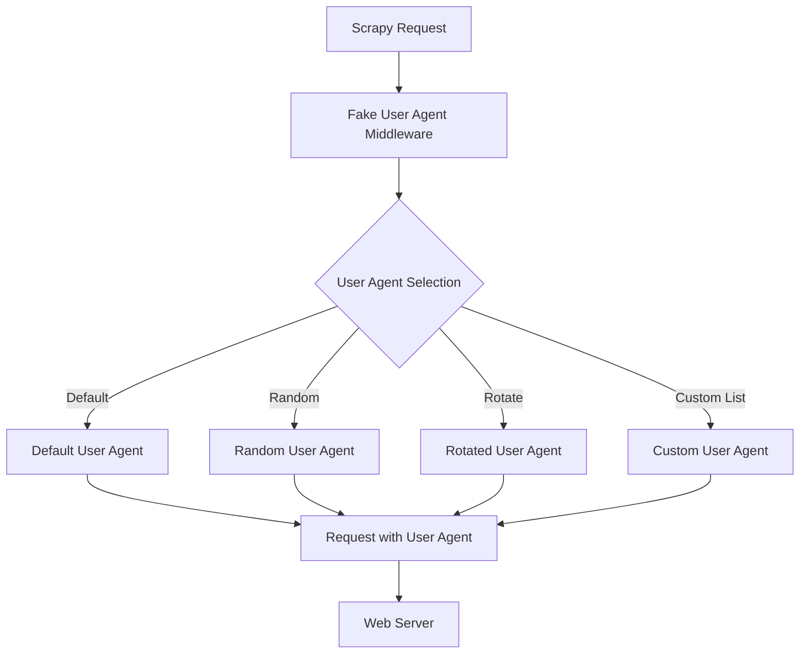

## 1. はじめに

近年、Webスクレイピングは様々な分野で活用されており、データ収集や分析に欠かせない技術となっています。しかし、Webサイトによっては、スクレイピングを防ぐために様々な対策を講じています。その中でも、User-Agentによる制限は一般的な手法の1つです。

User-Agentとは、Webブラウザやスクレイピングツールがサーバーに送信するHTTPリクエストヘッダーの一部で、クライアントのソフトウェアやバージョンなどの情報を含んでいます。Webサイトは、User-Agentを分析することで、スクレイピングツールからのアクセスを識別し、ブロックすることができます。

このような状況下で、スクレイピングを円滑に行うためには、User-Agentを適切に管理する必要があります。[scrapy-fake-useragent](https://github.com/alecxe/scrapy-fake-useragent)は、Pythonの人気スクレイピングフレームワークであるScrapyに対して、User-Agentをランダムに切り替える機能を提供するライブラリです。

本記事では、[scrapy-fake-useragent](https://github.com/alecxe/scrapy-fake-useragent)の概要と目的について説明し、インストール方法や設定、動作原理など、詳細な情報を提供します。また、コード例を交えながら、実際の使用方法や利点、注意点などについても解説していきます。

[scrapy-fake-useragent](https://github.com/alecxe/scrapy-fake-useragent)を活用することで、Webサイトからのブロックを回避し、効率的なスクレイピングを実現できるでしょう。

## 2. [scrapy-fake-useragent](https://github.com/alecxe/scrapy-fake-useragent)パッケージの詳細

[scrapy-fake-useragent](https://github.com/alecxe/scrapy-fake-useragent)ライブラリは、実在する様々なWebブラウザやデバイス、オペレーティングシステムのUser-Agent情報を提供しています。リクエストごとにUser-Agentをランダムに選択し、設定します。

[scrapy-fake-useragent](https://github.com/alecxe/scrapy-fake-useragent)の主な機能は以下の通りです：

1. User-Agentのランダム化：リクエストごとに、User-Agentをランダムに選択し、設定します。
2. User-Agentのローテーション：設定されたUser-Agentリストを順番に使用し、ローテーションします。
3. カスタムUser-Agentリストのサポート：ユーザー独自のUser-Agentリストを設定し、使用することができます。

[scrapy-fake-useragent](https://github.com/alecxe/scrapy-fake-useragent)のパッケージ構成は、以下の様になっています：

```bash
scrapy-fake-useragent(master): tree -L 3
.
├── CHANGELOG.rst
├── LICENSE.txt
├── README.rst
├── dev-requirements.txt
├── pytest.ini
├── requirements.txt
├── scrapy_fake_useragent
│   ├── __init__.py
│   ├── middleware.py
│   └── providers.py
├── setup.cfg
├── setup.py
├── tests
│   ├── __init__.py
│   ├── conftest.py
│   ├── test_random_ua_middleware
│   │   ├── __init__.py
│   │   ├── test_fallback_setting.py
│   │   ├── test_load_providers.py
│   │   └── test_providers
│   └── test_retry_middleware.py
└── tox.ini
```

scrapy_fake_useragentに着目します。

```bash
scrapy_fake_useragent/
├── __init__.py
├── middleware.py
└── providers.py
```

1. `__init__.py`:
  - `scrapy_fake_useragent`モジュールの初期化ファイルです。
  - モジュールがパッケージとして認識されるために必要です。
  - モジュールレベルの定数や関数、クラスなどを定義することができます。

2. `middleware.py`:
  - Scrapyのミドルウェアクラスを定義するファイルです。
  - `RandomUserAgentMiddleware`クラスは、リクエストにランダムなUser-Agentを設定するミドルウェアです。
  - `RetryUserAgentMiddleware`クラスは、リトライ時にランダムなUser-Agentを設定するミドルウェアです。
  - これらのミドルウェアクラスは、Scrapyのリクエスト/レスポンス処理パイプラインに組み込まれます。

3. `providers.py`:
  - User-Agentを提供するプロバイダークラスを定義するファイルです。
  - `BaseProvider`クラスは、すべてのプロバイダークラスの基底クラスです。
  - `FixedUserAgentProvider`クラスは、設定で指定された固定のUser-Agentを提供します。
  - `FakeUserAgentProvider`クラスは、`fake_useragent`ライブラリを使用してランダムな実際のUser-Agentを提供します。
  - `FakerProvider`クラスは、`Faker`ライブラリを使用してランダムなUser-Agentを生成します。
  - これらのプロバイダークラスは、ミドルウェアクラスからUser-Agentを取得するために使用されます。

これらのファイルを組み合わせることで、`scrapy_fake_useragent`モジュールは以下の機能を提供します。

1. ランダムなUser-Agentを設定するためのミドルウェア。
2. リトライ時にランダムなUser-Agentを設定するためのミドルウェア。
3. 様々なUser-Agentプロバイダーの選択肢と柔軟性。

このモジュールをScrapyプロジェクトに組み込むことで、リクエストに対してランダムなUser-Agentを設定し、Webサイトからのスクレイピングをよりスムーズに行うことができます。また、設定ファイルを通じてカスタマイズ可能であり、独自のUser-Agentプロバイダーを追加することもできます。

## 3. Scrapy Fake User Agentのインストールと設定

Scrapy Fake User Agentを使用するには、まず以下のコマンドを実行して、パッケージをインストールします。

```
pip install scrapy-fake-useragent
```

インストールが完了したら、Scrapyプロジェクトの設定ファイル（`settings.py`）に以下の設定を追加します。

```python
DOWNLOADER_MIDDLEWARES = {
    'scrapy.downloadermiddlewares.useragent.UserAgentMiddleware': None,
    'scrapy.downloadermiddlewares.retry.RetryMiddleware': None,
    'scrapy_fake_useragent.middleware.RandomUserAgentMiddleware': 400,
    'scrapy_fake_useragent.middleware.RetryUserAgentMiddleware': 401,
}
```

この設定では、Scrapyデフォルトの`UserAgentMiddleware`と`RetryMiddleware`を無効化し、代わりに`RandomUserAgentMiddleware`と`RetryUserAgentMiddleware`を有効化しています。ミドルウェアの優先度は400と401に設定されています。

以上の設定を行うことで、Scrapy Fake User Agentを使用する準備が整います。

## 4. User-Agentの設定オプション

Scrapy Fake User Agentは、様々な方法でUser-Agentを設定できます。以下に、主な設定オプションを説明します。

### デフォルトのUser-Agent

特に設定を行わない場合、Scrapy Fake User Agentは、[scrapy-fake-useragent](https://github.com/alecxe/scrapy-fake-useragent)ライブラリに含まれるデフォルトのUser-Agentリストからランダムに選択します。このリストには、一般的なWebブラウザのUser-Agentが含まれています。

### User-Agentのランダム化

`settings.py`に以下の設定を追加することで、リクエストごとにランダムなUser-Agentを選択できます。

```python
FAKEUSERAGENT_PROVIDERS = [
    'scrapy_fake_useragent.providers.FakeUserAgentProvider',  # 最初に試すプロバイダー
    'scrapy_fake_useragent.providers.FakerProvider',  # FakeUserAgentProviderが失敗した場合に使用するプロバイダー
    'scrapy_fake_useragent.providers.FixedUserAgentProvider',  # USER_AGENT値にフォールバックするプロバイダー
]
USER_AGENT = '<すべてのプロバイダーが失敗した場合にフォールバックするUser-Agent文字列>'
```

- `FakeUserAgentProvider`：[scrapy-fake-useragent](https://github.com/alecxe/scrapy-fake-useragent)ライブラリに含まれるデフォルトのUser-Agentリストからランダムに選択します。
- `FakerProvider`：Fakerライブラリを使用して、ランダムなUser-Agentを生成します。
- `FixedUserAgentProvider`：固定のUser-Agentを使用します。

## 5. Scrapy Fake User Agentの動作原理（Mermaidチャートを使った説明）

Scrapy Fake User Agentは、ScrapyのリクエストにランダムなUser-Agentを設定するためのミドルウェアです。以下のMermaidチャートを使って、その動作原理を説明します。



1. Scrapyがリクエストを生成します。
2. リクエストは、Fake User Agent Middlewareに渡されます。
3. ミドルウェアは、設定に基づいてUser-Agentを選択します。
  - デフォルト：[scrapy-fake-useragent](https://github.com/alecxe/scrapy-fake-useragent)ライブラリに含まれるデフォルトのUser-Agentリストから選択します。
  - ランダム：設定されたプロバイダ（`FakeUserAgentProvider`、`FakerProvider`、`FixedUserAgentProvider`）からランダムにUser-Agentを選択します。
  - ローテーション：設定されたUser-Agentリストを順番に使用します。
  - カスタムリスト：ユーザー独自のUser-Agentリストから選択します。
4. 選択されたUser-Agentがリクエストのヘッダーに設定されます。
5. User-Agentが設定されたリクエストがWebサーバーに送信されます。

Scrapy Fake User Agentは、内部で[scrapy-fake-useragent](https://github.com/alecxe/scrapy-fake-useragent)ライブラリを活用しています。このライブラリは、実在のUser-Agent情報を提供し、ランダムな選択やローテーションを可能にします。

ミドルウェアは、リクエストごとにUser-Agentを選択し、設定するため、Webサイトからのブロックを回避しながら、効率的にスクレイピングを行うことができます。

## 6. Scrapy Fake User Agentの利点

Scrapy Fake User Agentを使用することで、以下のような利点があります。

### Webサイトからのブロックを回避

多くのWebサイトは、同じUser-Agentを使用して大量のリクエストを送信するスクレイピングツールを検出し、ブロックする仕組みを持っています。Scrapy Fake User Agentを使用することで、リクエストごとにランダムなUser-Agentを設定し、Webサイトからのブロックを回避できます。

### スクレイピングの効率化

User-Agentをランダムに切り替えることで、Webサイトからのブロックを回避し、スクレイピングを継続的に行うことができます。これにより、スクレイピングの効率が向上し、より多くのデータを収集できます。

### 多様なUser-Agentによるデータ収集

Webサイトによっては、User-Agentに応じて異なるコンテンツを返す場合があります。Scrapy Fake User Agentを使用することで、様々なUser-Agentを使用してデータを収集できます。これにより、より多様なデータを収集し、分析の精度を向上させることができます。


## 7. 注意点とベストプラクティス

Scrapy Fake User Agentを使用する際には、以下の点に注意し、ベストプラクティスに従うことが重要です。

### 適切なUser-Agentの選択

Scrapy Fake User Agentは、実在のUser-Agent情報を使用しますが、Webサイトによっては、特定のUser-Agentを使用するとブロックされる場合があります。そのため、スクレイピング対象のWebサイトに適したUser-Agentを選択することが重要です。

### リクエスト間隔の調整

Webサイトへの過剰なリクエストは、サーバーに負荷をかけ、ブロックされる原因となります。Scrapy Fake User Agentを使用する場合でも、リクエスト間隔を適切に調整し、Webサイトに負荷をかけないようにすることが重要です。以下のように、`settings.py`にリクエスト間隔の設定を追加します。

```python
DOWNLOAD_DELAY = 1  # リクエスト間隔を1秒に設定
```

### Webサイトの利用規約の遵守

スクレイピングを行う際は、対象のWebサイトの利用規約を確認し、遵守することが重要です。多くのWebサイトでは、スクレイピングに関する規約が定められています。これらの規約に違反すると、法的な問題に発展する可能性があります。

以上が、Scrapy Fake User Agentの注意点とベストプラクティスです。これらの点に留意しながら、Scrapy Fake User Agentを効果的に活用してください。


## 8. まとめ

本記事では、Scrapy Fake User Agentについて詳細に解説しました。Scrapy Fake User Agentは、Scrapyフレームワークでのスクレイピングにおいて、User-Agentをランダムに切り替えることで、Webサイトからのブロックを回避し、効率的にデータを収集するためのツールです。

記事の内容を振り返ると、以下のようになります。

1. WebスクレイピングにおけるUser-Agentの重要性と、Scrapy Fake User Agentの概要について説明しました。
2. Scrapy Fake User Agentのパッケージ構成と提供する機能について詳細に解説しました。
3. Scrapy Fake User Agentのインストール方法と、Scrapyプロジェクトでの設定方法を示しました。
4. User-Agentの設定オプションの使用方法を説明しました。
5. Mermaidチャートを使用して、Scrapy Fake User Agentの動作原理を視覚的に表現し、説明しました。
6. Scrapy Fake User Agentを使用することによる利点について、Webサイトからのブロック回避、スクレイピングの効率化、多様なデータ収集の観点から説明しました。
7. Scrapy Fake User Agentを使用する際の注意点とベストプラクティスについて、適切なUser-Agentの選択、リクエスト間隔の調整、Webサイトの利用規約の遵守の観点から説明しました。

Scrapy Fake User Agentは、Webスクレイピングにおける重要なツールの1つです。Webサイトからのブロックを回避し、効率的にデータを収集するために、User-Agentを適切に管理することが求められます。

今後、Webスクレイピングを行う際には、Scrapy Fake User Agentを活用し、適切な設定とベストプラクティスに従うことで、より効果的なデータ収集が可能になるでしょう。

