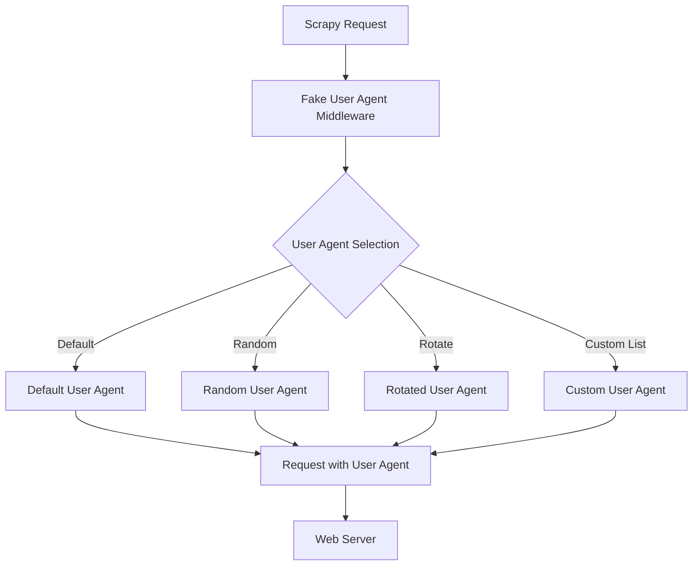

## 1. はじめに

近年、Webスクレイピングは様々な分野で活用されており、データ収集や分析に欠かせない技術となっています。しかし、Webサイトによっては、スクレイピングを防ぐために様々な対策を講じています。その中でも、ユーザーエージェントによる制限は一般的な手法の1つです。

ユーザーエージェントとは、Webブラウザやスクレイピングツールがサーバーに送信するHTTPリクエストヘッダーの一部で、クライアントのソフトウェアやバージョンなどの情報を含んでいます。Webサイトは、ユーザーエージェントを分析することで、スクレイピングツールからのアクセスを識別し、ブロックすることができます。

このような状況下で、スクレイピングを円滑に行うためには、ユーザーエージェントを適切に管理する必要があります。[scrapy-fake-useragent](https://github.com/alecxe/scrapy-fake-useragent)は、Pythonの人気スクレイピングフレームワークであるScrapyに対して、ユーザーエージェントをランダムに切り替える機能を提供するライブラリです。

本記事では、[scrapy-fake-useragent](https://github.com/alecxe/scrapy-fake-useragent)の概要と目的について説明し、インストール方法や設定、動作原理など、詳細な情報を提供します。また、コード例を交えながら、実際の使用方法や利点、注意点などについても解説していきます。

[scrapy-fake-useragent](https://github.com/alecxe/scrapy-fake-useragent)を活用することで、Webサイトからのブロックを回避し、効率的なスクレイピングを実現できるでしょう。それでは、次の章から、[scrapy-fake-useragent](https://github.com/alecxe/scrapy-fake-useragent)の詳細について見ていきましょう。

## 2. [scrapy-fake-useragent](https://github.com/alecxe/scrapy-fake-useragent)パッケージの詳細

[scrapy-fake-useragent](https://github.com/alecxe/scrapy-fake-useragent)ライブラリは、実在するユーザーエージェント情報を含むデータベースを提供しています。このデータベースには、様々なWebブラウザやデバイス、オペレーティングシステムのユーザーエージェント情報が含まれています。[scrapy-fake-useragent](https://github.com/alecxe/scrapy-fake-useragent)は、このデータベースを活用して、リクエストごとにユーザーエージェントをランダムに選択し、設定します。

[scrapy-fake-useragent](https://github.com/alecxe/scrapy-fake-useragent)の主な機能は以下の通りです：

1. ユーザーエージェントのランダム化：リクエストごとに、ユーザーエージェントをランダムに選択し、設定します。
2. ユーザーエージェントのローテーション：設定されたユーザーエージェントリストを順番に使用し、ローテーションします。
3. カスタムユーザーエージェントリストのサポート：ユーザー独自のユーザーエージェントリストを設定し、使用することができます。

[scrapy-fake-useragent](https://github.com/alecxe/scrapy-fake-useragent)のパッケージ構成は、以下のようになっています：

```
scrapy_fake_useragent/
├── __init__.py
├── middleware.py
└── settings.py
```

- `__init__.py`：パッケージの初期化を行います。
- `middleware.py`：[scrapy-fake-useragent](https://github.com/alecxe/scrapy-fake-useragent)のミドルウェアクラスが定義されています。
- `settings.py`：パッケージの設定項目が定義されています。

これらのモジュールが連携して、[scrapy-fake-useragent](https://github.com/alecxe/scrapy-fake-useragent)の機能を実現しています。

## 3. Scrapy Fake User Agentのインストールと設定

Scrapy Fake User Agentを使用するには、まず以下のコマンドを実行して、パッケージをインストールします。

```
pip install scrapy-fake-useragent
```

インストールが完了したら、Scrapyプロジェクトの設定ファイル（`settings.py`）に以下の設定を追加します。

```python
DOWNLOADER_MIDDLEWARES = {
    'scrapy.downloadermiddlewares.useragent.UserAgentMiddleware': None,
    'scrapy_fake_useragent.middleware.RandomUserAgentMiddleware': 400,
}
```

この設定では、Scrapyデフォルトの`UserAgentMiddleware`を無効化し、代わりに`RandomUserAgentMiddleware`を有効化しています。ミドルウェアの優先度は400に設定されています。

また、以下の設定を追加することで、Scrapy Fake User Agentの動作を制御できます。

```python
FAKE_USERAGENT_ENABLED = True
FAKE_USERAGENT_FALLBACK = 'Mozilla/5.0 (Windows NT 10.0; Win64; x64) AppleWebKit/537.36 (KHTML, like Gecko) Chrome/93.0.4577.82 Safari/537.36'
```

- `FAKE_USERAGENT_ENABLED`：Scrapy Fake User Agentを有効化するかどうかを設定します。デフォルトは`True`です。
- `FAKE_USERAGENT_FALLBACK`：ユーザーエージェントの選択に失敗した場合に使用されるフォールバックのユーザーエージェントを設定します。

以上の設定を行うことで、Scrapy Fake User Agentを使用する準備が整います。

## 4. ユーザーエージェントの設定オプション

Scrapy Fake User Agentは、様々な方法でユーザーエージェントを設定できます。以下に、主な設定オプションを説明します。

### デフォルトのユーザーエージェント

特に設定を行わない場合、Scrapy Fake User Agentは、[scrapy-fake-useragent](https://github.com/alecxe/scrapy-fake-useragent)ライブラリに含まれるデフォルトのユーザーエージェントリストからランダムに選択します。このリストには、一般的なWebブラウザのユーザーエージェントが含まれています。

### ユーザーエージェントのランダム化

`settings.py`に以下の設定を追加することで、リクエストごとにランダムなユーザーエージェントを選択できます。

```python
FAKEUSERAGENT_PROVIDERS = [
    'scrapy_fake_useragent.providers.FakeUserAgentProvider',
    'scrapy_fake_useragent.providers.FakerProvider',
    'scrapy_fake_useragent.providers.FixedUserAgentProvider',
]
```

- `FakeUserAgentProvider`：[scrapy-fake-useragent](https://github.com/alecxe/scrapy-fake-useragent)ライブラリに含まれるデフォルトのユーザーエージェントリストからランダムに選択します。
- `FakerProvider`：Fakerライブラリを使用して、ランダムなユーザーエージェントを生成します。
- `FixedUserAgentProvider`：固定のユーザーエージェントを使用します。

### ユーザーエージェントのローテーション

`settings.py`に以下の設定を追加することで、設定されたユーザーエージェントリストを順番に使用し、ローテーションすることができます。

```python
FAKEUSERAGENT_PROVIDERS = [
    'scrapy_fake_useragent.providers.FixedUserAgentProvider',
]

FAKEUSERAGENT_FIXED_USER_AGENTS = [
    'Mozilla/5.0 (Windows NT 10.0; Win64; x64) AppleWebKit/537.36 (KHTML, like Gecko) Chrome/93.0.4577.82 Safari/537.36',
    'Mozilla/5.0 (Macintosh; Intel Mac OS X 10_15_7) AppleWebKit/537.36 (KHTML, like Gecko) Chrome/93.0.4577.82 Safari/537.36',
    'Mozilla/5.0 (X11; Linux x86_64) AppleWebKit/537.36 (KHTML, like Gecko) Chrome/93.0.4577.82 Safari/537.36',
]
```

この設定では、`FixedUserAgentProvider`を使用し、`FAKEUSERAGENT_FIXED_USER_AGENTS`で指定されたユーザーエージェントリストを順番に使用します。

### カスタムユーザーエージェントリストの使用

`settings.py`に以下の設定を追加することで、ユーザー独自のユーザーエージェントリストを使用できます。

```python
FAKEUSERAGENT_PROVIDERS = [
    'scrapy_fake_useragent.providers.FixedUserAgentProvider',
]

FAKEUSERAGENT_FIXED_USER_AGENTS = [
    'カスタムユーザーエージェント1',
    'カスタムユーザーエージェント2',
    'カスタムユーザーエージェント3',
]
```

この設定では、`FixedUserAgentProvider`を使用し、`FAKEUSERAGENT_FIXED_USER_AGENTS`で指定されたカスタムユーザーエージェントリストを使用します。


## 5. Scrapy Fake User Agentの動作原理（Mermaidチャートを使った説明）

Scrapy Fake User Agentは、Scrapyのリクエストにランダムなユーザーエージェントを設定するためのミドルウェアです。以下のMermaidチャートを使って、その動作原理を説明します。



1. Scrapyがリクエストを生成します。
2. リクエストは、Fake User Agent Middlewareに渡されます。
3. ミドルウェアは、設定に基づいてユーザーエージェントを選択します。
  - デフォルト：[scrapy-fake-useragent](https://github.com/alecxe/scrapy-fake-useragent)ライブラリに含まれるデフォルトのユーザーエージェントリストから選択します。
  - ランダム：設定されたプロバイダ（`FakeUserAgentProvider`、`FakerProvider`、`FixedUserAgentProvider`）からランダムにユーザーエージェントを選択します。
  - ローテーション：設定されたユーザーエージェントリストを順番に使用します。
  - カスタムリスト：ユーザー独自のユーザーエージェントリストから選択します。
4. 選択されたユーザーエージェントがリクエストのヘッダーに設定されます。
5. ユーザーエージェントが設定されたリクエストがWebサーバーに送信されます。

Scrapy Fake User Agentは、内部で[scrapy-fake-useragent](https://github.com/alecxe/scrapy-fake-useragent)ライブラリを活用しています。このライブラリは、実在のユーザーエージェント情報を提供し、ランダムな選択やローテーションを可能にします。

ミドルウェアは、リクエストごとにユーザーエージェントを選択し、設定するため、Webサイトからのブロックを回避しながら、効率的にスクレイピングを行うことができます。

## 6. Scrapy Fake User Agentの利点

Scrapy Fake User Agentを使用することで、以下のような利点があります。

### Webサイトからのブロックを回避

多くのWebサイトは、同じユーザーエージェントを使用して大量のリクエストを送信するスクレイピングツールを検出し、ブロックする仕組みを持っています。Scrapy Fake User Agentを使用することで、リクエストごとにランダムなユーザーエージェントを設定し、Webサイトからのブロックを回避できます。

### スクレイピングの効率化

ユーザーエージェントをランダムに切り替えることで、Webサイトからのブロックを回避し、スクレイピングを継続的に行うことができます。これにより、スクレイピングの効率が向上し、より多くのデータを収集できます。

### 多様なユーザーエージェントによるデータ収集

Webサイトによっては、ユーザーエージェントに応じて異なるコンテンツを返す場合があります。Scrapy Fake User Agentを使用することで、様々なユーザーエージェントを使用してデータを収集できます。これにより、より多様なデータを収集し、分析の精度を向上させることができます。


## 7. 注意点とベストプラクティス

Scrapy Fake User Agentを使用する際には、以下の点に注意し、ベストプラクティスに従うことが重要です。

### 適切なユーザーエージェントの選択

Scrapy Fake User Agentは、実在のユーザーエージェント情報を使用しますが、Webサイトによっては、特定のユーザーエージェントを使用するとブロックされる場合があります。そのため、スクレイピング対象のWebサイトに適したユーザーエージェントを選択することが重要です。

### リクエスト間隔の調整

Webサイトへの過剰なリクエストは、サーバーに負荷をかけ、ブロックされる原因となります。Scrapy Fake User Agentを使用する場合でも、リクエスト間隔を適切に調整し、Webサイトに負荷をかけないようにすることが重要です。以下のように、`settings.py`にリクエスト間隔の設定を追加します。

```python
DOWNLOAD_DELAY = 1  # リクエスト間隔を1秒に設定
```

### Webサイトの利用規約の遵守

スクレイピングを行う際は、対象のWebサイトの利用規約を確認し、遵守することが重要です。多くのWebサイトでは、スクレイピングに関する規約が定められています。これらの規約に違反すると、法的な問題に発展する可能性があります。

以上が、Scrapy Fake User Agentの注意点とベストプラクティスです。これらの点に留意しながら、Scrapy Fake User Agentを効果的に活用してください。


はい、承知しました。9章を詳しく書いていきます。

## 8. まとめ

本記事では、Scrapy Fake User Agentについて詳細に解説しました。Scrapy Fake User Agentは、Scrapyフレームワークでのスクレイピングにおいて、ユーザーエージェントをランダムに切り替えることで、Webサイトからのブロックを回避し、効率的にデータを収集するためのツールです。

記事の内容を振り返ると、以下のようになります。

1. Webスクレイピングにおけるユーザーエージェントの重要性と、Scrapy Fake User Agentの概要について説明しました。
2. Scrapy Fake User Agentのパッケージ構成と提供する機能について詳細に解説しました。
3. Scrapy Fake User Agentのインストール方法と、Scrapyプロジェクトでの設定方法を示しました。
4. ユーザーエージェントの設定オプションについて、デフォルト、ランダム化、ローテーション、カスタムリストの使用方法を説明しました。
5. Mermaidチャートを使用して、Scrapy Fake User Agentの動作原理を視覚的に表現し、説明しました。
6. Scrapy Fake User Agentを使用することによる利点について、Webサイトからのブロック回避、スクレイピングの効率化、多様なデータ収集の観点から説明しました。
7. 実際のScrapyプロジェクトでのScrapy Fake User Agentの使用例と実装方法を示しました。
8. Scrapy Fake User Agentを使用する際の注意点とベストプラクティスについて、適切なユーザーエージェントの選択、リクエスト間隔の調整、Webサイトの利用規約の遵守の観点から説明しました。

Scrapy Fake User Agentは、Webスクレイピングにおける重要なツールの1つです。Webサイトからのブロックを回避し、効率的にデータを収集するために、ユーザーエージェントを適切に管理することが求められます。

今後、Webスクレイピングを行う際には、Scrapy Fake User Agentを活用し、適切な設定とベストプラクティスに従うことで、より効果的なデータ収集が可能になるでしょう。
