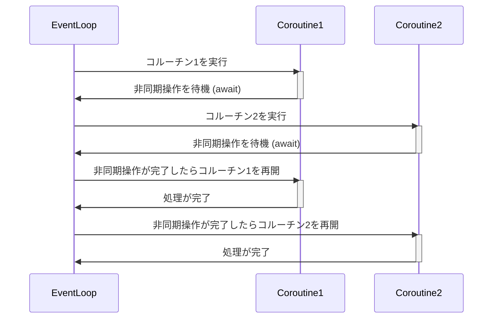

## 1. はじめに

近年、Webアプリケーションやネットワークサービスの高度化に伴い、非同期プログラミングの重要性が増しています。非同期プログラミングは、I/Oバウンドなタスクを効率的に処理することで、アプリケーションのパフォーマンスと応答性を向上させます。特に、複数のタスクを同時に実行する必要がある場合や、長時間かかる処理を扱う場合に、非同期プログラミングは大きな威力を発揮します。

Python は、バージョン 3.5 から async/await 構文を導入し、非同期プログラミングをより簡潔かつ直感的に記述できるようになりました。これにより、開発者はコールバック地獄に陥ることなく、非同期コードを読みやすく保守しやすい形で書けるようになりました。

async/await の登場以前は、Python では非同期プログラミングを実現するために、コールバックやジェネレータベースのライブラリ（例: Twisted, gevent）を使用していました。しかし、これらのアプローチは複雑で習得が難しく、コードの可読性も低いという問題がありました。

Python のコアチームは、これらの問題を解決するために、async/await 構文を導入することを決定しました。この構文は、他の言語（例: C#, JavaScript）ですでに成功を収めていたモデルを参考にしています。async/await は、非同期コードを同期的な見た目で書けるようにすることで、開発者の生産性を向上させ、非同期プログラミングをより身近なものにしました。

本記事では、Python の async/await を使った非同期プログラミングの基礎から応用までを解説していきます。非同期プログラミングの概念を理解し、async/await の仕組みを学ぶことで、効率的で拡張性の高いPythonアプリケーションを開発する力を身につけましょう。

## 2. 非同期プログラミングの概要

非同期プログラミングを理解するには、まず同期と非同期の違いを知ることが重要です。同期処理では、一つのタスクが完了するまで次のタスクは開始されません。つまり、各タスクは順番に実行され、前のタスクが終わるまで待機します。一方、非同期処理では、複数のタスクが同時に実行され、一つのタスクが完了するのを待つことなく、他のタスクを進めることができます。

同期処理の例としては、レストランで料理を注文する場面が挙げられます。注文が入ってから料理が提供されるまでの間、客は待たなければなりません。これは同期的な処理です。非同期処理の例としては、レストランで複数の料理人が同時に異なる料理を調理する場面が挙げられます。各料理人は、他の料理人が料理を完成させるのを待つことなく、自分の担当する料理を調理することができます。

ブロッキングとノンブロッキングは、同期と非同期に関連する重要な概念です。ブロッキング処理では、一つのタスクが完了するまで、プログラムの実行が停止します。つまり、CPUは他の処理を行うことができません。ノンブロッキング処理では、タスクの完了を待つ間も、プログラムの実行は継続します。これにより、CPUは他のタスクを処理することができ、効率的に資源を利用できます。

非同期プログラミングを実現する従来の方法の一つに、コールバックを使用する方法があります。コールバックとは、ある処理が完了したときに呼び出される関数のことです。しかし、複数の非同期処理を組み合わせる場合、コールバックを入れ子にすることが多くなり、いわゆる「コールバック地獄」という問題が発生します。コールバック地獄では、コードの可読性が低下し、エラーハンドリングが困難になります。

以下は、コールバック地獄の例です：

```javascript
asyncOperation1(function (result1) {
  asyncOperation2(result1, function (result2) {
    asyncOperation3(result2, function (result3) {
      // ...
    });
  });
});
```

コールバック地獄を避けるために、Pythonではasync/await構文が導入されました。この構文を使用することで、非同期コードを同期的な見た目で書くことができ、コードの可読性と保守性が向上します。次のセクションでは、async/awaitの仕組みについて詳しく説明します。

## 3. async/awaitの仕組み

Python の async/await は、非同期プログラミングを実現するための強力な機能です。これを理解するには、イベントループ、コルーチン、タスク、および Future オブジェクトの概念を知る必要があります。

### イベントループ

イベントループは、非同期プログラミングの中心的な存在です。その役割は、非同期タスクのスケジューリングと実行を管理することです。イベントループは、タスクが完了するまで、または次のタスクが実行可能になるまで、各タスクを順番に実行します。

Pythonの標準ライブラリである`asyncio`モジュールは、イベントループを作成し、管理するための機能を提供します。`asyncio.get_event_loop()`関数を使用することで、現在のコンテキストに関連付けられたイベントループを取得できます。

```python
import asyncio

loop = asyncio.get_event_loop()
```

### コルーチン

コルーチンは、非同期プログラミングの基本的な構成要素です。コルーチンは、`async def`構文を使用して定義され、`await`キーワードを使用して他の非同期操作を待機することができる特殊な関数です。コルーチンは、実行を一時的に中断し、制御をイベントループに戻すことができます。これにより、イベントループは他のタスクを実行できます。

以下は、コルーチンの例です：

```python
async def fetch_data(url):
    response = await aiohttp.get(url)
    data = await response.json()
    return data
```

このコルーチンは、`aiohttp`ライブラリを使用して非同期HTTPリクエストを送信し、レスポンスのJSONデータを取得します。`await`キーワードは、非同期操作が完了するまで実行を一時停止します。

### タスク

タスクは、コルーチンの実行をラップし、イベントループによってスケジュールおよび管理される非同期操作の単位です。タスクは、`asyncio.create_task()`関数を使用して作成されます。この関数は、コルーチンをタスクにラップし、イベントループがそのタスクをスケジュールできるようにします。

```python
async def main():
    task = asyncio.create_task(fetch_data(url))
    data = await task

asyncio.run(main())
```

### Futureオブジェクト

Futureオブジェクトは、非同期操作の結果を表します。Futureは、非同期操作が完了したときに、結果または例外を保持します。タスクは、内部でFutureを使用して操作の状態を追跡します。

`asyncio.Future()`関数を使用して、新しいFutureオブジェクトを作成できます。ただし、通常は`asyncio.create_task()`を使用してタスクを作成する方が便利です。

### イベントループとコルーチンの相互作用

以下は、イベントループとコルーチンの相互作用を示すシーケンス図です。



1. イベントループがコルーチン1の実行を開始します。
2. コルーチン1が非同期操作を待機する際に、awaitキーワードを使用してイベントループに制御を戻します。
3. イベントループは、コルーチン2の実行を開始します。
4. コルーチン2も非同期操作を待機する際に、awaitキーワードを使用してイベントループに制御を戻します。
5. 非同期操作が完了すると、イベントループはコルーチン1の実行を再開します。
6. コルーチン1の処理が完了すると、イベントループに制御が戻ります。
7. 次に、非同期操作が完了したコルーチン2の実行が再開されます。
8. コルーチン2の処理が完了すると、イベントループに制御が戻ります。

このようにして、イベントループは複数のコルーチンを効率的に管理し、非同期操作の完了を待ちながら、他のコルーチンを実行することができます。

## 4. async/awaitの基本的な使い方

async/awaitを使用した非同期プログラミングの基本は、コルーチンの定義と`asyncio.run()`関数によるエントリーポイントの設定です。

### コルーチンの定義

コルーチンは、`async def`構文を使用して定義されます。コルーチン内では、`await`キーワードを使用して他の非同期操作を待機することができます。以下は、APIからデータを取得するコルーチンの例です：

```python
async def fetch_data():
    data = await get_data_from_api()
    return data
```

このコルーチンでは、`get_data_from_api()`という非同期関数を呼び出し、その結果が返されるまで待機します。`await`キーワードは、非同期操作が完了し、結果が利用可能になるまで、コルーチンの実行を一時停止します。

### `asyncio.run()`によるエントリーポイント

非同期プログラムを実行するには、`asyncio.run()`関数を使用してエントリーポイントを設定する必要があります。この関数は、引数として渡されたコルーチンを実行し、イベントループを管理します。

```python
import asyncio

async def main():
    result = await fetch_data()
    print(result)

asyncio.run(main())
```

この例では、`main()`コルーチンが定義されています。`main()`内で、`fetch_data()`コルーチンが呼び出され、その結果が`result`変数に格納されます。`print()`関数を使用して、取得したデータを表示します。

`asyncio.run(main())`は、`main()`コルーチンを実行するためのエントリーポイントです。この関数は、新しいイベントループを作成し、`main()`コルーチンをそのイベントループで実行します。`main()`の実行が完了すると、`asyncio.run()`はイベントループを閉じ、プログラムを終了します。

これが、async/awaitを使用した非同期プログラミングの基本的な構造です。コルーチンを定義し、`await`キーワードを使用して非同期操作を待機し、`asyncio.run()`を使用してエントリーポイントを設定するだけで、非同期プログラムを作成できます。

次のセクションでは、複数のタスクを並行して実行する方法について説明します。これにより、非同期プログラミングの真の力を発揮できます。

## 5. 並行処理の実現

async/awaitの強力な機能の一つは、複数のタスクを並行して実行できることです。これにより、プログラムのパフォーマンスを大幅に向上させることができます。

### 複数のタスクを並行して実行する

複数のタスクを並行して実行するには、`asyncio.create_task()`関数を使用してタスクを作成し、`asyncio.gather()`関数を使用してそれらのタスクを同時に実行します。

```python
async def main():
    task1 = asyncio.create_task(fetch_data1())
    task2 = asyncio.create_task(fetch_data2())
    result1, result2 = await asyncio.gather(task1, task2)
```

この例では、`fetch_data1()`と`fetch_data2()`の2つのコルーチンを並行して実行しています。`asyncio.create_task()`を使用して、各コルーチンをタスクにラップします。次に、`asyncio.gather()`関数を使用して、これらのタスクを同時に実行します。`asyncio.gather()`は、すべてのタスクが完了するまで待機し、各タスクの結果を含むタプルを返します。

この方法により、複数の非同期操作を効率的に実行できます。例えば、複数のAPIエンドポイントからデータを取得する場合、各リクエストを個別のタスクとして実行し、`asyncio.gather()`を使用してそれらを並行して処理できます。

### タスクの同期と通信

並行処理を行う際、タスク間で同期や通信が必要になることがあります。Pythonの`asyncio`モジュールは、このための仕組みを提供しています。

#### `asyncio.Lock()`

`asyncio.Lock()`は、複数のタスク間で共有リソースへのアクセスを同期するために使用されます。ロックを取得したタスクだけが共有リソースにアクセスでき、他のタスクはロックが解放されるまで待機します。

```python
lock = asyncio.Lock()

async with lock:
    # 共有リソースにアクセスする
    ...
```

#### `asyncio.Queue()`

`asyncio.Queue()`は、タスク間でデータを安全に交換するために使用されます。あるタスクがキューにデータを追加し、別のタスクがそのデータを取得することができます。

```python
queue = asyncio.Queue()

# データをキューに追加する
await queue.put(data)

# キューからデータを取得する
data = await queue.get()
```

これらの機能を使用することで、複数のタスクを調整し、安全に通信できます。

並行処理は、async/awaitを使用した非同期プログラミングの大きな利点の一つです。複数のタスクを同時に実行し、タスク間で同期と通信を行うことで、プログラムのパフォーマンスと応答性を大幅に向上させることができます。

次のセクションでは、async/awaitを実際のユースケースに適用する方法について説明します。

## 6. 実践的なユースケース

async/awaitは、様々な実際のシナリオで非同期プログラミングを適用するのに適しています。ここでは、Web APIの非同期リクエスト、データベースの非同期クエリ、ファイルI/Oの非同期処理について説明します。

### Web APIの非同期リクエスト

async/awaitを使用すると、Web APIに対する非同期リクエストを簡単に実装できます。`aiohttp`ライブラリを使用して、非同期HTTPリクエストを送信できます。

```python
import aiohttp

async def fetch_data(url):
    async with aiohttp.ClientSession() as session:
        async with session.get(url) as response:
            data = await response.json()
            return data

async def main():
    url1 = 'https://api.example.com/data1'
    url2 = 'https://api.example.com/data2'

    task1 = asyncio.create_task(fetch_data(url1))
    task2 = asyncio.create_task(fetch_data(url2))

    result1, result2 = await asyncio.gather(task1, task2)
    print(result1)
    print(result2)

asyncio.run(main())
```

この例では、`fetch_data()`コルーチンを使用して、指定されたURLからJSONデータを取得します。`aiohttp.ClientSession()`を使用して、非同期HTTPセッションを作成し、`session.get()`を使用して非同期GETリクエストを送信します。

`main()`コルーチンでは、2つの異なるURLに対して`fetch_data()`を並行して実行し、結果を表示します。

### データベースの非同期クエリ

async/awaitを使用して、データベースに対する非同期クエリを実行できます。ここでは、`asyncpg`ライブラリを使用したPostgreSQLデータベースへの非同期クエリの例を示します。

```python
import asyncpg

async def fetch_data(conn):
    query = 'SELECT * FROM users WHERE id = $1'
    user_id = 42
    row = await conn.fetchrow(query, user_id)
    return row

async def main():
    conn = await asyncpg.connect(host='localhost', port=5432, user='user', password='password', database='mydb')

    data = await fetch_data(conn)
    print(data)

    await conn.close()

asyncio.run(main())
```

この例では、`asyncpg.connect()`を使用して、PostgreSQLデータベースへの非同期接続を確立します。`fetch_data()`コルーチンでは、`conn.fetchrow()`を使用して、指定されたクエリを非同期に実行し、結果を取得します。

### ファイルI/Oの非同期処理

async/awaitを使用すると、ファイルI/Oを非同期に処理できます。`aiofiles`ライブラリを使用して、ファイルの読み書きを非同期に行うことができます。

```python
import aiofiles

async def write_file(filename, data):
    async with aiofiles.open(filename, 'w') as f:
        await f.write(data)

async def read_file(filename):
    async with aiofiles.open(filename, 'r') as f:
        data = await f.read()
        return data

async def main():
    await write_file('example.txt', 'Hello, World!')
    data = await read_file('example.txt')
    print(data)

asyncio.run(main())
```

この例では、`write_file()`コルーチンを使用して、指定されたファイルに非同期に書き込みます。`aiofiles.open()`を使用して、ファイルを非同期モードで開き、`f.write()`を使用してデータを書き込みます。

同様に、`read_file()`コルーチンを使用して、指定されたファイルから非同期に読み取ります。`aiofiles.open()`を使用してファイルを開き、`f.read()`を使用してデータを読み取ります。

これらの例は、async/awaitを使用した非同期プログラミングの実践的なユースケースのほんの一部です。Web APIリクエスト、データベースクエリ、ファイルI/Oなど、I/Oバウンドなタスクを非同期に処理することで、プログラムのパフォーマンスと応答性を大幅に向上させることができます。

次のセクションでは、async/awaitを使用する際のエラーハンドリングとベストプラクティスについて説明します。

## 7. エラーハンドリングとベストプラクティス

async/awaitを使用する際は、適切なエラーハンドリングとベストプラクティスに従うことが重要です。ここでは、例外処理、デッドロックの回避、リソースの適切な管理について説明します。

### 例外処理

非同期プログラミングでは、例外処理は同期プログラミングと同様に重要です。async/awaitを使用する際は、`try`/`except`構文を使用して例外を処理できます。

```python
async def fetch_data(url):
    try:
        async with aiohttp.ClientSession() as session:
            async with session.get(url) as response:
                if response.status != 200:
                    raise Exception(f'Error: {response.status}')
                data = await response.json()
                return data
    except Exception as e:
        print(f'Error: {e}')
        return None
```

この例では、`fetch_data()`コルーチン内で`try`/`except`構文を使用しています。HTTPレスポンスのステータスコードが200以外の場合、例外が発生します。例外が発生した場合、`except`ブロックでエラーメッセージを出力し、`None`を返します。

また、`asyncio.TimeoutError`は、非同期操作がタイムアウトした場合に発生する特殊な例外です。タイムアウトを処理するには、以下のように`try`/`except`構文を使用します。

```python
async def fetch_data_with_timeout(url):
    try:
        async with aiohttp.ClientSession() as session:
            async with session.get(url, timeout=5) as response:
                data = await response.json()
                return data
    except asyncio.TimeoutError:
        print('Timeout error occurred')
        return None
```

この例では、`session.get()`にタイムアウト値を指定しています。タイムアウトが発生した場合、`asyncio.TimeoutError`が発生し、`except`ブロックでエラーメッセージを出力します。

### デッドロックの回避

デッドロックは、複数のタスクが互いにリソースを待ち合っている状態であり、非同期プログラミングで発生する可能性があります。デッドロックを回避するには、以下のようなベストプラクティスに従います。

- タスク間で共有リソースを使用する場合は、`asyncio.Lock()`を使用して同期を行います。
- タスクの実行順序に依存関係がある場合は、`asyncio.gather()`を使用して適切な順序で実行します。
- タイムアウトを設定して、デッドロックが発生した場合でもプログラムが応答を続けられるようにします。

### リソースの適切な管理

非同期プログラミングでは、リソースの適切な管理が重要です。以下のベストプラクティスに従って、リソースを管理します。

- `async with`文を使用して、コンテキストマネージャを利用します。これにより、リソースの確保と解放が自動的に行われます。
- 明示的にリソースを解放する必要がある場合は、`try`/`finally`構文を使用します。
- コルーチンが実行を終了する前に、確保したリソースを適切に解放します。

```python
async def process_file(filename):
    try:
        async with aiofiles.open(filename, 'r') as f:
            data = await f.read()
            # ファイルを処理する
            ...
    except Exception as e:
        print(f'Error: {e}')
    finally:
        # リソースを解放する
        ...
```

この例では、`async with`文を使用してファイルを開き、`try`/`finally`構文を使用して例外処理とリソースの解放を行っています。

これらのエラーハンドリングとベストプラクティスに従うことで、async/awaitを使用した非同期プログラミングをより堅牢で効率的なものにすることができます。

## まとめ

- async/awaitは、Pythonにおける非同期プログラミングを直感的かつ効率的に行うための機能です。
- イベントループ、コルーチン、タスク、Futureオブジェクトの概念を理解することが重要です。
- `async def`と`await`を使用してコルーチンを定義し、`asyncio.run()`を使用してエントリーポイントを設定します。
- `asyncio.create_task()`と`asyncio.gather()`を使用して、複数のタスクを並行して実行できます。
- `asyncio.Lock()`と`asyncio.Queue()`を使用して、タスク間の同期と通信を行います。
- Web API、データベース、ファイルI/Oなど、様々な実践的なユースケースでasync/awaitを活用できます。
- 適切なエラーハンドリングとベストプラクティスに従うことで、堅牢で効率的な非同期プログラムを作成できます。

async/awaitを使用することで、Pythonでの非同期プログラミングがより身近なものになりました。非同期プログラミングの概念を理解し、async/awaitの仕組みを活用することで、高パフォーマンスで応答性の高いアプリケーションを開発できます。

非同期プログラミングは、現代のソフトウェア開発において重要な役割を果たしています。特に、WebアプリケーションやネットワークサービスなどのI/Oバウンドなタスクを扱う場合に、非同期プログラミングは大きな威力を発揮します。Pythonのasync/awaitを活用することで、効率的でスケーラブルなアプリケーションを開発し、ユーザーエクスペリエンスを向上させることができるでしょう。
