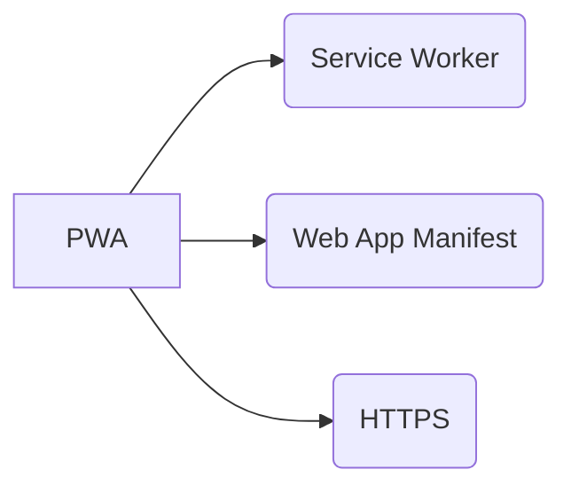
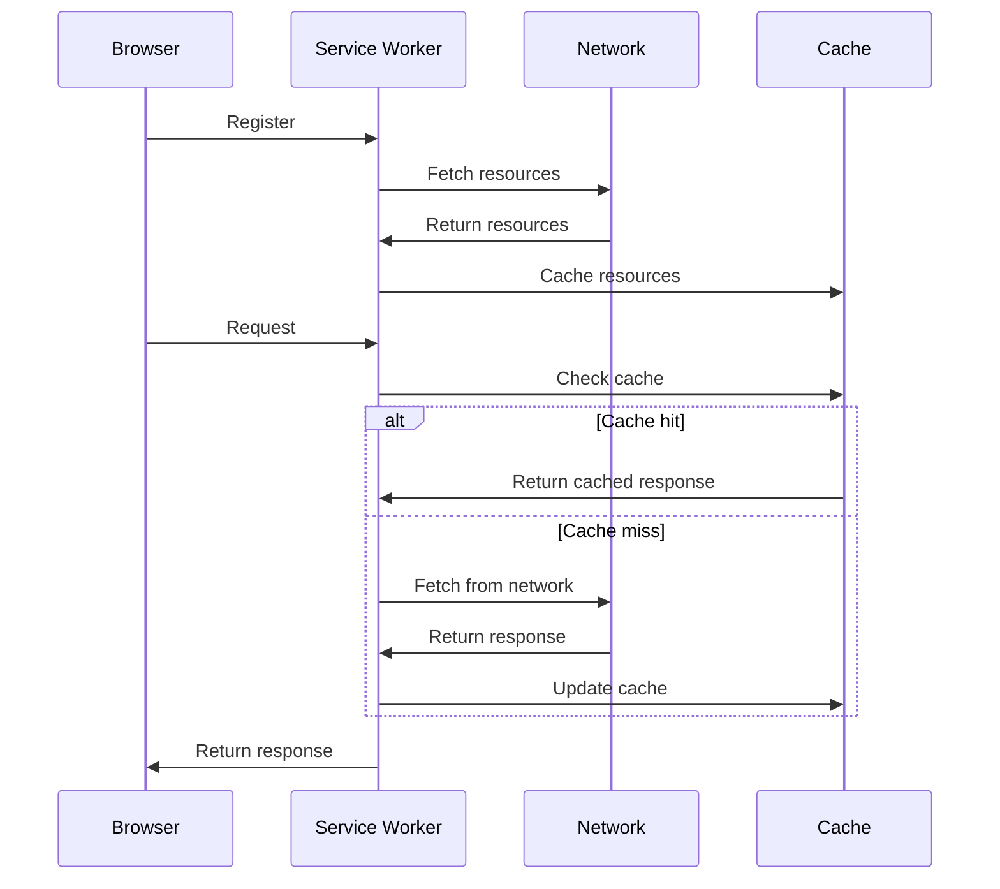

## 1. はじめに

近年、モバイルデバイスの普及により、ユーザーはアプリのようなWebサイトを求めるようになってきました。そこで登場したのが、Progressive Web Apps（PWA）です。PWAは、Webの利点とネイティブアプリの利点を組み合わせた、新しいWebアプリケーションの形態です。

PWAは、Web技術を使用して開発されますが、ネイティブアプリのような機能と性能を提供します。具体的には、以下のような特徴を持っています。

- オフライン動作: PWAはオフラインでも動作し、ネットワーク接続が不安定な環境でも快適に使用できます。
- 高速な読み込み: PWAは高速に読み込まれ、スムーズなユーザーエクスペリエンスを提供します。
- ホーム画面へのインストール: PWAはホーム画面にインストールでき、ネイティブアプリのように起動することができます。
- プッシュ通知: PWAはプッシュ通知を送信でき、ユーザーのエンゲージメントを高めることができます。

PWAの重要性は、ユーザーエクスペリエンスの向上とビジネスの成果につながることです。PWAを導入することで、以下のような利点が期待できます。

1. ユーザーエンゲージメントの向上: オフライン機能やプッシュ通知により、ユーザーとのエンゲージメントを高められます。
2. 転換率の向上: 高速な読み込みとスムーズなユーザーエクスペリエンスにより、転換率の向上が期待できます。
3. 開発コストの削減: Web技術を使用するため、ネイティブアプリの開発と比較して、開発コストを削減できます。
4. SEOの向上: PWAはWebサイトと同様にインデックス化されるため、SEOの向上につながります。

これからのWebアプリケーション開発において、PWAは重要な選択肢の一つとなっています。このガイドでは、PWAの基礎知識から実装方法まで、初心者向けに解説していきます。

## 2. PWAの基本概念

PWAは、Webアプリケーションの進化形と言えます。従来のWebアプリケーションとの主な違いは、以下の3つの特徴にあります。

### 信頼性

PWAは、ネットワーク接続が不安定な環境でも、オフラインでの動作を保証します。これは、Service Workerという技術を使用して実現されます。Service Workerは、Webアプリケーションとネットワーク間に位置し、リクエストを傍受してキャッシュからレスポンスを返すことができます。これにより、オフラインでもコンテンツを表示することが可能になります。

### 速度

PWAは、高速な読み込みとスムーズなユーザーエクスペリエンスを提供します。これは、Service Workerによるキャッシュ機能と、Web App Manifestによるアプリケーションシェルの定義により実現されます。アプリケーションシェルは、アプリケーションの構造を定義するもので、一度キャッシュされると、次回以降の読み込みが高速になります。

### エンゲージメント

PWAは、ユーザーとのエンゲージメントを高めるための機能を提供します。例えば、プッシュ通知機能により、ユーザーに対してタイムリーな情報を提供することができます。また、Web App Manifestを使用することで、ホーム画面へのインストールが可能になり、ネイティブアプリのようにアプリを起動することができます。

### PWAを構成する技術

PWAを実現するために、以下の3つの主要な技術が使用されています。

1. Service Worker: オフライン機能やプッシュ通知機能を提供するための技術です。
2. Web App Manifest: アプリケーションのメタデータを定義するためのJSONファイルです。アプリ名やアイコン、テーマカラーなどを指定します。
3. HTTPS: セキュアな通信を保証するためのプロトコルです。PWAではHTTPSが必須となっています。

以下は、これらの技術の関係性をMermaidのフローチャートで表現したものです。



次に、Service Workerの動作をMermaidのシーケンス図で表現してみましょう。



このシーケンス図では、以下のようなService Workerの動作を表現しています。

1. ブラウザがService Workerを登録する
2. Service Workerがネットワークからリソースをフェッチし、キャッシュに保存する
3. ブラウザがService Workerにリクエストを送信する
4. Service Workerがキャッシュをチェックする
5. キャッシュにリソースがある場合は、キャッシュからレスポンスを返す
6. キャッシュにリソースがない場合は、ネットワークからリソースをフェッチし、キャッシュを更新する
7. Service Workerがブラウザにレスポンスを返す

これらの技術を組み合わせることで、PWAは従来のWebアプリケーションを超える機能と性能を提供することができるのです。

## 3. Service Worker

Service Workerは、PWAの中核をなす技術の1つです。Service Workerは、Webアプリケーションとネットワーク間に位置するJavaScriptファイルで、リクエストを傍受し、キャッシュを管理することができます。

### Service Workerの役割と動作原理

Service Workerは、以下のような役割を持っています。

1. リクエストの傍受: Service Workerは、Webアプリケーションから発行されたリクエストを傍受し、処理することができます。
2. キャッシュの管理: Service Workerは、キャッシュAPIを使用して、リソースをキャッシュに保存したり、キャッシュから取得したりすることができます。
3. オフライン機能の提供: Service Workerは、オフラインでもキャッシュされたリソースを提供することができます。
4. プッシュ通知の実現: Service Workerは、プッシュ通知を受信し、ユーザーに通知を表示することができます。

Service Workerは、Webアプリケーションとは別のスレッドで実行されます。これにより、メインスレッドがブロックされることなく、バックグラウンドで処理を実行することができます。

### オフライン機能の実現方法

Service Workerを使用することで、オフライン機能を実現することができます。オフライン機能を実現するためには、以下の手順が必要です。

1. Service Workerをインストールする: Webアプリケーションから、Service Workerをインストールします。
2. リソースをキャッシュする: Service Worker内で、必要なリソースをキャッシュAPIを使用してキャッシュします。
3. リクエストを傍受する: Service Workerは、Webアプリケーションから発行されたリクエストを傍受します。
4. キャッシュから応答する: リクエストされたリソースがキャッシュに存在する場合は、キャッシュから応答します。キャッシュに存在しない場合は、ネットワークからリソースを取得し、キャッシュに保存した上で応答します。

### キャッシュ戦略について

Service Workerでは、様々なキャッシュ戦略を使用することができます。代表的なキャッシュ戦略には、以下のようなものがあります。

1. キャッシュファースト: キャッシュにリソースが存在する場合は、キャッシュから応答します。キャッシュに存在しない場合は、ネットワークから取得します。
2. ネットワークファースト: ネットワークからリソースを取得し、取得できた場合はキャッシュに保存します。ネットワークから取得できない場合は、キャッシュから応答します。
3. ステールホワイルリバリデート: キャッシュから応答しつつ、バックグラウンドでネットワークから最新のリソースを取得し、キャッシュを更新します。

キャッシュ戦略は、リソースの種類や更新頻度に応じて、適切に選択する必要があります。

Service Workerは、PWAにおいて非常に重要な役割を果たします。Service Workerを適切に実装することで、オフライン機能や高速な読み込みを実現することができるのです。

## 4. Web App Manifest

Web App Manifest は、JSON 形式のファイルで、Web アプリケーションのメタデータを定義するために使用されます。Web App Manifest を使用することで、Web アプリケーションをホーム画面に追加したり、フルスクリーンモードで起動したりすることができます。

### Web App Manifest の目的と機能

Web App Manifest には、以下のような目的と機能があります。

1. アプリ名の指定: Web アプリケーションの名前を指定することができます。
2. アイコンの指定: Web アプリケーションのアイコンを指定することができます。
3. 起動 URL の指定: Web アプリケーションの起動 URL を指定することができます。
4. ディスプレイモードの指定: Web アプリケーションの表示モード（フルスクリーン、スタンドアロン、ブラウザ）を指定することができます。
5. 画面の向きの指定: Web アプリケーションの画面の向き（縦、横）を指定することができます。
6. テーマカラーの指定: Web アプリケーションのテーマカラーを指定することができます。
7. バックグラウンドカラーの指定: Web アプリケーションの背景色を指定することができます。

### アプリのインストール方法

Web App Manifest を使用することで、ユーザーは Web アプリケーションをホーム画面に追加することができます。以下は、Web アプリケーションをインストールする手順の一例です。

1. Web アプリケーションを開く
2. ブラウザのメニューから "ホーム画面に追加" を選択する
3. 確認ダイアログで "追加" をクリックする

Web App Manifest で指定された情報に基づいて、アプリ名やアイコンがホーム画面に表示されます。

### アイコン、スプラッシュスクリーン、テーマカラーの設定

Web App Manifest では、以下のようにアイコン、スプラッシュスクリーン、テーマカラーを設定することができます。

#### アイコンの設定

```json
"icons": [
  {
    "src": "icon-192x192.png",
    "sizes": "192x192",
    "type": "image/png"
  },
  {
    "src": "icon-512x512.png",
    "sizes": "512x512",
    "type": "image/png"
  }
]
```

#### スプラッシュスクリーンの設定

```json
"background_color": "#ffffff",
"orientation": "portrait"
```

#### テーマカラーの設定

```json
"theme_color": "#2196f3"
```

これらの設定を Web App Manifest に記述することで、Web アプリケーションをネイティブアプリのようにカスタマイズすることができます。

Web App Manifest は、PWA の重要な構成要素の1つです。Web App Manifest を適切に設定することで、ユーザーにネイティブアプリのような体験を提供することができるのです。

## 5. PWAの利点

PWAは、従来のWebアプリケーションと比較して、多くの利点を持っています。ここでは、PWAの主な利点について詳しく説明します。

### オフライン機能による利便性向上

PWAは、オフライン機能を提供することができます。これは、Service Workerを使用してリソースをキャッシュすることで実現されます。オフライン機能により、以下のような利点があります。

1. ネットワークが不安定な環境でも、アプリケーションを使用することができます。
2. ネットワークの速度が遅い場合でも、キャッシュされたリソースを使用することで、高速に表示することができます。
3. ユーザーがオフラインの状態でアプリケーションを開いた場合でも、コンテンツを表示することができます。

これにより、ユーザーは、いつでもどこでもアプリケーションを使用することができ、利便性が大幅に向上します。

### 高速な読み込みとスムーズなユーザーエクスペリエンス

PWAは、高速な読み込みとスムーズなユーザーエクスペリエンスを提供します。これは、以下のような技術によって実現されます。

1. Service Workerによるリソースのキャッシュ: 一度読み込んだリソースをキャッシュすることで、次回以降の読み込みを高速化することができます。
2. App Shellアーキテクチャ: アプリケーションの構造を定義することで、初期ロードを高速化することができます。
3. レスポンシブデザイン: デバイスに応じて最適化されたレイアウトを提供することで、スムーズなユーザーエクスペリエンスを実現することができます。

これらの技術により、ユーザーは、ネイティブアプリのような高速な読み込みとスムーズな操作感を得ることができます。

### エンゲージメントの向上

PWAは、エンゲージメントを向上させるための機能を提供します。以下は、PWAがエンゲージメントを向上させる方法の例です。

1. プッシュ通知: Service Workerを使用して、プッシュ通知を送信することができます。これにより、ユーザーに対してタイムリーな情報を提供することができます。
2. ホーム画面へのインストール: Web App Manifestを使用することで、ユーザーはアプリケーションをホーム画面に追加することができます。これにより、ユーザーはアプリケーションに簡単にアクセスすることができます。
3. オフライン機能: オフライン機能により、ユーザーはネットワークが接続されていない状態でもアプリケーションを使用することができます。これにより、ユーザーとアプリケーションとの関係性を維持することができます。

これらの機能により、ユーザーとアプリケーションとの関係性を強化し、エンゲージメントを向上させることができます。

PWAの利点は、ユーザーにとっても、開発者にとっても大きなメリットがあります。PWAを採用することで、より多くのユーザーに高品質なWebアプリケーションを提供することができるのです。

## 6. PWAの実例紹介

PWAは、多くの企業や開発者に採用され、成功を収めています。ここでは、PWAの成功事例を紹介し、各事例における工夫点や特徴について解説します。

### 成功事例の紹介

#### Twitter Lite

Twitter Liteは、PWAを採用することで、以下のような成果を上げています。

- 読み込み時間が5秒から2秒に短縮
- データ使用量が70％削減
- エンゲージメント率が65％向上

Twitter Liteでは、Service Workerを使用してリソースをキャッシュし、高速な読み込みを実現しています。また、Web App Manifestを使用して、ホーム画面へのインストールを可能にしています。

#### Alibaba

Alibabaは、PWAを採用することで、以下のような成果を上げています。

- 読み込み時間が11.6秒から4.6秒に短縮
- 転換率が76％向上
- エンゲージメント率が14％向上

Alibabaでは、Service Workerを使用してオフライン機能を提供し、ユーザーがネットワークに接続されていない状態でも、アプリケーションを使用できるようにしています。

#### Trivago

Trivagoは、PWAを採用することで、以下のような成果を上げています。

- 読み込み時間が3.6秒から1.6秒に短縮
- 転換率が97％向上
- バウンス率が35％減少

Trivagoでは、App Shellアーキテクチャを採用し、高速な読み込みを実現しています。また、レスポンシブデザインを採用し、様々なデバイスに対応しています。

### 各事例における工夫点や特徴の解説

これらの事例における工夫点や特徴は、以下のようにまとめられます。

1. Service Workerの活用: Service Workerを使用してリソースをキャッシュし、高速な読み込みやオフライン機能を実現しています。
2. Web App Manifestの活用: Web App Manifestを使用して、ホーム画面へのインストールを可能にし、ユーザーエンゲージメントを向上させています。
3. App Shellアーキテクチャの採用: App Shellアーキテクチャを採用し、高速な読み込みを実現しています。
4. レスポンシブデザインの採用: レスポンシブデザインを採用し、様々なデバイスに対応しています。
5. パフォーマンスの最適化: 画像の遅延ロードやコードの最適化など、パフォーマンスを最適化するための工夫を行っています。

これらの工夫点や特徴は、PWAの利点を最大限に活用するために重要な要素です。PWAを実装する際には、これらの工夫点を参考にしながら、自社のサービスに適した方法で実装していくことが重要です。

PWAの実例は、その利点や効果を実証するものです。これらの事例を参考にしながら、PWAを活用することで、ユーザーエクスペリエンスの向上とビジネスの成果につなげることができるでしょう。

## 7. まとめ

本記事では、PWAについて初心者向けに解説してきました。PWAは、Webアプリケーションの新しい形態であり、ネイティブアプリに匹敵する機能とユーザーエクスペリエンスを提供することができます。

### PWAの重要性と将来性

PWAは、以下のような重要性と将来性を持っています。

1. ユーザーエクスペリエンスの向上: PWAは、高速な読み込みやオフライン機能など、ユーザーエクスペリエンスを向上させるための機能を提供します。
2. 開発コストの削減: PWAは、Webアプリケーションをベースに開発するため、ネイティブアプリの開発と比較して、開発コストを削減することができます。
3. 導入の容易さ: PWAは、URLを共有するだけで導入することができるため、ユーザーにとって導入の敷居が低くなります。
4. 将来性: PWAは、今後もWebの標準技術として発展していくことが予想され、より多くの機能や可能性を持つようになると考えられます。

これらの重要性と将来性から、PWAは今後もますます重要な技術になっていくと考えられます。

### 初心者向けのアドバイスや次のステップ

PWAを学び始めた初心者の方々に、以下のようなアドバイスをしたいと思います。

1. Web開発の基礎を身につける: PWAを学ぶ前に、HTML、CSS、JavaScriptなどのWeb開発の基礎を身につけることが重要です。
2. Service WorkerとWeb App Manifestを理解する: PWAの中核となる技術であるService WorkerとWeb App Manifestについて、詳しく学ぶことが重要です。
3. 既存のPWAを分析する: 既存のPWAがどのように実装されているかを分析することで、PWAの実装方法を学ぶことができます。
4. 自分でPWAを作ってみる: 実際にPWAを作ってみることで、PWAの開発プロセスを体験することができます。
5. コミュニティに参加する: PWAのコミュニティに参加することで、最新の情報を入手したり、他の開発者と交流したりすることができます。

次のステップとしては、実際にPWAの開発に取り組んでみることをお勧めします。簡単なアプリケーションから始めて、徐々に機能を追加していくことで、PWAの開発スキルを身につけることができるでしょう。

PWAは、Webの可能性を大きく広げる技術です。PWAを活用することで、より多くのユーザーに価値を提供し、ビジネスの成果につなげることができます。ぜひ、PWAの学習と実践に取り組んでみてください。
