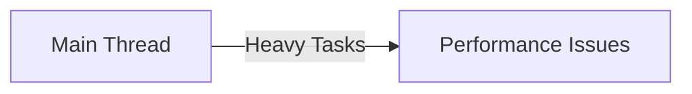
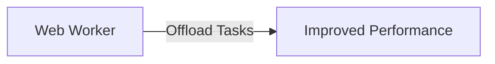
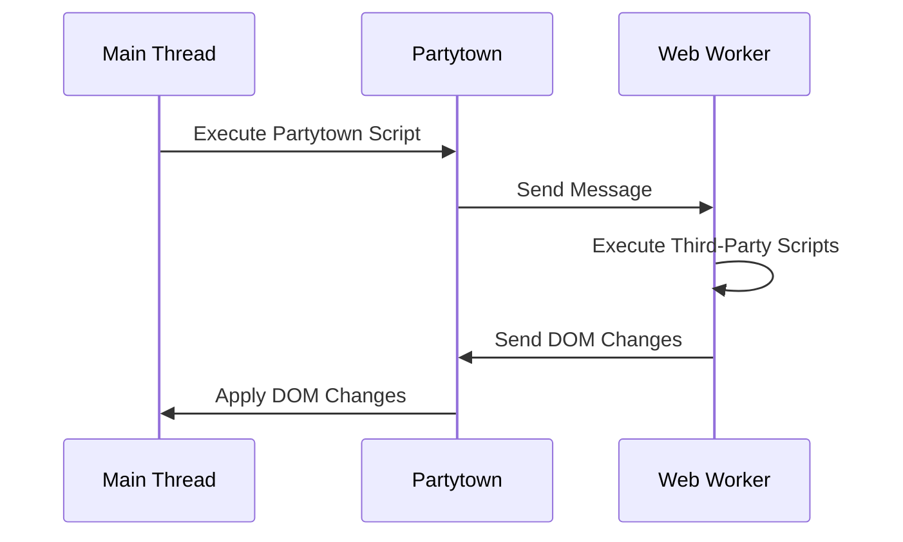

## 1. はじめに

近年、ウェブサイトにおけるユーザーエクスペリエンスの向上が重要視されており、サイトの表示速度はその中でも特に大きな要因の一つとなっています。しかし、多くのウェブサイトでは、広告やアナリティクス、ソーシャルメディアのシェアボタンなど、サードパーティのスクリプトを多数導入しています。これらのスクリプトは便利な機能を提供する一方で、サイトの読み込み速度を低下させる原因にもなっています。

サードパーティスクリプトがウェブサイトのパフォーマンスに与える影響は少なくありません。これらのスクリプトはメインスレッド上で実行されるため、重い処理を含んでいる場合、ページの表示が遅延したり、ユーザーインタラクションへの反応が鈍くなったりします。また、サードパーティスクリプトの読み込みに時間がかかると、First Contentful Paint (FCP) や Largest Contentful Paint (LCP) などの重要なメトリクスに影響し、Core Web Vitals のスコアが下がる可能性があります。

これらの問題を解決するために、partytown というライブラリが開発されました。partytown は、サードパーティスクリプトをメインスレッドではなく Web Worker 上で実行することで、メインスレッドの負荷を軽減し、ページのパフォーマンスを改善します。

本記事では、partytown の仕組みと活用方法について詳しく解説します。partytown を導入することで、サードパーティスクリプトによるパフォーマンスの低下を最小限に抑え、ユーザーエクスペリエンスの向上を図ることができるでしょう。

## 2. partytownとは

partytown は、サードパーティスクリプトをメインスレッドではなく Web Worker で実行することで、ウェブサイトのパフォーマンスを改善するためのライブラリです。その主な目的は、サードパーティスクリプトによるメインスレッドへの影響を最小限に抑え、ページの表示速度や応答性を向上させることです。

通常、ウェブサイトではすべてのJavaScriptがメインスレッド上で実行されます。メインスレッドは、ページのレンダリングやユーザーインタラクションの処理など、多くの重要なタスクを担当しています。そのため、メインスレッド上で重い処理を行うサードパーティスクリプトが存在すると、ページのパフォーマンスに大きな影響を与えてしまいます。

一方、Web Worker は、メインスレッドとは別のバックグラウンドスレッドで動作します。Web Worker 上でスクリプトを実行することで、メインスレッドへの負荷を軽減できます。partytown は、このWeb Worker の仕組みを利用して、サードパーティスクリプトをメインスレッドから Web Worker に移行します。

partytown を使用すると、サードパーティスクリプトがメインスレッドをブロックすることなく実行されるため、ページの表示速度が向上し、ユーザーインタラクションへの反応が速くなります。また、メインスレッドが他の重要なタスクに専念できるようになるため、全体的なパフォーマンスが改善されます。

ただし、Web Worker はメインスレッドとは異なるコンテキストで動作するため、DOM への直接的なアクセスができません。そのため、partytown ではメインスレッドと Web Worker 間でメッセージングを行うことで、必要なデータのやり取りを実現しています。

以上のように、partytown はメインスレッドとWeb Worker の役割を適切に分担することで、サードパーティスクリプトによるパフォーマンスの低下を防ぎ、ウェブサイトの高速化を実現するライブラリなのです。

## 3. partytownの仕組み

partytownは、サードパーティスクリプトをメインスレッドからWeb Workerに移行することでパフォーマンスを改善します。ここでは、partytownの仕組みについて詳しく見ていきましょう。

まず、partytownは、サードパーティスクリプトをWeb Worker上で実行します。通常、これらのスクリプトはメインスレッド上で実行されるため、重い処理を含む場合、メインスレッドがブロックされ、ページのパフォーマンスが低下します。しかし、Web Workerを使用することで、サードパーティスクリプトをバックグラウンドで実行し、メインスレッドへの影響を最小限に抑えることができます。

ただし、Web WorkerはDOMに直接アクセスできないため、サードパーティスクリプトがDOMを操作する必要がある場合は、メインスレッドとのコミュニケーションが必要になります。ここで、partytownのもう一つの重要な機能であるメインスレッドとWeb Worker間のメッセージングが活躍します。

以下のシーケンス図は、partytownにおけるメインスレッドとWeb Worker間のメッセージングの流れを示しています。

1. メインスレッドがpartytownのスクリプトを実行します。
2. partytownは、サードパーティスクリプトをWeb Workerに移行するためのメッセージをWeb Workerに送信します。
3. Web Workerは、受け取ったメッセージに基づいてサードパーティスクリプトを実行します。
4. サードパーティスクリプトがDOMを変更した場合、Web Workerはその変更内容をpartytownにメッセージとして送信します。
5. partytownは、Web Workerから受け取ったDOM変更のメッセージをメインスレッドに適用します。

このようなメッセージングの仕組みにより、サードパーティスクリプトはWeb Worker上で実行されながらも、必要に応じてDOMを操作することができます。メインスレッドとWeb Worker間のやり取りは非同期に行われるため、メインスレッドのブロックを最小限に抑えることができます。

以上のように、partytownは、サードパーティスクリプトのWeb Workerでの実行とメインスレッドとのメッセージングを組み合わせることで、パフォーマンスの改善を実現しています。この仕組みにより、開発者はサードパーティスクリプトの利点を享受しながら、ページの表示速度と応答性を向上させることができるのです。

## 4. partytownを使うメリット

partytownを導入することで、ウェブサイトのパフォーマンスを大幅に改善できます。ここでは、partytownを使用することのメリットについて詳しく説明します。

### メインスレッドのブロッキング防止と応答性の向上

サードパーティスクリプトがメインスレッド上で実行されると、重い処理によってメインスレッドがブロックされ、ページの応答性が低下する可能性があります。これにより、ユーザーがページ上のボタンをクリックしても反応が遅れたり、スクロールがスムーズでなくなったりといった問題が発生します。

partytownを使用すると、サードパーティスクリプトがWeb Worker上で実行されるため、メインスレッドへの影響が最小限に抑えられます。その結果、メインスレッドはページのレンダリングやユーザーインタラクションの処理に専念できるようになり、ページの応答性が向上します。ユーザーは、サイトの操作がより快適になったことを実感できるでしょう。

### ページの読み込み時間短縮とCore Web Vitalsスコアの改善

サードパーティスクリプトの読み込みと実行に時間がかかると、ページの表示が遅延し、ユーザーエクスペリエンスが損なわれます。特に、First Contentful Paint (FCP) やLargest Contentful Paint (LCP) などの指標は、サードパーティスクリプトのパフォーマンスに大きく影響を受けます。

partytownを導入することで、サードパーティスクリプトによるページの読み込み時間への影響を最小限に抑えることができます。Web Worker上でスクリプトが実行されるため、メインスレッドはページのレンダリングに集中でき、コンテンツがより早く表示されるようになります。これにより、FCPやLCPなどの指標が改善され、Core Web Vitalsのスコアが向上します。

Core Web Vitalsは、GoogleがWebページのユーザーエクスペリエンスを評価する上で重要な指標となっています。高いスコアを獲得することは、検索エンジン最適化（SEO）の観点からも有利になります。partytownを活用してCore Web Vitalsを改善することで、オーガニック検索でのランキング上昇や、ユーザーエンゲージメントの向上が期待できます。

以上のように、partytownを使用することで、メインスレッドのブロッキングを防止してページの応答性を高め、読み込み時間を短縮してCore Web Vitalsのスコアを改善できます。これらのメリットは、ウェブサイトのユーザーエクスペリエンスを大きく向上させ、ビジネス目標の達成にも貢献するでしょう。

## 5. partytownの使用上の注意点

partytownを導入する際には、いくつかの注意点があります。ここでは、非対応のスクリプトへの対処法、メッセージングのオーバーヘッドを考慮した設計、複雑なDOM操作が必要な場合の判断について説明します。

### 非対応のスクリプトがある場合の対処法

partytownは多くのサードパーティスクリプトに対応していますが、一部のスクリプトでは互換性の問題が発生する可能性があります。これは、スクリプトがWeb Workerでの実行を想定していなかったり、特定のブラウザ機能に依存していたりする場合に起こりえます。

非対応のスクリプトが見つかった場合、以下のような対処法があります：

1. スクリプトの提供元に問い合わせ、partytownでの使用に関する情報を求める。
2. 代替となるスクリプトを探し、partytownに対応しているものを選ぶ。
3. スクリプトをpartytownで実行せず、メインスレッドで従来通り実行する。

状況に応じて、最適な方法を選択することが重要です。

### メッセージングのオーバーヘッドを考慮した設計

partytownでは、メインスレッドとWeb Worker間でメッセージングが行われます。大量のメッセージのやり取りが発生すると、オーバーヘッドが増大し、パフォーマンスに影響を与える可能性があります。

このオーバーヘッドを最小限に抑えるには、以下の点に注意してください：

1. 必要最小限のデータのみをメッセージとしてやり取りする。
2. メッセージの送信頻度を適切に制御する。
3. 可能な限り、一度に複数のデータをまとめて送信する。

適切な設計により、メッセージングのオーバーヘッドを軽減し、partytownのパフォーマンスを最大化できます。

### 複雑なDOM操作が必要な場合の適切な判断

サードパーティスクリプトの中には、複雑なDOM操作を行うものがあります。partytownでは、Web WorkerからDOMを直接操作することはできないため、メインスレッドとのメッセージングが必要になります。

しかし、大量のDOM操作をメッセージングで処理しようとすると、オーバーヘッドが大きくなり、かえってパフォーマンスが低下する可能性があります。そのため、以下のような判断が必要です：

1. スクリプトのDOM操作の複雑さを評価する。
2. 複雑なDOM操作が必要な場合、partytownを使わずにメインスレッドで実行することを検討する。
3. DOM操作を最小限に抑え、パフォーマンスへの影響を軽減する。

状況に応じて適切に判断し、partytownの利点を最大限に活用することが重要です。

以上の注意点を踏まえつつpartytownを活用することで、サードパーティスクリプトによるパフォーマンスの低下を最小限に抑え、ウェブサイトのユーザーエクスペリエンスを向上させることができるでしょう。

## 6. まとめ

本記事では、サードパーティスクリプトを最適化するためのライブラリである partytown について詳しく解説してきました。ここでは、partytown を使ったサードパーティスクリプトの最適化方法と、ウェブサイトのパフォーマンス改善における partytown の有用性について振り返ります。

### partytownを使ったサードパーティスクリプトの最適化方法

partytown を使ってサードパーティスクリプトを最適化するには、以下の手順を踏むことが重要です：

1. サードパーティスクリプトを特定し、partytown での実行に適しているかを評価する。
2. partytown をプロジェクトに導入し、必要な設定を行う。
3. サードパーティスクリプトを partytown で実行するように変更する。
4. メインスレッドと Web Worker 間のメッセージングを適切に設計し、オーバーヘッドを最小限に抑える。
5. 複雑な DOM 操作が必要な場合は、partytown の使用を再検討する。

これらの手順を適切に実行することで、サードパーティスクリプトによるパフォーマンスへの影響を最小限に抑え、ウェブサイトの表示速度と応答性を向上させることができます。

### ウェブサイトのパフォーマンス改善におけるpartytownの有用性

partytown は、ウェブサイトのパフォーマンス改善において非常に有用なツールです。以下のような点から、partytown の有用性が確認できます：

1. サードパーティスクリプトをメインスレッドから Web Worker に移行することで、メインスレッドのブロッキングを防止し、ページの応答性を向上させる。
2. ページの読み込み時間を短縮し、First Contentful Paint (FCP) や Largest Contentful Paint (LCP) などの指標を改善することで、Core Web Vitals のスコアを向上させる。
3. ユーザーエクスペリエンスを向上させ、エンゲージメントや滞在時間の増加、離脱率の減少などのポジティブな効果をもたらす。
4. 検索エンジン最適化（SEO）の観点からも有利になり、オーガニック検索でのランキング上昇が期待できる。

ウェブサイトのパフォーマンスは、ユーザーエクスペリエンスとビジネス目標の達成に直結する重要な要素です。partytown を活用してサードパーティスクリプトを最適化することは、パフォーマンス改善のための効果的な方法の一つといえるでしょう。

ただし、partytown の導入には一定の技術的知見が必要であり、すべてのサードパーティスクリプトに対応しているわけではありません。適切な判断と設計が求められますが、それらを適切に行うことで、partytown はウェブサイトのパフォーマンス改善に大きく貢献してくれるはずです。
