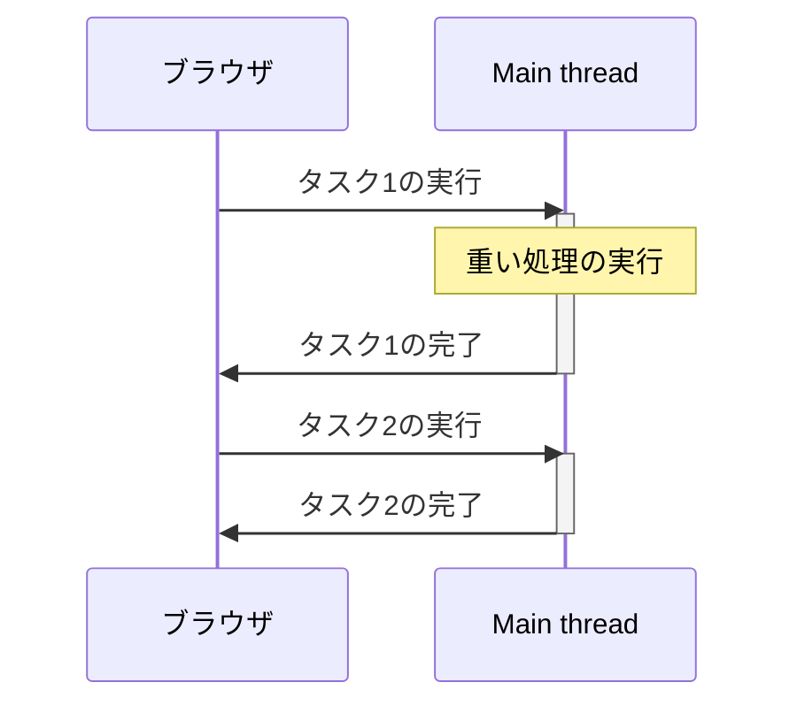
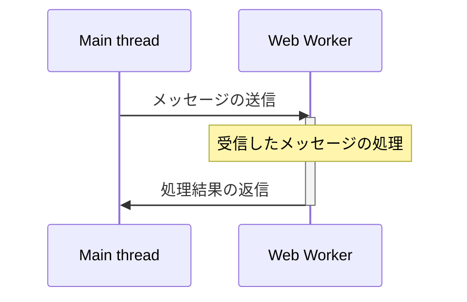
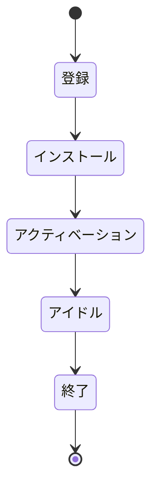
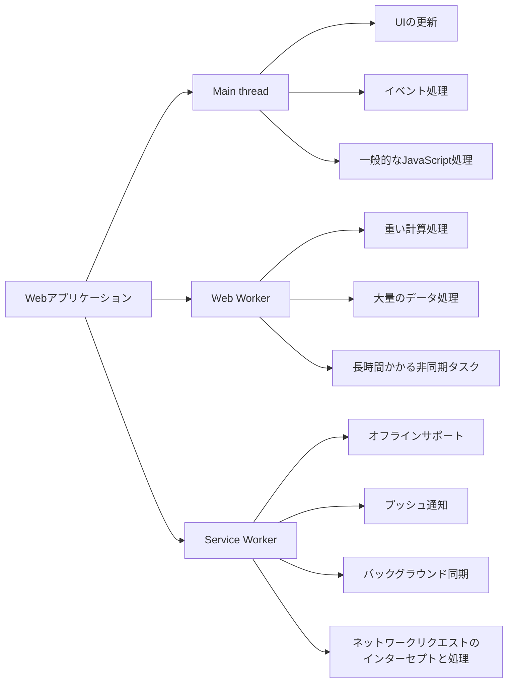
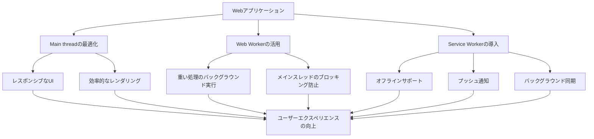

## 1. はじめに

JavaScriptは、Webアプリケーションの開発に欠かせないプログラミング言語です。しかし、JavaScriptはシングルスレッドで動作するため、複雑な処理を行う際にはパフォーマンスの問題が発生することがあります。そこで、JavaScriptにおけるスレッドの概念を理解することが重要になります。

JavaScriptにおけるスレッドには、主に3つの種類があります。

1. Main thread
2. Web Worker
3. Service Worker

これらのスレッドを適切に使い分けることで、Webアプリケーションのパフォーマンスを向上させ、ユーザーエクスペリエンスを改善することができます。

スレッドの理解が重要な理由は以下の通りです。

1. パフォーマンスの向上

- 重い処理をバックグラウンドで実行することで、メインスレッドのブロッキングを防ぎ、アプリケーションのレスポンスを向上させることができます。

2. ユーザーエクスペリエンスの改善

- スムーズなUIの更新や、オフライン機能の提供など、ユーザーエクスペリエンスを向上させるために、スレッドの活用が欠かせません。

3. 効率的なリソース管理

- スレッドを適切に使い分けることで、CPUやメモリなどのリソースを効率的に管理し、アプリケーションの安定性を高めることができます。

本記事では、Main thread、Web Worker、Service Workerについて詳しく説明していきます。それぞれの特徴や使い方を理解することで、JavaScriptのスレッドを効果的に活用し、より良いWebアプリケーションを開発することができるでしょう。

## 2. Main thread

### Main threadとは何か

Main threadは、JavaScriptがデフォルトで実行される単一のスレッドです。これは、ユーザーインターフェース（UI）の更新、イベント処理、およびJavaScriptコードの実行を担当します。

### Main threadの役割

Main threadは、以下の役割を担っています。

1. UIの更新: HTMLやCSSの変更、ページのレンダリングなど
2. イベント処理: ユーザーのクリックやキー入力、タイマーイベントなど
3. JavaScriptコードの実行: 変数の操作、関数の呼び出し、条件分岐など

### Main threadでのJavaScriptの実行

JavaScriptのコードは、Main thread上で逐次実行されます。つまり、一度に1つのタスクしか処理できません。以下は、Main threadでのJavaScriptの実行例です。

```javascript
console.log("タスク1の開始");
// 重い処理の例
for (let i = 0; i < 1000000000; i++) {
  // 何らかの処理
}
console.log("タスク1の終了");

console.log("タスク2の開始");
// 別の処理
console.log("タスク2の終了");
```

### Main threadのブロッキングとパフォーマンスへの影響

Main threadが1つのタスクを処理している間は、他のタスクは待機しなければなりません。これを「ブロッキング」と呼びます。重い処理がMain thread上で実行されると、UIの更新やユーザーインタラクションが遅延し、アプリケーションのパフォーマンスが低下します。

以下は、Main threadのブロッキングを表すシーケンス図です。



このように、Main threadがブロックされている間は、他のタスクが実行できないため、アプリケーションのパフォーマンスが低下します。この問題を解決するために、Web WorkerやService Workerといった別のスレッドを利用することができます。次のセクションでは、これらのスレッドについて詳しく説明します。

## 3. Web Worker

### Web Workerとは何か

Web Workerは、JavaScriptのメインスレッドとは別に、バックグラウンドでJavaScriptを実行するための仕組みです。Web Workerを使用することで、メインスレッドとは独立した別のスレッド上でスクリプトを実行できます。

### Web Workerの使用目的

Web Workerは、以下のような目的で使用されます。

1. 重い処理の実行: 複雑な計算や大量のデータ処理などの時間がかかるタスクを、メインスレッドをブロックせずに実行できます。
2. レスポンシブなUI: メインスレッドが重い処理でブロックされないため、ユーザーインターフェースのレスポンスが向上します。
3. 並列処理: 複数のWeb Workerを使用することで、タスクを並列に実行できます。

### Web Workerの作成と利用方法

Web Workerを作成するには、以下の手順に従います。

1. Web Worker用のJavaScriptファイルを作成します。
2. メインスレッドのJavaScriptファイルで、`Worker`オブジェクトを使用してWeb Workerを作成します。

```javascript
// メインスレッドのJavaScriptファイル
const worker = new Worker("worker.js");
```

3. Web Worker内で処理を実行します。

```javascript
// worker.js
function heavyTask() {
  // 重い処理の実行
}

heavyTask();
```

4. メインスレッドとWeb Worker間でメッセージを交換して、処理結果を受け取ります。

### Main threadとWeb Worker間のデータ通信

メインスレッドとWeb Worker間では、メッセージを介してデータを交換します。以下は、メインスレッドからWeb Workerにメッセージを送信し、Web Workerからの返信を受け取る例です。

```javascript
// メインスレッドのJavaScriptファイル
const worker = new Worker("worker.js");

worker.postMessage({ data: "メインスレッドからのデータ" });

worker.onmessage = function (event) {
  console.log("Web Workerからの返信:", event.data);
};
```

```javascript
// worker.js
self.onmessage = function (event) {
  console.log("メインスレッドからのデータ:", event.data);
  self.postMessage("Web Workerからの返信");
};
```

以下は、メインスレッドとWeb Worker間のデータ通信を表すシーケンス図です。



### Web Workerの制限事項

Web Workerには、以下のような制限事項があります。

1. DOMへのアクセス: Web Workerは、DOMに直接アクセスすることができません。
2. 一部のブラウザAPI: Web Workerは、`XMLHttpRequest`や`fetch`などの一部のブラウザAPIを使用できますが、すべてのAPIが利用可能とは限りません。
3. 同一オリジン: Web Workerは、同一オリジン（同じドメイン、プロトコル、ポート）のスクリプトのみ実行できます。

これらの制限事項を理解した上で、Web Workerを適切に活用することが重要です。次のセクションでは、Service Workerについて説明します。

## 4. Service Worker

### Service Workerとは何か

Service Workerは、Webアプリケーションとブラウザの間に位置し、ネットワークリクエストを傍受、処理、および応答することができるJavaScriptファイルです。Service Workerは、Webページとは別のスレッドで実行され、Webページがアクティブでない場合でも動作し続けることができます。

### Service Workerの主な用途

Service Workerは、以下のような用途で使用されます。

1. オフラインサポート: Service Workerを使用して、アプリケーションのアセットをキャッシュに保存し、オフラインでもアプリケーションを利用可能にすることができます。
2. プッシュ通知: Service Workerを使用して、サーバーからのプッシュ通知を受信し、ユーザーにリアルタイムな情報を提供できます。
3. バックグラウンド同期: Service Workerを使用して、オフライン時に行われた変更をオンラインに戻った際に同期することができます。

### Service Workerのライフサイクル

Service Workerのライフサイクルは、以下の段階で構成されています。

1. 登録（Registration）: Service Workerをブラウザに登録します。
2. インストール（Installation）: Service Workerがインストールされ、必要なアセットがキャッシュされます。
3. アクティベーション（Activation）: 古いService Workerが削除され、新しいService Workerがアクティブになります。
4. アイドル（Idle）: Service Workerがイベントを待機している状態です。
5. 終了（Termination）: Service Workerが必要なくなった場合、ブラウザによって終了されます。

以下は、Service Workerのライフサイクルを表すステートダイアグラムです。



### Service Workerの登録と活性化

Service Workerを使用するには、まず登録する必要があります。以下は、Service Workerの登録例です。

```javascript
if ("serviceWorker" in navigator) {
  window.addEventListener("load", function () {
    navigator.serviceWorker
      .register("/service-worker.js")
      .then(function (registration) {
        console.log("Service Worker登録成功:", registration);
      })
      .catch(function (error) {
        console.log("Service Worker登録失敗:", error);
      });
  });
}
```

登録後、Service Workerはインストールとアクティベーションの過程を経て、アクティブになります。

### Service Workerによるリクエストのインターセプトと処理

Service Workerは、`fetch`イベントを使用して、ネットワークリクエストをインターセプトし、処理することができます。以下は、Service Worker内でリクエストをインターセプトし、キャッシュから応答を返す例です。

```javascript
self.addEventListener("fetch", function (event) {
  event.respondWith(
    caches.match(event.request).then(function (response) {
      if (response) {
        return response;
      }
      return fetch(event.request);
    }),
  );
});
```

このように、Service Workerを使用することで、オフラインサポートやプッシュ通知などの高度な機能を実現できます。ただし、Service Workerの使用には注意が必要です。不適切な実装は、アプリケーションのパフォーマンスや信頼性に悪影響を与える可能性があります。

次のセクションでは、Main thread、Web Worker、Service Workerの比較について説明します。

## 5. Main thread、Web Worker、Service Workerの比較

### それぞれの特徴と違い

Main thread、Web Worker、Service Workerは、それぞれ異なる特徴と役割を持っています。以下は、それぞれの特徴と違いをまとめた表です。

| 特徴           | Main thread                                    | Web Worker                               | Service Worker                                         |
| -------------- | ---------------------------------------------- | ---------------------------------------- | ------------------------------------------------------ |
| 実行環境       | ブラウザのメインスレッド                       | バックグラウンドスレッド                 | バックグラウンドスレッド                               |
| 実行タイミング | ページの読み込み時                             | メインスレッドからの呼び出し時           | イベント駆動型                                         |
| DOMアクセス    | 可能                                           | 不可能                                   | 制限付きで可能                                         |
| 通信方法       | -                                              | メッセージング                           | メッセージング                                         |
| ライフサイクル | ページの読み込みから終了まで                   | メインスレッドからの呼び出しから終了まで | インストール、アクティベーション、アイドル、終了       |
| 用途           | UIの更新、イベント処理、一般的なJavaScript処理 | 重い処理の実行、バックグラウンドタスク   | オフラインサポート、プッシュ通知、バックグラウンド同期 |

### 適切な使用ケース

1. Main thread

- ユーザーインターフェースの更新
- イベント処理（クリック、キー入力など）
- 一般的なJavaScriptの処理

2. Web Worker

- 重い計算処理
- 大量のデータ処理
- 長時間かかる非同期タスク

3. Service Worker

- オフラインサポート
- プッシュ通知
- バックグラウンド同期
- ネットワークリクエストのインターセプトと処理

以下は、Main thread、Web Worker、Service Workerの適切な使用ケースを表すMermaidのダイアグラムです。



Main thread、Web Worker、Service Workerを適切に使い分けることで、Webアプリケーションのパフォーマンスを向上させ、ユーザーエクスペリエンスを改善することができます。それぞれの特徴と制限を理解し、適切な使用ケースに応じて活用することが重要です。

次のセクションでは、Web WorkerとService Workerのサンプルコードを紹介します。

## 6. サンプルコード

### Web Workerの基本的な使用例

以下は、Web Workerを使用して重い処理をバックグラウンドで実行する基本的な例です。

```html
<!-- index.html -->
<!doctype html>
<html>
  <head>
    <title>Web Worker Example</title>
  </head>
  <body>
    <button id="startButton">重い処理を開始</button>
    <script src="main.js"></script>
  </body>
</html>
```

```javascript
// main.js
const startButton = document.getElementById("startButton");

startButton.addEventListener("click", function () {
  const worker = new Worker("worker.js");

  worker.postMessage("重い処理を開始");

  worker.onmessage = function (event) {
    console.log(event.data);
  };
});
```

```javascript
// worker.js
self.onmessage = function (event) {
  console.log(event.data);

  // 重い処理の例
  let result = 0;
  for (let i = 0; i < 1000000000; i++) {
    result += i;
  }

  self.postMessage("重い処理が完了しました。結果: " + result);
};
```

### Service Workerの登録と活用例

以下は、Service Workerを登録し、オフラインサポートを提供する例です。

```html
<!-- index.html -->
<!doctype html>
<html>
  <head>
    <title>Service Worker Example</title>
  </head>
  <body>
    <h1>Service Worker Example</h1>
    <script src="main.js"></script>
  </body>
</html>
```

```javascript
// main.js
if ("serviceWorker" in navigator) {
  window.addEventListener("load", function () {
    navigator.serviceWorker
      .register("/service-worker.js")
      .then(function (registration) {
        console.log("Service Worker登録成功:", registration);
      })
      .catch(function (error) {
        console.log("Service Worker登録失敗:", error);
      });
  });
}
```

```javascript
// service-worker.js
const CACHE_NAME = "my-site-cache-v1";
const urlsToCache = [
  "/",
  "/index.html",
  "/main.js",
  "/styles.css",
  "/image.jpg",
];

self.addEventListener("install", function (event) {
  event.waitUntil(
    caches.open(CACHE_NAME).then(function (cache) {
      console.log("キャッシュにアセットを追加します");
      return cache.addAll(urlsToCache);
    }),
  );
});

self.addEventListener("fetch", function (event) {
  event.respondWith(
    caches.match(event.request).then(function (response) {
      if (response) {
        return response;
      }
      return fetch(event.request);
    }),
  );
});
```

これらのサンプルコードは、Web WorkerとService Workerの基本的な使用方法を示しています。実際のアプリケーションでは、これらのコードをさらに拡張し、必要な機能を実装することができます。

Web WorkerとService Workerを効果的に活用することで、Webアプリケーションのパフォーマンスを向上させ、ユーザーエクスペリエンスを改善することができます。ただし、これらの技術を使用する際は、ブラウザの互換性や、適切なエラーハンドリング、セキュリティの考慮が必要です。

次のセクションでは、まとめとして、Main thread、Web Worker、Service Workerの重要性と活用方法について述べます。

## 7. まとめ

### Main thread、Web Worker、Service Workerの重要性

Main thread、Web Worker、Service Workerは、それぞれがWebアプリケーションの重要な役割を担っています。

1. Main threadは、ユーザーインターフェースの更新やイベント処理など、アプリケーションの中核となる処理を実行します。
2. Web Workerは、重い処理をバックグラウンドで実行することで、メインスレッドのブロッキングを防ぎ、アプリケーションのレスポンシブ性を向上させます。
3. Service Workerは、オフラインサポートやプッシュ通知など、Webアプリケーションの高度な機能を提供し、ユーザーエクスペリエンスを向上させます。

これらのスレッドを適切に活用することで、Webアプリケーションのパフォーマンスと機能を大幅に改善できます。

### パフォーマンスと機能向上のためのスレッドの活用方法

1. Main threadの最適化

- 重い処理はWeb Workerに移行し、メインスレッドのブロッキングを最小限に抑えます。
- 効率的なDOMの操作やイベント処理を行い、レンダリングのパフォーマンスを向上させます。

2. Web Workerの活用

- 複雑な計算や大量のデータ処理など、時間のかかるタスクをWeb Workerで実行します。
- メインスレッドとWeb Worker間でのデータ通信を最適化し、オーバーヘッドを最小限に抑えます。

3. Service Workerの導入

- オフラインサポートを提供し、ネットワーク接続が不安定な環境でもアプリケーションを利用可能にします。
- プッシュ通知を活用し、ユーザーにタイムリーな情報を提供します。
- バックグラウンド同期を使用して、オフライン時のデータ変更をスムーズに同期します。

4. 適切なスレッドの選択

- 各スレッドの特徴と制限を理解し、タスクに応じて適切なスレッドを選択します。
- メインスレッド、Web Worker、Service Workerを組み合わせ、アプリケーション全体のパフォーマンスを最適化します。

以下は、スレッドの活用によるWebアプリケーションの改善点をまとめた図です。



Main thread、Web Worker、Service Workerを適切に活用することで、Webアプリケーションのパフォーマンスと機能を向上させ、ユーザーエクスペリエンスを大幅に改善できます。これらのスレッドの特徴と使用方法を理解し、アプリケーションの要件に合わせて適切に導入することが重要です。

今後も、これらの技術の進化に注目し、新しい可能性を探ることで、より高度なWebアプリケーションの開発が可能になるでしょう。

## 8. 参考資料

- [Main thread](https://developer.mozilla.org/ja/docs/Glossary/Main_thread)
- [Web Workers](https://developer.mozilla.org/ja/docs/Web/API/Web_Workers_API)
- [Service Worker](https://developer.mozilla.org/ja/docs/Web/API/Service_Worker_API)
