## 1. はじめに

### Reactとは何か

Reactは、Facebookによって開発されたJavaScriptのライブラリで、ユーザーインターフェース（UI）の構築に特化しています。Reactは、コンポーネントベースのアーキテクチャを採用しており、再利用可能なUIコンポーネントを作成することができます。これにより、コードの管理がしやすくなり、大規模なアプリケーションの開発がスムーズに行えます。

Reactは、仮想DOMと呼ばれる技術を使用しています。仮想DOMは、実際のDOMとは別に、Reactがメモリ内に保持する仮想的なDOMです。Reactは、この仮想DOMを使って、UIの変更を効率的に行います。仮想DOMを使うことで、不必要なDOMの更新を最小限に抑え、アプリケーションのパフォーマンスを向上させることができます。

### hooksの登場と役割

従来のReactでは、クラスコンポーネントを使ってステートや副作用を管理していました。しかし、クラスコンポーネントはコードが複雑になりがちで、再利用性が低いという問題がありました。また、クラスコンポーネントでは、ライフサイクルメソッドが複雑で、コードの可読性が低下するという問題もありました。

これらの問題を解決するために、React 16.8からhooksが導入されました。hooksは、クラスコンポーネントを使わずに、ステートや副作用を管理することができる関数です。hooksを使うことで、コンポーネントの再利用性が向上し、コードがシンプルで読みやすくなります。

hooksは、ステート管理、副作用の処理、コンテキストの共有など、さまざまな用途で使用されます。代表的なhooksには、useState、useEffect、useContextなどがあります。これらのhooksを組み合わせることで、クラスコンポーネントと同等の機能を実現することができます。

ReactのバージョンやライブラリはHook に関してどんどん進化しています。例えば、React Router v6ではuseRouteなどのフックが登場し、ルーティングを行うのに大変役立ちます。Redux Tool KitにはuseDispatchやuseSelectorなどがあり、状態管理もより簡潔に書けるようになっています。React Queryのフックは非同期処理やデータフェッチングを効率よく行えます。

このように、hooksの登場により、Reactの開発がより効率的で、読みやすく、再利用性の高いコードを書けるようになりました。次の章では、基本的なhooksについて詳しく説明していきます。

## 2. hooksとは

### hooksの定義と特徴

hooksは、React 16.8で導入された機能で、関数コンポーネント内でステートや副作用を扱うための仕組みです。hooksを使うことで、クラスコンポーネントを使わずに、ステート管理や副作用の処理を行うことができます。

hooksには、以下のような特徴があります。

1. 関数コンポーネント内で使用できる
2. 状態管理や副作用の処理を行える
3. 再利用可能なロジックを作成できる
4. コードがシンプルで読みやすくなる
5. パフォーマンスの最適化が容易

hooksは、useから始まる名前の関数として提供されています。例えば、useState、useEffect、useContextなどがあります。これらのhooksを使うことで、関数コンポーネント内でステートや副作用を管理することができます。

また、hooksは独自に作成することもできます。これをカスタムhooksと呼びます。カスタムhooksを作成することで、コンポーネント間で共通のロジックを再利用することができます。

### hooksが登場した背景

従来のReactでは、ステートや副作用の管理にはクラスコンポーネントを使用する必要がありました。しかし、クラスコンポーネントにはいくつかの問題がありました。

1. 複雑な階層構造: クラスコンポーネントでは、ステートや副作用の管理にライフサイクルメソッドを使用する必要があります。これにより、コンポーネントの階層構造が複雑になり、コードの可読性が低下します。

2. 再利用性の低さ: クラスコンポーネントでは、ステートや副作用の管理にクラスの機能を使用するため、コンポーネント間でロジックを共有することが難しくなります。

3. JavaScriptのクラスの問題: JavaScriptのクラスは、他の言語のクラスとは異なる動作をします。これにより、初心者にとってはクラスコンポーネントの理解が難しくなります。

これらの問題を解決するために、hooksが導入されました。hooksを使うことで、関数コンポーネント内でステートや副作用を管理することができるようになり、コードがシンプルで読みやすくなります。また、hooksを使うことで、再利用可能なロジックを作成することができるようになります。

Reactの開発チームは、hooksの導入により、Reactの学習コストを下げ、より多くの開発者にReactを使ってもらうことを目指しています。hooksは、Reactの未来を担う重要な機能であり、今後もさらに発展していくことが期待されています。

## 基本的なhooks

### useState

#### 状態管理の重要性

Reactアプリケーションを作成する際、コンポーネントの状態を管理することは非常に重要です。コンポーネントの状態が変化すると、Reactはコンポーネントを再レンダリングし、UIを更新します。これにより、アプリケーションのインタラクティブ性が実現されます。

#### useStateの使い方

useStateは、関数コンポーネント内で状態を管理するためのhookです。useStateを使うことで、コンポーネントの状態を宣言し、更新することができます。

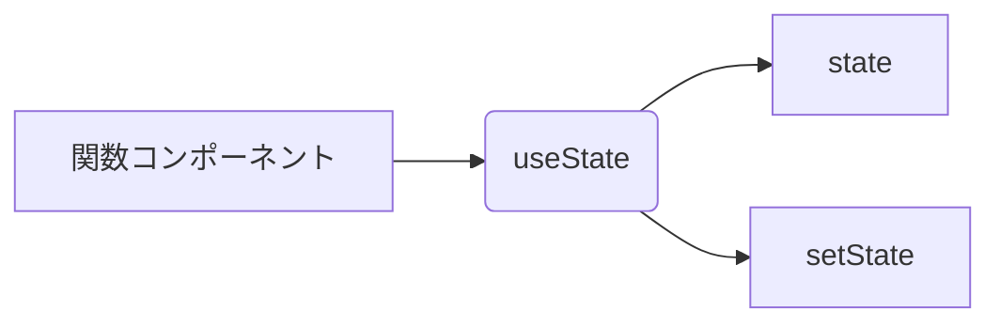

#### useStateの例

以下は、カウンターコンポーネントの例です。

```jsx
import React, { useState } from "react";

function Counter() {
  const [count, setCount] = useState(0);

  return (
    <div>
      <p>現在のカウント: {count}</p>
      <button onClick={() => setCount(count + 1)}>カウントを増やす</button>
    </div>
  );
}

export default Counter;
```

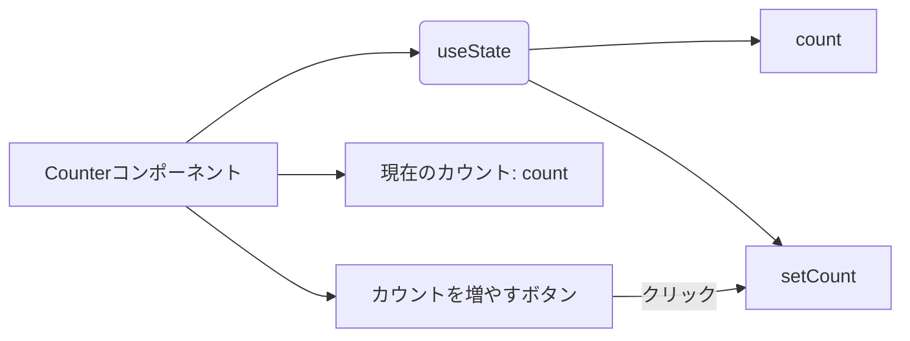

### useEffect

#### 副作用の処理

副作用とは、コンポーネントの描画以外の処理のことを指します。例えば、データのフェッチ、タイマーの設定、イベントリスナーの登録などが副作用にあたります。

#### useEffectの使い方

useEffectは、関数コンポーネント内で副作用を処理するためのhookです。useEffectを使うことで、コンポーネントのマウント時、アンマウント時、更新時に処理を実行することができます。

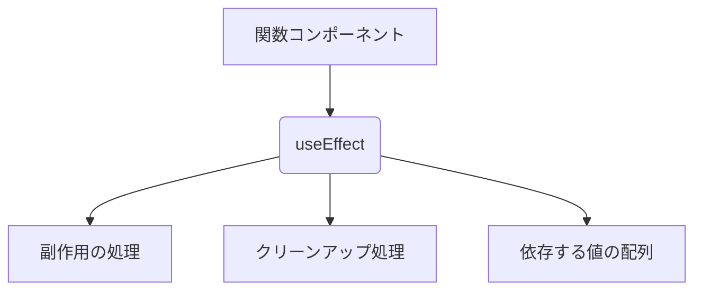

#### useEffectの例

以下は、データをフェッチするコンポーネントの例です。

```jsx
import React, { useState, useEffect } from "react";

function DataFetcher() {
  const [data, setData] = useState([]);

  useEffect(() => {
    fetch("https://api.example.com/data")
      .then((response) => response.json())
      .then((data) => setData(data));
  }, []);

  return (
    <ul>
      {data.map((item) => (
        <li key={item.id}>{item.name}</li>
      ))}
    </ul>
  );
}

export default DataFetcher;
```

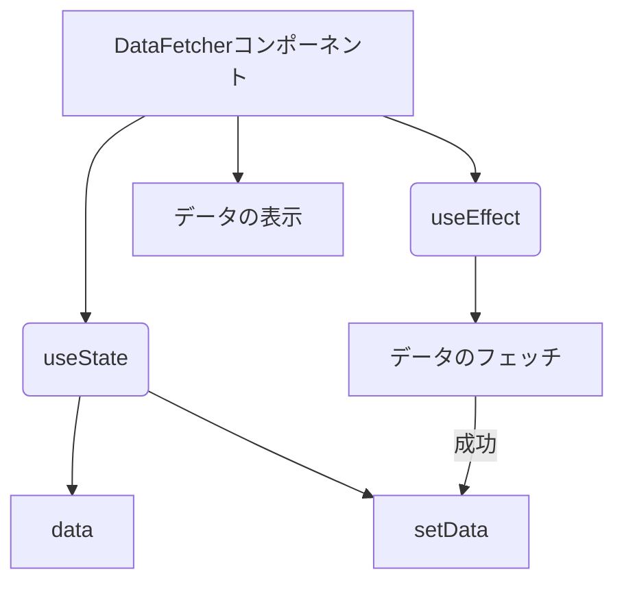

以上が、useStateとuseEffectの基本的な使い方と図解です。これらのhooksを使いこなすことで、関数コンポーネント内で状態管理と副作用の処理を行うことができます。

## その他のhooks

### useContext

#### コンテキストの共有

コンテキストは、Reactアプリケーション内でデータを共有するための仕組みです。コンテキストを使うことで、コンポーネントの階層を超えてデータを受け渡すことができます。

#### useContextの使い方

useContextは、コンテキストを利用するためのhookです。useContextを使うことで、コンポーネント内でコンテキストの値を取得することができます。

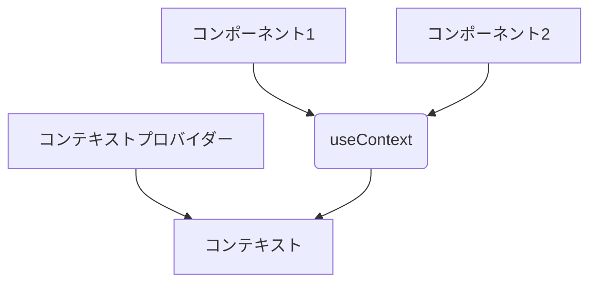

### useRef

#### リファレンスの管理

リファレンスは、コンポーネントのライフサイクルを通じて値を保持するためのオブジェクトです。リファレンスを使うことで、コンポーネントの再レンダリングを引き起こすことなく、値を保持することができます。

#### useRefの使い方

useRefは、リファレンスを作成するためのhookです。useRefを使うことで、コンポーネント内でリファレンスを作成し、値を保持することができます。

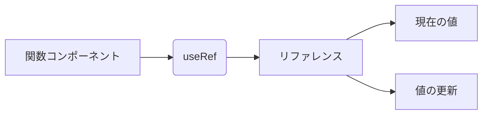

### useCallback と useMemo

#### パフォーマンス最適化

Reactアプリケーションのパフォーマンスを最適化するためには、不要な再レンダリングを避ける必要があります。useCallbackとuseMemoは、この問題を解決するためのhooksです。

#### useCallbackの使い方

useCallbackは、関数のメモ化を行うためのhookです。useCallbackを使うことで、関数の再作成を避け、パフォーマンスを改善することができます。


#### useMemoの使い方

useMemoは、値のメモ化を行うためのhookです。useMemoを使うことで、計算コストの高い処理の結果を再利用し、パフォーマンスを改善することができます。


以上が、useContext、useRef、useCallback、useMemoの基本的な使い方と図解です。これらのhooksを使いこなすことで、コンテキストの共有、リファレンスの管理、パフォーマンスの最適化を行うことができます。

## カスタムhooks

### カスタムhooksの概念

カスタムhooksは、開発者が自分で定義するhooksです。Reactには、useState、useEffectなどの組み込みのhooksが用意されていますが、これらだけでは不十分な場合があります。カスタムhooksを使うことで、コンポーネント間で共通のロジックを再利用することができます。

### カスタムhooksの作成方法

カスタムhooksは、「use」から始まる関数として定義します。カスタムhooks内では、組み込みのhooksや他のカスタムhooksを使用することができます。

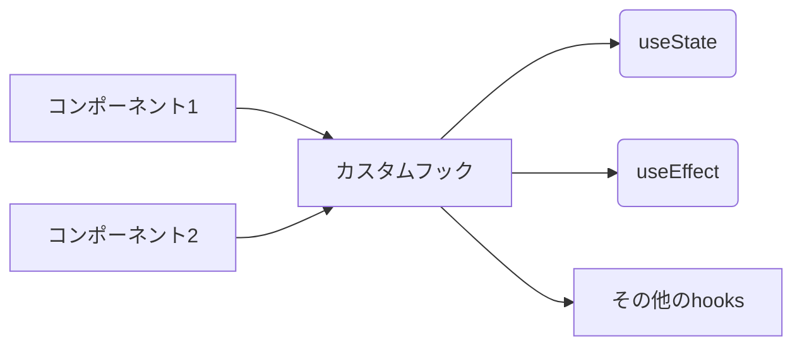

以下は、カスタムhooksの例です。

```jsx
function useCounter(initialCount) {
  const [count, setCount] = useState(initialCount);

  const increment = () => setCount(count + 1);
  const decrement = () => setCount(count - 1);
  const reset = () => setCount(initialCount);

  return [count, increment, decrement, reset];
}
```

このカスタムhookは、カウンターの状態と、カウンターを操作するための関数を返します。

### カスタムhooksの利点

カスタムhooksを使うことで、以下のような利点があります。

1. コードの再利用性が向上する
2. コンポーネントがシンプルになる
3. テストが容易になる

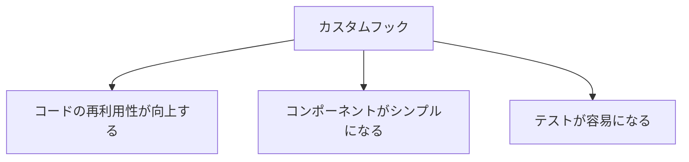

以下は、カスタムhooksを使ったコンポーネントの例です。

```jsx
function Counter() {
  const [count, increment, decrement, reset] = useCounter(0);

  return (
    <div>
      <p>現在のカウント: {count}</p>
      <button onClick={increment}>+1</button>
      <button onClick={decrement}>-1</button>
      <button onClick={reset}>リセット</button>
    </div>
  );
}
```

このコンポーネントでは、useCounterカスタムhookを使用しているため、カウンターの状態管理に関するコードがシンプルになっています。

以上が、カスタムhooksの概念、作成方法、利点の説明と図解です。カスタムhooksを活用することで、コードの再利用性を高め、コンポーネントをシンプルに保つことができます。

## hooksを使用する際の注意点

### ルールを守ること

hooksを使用する際は、以下の2つのルールを守る必要があります。

1. hooksは関数コンポーネントの最上位でのみ呼び出す
2. hooksは条件分岐やループの中で呼び出さない

これらのルールを守ることで、hooksが正しく動作することが保証されます。

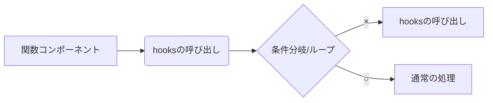

### 過剰な使用を避ける

hooksは非常に便利な機能ですが、過剰に使用すると、かえってコードの可読性が低下する恐れがあります。以下のような点に注意しましょう。

1. 1つのコンポーネントで多くのhooksを使用しない
2. カスタムhooksを適切に分割する
3. hooksに複雑なロジックを詰め込みすぎない

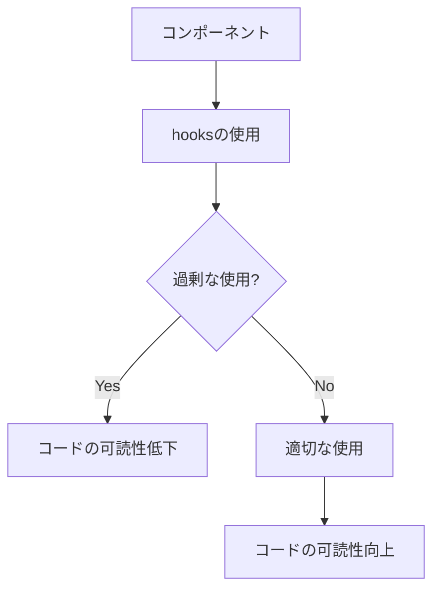

以下は、hooksを過剰に使用した例です。

```jsx
function UserInfo() {
  const [user, setUser] = useState(null);
  const [isLoading, setIsLoading] = useState(true);
  const [error, setError] = useState(null);

  useEffect(() => {
    fetchUser()
      .then((user) => {
        setUser(user);
        setIsLoading(false);
      })
      .catch((error) => {
        setError(error);
        setIsLoading(false);
      });
  }, []);

  if (isLoading) {
    return <div>Loading...</div>;
  }

  if (error) {
    return <div>Error: {error.message}</div>;
  }

  return (
    <div>
      <h1>{user.name}</h1>
      <p>{user.email}</p>
    </div>
  );
}
```

このコンポーネントでは、useState と useEffect を使用していますが、ロジックがやや複雑になっています。このような場合は、カスタムフックを作成して、ロジックを分割するのが良いでしょう。

以上が、hooksを使用する際の注意点の説明と図解です。hooksのルールを守り、過剰な使用を避けることで、可読性の高いコードを書くことができます。

## まとめ

### hooksの重要性

hooksは、Reactの開発において非常に重要な役割を果たしています。以下のような点で、hooksはReactの開発を大きく改善してくれます。

1. コードの再利用性が向上する
2. コンポーネントがシンプルになる
3. ステート管理がしやすくなる
4. 副作用の処理が容易になる
5. パフォーマンスの最適化が可能になる

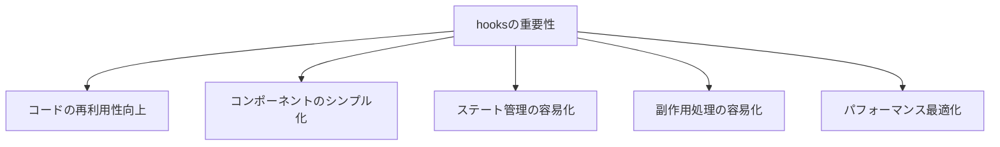

### hooksを使ったReactの開発

hooksを使ったReactの開発は、従来のクラスコンポーネントを使った開発と比べて、多くの利点があります。

1. 関数コンポーネントとhooksを組み合わせることで、コードがシンプルになる
2. カスタムhooksを活用することで、ロジックの再利用性が向上する
3. useEffectを使うことで、ライフサイクルメソッドよりも直感的に副作用の処理ができる
4. useCallbackやuseMemoを使うことで、パフォーマンスの最適化が容易になる

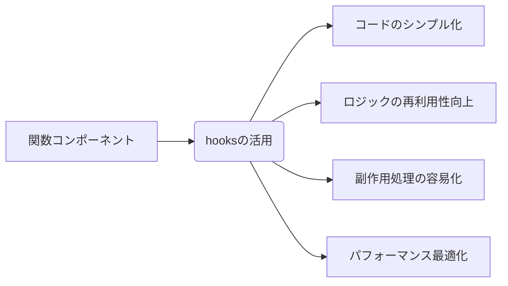

ただし、hooksを使う際は、ルールを守り、過剰な使用は避ける必要があります。

1. hooksは関数コンポーネントの最上位でのみ呼び出す
2. hooksは条件分岐やループの中で呼び出さない
3. 1つのコンポーネントで多くのhooksを使用しない
4. カスタムhooksを適切に分割する
5. hooksに複雑なロジックを詰め込みすぎない

これらの点に注意しながら、hooksを活用することで、より良いReactアプリケーションを開発することができるでしょう。

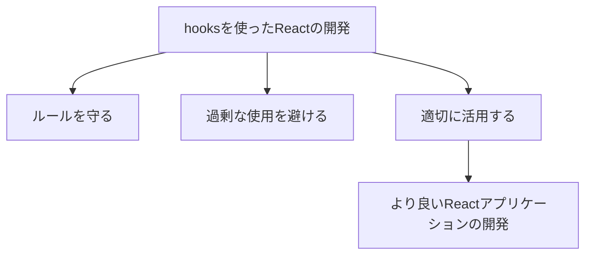

以上が、hooksの重要性とhooksを使ったReactの開発についてのまとめです。hooksは、Reactの開発に大きな変革をもたらした機能であり、適切に活用することで、より効率的で保守性の高いコードを書くことができます。
