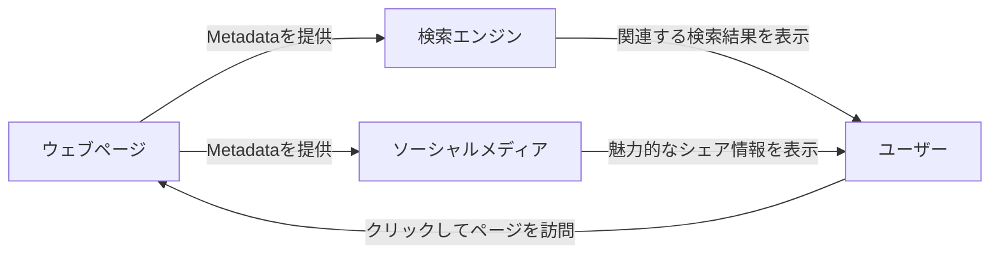
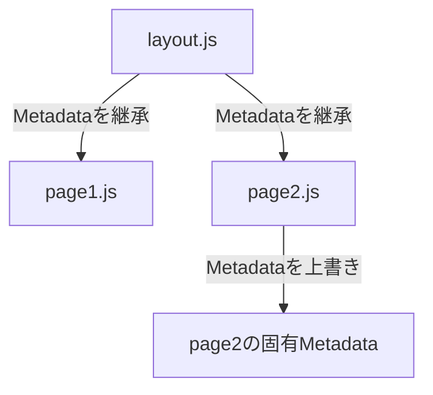
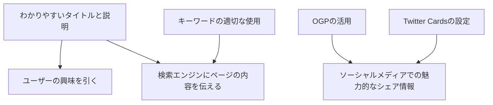
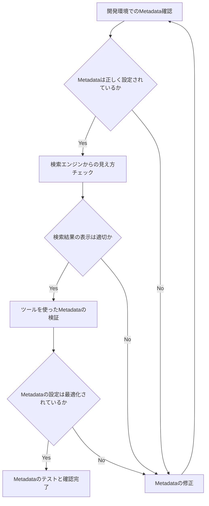
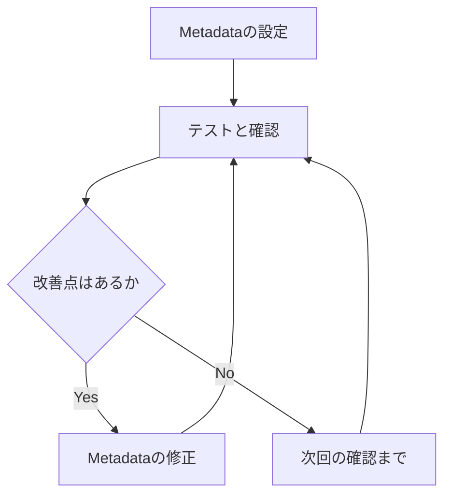

## 1. はじめに

Next.js 14がリリースされ、多くの新機能が追加されました。その中でも特に注目すべきなのが、Metadataの機能強化です。このバージョンでは、ページごとのMetadataの設定がより柔軟かつ簡単になり、SEOとUXの改善に大きく貢献します。

## 2. Metadataの重要性と役割

Metadataとは、ウェブページの内容を説明するための情報のことです。具体的には、タイトル、説明文、キーワードなどが含まれます。これらの情報は、検索エンジンがウェブページを理解し、適切な検索結果を表示するために使用されます。

また、Metadataは、SNSでのシェア時にも重要な役割を果たします。OGP（Open Graph Protocol）を設定することで、シェア時にウェブページの情報が正しく表示され、ユーザーにとって魅力的で情報量の多い投稿になります。

適切なMetadataを設定することで、検索エンジンからの流入を増やし、ユーザーのエンゲージメントを高めることができます。つまり、SEOとUXの両方を改善できるのです。

Next.js 14のMetadata機能は、このようなMetadataの設定をより簡単かつ柔軟に行えるようにするための機能です。ページごとにMetadataを設定できるだけでなく、親コンポーネントから子コンポーネントへのMetadataの継承や、動的なMetadataの生成なども可能になりました。

次の章からは、Next.js 14のMetadata機能の詳細について説明していきます。適切なMetadataの設定方法を学び、SEOとUXを改善するためのテクニックを身につけましょう。

## 3. Metadataとは

Metadataは、データに関する情報を提供するデータのことです。ウェブページの文脈では、Metadataはページの内容を説明し、検索エンジンやソーシャルメディアプラットフォームにページの概要を提供するために使用されます。

### Metadataの定義と目的

Metadataは、以下のような情報を含みます:

1. タイトル（Title）: ページの主題を表す短いテキスト
2. 説明文（Description）: ページの内容を要約した短い文章
3. キーワード（Keywords）: ページの内容に関連するキーワード
4. OGP（Open Graph Protocol）: ソーシャルメディアでシェアされた際に表示されるページの情報
5. Twitter Cards: Twitterでシェアされた際に表示されるページの情報

Metadataの主な目的は、検索エンジンとソーシャルメディアプラットフォームに対して、ページの内容を正確に伝えることです。これにより、ユーザーがページを見つけやすくなり、適切な文脈でページが共有されるようになります。

### SEOとUXにおけるMetadataの重要性

Metadataは、SEO（検索エンジン最適化）とUX（ユーザーエクスペリエンス）の両方において重要な役割を果たします。

1. SEOにおけるMetadataの重要性:

- 適切なMetadataを設定することで、検索エンジンはページの内容を正確に理解し、関連する検索クエリに対してページを表示することができます。
- タイトルとメタディスクリプションは、検索結果ページ（SERP）でユーザーに表示されるため、魅力的で関連性の高い内容を作成することが重要です。

2. UXにおけるMetadataの重要性:

- ソーシャルメディアでシェアされた際に、適切なOGPとTwitter Cardsが表示されることで、ユーザーはページの内容を一目で理解することができます。
- 魅力的なOGP画像とタイトルは、ユーザーのクリック率を高め、ページへのトラフィックを増加させます。

以下は、SEOとUXにおけるMetadataの役割を図解したものです:



このように、Metadataは検索エンジンとソーシャルメディアを介して、ユーザーとウェブページをつなぐ重要な役割を果たしています。Next.js 14のMetadata機能を活用することで、このプロセスをよりシームレスかつ効果的に行うことができます。

## 4. Next.js 14のMetadata機能

Next.js 14では、Metadataの設定方法が大幅に改善され、よりシームレスかつ柔軟になりました。ここでは、新しいMetadata機能の詳細について説明します。

### Metadataの設定方法

#### page コンポーネントでのMetadataの設定

Next.js 14では、`page.js`ファイルでMetadataを直接設定できます。以下は、`page.js`でMetadataを設定する例です:

```jsx
export const metadata = {
  title: "ページのタイトル",
  description: "ページの説明文",
};

export default function Page() {
  return <div>ページの内容</div>;
}
```

#### layout コンポーネントでのMetadataの設定

`layout.js`ファイルでもMetadataを設定できます。これにより、複数のページで共通のMetadataを一括で設定することができます。

```jsx
export const metadata = {
  title: "サイトのタイトル",
  description: "サイトの説明文",
};

export default function Layout({ children }) {
  return <div>{children}</div>;
}
```

### Metadataの継承と上書き

#### 親コンポーネントから子コンポーネントへのMetadataの継承

Next.js 14では、Metadataは親コンポーネントから子コンポーネントへ自動的に継承されます。つまり、`layout.js`で設定したMetadataは、その配下にあるすべての`page.js`に継承されます。

#### 子コンポーネントでのMetadataの上書き

子コンポーネントでは、親コンポーネントから継承されたMetadataを上書きすることができます。これにより、ページごとに固有のMetadataを設定できます。

以下は、Metadataの継承と上書きを図解したものです:



### 動的なMetadataの生成

#### データフェッチを使用した動的なMetadataの生成

Next.js 14では、データフェッチを使用して動的にMetadataを生成することができます。これにより、CMSやAPIから取得したデータに基づいてMetadataを設定できます。

```jsx
async function getPostData(id) {
  const res = await fetch(`https://api.example.com/posts/${id}`);
  return res.json();
}

export async function generateMetadata({ params }) {
  const post = await getPostData(params.id);
  return {
    title: post.title,
    description: post.excerpt,
  };
}

export default function Post({ post }) {
  return <div>{post.content}</div>;
}
```

#### ページごとに異なるMetadataの設定

動的なMetadata生成を利用することで、ページごとに異なるMetadataを設定することができます。これにより、各ページの内容に合わせたきめ細かなSEO対策が可能になります。

以上のように、Next.js 14のMetadata機能を活用することで、柔軟かつ効果的にMetadataを設定することができます。継承や上書き、動的生成などの機能を駆使して、ページごとに最適なMetadataを設定しましょう。

## 5. Metadataのベストプラクティス

Metadataを効果的に活用するためには、いくつかのベストプラクティスを踏まえることが重要です。ここでは、わかりやすいタイトルと説明の作成、キーワードの適切な使用、OGPとTwitter Cardsの活用について説明します。

### わかりやすいタイトルと説明の作成

タイトルと説明文は、検索結果ページ（SERP）やソーシャルメディアでユーザーに表示される重要な要素です。以下の点に留意して、わかりやすいタイトルと説明文を作成しましょう:

1. タイトルは50～60文字程度、説明文は120～160文字程度に収める
2. ページの内容を正確に表現する
3. ユーザーの興味を引く魅力的な文言を使用する
4. キーワードを自然に盛り込む

### キーワードの適切な使用

キーワードは、検索エンジンがページの内容を理解するために重要な役割を果たします。ただし、過剰な使用は逆効果となるため、以下の点に注意しましょう:

1. ページの内容に関連する2～3つのキーワードに絞る
2. タイトルと説明文に自然な形でキーワードを盛り込む
3. キーワードの詰め込み（キーワードスタッフィング）は避ける

### OGP（Open Graph Protocol）の活用

OGPは、ソーシャルメディアでシェアされた際にページの情報を表示するためのプロトコルです。以下の要素を設定することで、魅力的なシェア情報を表示できます:

1. og:title: ページのタイトル
2. og:description: ページの説明文
3. og:image: シェア時に表示される画像のURL
4. og:url: ページのURL

以下は、OGPの設定例です:

```jsx
export const metadata = {
  openGraph: {
    title: "ページのタイトル",
    description: "ページの説明文",
    images: [
      {
        url: "https://example.com/image.jpg",
        width: 800,
        height: 600,
      },
    ],
    url: "https://example.com/page",
  },
};
```

### Twitter Cardsの設定

Twitter Cardsは、Twitterでシェアされたときにページのプレビューをリッチに表示するための仕組みです。OGPと同様の要素を設定することで、魅力的なTwitter Cardsを表示できます。

```jsx
export const metadata = {
  twitter: {
    card: "summary_large_image",
    title: "ページのタイトル",
    description: "ページの説明文",
    images: ["https://example.com/image.jpg"],
  },
};
```

以下は、Metadataのベストプラクティスを図解したものです:



これらのベストプラクティスを踏まえてMetadataを設定することで、検索エンジンとソーシャルメディアからのトラフィックを最大化し、ユーザーにとって魅力的なページを作成することができます。

## 6. Metadataのテストと確認

Metadataを設定した後は、実際にどのように表示されるかを確認することが重要です。ここでは、開発環境でのMetadataの確認方法、検索エンジンからの見え方のチェック、ツールを使ったMetadataの検証について説明します。

### 開発環境でのMetadataの確認方法

開発環境では、以下の方法でMetadataの表示を確認できます:

1. ブラウザの開発者ツールを使用する

- Chrome: `Ctrl + Shift + I` (Windows) または `Cmd + Option + I` (Mac)
- Firefox: `Ctrl + Shift + I` (Windows) または `Cmd + Option + I` (Mac)

2. ページのソースコードを表示する

- Chrome: `Ctrl + U` (Windows) または `Cmd + Option + U` (Mac)
- Firefox: `Ctrl + U` (Windows) または `Cmd + Option + U` (Mac)

これらの方法で、設定したMetadataがHTML内に正しく反映されているかを確認しましょう。

### 検索エンジンからの見え方のチェック

実際の検索エンジンからページがどのように見えるかを確認するには、以下の方法があります:

1. Googleの検索結果プレビューツールを使用する

- [Google Search Console](https://search.google.com/search-console) にアクセスし、「検索結果の表示」タブを選択
- 確認したいページのURLを入力し、プレビューを表示

2. 実際に検索エンジンで検索し、結果を確認する

- ページが検索結果に表示されるまでには時間がかかる場合があります

これらの方法で、設定したタイトルや説明文が検索結果ページ（SERP）でどのように表示されるかを確認しましょう。

### ツールを使ったMetadataの検証

各種ツールを使用することで、Metadataの設定が適切かどうかを検証できます:

1. [Google Search Console](https://search.google.com/search-console)

- サイトの所有権を確認した上で、Metadataの設定や検索パフォーマンスを確認できます

2. [Twitter Card Validator](https://cards-dev.twitter.com/validator)

- TwitterのカードタイプやMetadataの設定が正しいかを検証できます

3. [Facebook Debugger](https://developers.facebook.com/tools/debug/)

- OGPの設定が正しいかを検証し、シェア時のプレビューを確認できます

以下は、Metadataのテストと確認の流れを図解したものです:



このようなテストと確認の流れを通して、Metadataの設定を最適化していきましょう。定期的にチェックを行うことで、常にベストな状態を維持することができます。

## 7. まとめ

本記事では、Next.js 14のMetadata機能について詳しく解説してきました。ここでは、Metadata機能の重要性、適切な設定によるSEOとUXの改善、継続的な最適化の必要性について振り返ります。

### Next.js 14のMetadata機能の重要性

Next.js 14のMetadata機能は、ウェブサイトのSEOとUX改善に大きく貢献します:

1. ページごとのMetadataを柔軟に設定できる
2. 親コンポーネントから子コンポーネントへのMetadata継承が可能
3. 動的なMetadataの生成により、ページ固有の情報を反映できる

これらの機能を活用することで、検索エンジンとソーシャルメディアにページの内容を的確に伝え、ユーザーにとって魅力的なコンテンツを提供することができます。

### 適切なMetadataの設定によるSEOとUXの改善

Metadataのベストプラクティスを踏まえて適切に設定することで、以下のようなSEOとUXの改善が期待できます:

1. 検索エンジンからの流入増加
2. ソーシャルメディアでのシェア率向上
3. ユーザーエンゲージメントの向上
4. ブランド認知度の向上

これらの改善は、ウェブサイトの成功に直結するため、Metadataの設定は重要な施策の一つと言えます。

### 継続的なMetadataの最適化の必要性

Metadataの設定は一度で完了するものではありません。以下のような理由から、継続的な最適化が必要です:

1. ウェブサイトのコンテンツ更新に合わせたMetadataの修正
2. 検索エンジンのアルゴリズム変更への対応
3. ユーザー行動の変化に合わせたMetadataの改善

定期的にMetadataのテストと確認を行い、必要な修正を加えていくことが重要です。

以下は、Metadataの継続的な最適化の流れを図解したものです:



このサイクルを繰り返すことで、常に最適なMetadataを維持し、SEOとUXの改善を継続的に行うことができます。

Next.js 14のMetadata機能は、ウェブサイトの成功に大きく貢献する強力なツールです。本記事で紹介した設定方法やベストプラクティス、テストと確認の方法を参考に、ぜひ自身のプロジェクトでMetadata機能を活用してみてください。継続的な最適化により、検索エンジンとユーザーから高く評価されるウェブサイトを構築することができるでしょう。

## 8. 参考資料

- [Next.js14 Metadata](https://nextjs.org/docs/app/building-your-application/optimizing/metadata)
