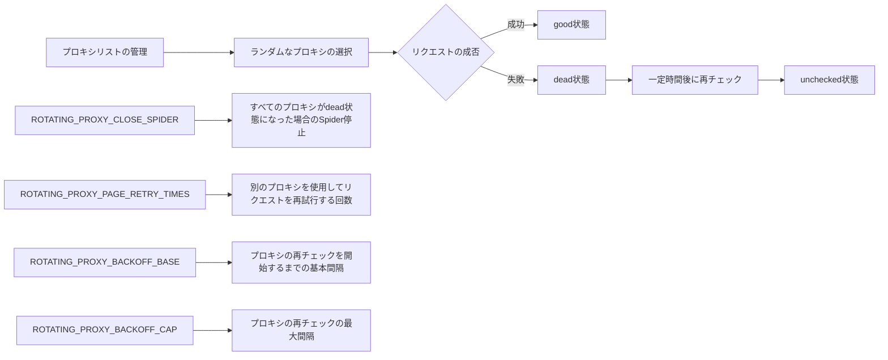
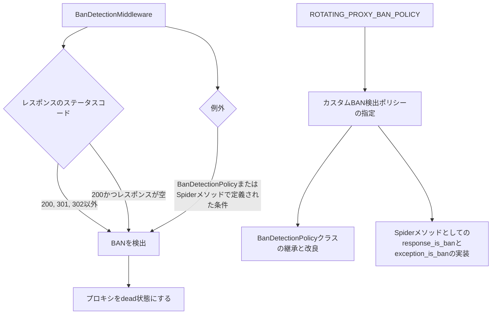
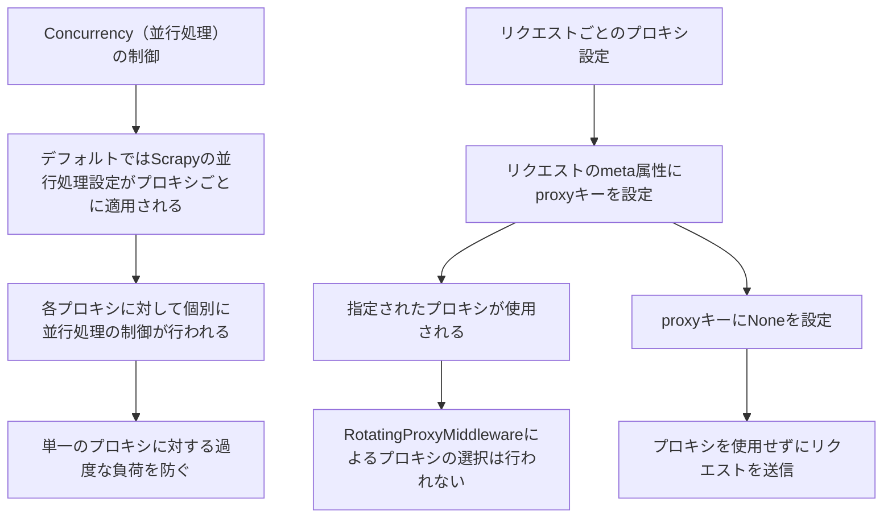
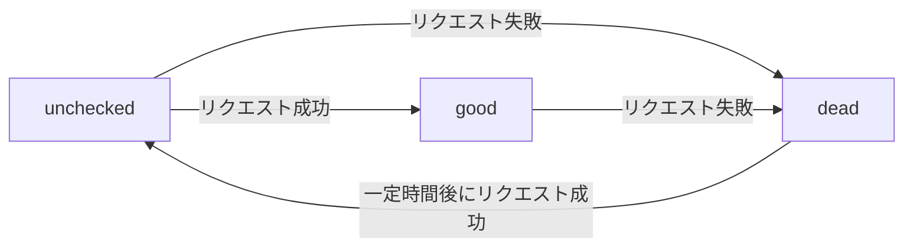
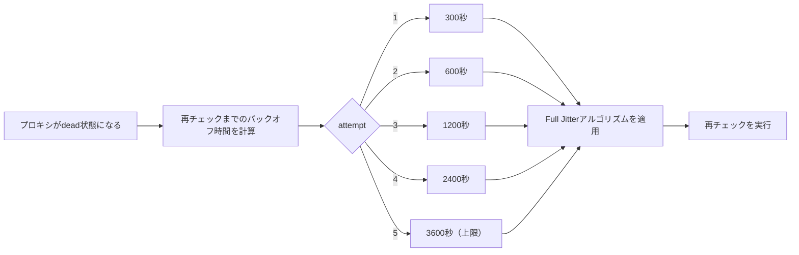
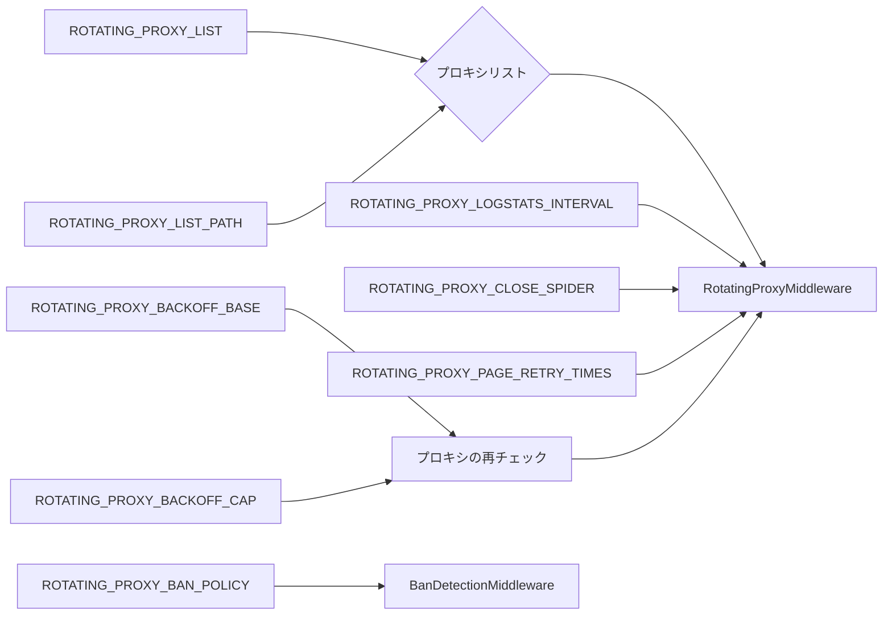

## 1. はじめに

Webスクレイピングを行う際、IPアドレスがブロックされたり、アクセス制限に引っかかったりすることがあります。これは、同じIPアドレスから大量のリクエストを送信することで、Webサーバーから異常なアクセスとみなされるためです。こうした問題を回避するために、プロキシサーバーを利用してIPアドレスを切り替えながらスクレイピングを行うことが効果的です。

[scrapy-rotating-proxies](https://github.com/TeamHG-Memex/scrapy-rotating-proxies) は、Scrapy Frameworkで使用できるミドルウェアで、プロキシサーバーのリストを管理し、リクエストごとにランダムにプロキシを選択することでIPアドレスをローテーションします。これにより、単一のIPアドレスからの大量のリクエストを防ぎ、Webサーバーからのアクセス制限を回避することができます。

プロキシローテーションは、以下のような理由で重要です。

1. IPアドレスのブロックを回避: 同じIPアドレスから大量のリクエストを送信し続けると、Webサーバーからブロックされる可能性があります。プロキシローテーションを使用することで、このようなブロックを回避できます。

2. アクセス制限の回避: 一部のWebサイトでは、同じIPアドレスからのアクセス頻度に制限を設けています。プロキシローテーションを使用することで、これらの制限を回避し、スクレイピングを円滑に進めることができます。

3. 地理的制限の回避: 一部のWebサイトでは、特定の国や地域からのアクセスを制限している場合があります。プロキシローテーションを使用して、異なる国や地域のIPアドレスからアクセスすることで、こうした地理的制限を回避できます。

4. スクレイピングの安定性向上: プロキシローテーションを使用することで、単一のIPアドレスに依存せずにスクレイピングを行うことができます。これにより、特定のIPアドレスがブロックされた場合でも、他のプロキシを使用してスクレイピングを継続できます。

scrapy-rotating-proxiesは、これらの課題を解決するために開発されたライブラリであり、Scrapyユーザーにとって非常に便利なツールです。このライブラリを使用することで、安定したWebスクレイピングが可能になり、より効率的にデータを収集することができます。

## 2. インストールと設定

scrapy-rotating-proxiesを使用するには、まずライブラリをインストールし、Scrapyの設定ファイルに必要な変更を加える必要があります。以下では、インストール方法と設定手順を詳しく説明します。

### インストール方法

scrapy-rotating-proxiesは、pip（Pythonパッケージマネージャー）を使用してインストールできます。以下のコマンドを実行してください。

```bash
pip install scrapy-rotating-proxies
```

### Scrapyの設定ファイルに必要な変更

scrapy-rotating-proxiesを使用するには、Scrapyの設定ファイル（通常は`settings.py`）に以下の変更を加える必要があります。

#### ROTATING_PROXY_LISTまたはROTATING_PROXY_LIST_PATHの設定

プロキシサーバーのリストを設定するには、`ROTATING_PROXY_LIST`または`ROTATING_PROXY_LIST_PATH`を使用します。

- `ROTATING_PROXY_LIST`: プロキシサーバーのリストを直接設定ファイルに記述する場合に使用します。

```python
ROTATING_PROXY_LIST = [
    'proxy1.example.com:8000',
    'proxy2.example.com:8031',
    # ...
]
```

- `ROTATING_PROXY_LIST_PATH`: プロキシサーバーのリストを別のファイルに記述する場合に使用します。

```python
ROTATING_PROXY_LIST_PATH = '/path/to/proxy_list.txt'
```

`ROTATING_PROXY_LIST_PATH`で指定するファイルには、1行に1つのプロキシサーバーを記述してください。

#### DOWNLOADERミドルウェアの設定

scrapy-rotating-proxiesを有効にするには、Scrapyの`DOWNLOADER_MIDDLEWARES`設定に以下のミドルウェアを追加します。

```python
DOWNLOADER_MIDDLEWARES = {
    # ...
    'rotating_proxies.middlewares.RotatingProxyMiddleware': 610,
    'rotating_proxies.middlewares.BanDetectionMiddleware': 620,
    # ...
}
```

これらのミドルウェアは、リクエストごとにプロキシを選択し、プロキシの状態を管理します。

これらの手順を完了すると、scrapy-rotating-proxiesが有効になり、プロキシローテーションを使用してWebスクレイピングを行うことができます。次のセクションでは、RotatingProxyMiddlewareとBanDetectionMiddlewareの機能と設定について詳しく説明します。

## 3. RotatingProxyMiddlewareの機能と設定

RotatingProxyMiddlewareは、scrapy-rotating-proxiesの中核をなすコンポーネントであり、プロキシリストの管理、プロキシの選択、プロキシの状態管理などの機能を提供します。以下では、RotatingProxyMiddlewareの主要な機能と設定オプションについて詳しく説明します。

### プロキシリストの管理

RotatingProxyMiddlewareは、`ROTATING_PROXY_LIST`または`ROTATING_PROXY_LIST_PATH`で指定されたプロキシリストを読み込み、管理します。プロキシリストが変更された場合、ミドルウェアは自動的に変更を検出し、新しいプロキシリストを使用します。

### ランダムなプロキシの選択

リクエストごとに、RotatingProxyMiddlewareはプロキシリストからランダムにプロキシを選択し、リクエストにそのプロキシを割り当てます。これにより、単一のIPアドレスからの大量のリクエストを防ぎ、Webサーバーからのアクセス制限を回避することができます。

### プロキシの状態管理（good, dead, unchecked）

RotatingProxyMiddlewareは、各プロキシの状態を以下の3つのカテゴリに分類して管理します。

- good: 正常に動作しているプロキシ
- dead: 応答が得られないなど、正常に動作していないプロキシ
- unchecked: まだチェックされていないプロキシ

ミドルウェアは、リクエストの成否に基づいてプロキシの状態を更新します。リクエストが成功した場合、プロキシは"good"状態になります。リクエストが失敗した場合、プロキシは"dead"状態になります。

### プロキシの再チェック（reanimated）

"dead"状態のプロキシは、一定時間後に再チェックされます。再チェックでプロキシが正常に動作することが確認された場合、プロキシは"unchecked"状態に移行します。この機能により、一時的に応答がない場合でもプロキシを再利用することができます。

### 主要な設定オプションの解説

RotatingProxyMiddlewareの動作は、以下の設定オプションで制御できます。

- `ROTATING_PROXY_CLOSE_SPIDER`: Trueに設定すると、すべてのプロキシが"dead"状態になった場合にSpiderを停止します。デフォルトはFalseです。
- `ROTATING_PROXY_PAGE_RETRY_TIMES`: プロキシが"dead"状態になった場合に、別のプロキシを使用してリクエストを再試行する回数を指定します。デフォルトは5回です。
- `ROTATING_PROXY_BACKOFF_BASE`: プロキシの再チェックを開始するまでの基本間隔を秒単位で指定します。デフォルトは300秒（5分）です。
- `ROTATING_PROXY_BACKOFF_CAP`: プロキシの再チェックの最大間隔を秒単位で指定します。デフォルトは3600秒（1時間）です。

以下は、RotatingProxyMiddlewareの主要な機能と設定オプションを図解したものです。



これらの機能と設定オプションを理解することで、RotatingProxyMiddlewareを効果的に活用し、安定したWebスクレイピングを実現することができます。

## 4. BanDetectionMiddlewareの機能と設定

BanDetectionMiddlewareは、Webサーバーからのアクセス制限（BAN）を検出するためのミドルウェアです。このミドルウェアは、レスポンスのステータスコードや内容に基づいてBANを検出し、BANが検出された場合はプロキシを"dead"状態にします。以下では、BanDetectionMiddlewareの機能と設定について詳しく説明します。

### BANの検出方法

デフォルトでは、BanDetectionMiddlewareは以下の条件でBANを検出します。

- レスポンスのステータスコードが200、301、302以外の場合
- レスポンスのステータスコードが200であっても、レスポンスの内容が空の場合

これらの条件は、一般的なBANの特徴に基づいています。ただし、Webサイトによってはデフォルトの検出条件では不十分な場合があります。そのような場合は、カスタムBAN検出ポリシーを作成する必要があります。

### カスタムBAN検出ポリシーの作成

カスタムBAN検出ポリシーを作成するには、以下の2つの方法があります。

#### BanDetectionPolicyクラスの継承と改良

`BanDetectionPolicy`クラスを継承し、`response_is_ban`メソッドと`exception_is_ban`メソッドをオーバーライドすることで、カスタムBAN検出ポリシーを作成できます。

```python
from rotating_proxies.policy import BanDetectionPolicy

class MyBanDetectionPolicy(BanDetectionPolicy):
    def response_is_ban(self, request, response):
        # レスポンスがBANであるかを判定するカスタムロジックを実装
        return super().response_is_ban(request, response) or b"captcha" in response.body

    def exception_is_ban(self, request, exception):
        # 例外がBANによるものであるかを判定するカスタムロジックを実装
        return None
```

#### Spiderメソッドとしてのresponse_is_banとexception_is_banの実装

Spiderクラスに`response_is_ban`メソッドと`exception_is_ban`メソッドを実装することで、カスタムBAN検出ポリシーを作成できます。

```python
class MySpider(scrapy.Spider):
    # ...

    def response_is_ban(self, request, response):
        return b"banned" in response.body

    def exception_is_ban(self, request, exception):
        return None
```

### ROTATING_PROXY_BAN_POLICY設定の説明

カスタムBAN検出ポリシーを使用するには、`ROTATING_PROXY_BAN_POLICY`設定にポリシークラスまたはSpiderメソッドへのパスを指定します。

```python
ROTATING_PROXY_BAN_POLICY = "myproject.policy.MyBanDetectionPolicy"
```

以下は、BanDetectionMiddlewareの機能と設定を図解したものです。



BanDetectionMiddlewareとカスタムBAN検出ポリシーを適切に設定することで、Webサイト固有のアクセス制限に対応し、より効果的にBANを回避することができます。

## 5. 追加の機能

scrapy-rotating-proxiesには、プロキシローテーションに関連するいくつかの追加機能があります。ここでは、Concurrency（並行処理）の制御とリクエストごとのプロキシ設定について説明します。

### Concurrency（並行処理）の制御

scrapy-rotating-proxiesを使用すると、デフォルトではScrapyのすべての並行処理設定（`DOWNLOAD_DELAY`、`AUTOTHROTTLE_ENABLED`、`CONCURRENT_REQUESTS_PER_DOMAIN`など）がプロキシごとに適用されます。つまり、各プロキシに対して個別に並行処理の制御が行われます。

例えば、`CONCURRENT_REQUESTS_PER_DOMAIN`を2に設定した場合、各プロキシに対して同時に最大2つの接続が許可されます。これにより、単一のプロキシに対する過度な負荷を防ぐことができます。

### リクエストごとのプロキシ設定（meta['proxy']の利用）

特定のリクエストに対してプロキシを指定したい場合は、リクエストの`meta`属性に`proxy`キーを設定します。

```python
yield Request(url, meta={'proxy': 'http://proxy.example.com:8000'})
```

この場合、指定されたプロキシが使用され、RotatingProxyMiddlewareによるプロキシの選択は行われません。

プロキシを使用せずにリクエストを送信したい場合は、`None`を設定します。

```python
yield Request(url, meta={'proxy': None})
```

以下は、追加の機能を図解したものです。



これらの追加機能を活用することで、プロキシローテーションをより柔軟に制御し、特定のリクエストに対して個別のプロキシ設定を行うことができます。

## 6. プロキシの有効期限管理（expire.py）

scrapy-rotating-proxiesは、プロキシの有効期限を管理するために`expire.py`モジュールを使用しています。このモジュールは、プロキシの状態遷移とバックオフ時間の計算を担当します。

### プロキシの状態遷移

プロキシは以下の3つの状態を持ちます。

- good: 正常に動作しているプロキシ
- dead: 応答が得られないなど、正常に動作していないプロキシ
- unchecked: まだチェックされていないプロキシ

プロキシの状態は、リクエストの成否に基づいて遷移します。以下は、プロキシの状態遷移を図解したものです。



### バックオフ時間の計算

プロキシが"dead"状態になった場合、一定時間後に再チェックが行われます。この再チェックまでの時間（バックオフ時間）は、指数関数的に増加します。バックオフ時間の計算には、以下の式が使用されます。

```python
def exp_backoff(attempt, cap=3600, base=300):
    return min(cap, base * 2 ** attempt)
```

ここで、`attempt`は再チェックの試行回数、`cap`はバックオフ時間の上限、`base`はバックオフ時間の基本値です。デフォルトでは、`cap`は3600秒（1時間）、`base`は300秒（5分）に設定されています。

バックオフ時間の計算では、Full Jitterアルゴリズムが使用されます。これにより、複数のプロキシが同時に再チェックされることを防ぎ、ネットワークの負荷を分散することができます。

以下は、バックオフ時間の計算を図解したものです。



`expire.py`モジュールは、これらのプロキシの状態遷移とバックオフ時間の計算を管理することで、プロキシの効率的な運用を実現しています。

## 7. 環境変数と設定の変数一覧

scrapy-rotating-proxiesでは、以下の環境変数と設定変数を使用してプロキシローテーションの動作を制御します。

### ROTATING_PROXY_LIST

- 説明: プロキシのリストを直接指定する場合に使用します。
- タイプ: リスト
- 例:
  ```python
  ROTATING_PROXY_LIST = [
      'http://proxy1.example.com:8000',
      'http://proxy2.example.com:8001',
      'http://proxy3.example.com:8002',
  ]
  ```

### ROTATING_PROXY_LIST_PATH

- 説明: プロキシのリストを含むファイルのパスを指定する場合に使用します。ファイルには、1行に1つのプロキシを記述します。
- タイプ: 文字列
- 例:
  ```python
  ROTATING_PROXY_LIST_PATH = '/path/to/proxy_list.txt'
  ```

### ROTATING_PROXY_LOGSTATS_INTERVAL

- 説明: プロキシの統計情報をログに記録する間隔を秒単位で指定します。
- タイプ: 整数
- デフォルト値: 30

### ROTATING_PROXY_CLOSE_SPIDER

- 説明: 利用可能なプロキシがない場合にSpiderを停止するかどうかを指定します。Trueに設定すると、利用可能なプロキシがない場合にSpiderが停止します。Falseに設定すると、プロキシがない場合に全てのデッドプロキシを再チェックします。
- タイプ: ブール値
- デフォルト値: False

### ROTATING_PROXY_PAGE_RETRY_TIMES

- 説明: プロキシが応答しない場合に、別のプロキシを使用してリクエストを再試行する回数を指定します。この回数を超えると、リクエストは失敗としてマークされます。
- タイプ: 整数
- デフォルト値: 5

### ROTATING_PROXY_BACKOFF_BASE

- 説明: プロキシの再チェックを開始するまでの基本間隔を秒単位で指定します。
- タイプ: 整数
- デフォルト値: 300（5分）

### ROTATING_PROXY_BACKOFF_CAP

- 説明: プロキシの再チェックの最大間隔を秒単位で指定します。
- タイプ: 整数
- デフォルト値: 3600（1時間）

### ROTATING_PROXY_BAN_POLICY

- 説明: カスタムBAN検出ポリシーを指定します。ポリシークラスまたはSpiderメソッドへのパスを指定します。
- タイプ: 文字列
- デフォルト値: 'rotating_proxies.policy.BanDetectionPolicy'

以下は、これらの環境変数と設定変数の関係を図解したものです。



これらの環境変数と設定変数を適切に設定することで、scrapy-rotating-proxiesの動作を制御し、プロジェクトの要件に合わせたプロキシローテーションを実現することができます。

## 8. 使用例

ここでは、scrapy-rotating-proxiesを使用してSpiderを作成し、ログとステータスを確認する方法を説明します。

### scrapy-rotating-proxiesを使ったSpiderの作成

以下は、scrapy-rotating-proxiesを使用したSpiderの例です。

```python
import scrapy
from scrapy.crawler import CrawlerProcess
from scrapy.utils.project import get_project_settings

class MySpider(scrapy.Spider):
    name = 'myspider'
    start_urls = ['http://example.com']

    def parse(self, response):
        # ページの解析処理を実装
        yield {'url': response.url, 'title': response.css('title::text').get()}

if __name__ == '__main__':
    settings = get_project_settings()
    settings['ROTATING_PROXY_LIST'] = [
        'http://proxy1.example.com:8000',
        'http://proxy2.example.com:8001',
        'http://proxy3.example.com:8002',
    ]
    process = CrawlerProcess(settings)
    process.crawl(MySpider)
    process.start()
```

この例では、`ROTATING_PROXY_LIST`設定を使用してプロキシのリストを指定しています。`MySpider`は、`start_urls`で指定されたURLから始まり、`parse`メソッドでページの解析処理を行います。

### ログとステータスの確認

scrapy-rotating-proxiesは、プロキシの統計情報をログに記録します。ログレベルを`INFO`以上に設定することで、これらの情報を確認することができます。

以下は、ログの例です。

```
2023-04-01 12:00:00 [rotating_proxies.middlewares] INFO: Proxies(good: 2, dead: 1, unchecked: 0, reanimated: 0, mean backoff time: 0s)
```

このログは、現在のプロキシの状態を示しています。また、Scrapyのステータス画面でも、プロキシに関する統計情報を確認することができます。

## 9. まとめ

scrapy-rotating-proxiesは、Scrapyプロジェクトでプロキシローテーションを簡単に実装するためのパワフルなツールです。以下は、scrapy-rotating-proxiesの主な利点です。

- プロキシの状態管理: プロキシの状態（good、dead、unchecked）を自動的に管理し、デッドプロキシを再チェックします。
- カスタマイズ可能なBAN検出: カスタムBAN検出ポリシーを作成することで、プロジェクト固有の要件に対応できます。
- 並行処理の制御: デフォルトでは、Scrapyの並行処理設定がプロキシごとに適用されます。
- 柔軟なプロキシ設定: リクエストごとにプロキシを指定することができます。

ただし、以下の点に注意が必要です。

- プロキシの品質: 信頼できるプロキシのリストを使用することが重要です。品質の低いプロキシを使用すると、パフォーマンスが低下する可能性があります。
- BAN検出ルールの維持管理: Webサイトの変更に合わせてBAN検出ルールを定期的に見直し、更新する必要があります。

## 10. 参考

- [scrapy-rotating-proxies](https://github.com/TeamHG-Memex/scrapy-rotating-proxies)
- [docs.scrapy.org](https://docs.scrapy.org/en/latest/)
- [Scrapyチュートリアル](https://doc-ja-scrapy.readthedocs.io/ja/latest/intro/tutorial.html)
