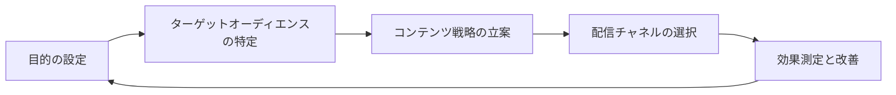
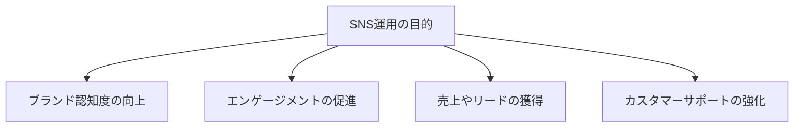
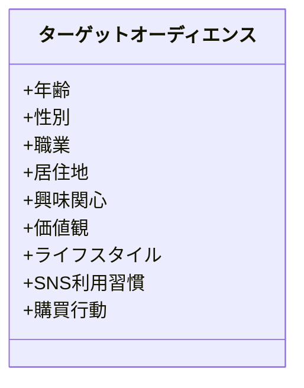
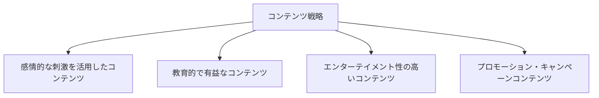
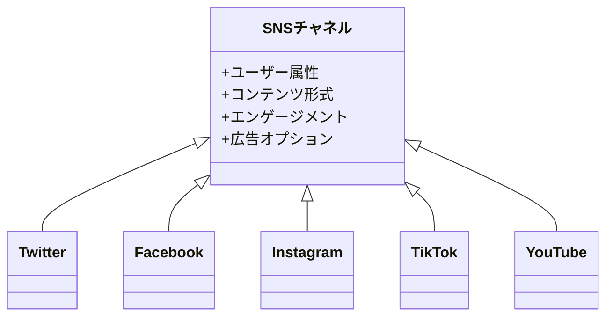
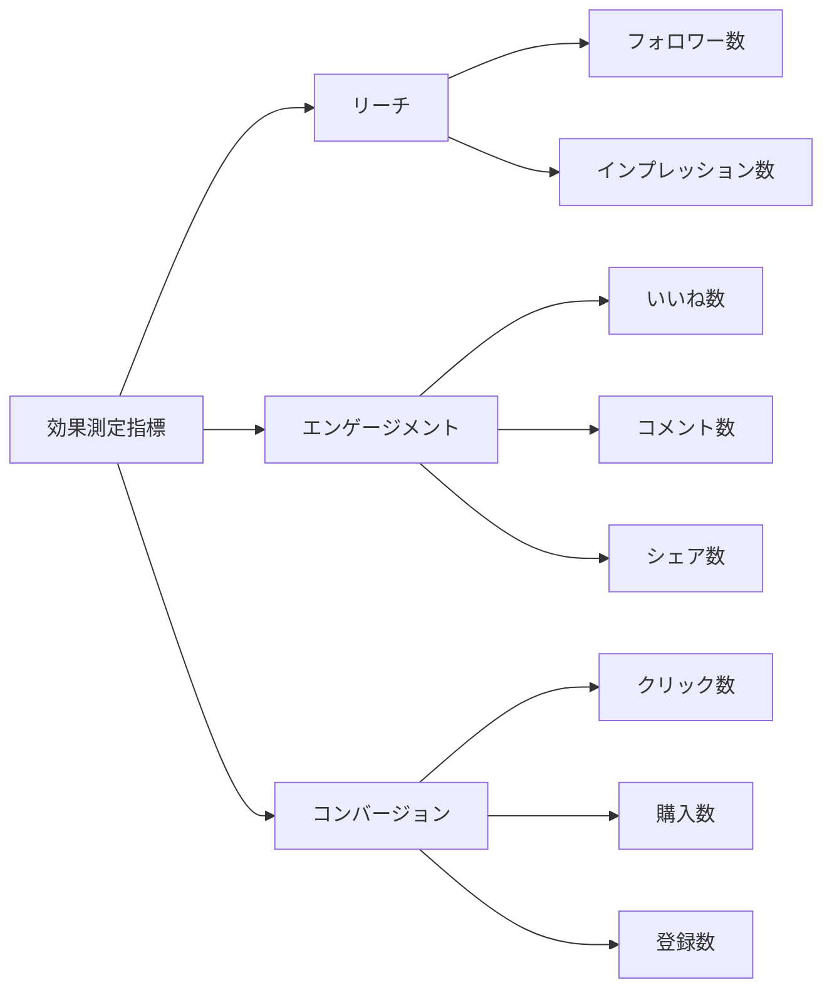
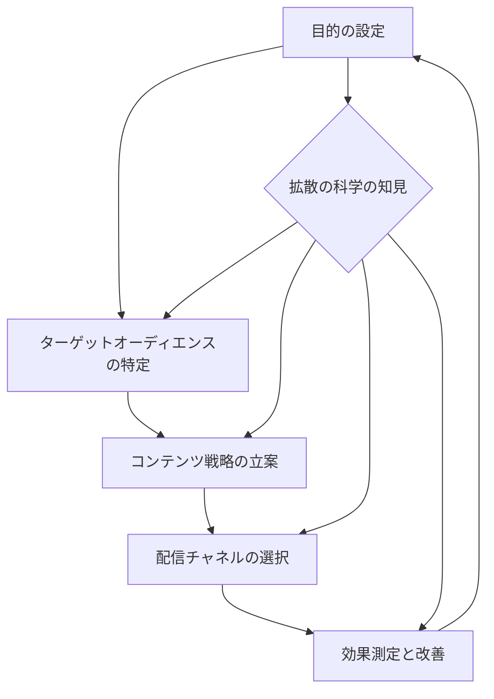

## 1. はじめに

SNSの登場とその普及により、情報の拡散方法は大きく変化しました。個人や企業は、SNSを通じて広範囲にメッセージを発信できるようになり、情報拡散のスピードも格段に速くなりました。しかし、その一方で、SNS上での情報の拡散メカニズムを十分に理解し、戦略的に活用している個人や企業は多くありません。

そこで、本記事では、Twitter社が2023年5月に公開した「[#拡散の科学](https://marketing.twitter.com/content/dam/marketing-twitter/apac/ja/insights/kakusan/kakusan.pdf)（The Science of Spread）」の資料を基に、SNSにおける情報拡散のメカニズムを解説し、それを踏まえた効果的なSNS運用戦略について説明します。

「拡散の科学」資料では、以下のような情報拡散に関する重要な知見が示されています。

1. **感情的に刺激的なコンテンツほど拡散されやすい。**
2. **偽情報やミスリーディングな情報も、真実の情報と同様に拡散されやすい。**
3. **著名人や影響力のあるアカウントからの発信は、一般ユーザーよりも広く拡散される。**
4. **ハッシュタグやメンションを使用することで、情報の到達範囲が広がる。**
5. **ニュースイベントに関連したコンテンツは、通常よりも速いスピードで拡散する。**

これらの知見は、SNS運用戦略を立案する上で非常に重要な示唆を与えてくれます。本記事では、これらの知見を活用し、目的の設定、ターゲットオーディエンスの特定、コンテンツ戦略の立案、配信チャネルの選択、効果測定と改善という一連のプロセスを通じて、効果的なSNS運用戦略を構築する方法について解説します。

## 2. SNS運用戦略の全体像

効果的なSNS運用戦略を立案するには、まず全体像を把握することが重要です。ここでは、SNS運用戦略の全体像を説明します。

このフローチャートが示すように、SNS運用戦略は以下の5つのステップで構成されます。

1. **目的の設定**

- SNS運用の目的を明確に定義する。
- 例: ブランド認知度の向上、エンゲージメントの促進、売上やリードの獲得など。

2. **ターゲットオーディエンスの特定**

- 目的に合わせて、ターゲットとなるオーディエンスを特定する。
- 年齢、性別、職業、興味関心などの属性を考慮する。

3. **コンテンツ戦略の立案**

- ターゲットオーディエンスに合わせて、発信するコンテンツの内容や形式を決める。
- 「拡散の科学」の知見を活用し、拡散されやすいコンテンツを企画する。

4. **配信チャネルの選択**

- コンテンツの内容やターゲットオーディエンスに適したSNSチャネルを選択する。
- 各チャネルの特性を理解し、効果的に活用する。

5. **効果測定と改善**

- SNS運用の効果を定期的に測定し、改善点を見つける。
- A/Bテストなどを行い、より効果的な運用方法を探る。

これらのステップは、一直線に進むのではなく、循環的に行われます。効果測定の結果を踏まえて、目的の再設定やコンテンツ戦略の見直しを行い、継続的に運用を改善していくことが重要です。

## 3. 目的の設定

SNS運用戦略を立案する上で、まず明確にすべきなのが目的です。目的を明確に定義することで、ターゲットオーディエンスの特定やコンテンツ戦略の立案がスムーズに進みます。ここでは、SNS運用の主な目的について説明します。

この目的別分類図が示すように、SNS運用の主な目的は以下の4つに分類できます。

1. ブランド認知度の向上

- 企業やブランドの存在を広く知ってもらうことを目的とする。
- ブランドメッセージの発信や、ブランドストーリーの共有などが含まれる。

2. エンゲージメントの促進

- ユーザーとのインタラクションを通じて、ブランドとの絆を深めることを目的とする。
- ユーザー同士のコミュニケーションを促進することも含まれる。

3. 売上やリードの獲得

- SNSを通じて、製品やサービスの販売促進を図ることを目的とする。
- リードジェネレーションや、Eコマースとの連携などが含まれる。

4. カスタマーサポートの強化

- SNSを通じて、顧客からの問い合わせや要望に迅速に対応することを目的とする。
- 顧客満足度の向上や、ブランドロイヤリティの強化につながる。

これらの目的は、互いに排他的ではなく、複数の目的を同時に設定することも可能です。ただし、目的が多岐にわたりすぎると、戦略の焦点がぼやけてしまう恐れがあるので、優先順位を明確にしておくことが重要です。

目的を設定する際は、自社のビジネス戦略や、競合他社のSNS活用状況なども考慮に入れると良いでしょう。また、目的は定期的に見直し、必要に応じて修正を加えていくことが大切です。

## 4. ターゲットオーディエンスの特定

SNS運用戦略を立案する上で、目的を明確にした後に重要なのが、ターゲットオーディエンスの特定です。ターゲットオーディエンスを明確にすることで、コンテンツ戦略の立案や配信チャネルの選択がスムーズに進みます。ここでは、ターゲットオーディエンスの特定方法について説明します。

このペルソナ図が示すように、ターゲットオーディエンスを特定する際には、以下の3つの観点から属性を整理することが有効です。

1. demografic（デモグラフィック）

- 年齢、性別、職業、居住地などの基本的な属性。
- これらの属性は、オーディエンスの大まかな輪郭を捉えるのに役立つ。

2. psychografic（サイコグラフィック）

- 興味関心、価値観、ライフスタイルなどの心理的な属性。
- これらの属性は、オーディエンスの嗜好やニーズを理解するのに役立つ。

3. behavioral（ビヘイビオラル）

- SNS利用習慣、購買行動などの行動的な属性。
- これらの属性は、オーディエンスの実際の行動パターンを理解するのに役立つ。

これらの属性を組み合わせることで、ターゲットオーディエンスのペルソナ（人物像）を具体的にイメージすることができます。例えば、「20代前半の女性、東京在住、ファッションや美容に興味がある、インスタグラムを毎日チェックする、オンラインショッピングをよく利用する」というようなペルソナを設定することで、そのペルソナに合ったコンテンツ戦略を立案しやすくなります。

ターゲットオーディエンスの特定には、自社の顧客データや、SNSの分析ツールなどを活用すると良いでしょう。また、ペルソナは複数設定することも可能です。その場合は、ペルソナごとにコンテンツ戦略を立案するなど、きめ細やかな対応が求められます。

## 5. コンテンツ戦略の立案

ターゲットオーディエンスを特定したら、次はそのオーディエンスに合ったコンテンツ戦略を立案します。「拡散の科学」の知見を活用しつつ、オーディエンスの興味関心や行動パターンに合ったコンテンツを企画することが重要です。ここでは、コンテンツ戦略の立案方法について説明します。

このコンテンツマトリクスが示すように、SNS運用で発信するコンテンツは、以下の4つに分類することができます。

1. 感情的な刺激を活用したコンテンツ

- 「拡散の科学」の知見を活用し、感情的な反応を引き出すコンテンツを企画する。
- 例えば、感動的なストーリーや、驚きのある事実など。

2. 教育的で有益なコンテンツ

- ターゲットオーディエンスの問題解決や、知識向上に役立つコンテンツを提供する。
- 例えば、ハウツー記事や、業界の最新トレンド情報など。

3. エンターテイメント性の高いコンテンツ

- オーディエンスを楽しませ、エンゲージメントを促進するコンテンツを企画する。
- 例えば、ユーモラスな動画や、インタラクティブなクイズなど。

4. プロモーション・キャンペーンコンテンツ

- 自社の製品やサービスの販売促進を目的としたコンテンツを発信する。
- 例えば、新製品の告知や、期間限定のキャンペーン情報など。

これらのコンテンツタイプを組み合わせ、ターゲットオーディエンスの嗜好に合ったコンテンツ戦略を立案します。その際、「拡散の科学」の知見を活用し、拡散されやすいコンテンツを意識的に企画することが重要です。例えば、感情的な刺激を活用したコンテンツと、教育的で有益なコンテンツを組み合わせるなど、戦略的な組み合わせを考えましょう。

また、コンテンツの形式（テキスト、画像、動画など）や、投稿の頻度・タイミングについても、ターゲットオーディエンスの行動パターンを考慮しながら決定します。

## 6. 配信チャネルの選択

コンテンツ戦略を立案したら、次はそのコンテンツを発信する配信チャネルを選択します。SNSには様々なチャネルがあり、それぞれ特性が異なるため、コンテンツの内容やターゲットオーディエンスに合ったチャネルを選ぶことが重要です。ここでは、主要なSNSチャネルの特性について説明します。

このチャネル比較表が示すように、主要なSNSチャネルは以下のような特性を持っています。

1. Twitter

- ユーザー属性：幅広い年齢層、リアルタイム性重視
- コンテンツ形式：テキスト（280字制限）、画像、動画
- エンゲージメント：リツイート、いいね、リプライ
- 広告オプション：プロモーツイート、フォロワー広告など

2. Facebook

- ユーザー属性：幅広い年齢層、つながりを重視
- コンテンツ形式：テキスト、画像、動画、ライブ配信
- エンゲージメント：いいね、コメント、シェア
- 広告オプション：ページ広告、ブースト投稿など

3. Instagram

- ユーザー属性：比較的若年層、ビジュアル重視
- コンテンツ形式：画像、動画（リール）、ストーリーズ
- エンゲージメント：いいね、コメント、保存
- 広告オプション：フィード広告、ストーリーズ広告など

4. TikTok

- ユーザー属性：主にZ世代、エンターテイメント重視
- コンテンツ形式：短尺動画（15秒～3分）
- エンゲージメント：いいね、コメント、シェア、デュエット
- 広告オプション：インフィード広告、ハッシュタグチャレンジなど

5. YouTube

- ユーザー属性：幅広い年齢層、情報探索や学習目的
- コンテンツ形式：長尺動画（数分～数時間）
- エンゲージメント：高評価、コメント、チャンネル登録
- 広告オプション：インストリーム広告、バンパー広告など

これらのチャネルの特性を理解した上で、コンテンツの内容やターゲットオーディエンスとの適合性を考慮してチャネルを選択します。例えば、若年層向けのエンターテイメントコンテンツであればTikTokが適しているでしょうし、専門的な情報を発信するのであればYouTubeが効果的です。

また、複数のチャネルを組み合わせて活用することも重要です。各チャネルの特性を活かしつつ、相互に連携させることで、より大きな効果を生み出すことができます。

## 7. 効果測定と改善

SNS運用戦略を実行に移したら、その効果を定期的に測定し、改善につなげていくことが重要です。効果測定には様々な指標がありますが、ここでは主要な指標について説明します。

この指標ダッシュボードが示すように、SNS運用の効果測定には以下の3つの主要な指標があります。

1. リーチ

- フォロワー数：SNSアカウントのフォロワー総数。
- インプレッション数：投稿が表示された総回数。

2. エンゲージメント

- いいね数：投稿に対するいいねの総数。
- コメント数：投稿に対するコメントの総数。
- シェア数：投稿が共有された総数。

3. コンバージョン

- クリック数：投稿に含まれるリンクがクリックされた総数。
- 購入数：投稿からの購入につながった総数。
- 登録数：投稿からの会員登録などにつながった総数。

これらの指標を定期的に計測し、時系列での変化を追跡します。また、各指標の関連性についても分析し、改善のためのインサイトを得ることが重要です。例えば、リーチは高いがエンゲージメントが低い場合、コンテンツの内容や形式を見直す必要があるかもしれません。

効果測定の結果を踏まえ、以下のようなアクションにつなげていきます。

1. A/Bテストによる最適化

- 投稿の文言やビジュアルなどを変えてテストし、より高いパフォーマンスにつながる要素を特定する。

2. 定期的な見直しと改善サイクルの確立

- 月次や四半期ごとに、運用の総括を行い、改善点を洗い出す。
- PDCAサイクルを回し、継続的な改善を図る。

SNS運用の効果測定と改善は、一時的なものではなく、継続的に取り組むべき活動です。定期的なモニタリングと、仮説検証を繰り返しながら、運用の最適化を図っていくことが重要です。

## 8. まとめ

本記事では、Twitter社の「拡散の科学」の知見を活用したSNS運用戦略について、一連のステップに沿って解説してきました。ここでは、これまでの内容を総括し、SNS運用戦略の全体像について説明します。

この戦略フレームワークが示すように、SNS運用戦略は、目的の設定、ターゲットオーディエンスの特定、コンテンツ戦略の立案、配信チャネルの選択、効果測定と改善という一連のステップで構成されます。そして、それぞれのステップにおいて、「拡散の科学」の知見が活用されることで、より効果的な運用が可能になります。

具体的には、以下のような知見の活用が考えられます。

1. 感情的な刺激を活用したコンテンツの企画（コンテンツ戦略）
2. 影響力のあるアカウントとのコラボレーション（配信チャネル）
3. ハッシュタグやメンションの戦略的な使用（コンテンツ戦略、配信チャネル）
4. ニュースイベントに合わせたリアルタイムな情報発信（コンテンツ戦略、配信チャネル）

これらの知見を、SNS運用戦略の各ステップに組み込むことで、情報の拡散力を高め、運用の効果を最大化することができるでしょう。

ただし、SNS運用戦略は、一度確立すれば終わりというものではありません。社会の変化やプラットフォームの進化に合わせて、常に学習と改善を続けていく必要があります。「拡散の科学」の知見も、今後さらに深化していくことが予想されます。そうした新たな知見を積極的に取り入れながら、SNS運用戦略をアップデートしていくことが重要です。

本記事が、読者の皆様のSNS運用戦略の確立と、継続的な改善の一助となれば幸いです。SNSの戦略的な活用を通じて、ビジネスの成功や、社会との対話の促進につながることを願っています。

## 9. 参考資料

- [#拡散の科学](https://marketing.twitter.com/content/dam/marketing-twitter/apac/ja/insights/kakusan/kakusan.pdf)
