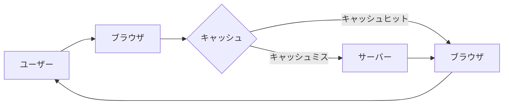

## 1. はじめに

ブラウザのキャッシュは、Webページの読み込み速度を向上させるために重要な役割を果たします。キャッシュ機能により、一度読み込んだリソース（HTML、CSS、JavaScript、画像など）をブラウザに保存し、次回以降の読み込み時に再利用することができます。これにより、サーバーへのリクエスト数が減少し、ネットワーク帯域幅の消費が抑えられ、ユーザーエクスペリエンスが向上します。

キャッシュの利点を簡単に図解すると以下のようになります。



上記の図では、ユーザーがブラウザでWebページにアクセスすると、ブラウザはまずキャッシュを確認します。リクエストされたリソースがキャッシュ内に存在する場合（キャッシュヒット）、ブラウザはサーバーにリクエストを送信せずにキャッシュからリソースを直接読み込みます。一方、リクエストされたリソースがキャッシュ内に存在しない場合（キャッシュミス）、ブラウザはサーバーにリクエストを送信し、リソースを取得します。

本記事では、ブラウザのキャッシュの仕組みや利用方法、最適化手法などについて詳しく解説します。適切なキャッシュ設定を行うことで、Webパフォーマンスを大幅に改善できるでしょう。

## 2. ブラウザのキャッシュの仕組み

ブラウザのキャッシュには、主に2種類のキャッシュがあります。

1. メモリキャッシュ
2. ディスクキャッシュ

メモリキャッシュは、コンピュータのRAMに保存されるキャッシュで、高速にアクセスできます。一方、ディスクキャッシュは、ハードディスクやSSDに保存されるキャッシュで、メモリキャッシュよりもアクセス速度は遅いですが、大容量のデータを保存できます。

ブラウザは、キャッシュを管理するために以下のような仕組みを使用しています。

1. キャッシュの保存場所と管理方法

- ブラウザごとにキャッシュの保存場所が異なります
- キャッシュは、URLをキーとして保存されます
- キャッシュの有効期限や更新方法は、HTTPヘッダーによって制御されます

2. キャッシュの有効期限と更新方法

- キャッシュの有効期限は、`Cache-Control`や`Expires`ヘッダーによって指定されます
- 有効期限が切れたキャッシュは、サーバーに再検証リクエストを送信して更新の必要性を確認します
- `ETag`や`Last-Modified`ヘッダーを使用して、リソースの変更有無を効率的に確認できます

以下は、キャッシュの有効期限と更新方法を示すサンプルのHTTPレスポンスヘッダーです。

```http
HTTP/1.1 200 OK
Cache-Control: max-age=3600
Expires: Tue, 19 Mar 2024 12:00:00 GMT
ETag: "1a2b3c4d5e6f7g8h9i"
Last-Modified: Tue, 12 Mar 2024 12:00:00 GMT
```

上記のレスポンスヘッダーでは、`Cache-Control`の`max-age`ディレクティブで3600秒（1時間）のキャッシュ有効期限が指定されています。また、`Expires`ヘッダーでも有効期限が明示的に設定されています。`ETag`と`Last-Modified`ヘッダーは、リソースの変更有無を確認するために使用されます。

次の章では、キャッシュの利用方法について詳しく説明します。

承知しました。第三章を書き出します。

## 3. キャッシュの利用方法

ブラウザのキャッシュを効果的に利用するために、適切なキャッシュ設定を行う必要があります。ここでは、静的コンテンツと動的コンテンツのキャッシング方法、およびキャッシュコントロールヘッダーの設定について説明します。

### 3.1 静的コンテンツのキャッシング

静的コンテンツ（CSS、JavaScript、画像など）は、変更頻度が低いため、長期間のキャッシュが可能です。以下は、Apache Web Serverで静的コンテンツにキャッシュヘッダーを設定する例です。

```apache
<FilesMatch "\.(css|js|jpg|jpeg|png|gif|ico)$">
  Header set Cache-Control "max-age=31536000, public"
</FilesMatch>
```

上記の設定では、指定した拡張子のファイルに対して、`Cache-Control`ヘッダーを設定しています。`max-age`ディレクティブで1年間（31536000秒）のキャッシュ有効期限を指定し、`public`ディレクティブでパブリックキャッシュ（CDNやプロキシサーバー）での利用を許可しています。

### 3.2 動的コンテンツのキャッシング

動的コンテンツ（HTMLページなど）は、静的コンテンツと比べて変更頻度が高いため、短期間のキャッシュが適しています。以下は、PHPで動的コンテンツにキャッシュヘッダーを設定する例です。

```php
<?php
header("Cache-Control: max-age=3600, private");
?>
```

上記のコードでは、`Cache-Control`ヘッダーを設定し、`max-age`ディレクティブで1時間（3600秒）のキャッシュ有効期限を指定しています。また、`private`ディレクティブでプライベートキャッシュ（ユーザーのブラウザ）のみでの利用を指定しています。

### 3.3 キャッシュコントロールヘッダーの設定

キャッシュコントロールヘッダーを適切に設定することで、キャッシュの動作を制御できます。主なキャッシュコントロールヘッダーは以下の通りです。

- `Cache-Control`: キャッシュの有効期限や公開範囲を指定します
- `Expires`: キャッシュの有効期限を絶対時間で指定します
- `ETag`: リソースの一意な識別子を指定します
- `Last-Modified`: リソースの最終更新日時を指定します

以下は、これらのヘッダーを組み合わせた例です。

```http
HTTP/1.1 200 OK
Cache-Control: max-age=3600, public
Expires: Tue, 19 Mar 2024 14:00:00 GMT
ETag: "1a2b3c4d5e6f7g8h9i"
Last-Modified: Tue, 19 Mar 2024 13:00:00 GMT
```

上記のレスポンスヘッダーでは、`Cache-Control`と`Expires`ヘッダーでキャッシュの有効期限を指定し、`ETag`と`Last-Modified`ヘッダーでリソースの変更有無を確認するための情報を提供しています。

次の章では、キャッシュの最適化手法について説明します。

かしこまりました。第四章を書き出します。

## 4. キャッシュの最適化

キャッシュを最適化することで、Webパフォーマンスをさらに向上させることができます。ここでは、キャッシュ可能なリソースの選択、キャッシュ期間の設定、適切なキャッシュキーの選択、条件付きリクエストの活用について説明します。

### 4.1 キャッシュ可能なリソースの選択

すべてのリソースをキャッシュする必要はありません。以下のようなリソースは、キャッシュに適しています。

- 静的コンテンツ（CSS、JavaScript、画像など）
- 変更頻度の低いコンテンツ
- 複数のページで共通して使用されるコンテンツ

一方、以下のようなリソースは、キャッシュに適していません。

- 頻繁に更新されるコンテンツ
- ユーザー固有のデータを含むコンテンツ
- セキュリティ上の理由からキャッシュできないコンテンツ

### 4.2 キャッシュ期間の設定

キャッシュ期間は、リソースの種類や更新頻度に応じて適切に設定する必要があります。以下は、リソースの種類ごとのキャッシュ期間の目安です。

- 静的コンテンツ: 1年以上
- 変更頻度の低いコンテンツ: 1日〜1ヶ月
- 変更頻度の高いコンテンツ: 1時間以内

ただし、これらは目安であり、実際のキャッシュ期間は、サイトの特性やニーズに応じて調整してください。

### 4.3 適切なキャッシュキーの選択

キャッシュキーは、リソースを一意に識別するために使用されます。適切なキャッシュキーを選択することで、キャッシュの効率を高めることができます。以下は、キャッシュキーの選択方法の例です。

- URLをキャッシュキーとして使用する
- クエリ文字列を含めたURLをキャッシュキーとして使用する
- リソースのバージョン情報をURLに含める

以下は、リソースのバージョン情報をURLに含める例です。

```html
<link rel="stylesheet" href="/css/style.css?v=1.0" />
<script src="/js/main.js?v=1.1"></script>
```

上記の例では、CSSとJavaScriptのURLにバージョン情報（`v=1.0`、`v=1.1`）を含めています。リソースが更新された場合、バージョン情報を変更することで、キャッシュを無効化できます。

### 4.4 条件付きリクエストの活用

条件付きリクエストを活用することで、サーバーとの通信を最適化できます。以下は、条件付きリクエストのヘッダーの例です。

- `If-Modified-Since`: 指定した日時以降にリソースが変更された場合のみ、リソースを取得します
- `If-None-Match`: 指定したETagと一致しない場合のみ、リソースを取得します

以下は、条件付きリクエストを使用した例です。

```http
GET /image.jpg HTTP/1.1
If-Modified-Since: Tue, 19 Mar 2024 12:00:00 GMT
If-None-Match: "1a2b3c4d5e6f7g8h9i"
```

上記のリクエストでは、`If-Modified-Since`ヘッダーで指定した日時以降にリソースが変更された場合、または`If-None-Match`ヘッダーで指定したETagと一致しない場合にのみ、サーバーがリソースを返します。条件が満たされない場合、サーバーは`304 Not Modified`レスポンスを返し、ブラウザはキャッシュからリソースを読み込みます。

条件付きリクエストを活用することで、不必要なデータ転送を減らし、ネットワーク帯域幅を節約できます。

次の章では、キャッシュに関する問題点と対策について説明します。

## 5. キャッシュに関する問題点と対策

キャッシュは、Webパフォーマンスを向上させる一方で、いくつかの問題点があります。ここでは、キャッシュの不整合、セキュリティリスク、キャッシュのクリアと無効化について説明し、それぞれの問題に対する対策を提示します。

### 5.1 キャッシュの不整合と解消方法

キャッシュの不整合は、サーバー上のリソースが更新されたにもかかわらず、ブラウザがキャッシュから古いリソースを読み込んでしまう問題です。この問題を解消するには、以下の方法があります。

1. キャッシュキーにバージョン情報を含める
2. キャッシュ期間を適切に設定する
3. サーバー側でキャッシュ無効化の仕組みを導入する

キャッシュキーにバージョン情報を含める方法は、4.3節で説明した通りです。キャッシュ期間を適切に設定することで、リソースの更新頻度に合わせてキャッシュを無効化できます。

サーバー側でキャッシュ無効化の仕組みを導入する方法の一つに、`Cache-Busting`があります。以下は、PHPでCache-Bustingを実装する例です。

```php
<?php
$version = '1.0';
$css_url = '/css/style.css?' . $version;
$js_url = '/js/main.js?' . $version;
?>
<link rel="stylesheet" href="<?php echo $css_url; ?>">
<script src="<?php echo $js_url; ?>"></script>
```

上記のコードでは、CSSとJavaScriptのURLにバージョン情報をクエリ文字列として追加しています。リソースが更新された際に、`$version`の値を変更することで、キャッシュを無効化できます。

### 5.2 キャッシュによるセキュリティリスクと対策

キャッシュを使用する際は、セキュリティにも注意が必要です。以下は、キャッシュに関連するセキュリティリスクと対策です。

1. 機密情報の漏洩

- 機密情報を含むレスポンスにはキャッシュを使用しない
- `Cache-Control: no-store`ヘッダーを使用して、キャッシュを無効化する

2. クロスサイトスクリプティング（XSS）攻撃

- ユーザー入力を適切にエスケープ処理する
- `HttpOnly`属性を使用して、JavaScriptからのCookieアクセスを制限する

3. クリックジャッキング攻撃

- `X-Frame-Options`ヘッダーを使用して、フレーム内での読み込みを制限する

### 5.3 キャッシュのクリアと無効化

キャッシュが原因で問題が発生した場合、キャッシュのクリアや無効化が必要になることがあります。以下は、キャッシュのクリアと無効化の方法です。

1. ブラウザの開発者ツールを使用してキャッシュをクリアする
2. ブラウザの設定からキャッシュを削除する
3. `Clear-Site-Data`ヘッダーを使用してキャッシュを削除する

以下は、`Clear-Site-Data`ヘッダーを使用してキャッシュを削除する例です。

```http
HTTP/1.1 200 OK
Clear-Site-Data: "cache"
```

上記のレスポンスヘッダーでは、`Clear-Site-Data`ヘッダーに`"cache"`を指定することで、ブラウザのキャッシュを削除するように指示しています。

キャッシュのクリアや無効化は、問題解決のために有効な手段ですが、頻繁に行うとパフォーマンスが低下する可能性があります。適切なキャッシュ設定とバランスを取ることが重要です。

## 7. まとめ

本記事では、ブラウザのキャッシュについて詳しく解説してきました。以下は、各章のポイントをまとめたものです。

1. ブラウザのキャッシュは、Webパフォーマンスを向上させるために重要な役割を果たします。
2. ブラウザのキャッシュには、メモリキャッシュとディスクキャッシュがあり、それぞれ特徴があります。
3. 静的コンテンツと動的コンテンツでは、適切なキャッシュ設定が異なります。
4. キャッシュ可能なリソースの選択、キャッシュ期間の設定、適切なキャッシュキーの選択、条件付きリクエストの活用により、キャッシュを最適化できます。
5. キャッシュの不整合、セキュリティリスク、クリアと無効化について理解し、適切に対処する必要があります。

ブラウザのキャッシュを適切に活用するためのポイントは以下の通りです。

1. リソースの種類や更新頻度に応じて、適切なキャッシュ設定を行う
2. キャッシュキーにバージョン情報を含めるなど、キャッシュの不整合を防ぐ工夫をする
3. 機密情報を含むレスポンスにはキャッシュを使用しないなど、セキュリティに配慮する
4. 複数のブラウザでキャッシュ管理の方法を確認し、テストを行う
5. キャッシュのクリアや無効化は問題解決のために有効だが、過度な使用は避ける

以上のポイントを押さえることで、ブラウザのキャッシュを効果的に活用し、Webパフォーマンスを大幅に改善できるでしょう。

ブラウザのキャッシュは、Webパフォーマンスにおいて非常に重要な役割を果たします。本記事で説明した内容を理解し、適切にキャッシュを設定・管理することで、ユーザーエクスペリエンスの向上と効率的なリソース活用を実現できます。

キャッシュ設定は、サイトの特性やニーズに応じて調整する必要がありますが、本記事で紹介した基本的な考え方とテクニックを活用することで、最適なキャッシュ戦略を立てることができるでしょう。
