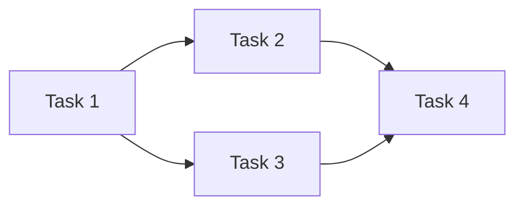
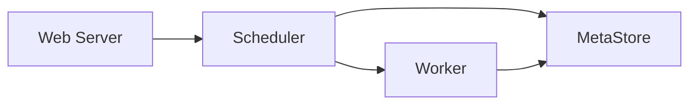
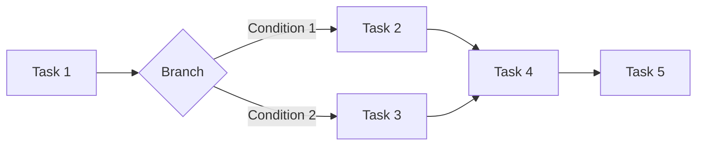
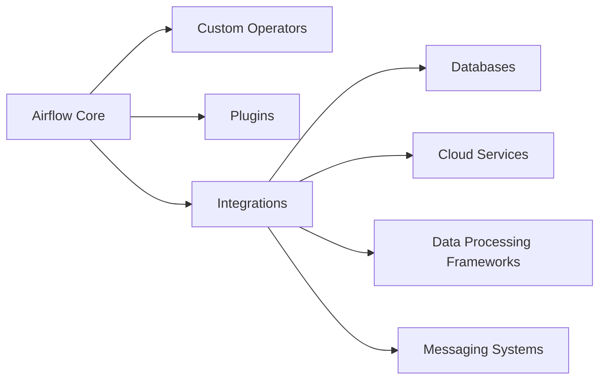
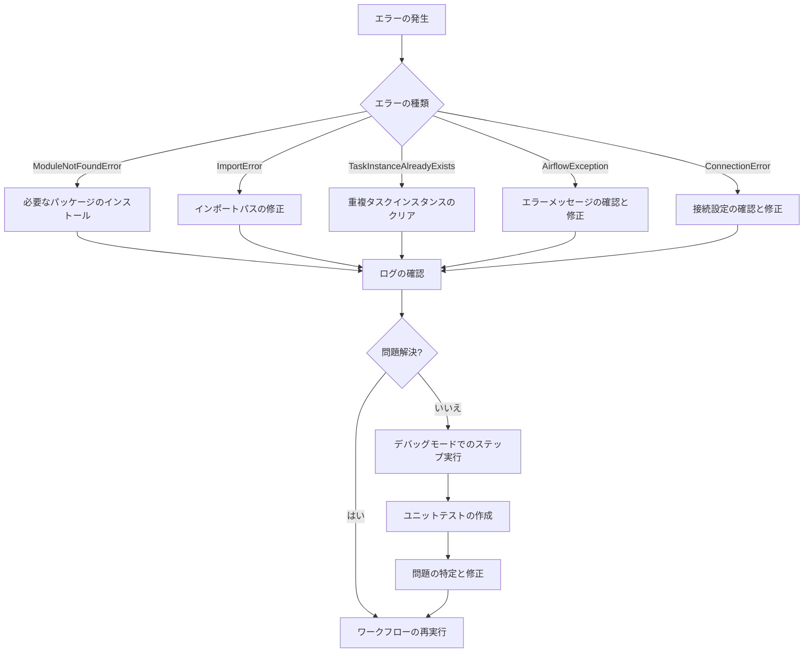
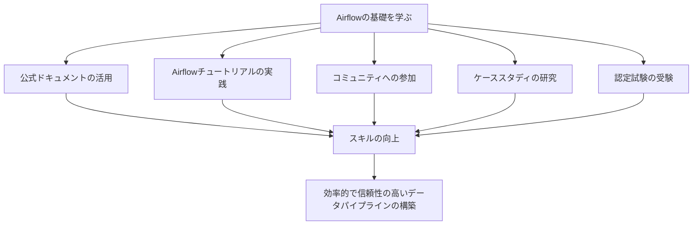

## はじめに

データエンジニアリングの世界では、データパイプラインの構築と管理が重要な役割を果たします。データパイプラインは、データの収集、処理、変換、および配信を自動化するために使用されます。Apache Airflowは、データパイプラインの作成、スケジューリング、および監視を容易にするオープンソースのプラットフォームです。このガイドでは、Python Airflowの基本概念と使用方法について説明し、初心者のデータエンジニアがAirflowを使いこなせるようになることを目的としています。

### Airflowとは何か

Airflowは、プログラムでワークフローを作成、スケジュール、および監視するためのプラットフォームです。Airflowを使用すると、複雑なデータパイプラインを定義し、それらの依存関係を管理し、スケジュールに従って実行することができます。Airflowは、有向非巡回グラフ（DAG）を使用してワークフローを表現します。各DAGは、一連のタスクで構成され、これらのタスクは特定の順序で実行されます。

### Airflowを使用するメリット

Airflowを使用する主なメリットは次のとおりです。

1. **ワークフローの視覚化**: AirflowのWebUIを使用すると、ワークフローを視覚的に表現し、各タスクの依存関係や実行状況を簡単に把握することができます。

2. **スケジューリングの柔軟性**: Airflowでは、ワークフローのスケジュールを柔軟に設定できます。特定の時間、日付、または間隔でワークフローを実行するようにスケジュールを設定できます。

3. **拡張性**: Airflowは、さまざまなデータソース、データベース、およびクラウドプロバイダーと統合できます。また、カスタムオペレーターを作成して、特定のユースケースに合わせてAirflowを拡張することもできます。

4. **エラー処理とモニタリング**: Airflowには、エラー処理とモニタリングのための組み込み機能があります。タスクが失敗した場合、Airflowはエラーを記録し、必要に応じてタスクを再試行します。また、Airflowのウェブインターフェースを使用して、ワークフローの進行状況を監視できます。

Airflowを使用することで、データエンジニアはデータパイプラインの構築と管理に関連する多くの手動タスクを自動化できます。これにより、時間を節約し、エラーを減らし、データパイプラインの信頼性を向上させることができます。

次の章では、Airflowの基本概念について詳しく説明します。

## Airflowの基本概念

Airflowを効果的に使用するには、その基本概念を理解することが重要です。この章では、Airflowの主要な構成要素について説明します。

### DAG (Directed Acyclic Graph)

DAGは、Airflowにおけるワークフローの中心的な概念です。DAGは、タスクとその依存関係を表す有向非巡回グラフです。各DAGは、一連のタスクで構成され、これらのタスクは特定の順序で実行されます。DAGは、サイクルを含まない、つまり、タスクが自分自身に依存することはできません。

DAGの例を以下のMermaidチャートで示します。



### タスク

タスクは、DAG内の個々の処理単位です。タスクは、実行されるアクションを定義します。例えば、データの抽出、変換、ロードなどです。Airflowでは、オペレーターを使用してタスクを作成します。

### オペレーター

オペレーターは、タスクを実行するための事前定義された一連のアクションです。Airflowには、さまざまな種類の組み込みオペレーターが用意されています。例えば、PythonOperator、BashOperator、HTTPOperatorなどです。これらのオペレーターを使用して、タスクで実行するアクションを定義できます。

以下は、BashOperatorを使用したタスクの例です。

```python
from airflow.operators.bash_operator import BashOperator

task = BashOperator(
    task_id='example_task',
    bash_command='echo "Hello, World!"',
    dag=dag,
)
```

### スケジューリング

Airflowでは、DAGの実行スケジュールを定義できます。スケジュールは、特定の時間、日付、または間隔でDAGを実行するように設定できます。スケジュールは、cron式またはタイムデルタを使用して定義します。

以下は、DAGにスケジュールを設定する例です。

```python
from datetime import timedelta

default_args = {
    'start_date': datetime(2023, 1, 1),
    'schedule_interval': timedelta(days=1),
}

dag = DAG(
    'example_dag',
    default_args=default_args,
)
```

この例では、DAGは2023年1月1日から開始し、毎日実行されるようにスケジュールされています。

Airflowの基本概念を理解したところで、次の章ではAirflowのインストールとセットアップ方法について説明します。

## Airflowのインストールとセットアップ

この章では、Airflowのインストールとセットアッププロセスについて説明します。Airflowを使用するには、まず環境を正しく設定する必要があります。

### 前提条件

Airflowをインストールする前に、以下の前提条件を満たしていることを確認してください。

- Python 3.6以降がインストールされていること
- pipパッケージマネージャーがインストールされていること
- 仮想環境を作成および管理するためのツール（venvまたはconda）がインストールされていること

### インストール方法

以下の手順に従って、Airflowをインストールします。

1. 新しい仮想環境を作成します。

```bash
python -m venv airflow-env
source airflow-env/bin/activate
```

2. Airflowをインストールします。

```bash
pip install apache-airflow
```

3. Airflowのホームディレクトリを設定します。

```bash
export AIRFLOW_HOME=~/airflow
```

4. Airflowのデータベースを初期化します。

```bash
airflow db init
```

5. ユーザーを作成します。

```bash
airflow users create \
    --username admin \
    --password password \
    --firstname FirstName \
    --lastname LastName \
    --role Admin \
    --email admin@example.com
```

これで、Airflowがインストールされ、使用する準備が整いました。

### 設定ファイルの概要

Airflowの設定は、`airflow.cfg`ファイルで管理されます。このファイルは、`AIRFLOW_HOME`ディレクトリ内にあります。設定ファイルでは、Airflowのさまざまな側面を制御できます。例えば、データベース接続、ログの場所、実行者の設定などです。

以下は、`airflow.cfg`ファイルの一部の例です。

```ini
[core]
dags_folder = /path/to/your/dags/folder
base_log_folder = /path/to/your/logs/folder
executor = SequentialExecutor

[webserver]
web_server_port = 8080

[database]
sql_alchemy_conn = sqlite:////path/to/your/airflow.db
```

設定ファイルを変更することで、Airflowの動作をカスタマイズできます。ただし、初心者の場合は、デフォルトの設定で開始し、必要に応じて徐々に変更を加えることをお勧めします。

次の章では、最初のDAGを作成する方法について説明します。

## 最初のDAGの作成

この章では、Airflowで最初のDAGを作成する方法について説明します。DAGの定義、タスクの作成、オペレーターの使用、およびDAGの実行について学びます。

### DAGの定義

DAGを作成するには、`airflow.models`モジュールからDAGクラスをインポートします。次に、DAGのインスタンスを作成し、引数を指定します。

```python
from airflow import DAG
from datetime import datetime, timedelta

default_args = {
    'owner': 'your_name',
    'depends_on_past': False,
    'start_date': datetime(2023, 1, 1),
    'email_on_failure': False,
    'email_on_retry': False,
    'retries': 1,
    'retry_delay': timedelta(minutes=5),
}

dag = DAG(
    'example_dag',
    default_args=default_args,
    description='A simple example DAG',
    schedule_interval=timedelta(days=1),
)
```

この例では、`default_args`ディクショナリを使用して、DAGのデフォルト引数を指定しています。`dag`インスタンスは、DAGの名前、デフォルト引数、説明、およびスケジュール間隔を指定して作成されます。

### タスクの作成

タスクを作成するには、オペレーターのインスタンスを作成します。Airflowには、さまざまな組み込みオペレーターが用意されています。この例では、`BashOperator`を使用します。

```python
from airflow.operators.bash_operator import BashOperator

task1 = BashOperator(
    task_id='print_date',
    bash_command='date',
    dag=dag,
)

task2 = BashOperator(
    task_id='sleep',
    depends_on_past=False,
    bash_command='sleep 5',
    dag=dag,
)
```

この例では、2つのタスク`task1`と`task2`を作成しています。各タスクは、一意の`task_id`、実行するbashコマンド、および関連するDAGを指定して定義されます。

### タスクの依存関係

タスクの依存関係を定義することで、タスクの実行順序を制御できます。Airflowでは、ビットシフト演算子（`>>`）を使用してタスクの依存関係を指定します。

```python
task1 >> task2
```

この例では、`task1`が完了した後に`task2`が実行されるように指定しています。

### DAGの実行

DAGを実行するには、以下のコマンドを使用します。

```bash
airflow dags trigger example_dag
```

このコマンドは、`example_dag`を手動でトリガーします。DAGが正常に実行されると、Airflowのウェブインターフェースで実行の進行状況を確認できます。

以下は、完全な例です。

```python
from airflow import DAG
from airflow.operators.bash_operator import BashOperator
from datetime import datetime, timedelta

default_args = {
    'owner': 'your_name',
    'depends_on_past': False,
    'start_date': datetime(2023, 1, 1),
    'email_on_failure': False,
    'email_on_retry': False,
    'retries': 1,
    'retry_delay': timedelta(minutes=5),
}

dag = DAG(
    'example_dag',
    default_args=default_args,
    description='A simple example DAG',
    schedule_interval=timedelta(days=1),
)

task1 = BashOperator(
    task_id='print_date',
    bash_command='date',
    dag=dag,
)

task2 = BashOperator(
    task_id='sleep',
    depends_on_past=False,
    bash_command='sleep 5',
    dag=dag,
)

task1 >> task2
```

これで、最初のDAGが作成されました。次の章では、Airflowの主要コンポーネントについて詳しく説明します。

## Airflowの主要コンポーネント

Airflowは、いくつかの主要コンポーネントで構成されています。これらのコンポーネントは、Airflowの機能を提供し、ワークフローの管理と実行を容易にします。この章では、Airflowの主要コンポーネントについて詳しく説明します。

### ウェブサーバー

Airflowのウェブサーバーは、Airflowのユーザーインターフェースを提供します。ウェブサーバーを使用すると、以下のことができます。

- DAGの一覧表示と管理
- DAGの実行履歴の表示
- タスクの実行状況の監視
- 変数と接続の管理

ウェブサーバーは、デフォルトでポート8080で実行されます。ウェブサーバーを起動するには、以下のコマンドを使用します。

```bash
airflow webserver
```

### スケジューラー

Airflowのスケジューラーは、DAGの実行をスケジュールおよび管理します。スケジューラーは、以下の機能を提供します。

- DAGの実行スケジュールの管理
- タスクインスタンスの作成とキューイング
- タスクの依存関係の解決
- タスクの実行状況の追跡

スケジューラーを起動するには、以下のコマンドを使用します。

```bash
airflow scheduler
```

### ワーカー

Airflowのワーカーは、タスクの実際の実行を担当します。ワーカーは、スケジューラーからタスクを受け取り、それらを実行します。Airflowは、さまざまなタイプのワーカーをサポートしています。例えば、LocalWorker、CeleryWorker、KubernetesWorkerなどです。

ワーカーを起動するには、以下のコマンドを使用します。

```bash
airflow celery worker
```

### メタストア

Airflowのメタストアは、Airflowのメタデータを保存するためのバックエンドデータベースです。メタストアは、以下の情報を格納します。

- DAGの定義
- タスクインスタンス
- 変数と接続
- ログ

デフォルトでは、AirflowはSQLiteデータベースをメタストアとして使用します。ただし、本番環境では、MySQLやPostgreSQLなどのより堅牢なデータベースを使用することをお勧めします。

以下の図は、Airflowの主要コンポーネントとその相互作用を示しています。



この図から、ウェブサーバーがスケジューラーと通信し、スケジューラーがメタストアからDAGの情報を取得していることがわかります。スケジューラーは、ワーカーにタスクを割り当て、ワーカーはタスクを実行し、その結果をメタストアに保存します。

Airflowの主要コンポーネントを理解したところで、次の章では一般的なオペレーターについて説明します。

## 一般的なオペレーター

Airflowのオペレーターは、タスクを実行するための事前定義された一連のアクションです。Airflowには、さまざまな種類の組み込みオペレーターが用意されています。この章では、一般的に使用されるオペレーターについて説明します。

### BashOperator

BashOperatorは、Bashコマンドを実行するためのオペレーターです。このオペレーターは、シェルスクリプトやコマンドラインユーティリティを実行するために使用できます。

```python
from airflow.operators.bash_operator import BashOperator

task = BashOperator(
    task_id='example_bash_operator',
    bash_command='echo "Hello, World!"',
    dag=dag,
)
```

### PythonOperator

PythonOperatorは、Pythonの関数を実行するためのオペレーターです。このオペレーターは、Pythonスクリプトやカスタム関数を実行するために使用できます。

```python
from airflow.operators.python_operator import PythonOperator

def example_function():
    print("Hello, World!")

task = PythonOperator(
    task_id='example_python_operator',
    python_callable=example_function,
    dag=dag,
)
```

### EmailOperator

EmailOperatorは、電子メールを送信するためのオペレーターです。このオペレーターは、ワークフローのステータスを通知したり、レポートを配信したりするために使用できます。

```python
from airflow.operators.email_operator import EmailOperator

task = EmailOperator(
    task_id='example_email_operator',
    to='example@example.com',
    subject='Airflow Alert',
    html_content="<p>This is an example email.</p>",
    dag=dag,
)
```

### HTTPOperator

HTTPOperatorは、HTTP リクエストを送信するためのオペレーターです。このオペレーターは、外部のAPIとの統合や、Webサービスの呼び出しに使用できます。

```python
from airflow.operators.http_operator import SimpleHttpOperator

task = SimpleHttpOperator(
    task_id='example_http_operator',
    http_conn_id='http_default',
    endpoint='api/v1/example',
    method='GET',
    dag=dag,
)
```

これらは、Airflowで一般的に使用されるオペレーターのほんの一部です。Airflowには、他にもさまざまなオペレーターが用意されており、特定のユースケースに対応しています。また、カスタムオペレーターを作成して、独自の機能を実装することもできます。

以下は、複数のオペレーターを使用したDAGの例です。

```python
from airflow import DAG
from airflow.operators.bash_operator import BashOperator
from airflow.operators.python_operator import PythonOperator
from airflow.operators.email_operator import EmailOperator
from datetime import datetime, timedelta

default_args = {
    'owner': 'your_name',
    'depends_on_past': False,
    'start_date': datetime(2023, 1, 1),
    'email_on_failure': False,
    'email_on_retry': False,
    'retries': 1,
    'retry_delay': timedelta(minutes=5),
}

dag = DAG(
    'example_dag_with_operators',
    default_args=default_args,
    description='DAG with multiple operators',
    schedule_interval=timedelta(days=1),
)

bash_task = BashOperator(
    task_id='example_bash_operator',
    bash_command='echo "Hello from BashOperator!"',
    dag=dag,
)

def example_function():
    print("Hello from PythonOperator!")

python_task = PythonOperator(
    task_id='example_python_operator',
    python_callable=example_function,
    dag=dag,
)

email_task = EmailOperator(
    task_id='example_email_operator',
    to='example@example.com',
    subject='Airflow DAG Completed',
    html_content="<p>The example DAG has completed.</p>",
    dag=dag,
)

bash_task >> python_task >> email_task
```

この例では、BashOperator、PythonOperator、EmailOperatorを使用して、3つのタスクを定義しています。タスクの依存関係は、ビットシフト演算子（`>>`）を使用して指定されており、`bash_task`が完了すると`python_task`が実行され、最後に`email_task`が実行されます。

次の章では、タスクの依存関係と順序について詳しく説明します。

## タスクの依存関係と順序

Airflowでは、DAG内のタスクの実行順序を制御するために、タスクの依存関係を定義します。タスクの依存関係を適切に設定することで、ワークフローが意図したとおりに実行されるようにできます。この章では、タスクの依存関係を定義する方法と、タスクの順序を制御する方法について説明します。

### タスクの依存関係の定義

Airflowでは、ビットシフト演算子（`>>`）を使用してタスクの依存関係を定義します。`task1 >> task2`は、`task1`が完了した後に`task2`が実行されることを意味します。

以下は、タスクの依存関係を定義する例です。

```python
task1 = BashOperator(
    task_id='task1',
    bash_command='echo "Task 1"',
    dag=dag,
)

task2 = BashOperator(
    task_id='task2',
    bash_command='echo "Task 2"',
    dag=dag,
)

task3 = BashOperator(
    task_id='task3',
    bash_command='echo "Task 3"',
    dag=dag,
)

task1 >> [task2, task3]
```

この例では、`task1`が完了すると、`task2`と`task3`が並行して実行されます。

タスクの依存関係は、より複雑な方法で定義することもできます。例えば、複数のタスクが完了した後に特定のタスクを実行したり、条件に基づいてタスクをスキップしたりすることができます。

### タスクの順序制御

タスクの順序を制御するには、さまざまな方法があります。以下は、一般的な順序制御の方法です。

1. リニアな依存関係：タスクを一列に並べ、各タスクが前のタスクに依存するようにします。

```python
task1 >> task2 >> task3 >> task4
```

2. 並行実行：複数のタスクを並行して実行します。

```python
task1 >> [task2, task3] >> task4
```

3. 条件付き実行：条件に基づいてタスクを実行またはスキップします。

```python
from airflow.operators.python_operator import BranchPythonOperator

def decide_task(**kwargs):
    if some_condition:
        return "task2"
    else:
        return "task3"

branch_task = BranchPythonOperator(
    task_id='branch_task',
    python_callable=decide_task,
    dag=dag,
)

task1 >> branch_task >> [task2, task3] >> task4
```

4. SubDAGs：複雑なワークフローを小さなサブワークフローに分割します。

```python
from airflow.operators.subdag_operator import SubDagOperator

subdag = DAG(
    'subdag',
    default_args=default_args,
    schedule_interval=None,
)

subtask1 = BashOperator(
    task_id='subtask1',
    bash_command='echo "Subtask 1"',
    dag=subdag,
)

subtask2 = BashOperator(
    task_id='subtask2',
    bash_command='echo "Subtask 2"',
    dag=subdag,
)

subtask1 >> subtask2

main_task = SubDagOperator(
    task_id='main_task',
    subdag=subdag,
    dag=dag,
)

task1 >> main_task >> task4
```

これらの順序制御方法を組み合わせることで、複雑なワークフローを管理しやすい小さなタスクに分割できます。

以下は、タスクの依存関係と順序制御を示すMermaidチャートの例です。



このチャートは、`Task 1`が完了した後、条件に基づいて`Task 2`または`Task 3`が実行されることを示しています。`Task 2`と`Task 3`が完了すると、`Task 4`が実行され、最後に`Task 5`が実行されます。

タスクの依存関係と順序制御を理解することは、Airflowでワークフローを設計する上で重要です。適切に設計されたワークフローは、メンテナンスが容易で、エラーが発生しにくくなります。

次の章では、Airflowのベストプラクティスについて説明します。

## Airflowのベストプラクティス

Airflowを使用してワークフローを作成する際には、ベストプラクティスに従うことで、メンテナンスしやすく、拡張性が高く、エラーが発生しにくいワークフローを設計できます。この章では、Airflowのベストプラクティスについて説明します。

### DAGの設計

DAGを設計する際には、以下の点に留意してください。

1. DAGを簡潔かつ目的に沿ったものにする
2. タスクの粒度を適切に設定する
3. タスクの依存関係を明確に定義する
4. 再利用可能なタスクを作成する
5. 設定値はDAGに直接書き込まず、変数を使用する

以下は、これらのベストプラクティスに従ったDAGの例です。

```python
from airflow import DAG
from airflow.operators.python_operator import PythonOperator
from airflow.models import Variable
from datetime import datetime, timedelta

default_args = {
    'owner': 'your_name',
    'depends_on_past': False,
    'start_date': datetime(2023, 1, 1),
    'email_on_failure': False,
    'email_on_retry': False,
    'retries': 1,
    'retry_delay': timedelta(minutes=5),
}

dag = DAG(
    'example_dag_best_practices',
    default_args=default_args,
    description='DAG following best practices',
    schedule_interval=timedelta(days=1),
)

def process_data(ds, **kwargs):
    input_path = Variable.get("input_path")
    output_path = Variable.get("output_path")
    ## Process data here

task1 = PythonOperator(
    task_id='process_data',
    python_callable=process_data,
    provide_context=True,
    dag=dag,
)

def send_report(ds, **kwargs):
    ## Send report here

task2 = PythonOperator(
    task_id='send_report',
    python_callable=send_report,
    provide_context=True,
    dag=dag,
)

task1 >> task2
```

### タスクの分割

複雑なタスクは、小さな再利用可能なサブタスクに分割してください。これにより、コードの可読性が向上し、メンテナンスが容易になります。

```python
def extract_data(ds, **kwargs):
    ## Extract data here

def transform_data(ds, **kwargs):
    ## Transform data here

def load_data(ds, **kwargs):
    ## Load data here

extract_task = PythonOperator(
    task_id='extract_data',
    python_callable=extract_data,
    provide_context=True,
    dag=dag,
)

transform_task = PythonOperator(
    task_id='transform_data',
    python_callable=transform_data,
    provide_context=True,
    dag=dag,
)

load_task = PythonOperator(
    task_id='load_data',
    python_callable=load_data,
    provide_context=True,
    dag=dag,
)

extract_task >> transform_task >> load_task
```

### 変数とマクロの使用

機密情報や設定値は、DAGに直接書き込むのではなく、変数を使用してください。また、Airflowのマクロを使用して、実行日時や実行間隔などの情報にアクセスできます。

```python
from airflow.macros import ds_add

process_data_task = PythonOperator(
    task_id='process_data',
    python_callable=process_data,
    provide_context=True,
    op_args=[Variable.get("input_path"), Variable.get("output_path")],
    dag=dag,
)

def send_report(ds, **kwargs):
    report_date = ds_add(ds, -1)  ## 前日の日付を取得
    ## Send report here
```

### ログとモニタリング

DAGの実行状況を追跡し、エラーを検出するために、ログとモニタリングを適切に設定してください。Airflowは、ログ記録とモニタリングのための組み込み機能を提供しています。

```python
from airflow.operators.python_operator import PythonOperator

def process_data(ds, **kwargs):
    try:
        ## Process data here
        logging.info("Data processed successfully")
    except Exception as e:
        logging.error(f"Error processing data: {str(e)}")
        raise

process_data_task = PythonOperator(
    task_id='process_data',
    python_callable=process_data,
    provide_context=True,
    dag=dag,
)
```

これらのベストプラクティスに従うことで、メンテナンスしやすく、拡張性が高く、エラーが発生しにくいワークフローを作成できます。

次の章では、Airflowの拡張機能について説明します。

## Airflowの拡張機能

Airflowは、柔軟で拡張性の高いプラットフォームであり、カスタムコンポーネントを追加してその機能を拡張できます。この章では、カスタムオペレーターの作成、プラグインの使用、およびAirflowの統合について説明します。

### カスタムオペレーターの作成

Airflowには多数の組み込みオペレーターが用意されていますが、特定のユースケースに対応するために、カスタムオペレーターを作成することもできます。カスタムオペレーターを作成するには、`BaseOperator`クラスを継承し、`execute`メソッドをオーバーライドします。

以下は、カスタムオペレーターの例です。

```python
from airflow.models.baseoperator import BaseOperator
from airflow.utils.decorators import apply_defaults

class MyOperator(BaseOperator):
    @apply_defaults
    def __init__(self, my_param, *args, **kwargs):
        super().__init__(*args, **kwargs)
        self.my_param = my_param

    def execute(self, context):
        ## カスタムロジックをここに実装
        print(f"MyOperator is running with param: {self.my_param}")

my_task = MyOperator(
    task_id='my_task',
    my_param='custom_value',
    dag=dag,
)
```

### プラグインの使用

Airflowプラグインを使用すると、カスタムコンポーネント（オペレーター、フック、マクロ、UIビューなど）をパッケージ化し、複数のDAGで再利用できます。プラグインを作成するには、`airflow.plugins_manager.AirflowPlugin`クラスを継承し、カスタムコンポーネントをクラス属性として定義します。

以下は、カスタムオペレーターを含むプラグインの例です。

```python
from airflow.plugins_manager import AirflowPlugin

class MyPlugin(AirflowPlugin):
    name = "my_plugin"
    operators = [MyOperator]

my_task = MyOperator(
    task_id='my_task',
    my_param='custom_value',
    dag=dag,
)
```

### Airflowの統合

Airflowは、様々な外部システムやサービスと統合できます。これにより、データの取り込み、処理、エクスポートを行うワークフローを構築できます。Airflowは、以下のような一般的な統合シナリオをサポートしています。

1. データベース統合（MySQL、PostgreSQL、SQLiteなど）
2. クラウドサービス統合（Amazon Web Services、Google Cloud Platform、Microsoft Azureなど）
3. データ処理フレームワーク統合（Apache Spark、Apache Hive、Prestoなど）
4. メッセージングシステム統合（Apache Kafka、RabbitMQなど）

これらの統合シナリオには、Airflowの組み込みフックとオペレーターを使用できます。また、カスタムフックとオペレーターを作成して、特定の統合要件に対応することもできます。

以下は、Airflowの拡張機能を示すMermaidチャートの例です。



このチャートは、Airflowのコアシステムがカスタムオペレーター、プラグイン、および外部システムやサービスとの統合によって拡張できることを示しています。

Airflowの拡張機能を理解することで、特定のユースケースに合わせてプラットフォームをカスタマイズし、強力なデータパイプラインを構築できます。

次の章では、Airflowのトラブルシューティングとデバッグについて説明します。

## トラブルシューティングとデバッグ

Airflowを使用してワークフローを開発・運用する際には、問題が発生することがあります。この章では、一般的なエラーとその解決方法、およびデバッグ技術について説明します。

### 一般的なエラーとその解決方法

以下は、Airflowで発生する一般的なエラーとその解決方法です。

1. `ModuleNotFoundError`: 必要なPythonパッケージがインストールされていない場合に発生します。解決方法は、欠落しているパッケージをインストールすることです。

2. `ImportError`: DAGファイルでモジュールやクラスを正しくインポートできない場合に発生します。解決方法は、インポートパスを確認し、必要に応じて修正することです。

3. `TaskInstanceAlreadyExists`: 同じタスクインスタンスが既に存在する場合に発生します。解決方法は、DAGの実行状況を確認し、重複するタスクインスタンスをクリアすることです。

4. `AirflowException`: Airflowの一般的な例外です。解決方法は、エラーメッセージを確認し、適切な修正を行うことです。

5. `ConnectionError`: 外部システムやサービスへの接続が失敗した場合に発生します。解決方法は、接続設定を確認し、必要に応じて修正することです。

### デバッグ技術

Airflowワークフローをデバッグする際には、以下の技術が役立ちます。

1. ログの活用: Airflowは、各タスクの実行ログを生成します。これらのログを確認することで、エラーの原因を特定できます。

```python
from airflow.operators.python_operator import PythonOperator

def my_task_function(ds, **kwargs):
    try:
        ## タスクのロジックをここに実装
        logging.info("Task completed successfully")
    except Exception as e:
        logging.error(f"Error occurred: {str(e)}")
        raise

my_task = PythonOperator(
    task_id='my_task',
    python_callable=my_task_function,
    provide_context=True,
    dag=dag,
)
```

2. デバッグモードの使用: Airflowには、デバッグモードがあります。このモードでは、タスクの実行が一時停止され、デバッガーを使用してコードをステップ実行できます。

```bash
airflow dags test my_dag my_task 2023-01-01
```

3. ユニットテストの作成: 複雑なワークフローをデバッグする場合は、ユニットテストを作成することをお勧めします。これにより、個々のタスクやワークフローの特定の部分を独立してテストできます。

```python
import unittest
from airflow.models import DagBag

class TestMyDAG(unittest.TestCase):
    def setUp(self):
        self.dagbag = DagBag()

    def test_dag_loaded(self):
        dag = self.dagbag.get_dag(dag_id='my_dag')
        self.assertIsNotNone(dag)

    def test_task_order(self):
        dag = self.dagbag.get_dag(dag_id='my_dag')
        tasks = dag.tasks
        self.assertEqual(tasks[0].task_id, 'task1')
        self.assertEqual(tasks[1].task_id, 'task2')
        self.assertEqual(tasks[2].task_id, 'task3')
```

これらのデバッグ技術を活用することで、Airflowワークフローの問題を効率的に特定し、解決できます。

以下は、トラブルシューティングとデバッグのプロセスを示すMermaidチャートの例です。



このチャートは、エラーが発生してから問題が解決されるまでのトラブルシューティングとデバッグのプロセスを示しています。エラーの種類に応じて適切な解決方法を適用し、ログの確認、デバッグモードでのステップ実行、ユニットテストの作成を通じて問題を特定し、修正します。

トラブルシューティングとデバッグのスキルを身につけることで、Airflowワークフローの問題を効果的に解決し、安定したデータパイプラインを維持できます。

## まとめ

この記事では、データエンジニア初心者向けにPython Airflowの概要と使用方法について説明しました。Airflowは、データパイプラインの構築、スケジューリング、および監視のための強力なプラットフォームであり、データエンジニアにとって重要なツールの1つです。

### Airflowの重要ポイント

- Airflowは、有向非巡回グラフ（DAG）を使用してワークフローを定義します。
- タスクはDAGの基本的な構成要素であり、オペレーターを使用して作成します。
- Airflowは、ワークフローのスケジューリングと実行を管理します。
- Airflowのアーキテクチャは、ウェブサーバー、スケジューラー、ワーカー、メタストアで構成されます。
- Airflowは、さまざまなオペレーターとセンサーを提供し、外部システムやサービスとの統合を容易にします。
- Airflowをカスタマイズするには、カスタムオペレーターの作成やプラグインの使用が可能です。
- Airflowのベストプラクティスに従うことで、メンテナンスしやすく、拡張性が高く、エラーが発生しにくいワークフローを設計できます。
- トラブルシューティングとデバッグのスキルは、Airflowワークフローの問題を効果的に解決するために重要です。

### 次のステップとリソース

Airflowの基礎を学んだ後は、以下のステップとリソースを参考にしてスキルを向上させることができます。

1. 公式ドキュメントの活用: Airflowの公式ドキュメント（https://airflow.apache.org/docs/）には、詳細な情報とサンプルコードが掲載されています。

2. Airflowチュートリアルの実践: Airflowのチュートリアル（https://airflow.apache.org/docs/apache-airflow/stable/tutorial.html）を実践することで、実際のワークフロー構築方法を学べます。

3. コミュニティへの参加: Airflowには活発なコミュニティがあります。Slack（https://apache-airflow-slack.herokuapp.com/）やメーリングリスト（https://groups.google.com/g/apache-airflow-users）に参加することで、他のユーザーと知識を共有できます。

4. ケーススタディの研究: Airflowを使用した実際のケーススタディを研究することで、ベストプラクティスや課題への対処方法を学べます。

5. 認定試験の受験: Astronomer社が提供するApache Airflow認定試験（https://www.astronomer.io/certification/）に合格することで、Airflowの専門知識を証明できます。

Airflowは、データエンジニアリングの世界で重要な役割を果たすツールです。Airflowを使いこなすことで、効率的で信頼性の高いデータパイプラインを構築し、組織のデータ処理ニーズに対応できるようになります。

以下は、Airflowを学ぶための重要なポイントと次のステップをまとめたMermaidチャートの例です。



このチャートは、Airflowの基礎を学んだ後、公式ドキュメントの活用、チュートリアルの実践、コミュニティへの参加、ケーススタディの研究、認定試験の受験を通じてスキルを向上させ、最終的に効率的で信頼性の高いデータパイプラインを構築できることを示しています。

Airflowを学ぶ過程で、常に好奇心を持ち、新しいことにチャレンジしてください。データエンジニアリングの世界では、継続的な学習と成長が不可欠です。この記事が、あなたのAirflow学習の第一歩となることを願っています。
