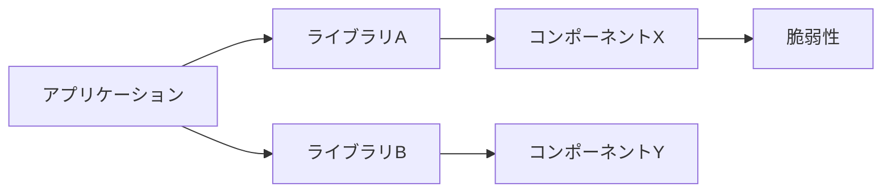
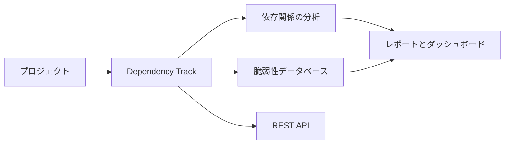
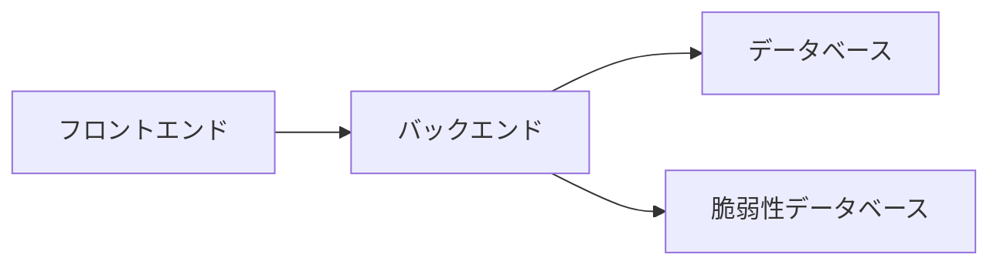
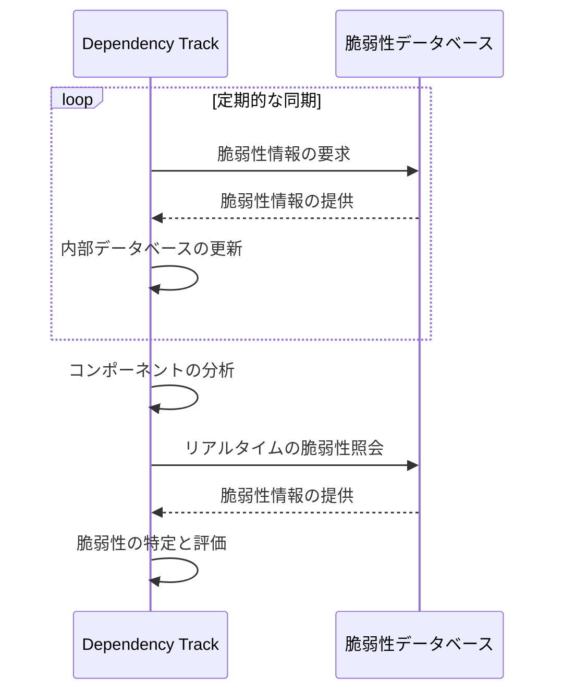
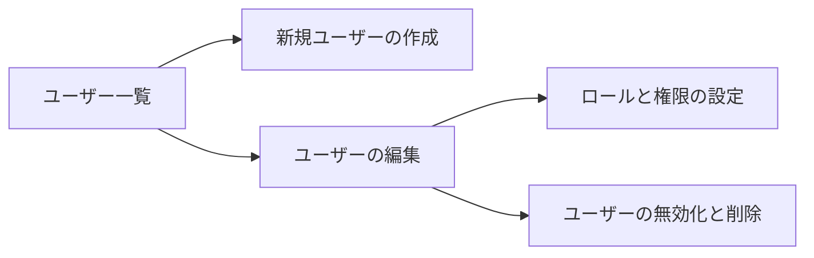
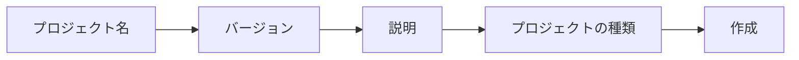
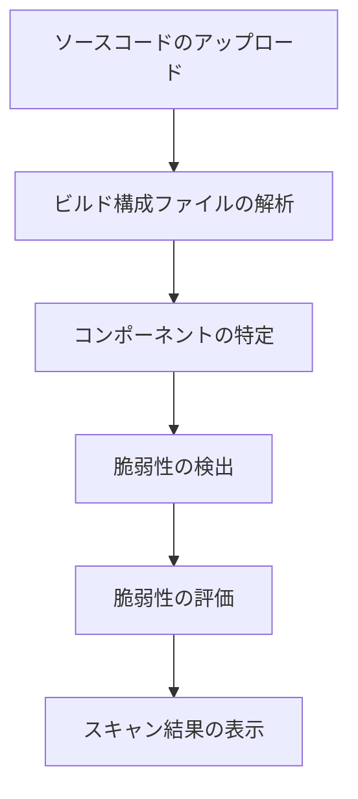
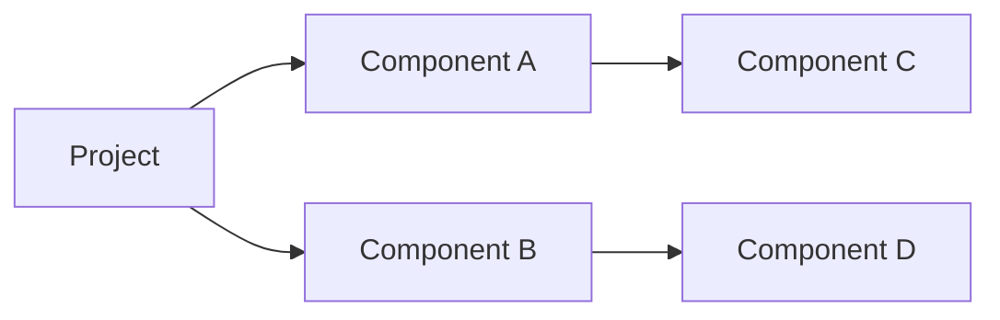
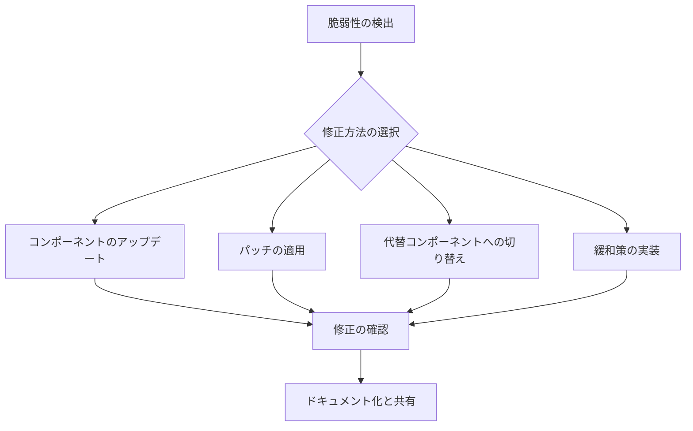
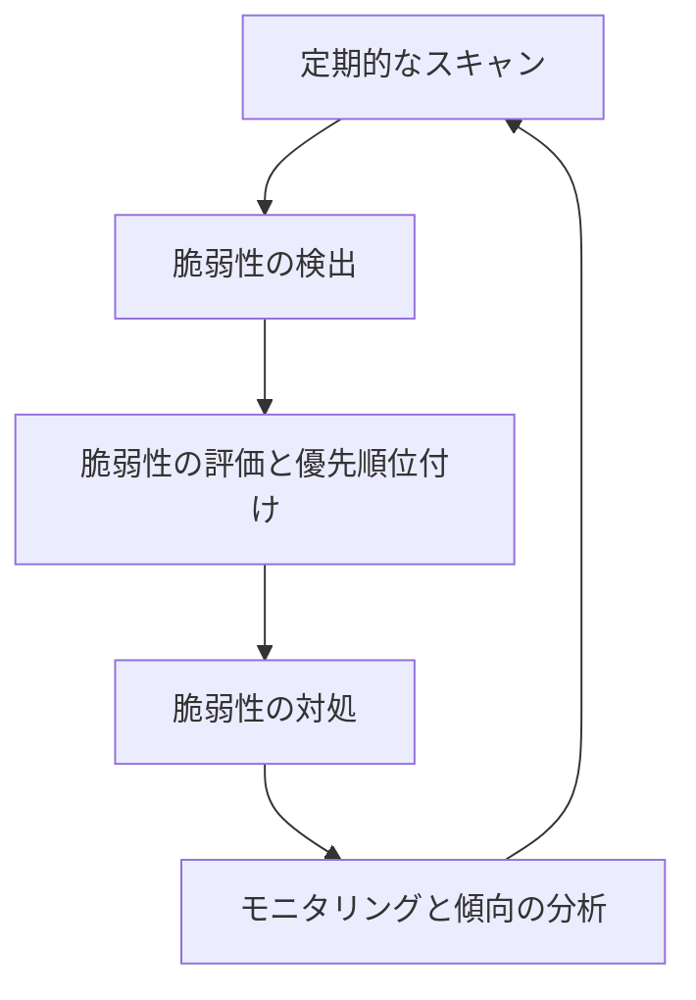

## 1. はじめに

### 1-1. ソフトウェアのサプライチェーンリスクとは

現代のソフトウェア開発では、オープンソースコンポーネントの使用が不可欠となっています。これらのコンポーネントを活用することで、開発者は時間と労力を節約し、高品質なソフトウェアを迅速に構築することができます。しかし、オープンソースコンポーネントを使用することで、ソフトウェアのサプライチェーンにセキュリティリスクが生じる可能性があります。

サプライチェーンリスクとは、ソフトウェアの依存関係に存在する脆弱性や脅威によって、アプリケーションの機能や機密性、完全性が損なわれる可能性を指します。これらのリスクは、開発者が直接管理していないオープンソースコンポーネントに起因することが多く、脆弱性が悪用された場合、深刻な被害をもたらす可能性があります。

以下の図は、サプライチェーンリスクの例を示しています。



この例では、アプリケーションがライブラリAとライブラリBに依存しており、それぞれのライブラリがコンポーネントXとコンポーネントYに依存しています。コンポーネントXには脆弱性が存在するため、この脆弱性がアプリケーション全体に影響を与える可能性があります。

### 1-2. オープンソースコンポーネントの重要性と脆弱性管理の必要性

オープンソースコンポーネントは、ソフトウェア開発において重要な役割を果たしています。これらのコンポーネントを使用することで、開発者は以下のようなメリットを享受できます。

- 開発時間の短縮
- コードの再利用性の向上
- 高品質なソフトウェアの構築

しかし、オープンソースコンポーネントを使用する際には、脆弱性管理に十分な注意を払う必要があります。脆弱性管理を怠ると、以下のようなリスクが生じる可能性があります。

- データ漏洩や改ざんなどのセキュリティインシデント
- システムの可用性の低下
- 法的責任や信頼性の喪失

そのため、開発者はオープンソースコンポーネントの脆弱性を定期的にチェックし、適切に管理する必要があります。この過程で、Dependency Trackのようなソフトウェア成分分析ツールが重要な役割を果たします。

次の章では、Dependency Trackの概要と主な機能について説明します。

## 2. Dependency Trackの概要

### 2-1. Dependency Trackとは何か

Dependency Trackは、オープンソースのソフトウェア成分分析ツールであり、ソフトウェアプロジェクトで使用されているサードパーティコンポーネントの脆弱性を特定し、管理するために設計されています。このツールは、OSWAFのプロジェクトの一部として開発されており、ソフトウェアのサプライチェーンリスクを軽減することを目的としています。

Dependency Trackは、ソフトウェアプロジェクトの依存関係を分析し、既知の脆弱性を検出することで、開発者がセキュリティリスクを早期に特定し、対処できるようにします。これにより、脆弱性が悪用される前に適切な対策を講じることができます。

### 2-2. 主な機能と特徴

Dependency Trackの主な機能と特徴は以下の通りです。

1. 自動化された依存関係の分析

- プロジェクトのソースコードやビルド構成ファイルを解析し、使用されているサードパーティコンポーネントを自動的に特定します。

2. 脆弱性データベースとの統合

- National Vulnerability Database（NVD）や他の脆弱性データベースと統合し、既知の脆弱性を検出します。

3. 脆弱性の重要度評価

- 検出された脆弱性の重要度を評価し、リスクレベルに基づいて優先順位を付けます。

4. レポートとダッシュボード

- プロジェクトの依存関係と脆弱性の概要を示すレポートとダッシュボードを生成します。

5. REST APIの提供

- 他のツールやシステムとの統合を容易にするためのREST APIを提供します。

6. マルチユーザーとアクセス制御

- 複数のユーザーアカウントとアクセス制御機能を備えており、チームでの使用に適しています。

以下は、Dependency Trackの主要コンポーネントとそれらの相互作用を示す図です。



### 2-3. 他のソフトウェア成分分析ツールとの比較

Dependency Trackは、他のソフトウェア成分分析ツールと比較して、以下のような特徴があります。

- オープンソースであり、無料で使用できる
- 自己ホスト型であるため、データのプライバシーとセキュリティが確保される
- 複数のプログラミング言語とビルドシステムに対応している
- ユーザーインターフェースが直感的で使いやすい

次の章では、Dependency Trackのアーキテクチャと動作原理について詳しく説明します。

## 3. Dependency Trackのアーキテクチャと動作原理

### 3-1. コンポーネントの構成

Dependency Trackは、以下の主要コンポーネントから構成されています。

1. フロントエンド

- ユーザーインターフェースを提供するためのReactベースのWebアプリケーション。

2. バックエンド

- APIサーバーとしての役割を果たすJavaベースのアプリケーション。
- プロジェクトの管理、依存関係の分析、脆弱性の検出などの主要な処理を担当する。

3. データベース

- プロジェクトの情報、依存関係、脆弱性データを保存するためのリレーショナルデータベース。
- デフォルトではH2データベースを使用するが、PostgreSQLやMySQLなども対応可能。

4. 脆弱性データベース

- 脆弱性情報を取得するための外部データソース。
- National Vulnerability Database（NVD）やOSSインデックスなどと統合される。

これらのコンポーネントは、以下のような構成で相互に連携します。



### 3-2. 脆弱性データベースとの連携方法

Dependency Trackは、外部の脆弱性データベースから情報を取得し、プロジェクトで使用されているコンポーネントの脆弱性を特定します。主な連携方法は以下の通りです。

1. 定期的なデータの同期

- Dependency Trackは、設定された間隔で外部データベースから脆弱性情報を取得し、内部データベースを更新する。

2. リアルタイムの脆弱性照会

- コンポーネントの分析時に、外部データベースに対してリアルタイムの照会を行い、最新の脆弱性情報を取得する。

以下は、脆弱性データベースとの連携の例です。



### 3-3. スキャンの仕組みと結果の解釈

Dependency Trackは、以下の手順でプロジェクトの依存関係をスキャンし、脆弱性を特定します。

1. プロジェクトの作成とソースコードのアップロード
2. 依存関係の解析

- ビルド構成ファイル（pom.xml, package.json など）を解析し、使用されているコンポーネントを特定する。

3. 脆弱性の検出

- 特定されたコンポーネントと脆弱性データベースの情報を照合し、既知の脆弱性を検出する。

4. 脆弱性の評価

- 検出された脆弱性の重要度を評価し、リスクレベルを判定する。

5. レポートとダッシュボードの生成

- スキャン結果に基づいて、プロジェクトの依存関係と脆弱性の概要を示すレポートとダッシュボードを生成する。

スキャン結果は、以下のような情報を含みます。

- 使用されているコンポーネントとそのバージョン
- 検出された脆弱性の詳細（CVE ID、説明、重要度など）
- 影響を受けるコンポーネントと推奨される対策

開発者は、これらの情報を基に、脆弱性への対処の優先順位を決定し、適切な対策を講じることができます。

次の章では、Dependency Trackのセットアップ方法について説明します。

## 4. Dependency Trackのセットアップ

### 4-1. システム要件

Dependency Trackを利用するには、以下のシステム要件を満たす必要があります。

- Java 8以降
- サポートされているリレーショナルデータベース（H2、PostgreSQL、MySQLなど）
- 十分なメモリとストレージ容量（プロジェクトの規模に応じて異なる）

以下は、Dependency Trackを実行するための推奨スペックの一例です。

```
- OS: Linux（Ubuntu、CentOS、RedHatなど）
- CPU: 2コア以上
- メモリ: 4GB以上
- ストレージ: 50GB以上
```

### 4-2. インストール方法

Dependency Trackのインストール方法には、以下の選択肢があります。

1. バイナリ配布物を使用する方法

- 公式サイトからzipファイルをダウンロードし、解凍して使用する。

2. Dockerを使用する方法

- 公式のDockerイメージを使用して、コンテナ化されたDependency Trackを実行する。

3. ソースコードからビルドする方法

- GitHubリポジトリからソースコードをクローンし、Mavenを使用してビルドする。

ここでは、Dockerを使用する方法を例として説明します。

```bash
# Dockerイメージの取得
docker pull dependencytrack/dependency-track

# コンテナの起動
docker run -d -p 8080:8080 --name dependency-track dependencytrack/dependency-track
```

上記のコマンドを実行すると、Dependency Trackが起動し、`http://localhost:8080`でアクセスできるようになります。

### 4-3. 初期設定とユーザー管理

Dependency Trackを初めて起動すると、初期設定ウィザードが表示されます。ここで、以下の設定を行います。

1. 管理者アカウントの作成

- ユーザー名、メールアドレス、パスワードを設定する。

2. データベースの選択と設定

- 使用するデータベースを選択し、接続情報を設定する。

3. 脆弱性データベースの設定

- 使用する脆弱性データベースを選択し、API キーなどの必要な情報を設定する。

初期設定が完了すると、管理者アカウントでログインできるようになります。管理者は、以下のようなユーザー管理機能を使用できます。

- 新規ユーザーの作成
- ユーザーのロールと権限の設定
- ユーザーの無効化と削除

以下は、ユーザー管理画面の例です。



適切なユーザー管理を行うことで、プロジェクトのセキュリティと機密性を確保することができます。

次の章では、プロジェクトの作成とスキャンの方法について説明します。

## 5. プロジェクトの作成とスキャン

### 5-1. 新しいプロジェクトの作成方法

Dependency Trackでプロジェクトの依存関係をスキャンするには、まず新しいプロジェクトを作成する必要があります。以下は、プロジェクトを作成する手順です。

1. Dependency Trackにログインし、ダッシュボードを開く。
2. 「新しいプロジェクト」ボタンをクリックする。
3. プロジェクト名、バージョン、説明を入力する。
4. プロジェクトの種類（アプリケーション、ライブラリ、フレームワークなど）を選択する。
5. 「作成」ボタンをクリックしてプロジェクトを作成する。

以下は、プロジェクト作成画面の例です。



### 5-2. ソースコードのアップロードとスキャンの実行

プロジェクトを作成したら、以下の手順でソースコードをアップロードし、スキャンを実行します。

1. プロジェクトの詳細ページを開く。
2. 「ソースコードのアップロード」セクションで、以下のいずれかの方法を選択する。

- ソースコードのzipファイルをアップロードする。
- バージョン管理システム（Git、SVNなど）のURLを指定する。

3. 「スキャンの開始」ボタンをクリックしてスキャンを開始する。

スキャンが完了すると、Dependency Trackは以下の処理を行います。

- ビルド構成ファイルを解析し、使用されているコンポーネントを特定する。
- 特定されたコンポーネントと脆弱性データベースの情報を照合し、既知の脆弱性を検出する。
- 検出された脆弱性の重要度を評価し、リスクレベルを判定する。

以下は、スキャンの実行フローの例です。



### 5-3. 依存関係の可視化とレポートの生成

スキャンが完了すると、Dependency Trackは以下の機能を提供します。

1. 依存関係の可視化

- プロジェクトの依存関係をグラフィカルに表示し、コンポーネント間の関係を把握できる。

2. レポートの生成

- プロジェクトの概要、検出された脆弱性、推奨される対策などを含むレポートを生成する。
- レポートはPDFやHTML形式でエクスポートできる。

以下は、依存関係グラフの例です。



生成されたレポートを利用することで、開発者はプロジェクトのセキュリティ状態を把握し、適切な対策を講じることができます。

次の章では、検出された脆弱性の管理と対処方法について説明します。

## 6. 脆弱性の管理と対処

### 6-1. 検出された脆弱性の確認方法

スキャンが完了すると、Dependency Trackのダッシュボードに検出された脆弱性の概要が表示されます。以下の手順で、脆弱性の詳細を確認できます。

1. ダッシュボードの「プロジェクト」セクションから対象のプロジェクトを選択する。
2. プロジェクトの詳細ページで、「脆弱性」タブをクリックする。
3. 検出された脆弱性のリストが表示される。
4. 脆弱性をクリックすると、詳細情報（説明、重要度、影響を受けるコンポーネントなど）が表示される。

以下は、脆弱性の詳細情報の例です。

```
- CVE ID: CVE-2021-12345
- 説明: XYZライブラリのバッファオーバーフロー脆弱性
- 重要度: 高
- CVSS スコア: 8.5
- 影響を受けるコンポーネント: XYZライブラリ v1.2.3
- 修正バージョン: v1.2.4以降
```

### 6-2. 脆弱性の評価とリスクの判断

検出された脆弱性のリスクを判断するために、以下の要因を考慮します。

1. 脆弱性の重要度

- CVSS（共通脆弱性評価システム）に基づいて、脆弱性の重要度が評価される。
- 重要度は「低」、「中」、「高」、「緊急」の4段階で表される。

2. 影響を受けるコンポーネントの用途

- 脆弱性が存在するコンポーネントがプロジェクトのどの部分で使用されているかを確認する。
- 重要な機能や機密情報を扱う部分で使用されている場合、リスクが高くなる。

3. 悪用の難易度と可能性

- 脆弱性を悪用するために必要な条件や技術的な難易度を評価する。
- 容易に悪用できる脆弱性は、リスクが高くなる。

これらの要因を総合的に考慮し、脆弱性への対処の優先順位を決定します。

### 6-3. 脆弱性への対処方法と修正プロセス

脆弱性への対処方法は、以下の選択肢があります。

1. コンポーネントのアップデート

- 脆弱性が修正されたバージョンのコンポーネントが利用可能な場合、アップデートを行う。

2. パッチの適用

- コンポーネントのベンダーがパッチを提供している場合、パッチを適用する。

3. 代替コンポーネントへの切り替え

- 脆弱性の影響が大きく、アップデートやパッチが提供されていない場合、代替のコンポーネントを探し、切り替える。

4. 緩和策の実装

- アップデートやパッチ、代替コンポーネントが利用できない場合、脆弱性の影響を最小限に抑えるための緩和策を実装する。

脆弱性への対処が完了したら、以下の手順で修正を確認します。

1. 修正後のソースコードをDependency Trackにアップロードし、再スキャンを実行する。
2. 脆弱性が解消されたことを確認する。
3. 修正内容をドキュメント化し、関係者に共有する。

以下は、脆弱性対処のフローチャートの例です。



適切な対処方法を選択し、迅速に修正を行うことで、脆弱性によるリスクを最小限に抑えることができます。

次の章では、Dependency TrackのAPIを使った自動化と統合について説明します。

## 7. APIとの統合

### 7-1. Dependency TrackのREST APIの概要

Dependency Trackは、他のツールやシステムとの統合を容易にするために、包括的なREST APIを提供しています。APIを使用することで、以下のような操作を自動化できます。

- プロジェクトの作成と管理
- コンポーネントの検索と追加
- 脆弱性情報の取得と更新
- スキャンの実行とレポートの生成

APIはJSONフォーマットでデータをやり取りし、認証にはAPIキーまたはJWTトークンを使用します。

### 7-2. APIを使ったスキャンの自動化

以下は、APIを使用してプロジェクトのスキャンを自動化する例です（Python）。

```python
import requests

api_key = "your_api_key"
project_id = "your_project_id"
url = "https://your-dependency-track-url/api/v1"

# スキャンの実行
scan_payload = {
    "projectId": project_id,
    "blacklist": [],
    "whitelist": [],
    "includeDeprecated": False
}

headers = {
    "Content-Type": "application/json",
    "X-Api-Key": api_key
}

response = requests.post(f"{url}/scan", json=scan_payload, headers=headers)

if response.status_code == 200:
    print("スキャンが開始されました")
else:
    print(f"スキャンの開始に失敗しました。ステータスコード: {response.status_code}")
```

上記のコードでは、`requests`ライブラリを使用してDependency TrackのAPIにHTTPリクエストを送信し、プロジェクトのスキャンを開始しています。

### 7-3. CI/CDパイプラインへの組み込み方法

Dependency TrackをCI/CDパイプラインに組み込むことで、継続的なセキュリティ監視を実現できます。以下は、GitHubのCI/CDパイプラインにDependency Trackを組み込む例です。

```yaml
name: Dependency Track Scan

on:
  push:
    branches: [main]
  pull_request:
    branches: [main]

jobs:
  scan:
    runs-on: ubuntu-latest

    steps:
  - uses: actions/checkout@v3

  - name: Run Dependency Track Scan
      env:
        DEPENDENCY_TRACK_API_KEY: ${{ secrets.DEPENDENCY_TRACK_API_KEY }}
        PROJECT_ID: your_project_id
      run: |
        curl -X POST \
        -H "Content-Type: application/json" \
        -H "X-Api-Key: $DEPENDENCY_TRACK_API_KEY" \
        -d '{"projectId": "'$PROJECT_ID'", "blacklist": [], "whitelist": [], "includeDeprecated": false}' \
          https://your-dependency-track-url/api/v1/scan
```

上記の例では、GitHubのワークフローを定義しています。

1. `on`セクションで、`main`ブランチへのプッシュとプルリクエストをトリガーとして指定しています。

2. `jobs`セクションで、`scan`ジョブを定義しています。

3. `runs-on`で、ジョブを実行するランナーの環境を指定しています（この例ではUbuntu最新版）。

4. `steps`セクションで、以下の手順を定義しています。

- `actions/checkout@v3`を使用して、リポジトリのコードをチェックアウトします。
- `Run Dependency Track Scan`ステップで、Dependency TrackのAPIを呼び出し、プロジェクトのスキャンを実行します。

5. `env`セクションで、環境変数を設定しています。

- `DEPENDENCY_TRACK_API_KEY`は、GitHubのシークレットとして設定した値を参照します。
- `PROJECT_ID`は、スキャンするプロジェクトのIDを指定します。

このワークフローを設定することで、GitHubリポジトリへのプッシュやプルリクエストをトリガーとして、Dependency Trackのスキャンが自動的に実行されます。

APIキーをGitHubのシークレットとして設定することで、セキュリティを確保しながら、Dependency Trackとシームレスに統合することができます。

次の章では、Dependency Trackを効果的に使用するためのベストプラクティスとヒントについて説明します。

## 8. ベストプラクティスとヒント

### 8-1. 効果的な脆弱性管理のためのヒント

1. 定期的なスキャンの実行

- 新しい脆弱性が発見された際に速やかに検出できるよう、定期的にスキャンを実行する。
- CI/CDパイプラインにDependency Trackを組み込み、自動化する。

2. 脆弱性の優先順位付け

- 検出された脆弱性のリスクを評価し、優先順位を付ける。
- 重要度の高い脆弱性から対処することで、効率的にリスクを低減できる。

3. 修正のタイムラインの設定

- 脆弱性の重要度に応じて、修正のタイムラインを設定する。
- 高いリスクの脆弱性は速やかに対処し、中・低リスクの脆弱性は計画的に対処する。

4. 脆弱性管理のポリシーの確立

- 組織全体で脆弱性管理のポリシーを確立し、開発者に周知する。
- ポリシーには、脆弱性の評価基準、対処方法、タイムラインなどを含める。

### 8-2. フォルスポジティブの低減方法

フォルスポジティブ（誤検知）を低減するために、以下の方法を検討します。

1. コンポーネントの使用状況の確認

- 検出された脆弱性が、実際にコードで使用されているか確認する。
- 使用されていない脆弱性は、フォルスポジティブの可能性が高い。

2. 脆弱性の適用可能性の評価

- 脆弱性が適用可能かどうか、コードの文脈を考慮して評価する。
- 例えば、脆弱性が特定の機能に関連する場合、その機能が使用されていなければリスクは低い。

3. 脆弱性の検証

- 脆弱性の再現性を検証し、実際にリスクが存在するか確認する。
- 必要に応じて、手動のペネトレーションテストを実施する。

4. 脆弱性データベースの更新

- 脆弱性データベースを最新の状態に保ち、フォルスポジティブの情報を反映する。
- Dependency Trackの脆弱性データベースを定期的に更新する。

### 8-3. 定期的なスキャンとモニタリングの重要性

定期的なスキャンとモニタリングは、効果的な脆弱性管理において重要な役割を果たします。

1. 新しい脆弱性の早期発見

- 定期的なスキャンにより、新しく発見された脆弱性を速やかに検出できる。
- 早期発見により、迅速な対処が可能になる。

2. 脆弱性の傾向の把握

- 定期的なスキャンの結果を分析することで、組織内の脆弱性の傾向を把握できる。
- 傾向を理解することで、適切な対策を講じることができる。

3. セキュリティ意識の向上

- 定期的なスキャンとモニタリングにより、開発者のセキュリティ意識を高めることができる。
- セキュリティを継続的に意識することで、より安全なソフトウェア開発が可能になる。

以下は、定期的なスキャンとモニタリングのサイクルを示す図です。



このサイクルを継続的に実施することで、組織全体でセキュリティ意識を高め、効果的な脆弱性管理を実現することができます。

## 9. まとめ

- Dependency Trackは、オープンソースコンポーネントの脆弱性を管理するための強力なツールである。
- プロジェクトの依存関係を可視化し、既知の脆弱性を自動的に検出することができる。
- APIを活用することで、CI/CDパイプラインとの統合が可能であり、継続的なセキュリティ監視を実現できる。
- 定期的なスキャンとモニタリング、適切な対処方法の選択により、効果的な脆弱性管理が可能になる。
- Dependency Trackを活用することで、オープンソースコンポーネントのリスクを最小限に抑え、セキュアなソフトウェア開発を促進することができる。

このガイドが、効果的な脆弱性管理の実践と、セキュアなソフトウェア開発の実現に役立つことを願っています。
