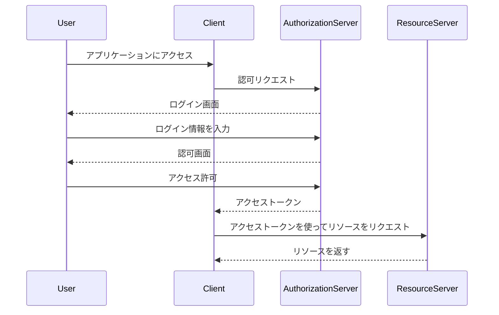
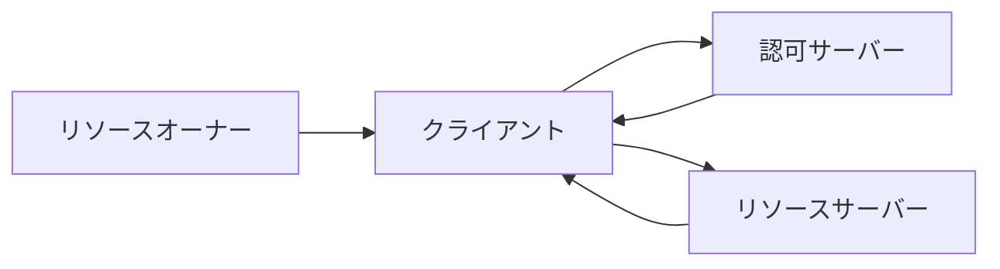
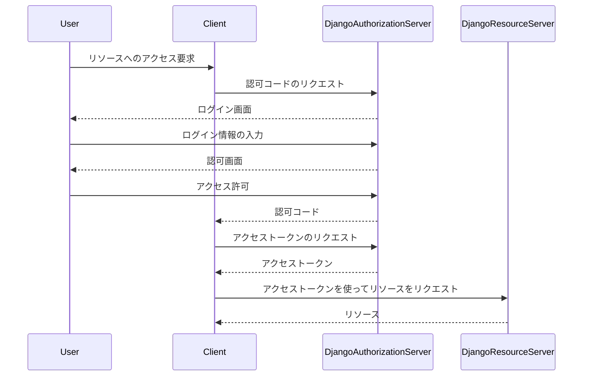
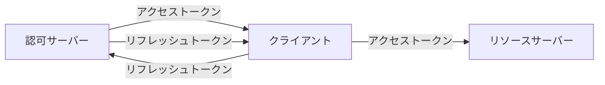
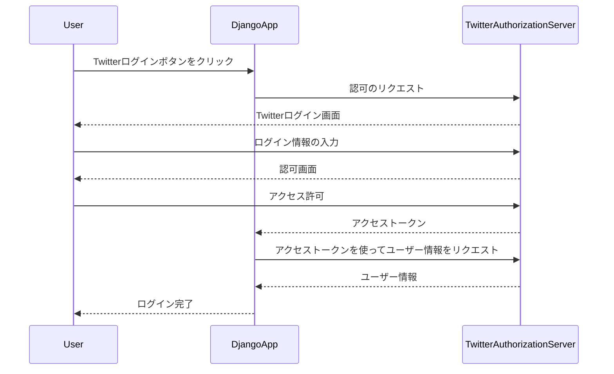

## 1. はじめに

OAuth2は、現代のウェブやモバイルアプリケーションにおいて、安全で効率的な認可を実現するためのプロトコルです。OAuth2を使用することで、ユーザーは自分のアカウント情報を直接アプリケーションに渡すことなく、アプリケーションにリソースへのアクセスを許可することができます。

この記事では、OAuth2の基本概念から実際の使用例まで、初心者の方にもわかりやすく解説していきます。記事を読み進めることで、OAuth2の仕組みを理解し、自分のアプリケーションにOAuth2を導入する方法がわかるようになります。

OAuth2の認可フローを図示すると以下のようになります。



この図は、OAuth2の基本的な認可フローを表しています。ユーザーがアプリケーションにアクセスすると、アプリケーション（クライアント）は認可サーバーに認可リクエストを送信します。認可サーバーはユーザーにログイン画面を表示し、ユーザーがログイン情報を入力すると、認可画面が表示されます。ユーザーがアクセスを許可すると、認可サーバーはアプリケーションにアクセストークンを発行します。アプリケーションはこのアクセストークンを使用して、リソースサーバーからユーザーのリソースを取得します。

次の章では、OAuth2の概要と、OAuth2を使用するメリットについて詳しく説明します。

## 2. OAuth2の概要

OAuth2は、認可を管理するためのオープンスタンダードプロトコルです。OAuth2を使用することで、アプリケーションはユーザーに代わってリソースにアクセスすることができます。これにより、ユーザーはアプリケーションにパスワードを直接渡すことなく、リソースへのアクセスを許可することができます。

OAuth2の主な役割は以下の通りです。

1. ユーザーの認証情報を保護する
2. アプリケーションにリソースへの限定的なアクセスを許可する
3. ユーザーがアクセス許可を取り消せるようにする

OAuth2を使用するメリットは以下の通りです。

1. セキュリティの向上
   - ユーザーの認証情報がアプリケーションに直接渡されないため、情報漏洩のリスクが減ります。
2. ユーザーエクスペリエンスの向上
   - ユーザーは、複数のアプリケーションで同じ認証情報を使い回すことができます。
3. アプリケーション開発の簡素化
   - OAuth2を使用することで、開発者は認証・認可の仕組みを一から実装する必要がなくなります。

以下は、OAuth2を使用してTwitterログインを実装するPythonコードの例です。

```python
from django.shortcuts import redirect
from requests_oauthlib import OAuth1Session

# Twitter APIの認証情報
consumer_key = "your_consumer_key"
consumer_secret = "your_consumer_secret"
callback_url = "http://localhost:8000/callback"

def twitter_login(request):
    oauth = OAuth1Session(consumer_key, client_secret=consumer_secret, callback_uri=callback_url)
    url = "https://api.twitter.com/oauth/request_token"
    response = oauth.fetch_request_token(url)
    authorization_url = "https://api.twitter.com/oauth/authorize"
    return redirect(oauth.authorization_url(authorization_url))

def callback(request):
    oauth = OAuth1Session(consumer_key, client_secret=consumer_secret, callback_uri=callback_url)
    oauth_token = request.GET.get("oauth_token")
    oauth_verifier = request.GET.get("oauth_verifier")
    access_token_url = "https://api.twitter.com/oauth/access_token"
    oauth = OAuth1Session(consumer_key, client_secret=consumer_secret,
                          resource_owner_key=oauth_token, resource_owner_secret=oauth_verifier)
    oauth_tokens = oauth.fetch_access_token(access_token_url)
    return f"Access token: {oauth_tokens['oauth_token']}"
```

このコードは、DjangoとRequests-OAuthlibを使用してTwitterログインを実装しています。`/twitter_login`エンドポイントにアクセスすると、Twitterの認可URLにリダイレクトされます。ユーザーがTwitterで認証を完了すると、`/callback`エンドポイントで認証情報を取得し、アクセストークンを表示します。

次の章では、OAuth2の基本用語について説明します。

## 3. OAuth2の基本用語

OAuth2を理解するためには、以下の基本用語を知っておく必要があります。

1. クライアント（アプリケーション）
   - ユーザーに代わってリソースにアクセスするアプリケーションやウェブサービスのことを指します。
2. リソースオーナー（ユーザー）
   - 保護されたリソースを所有するユーザーのことを指します。
3. リソースサーバー（APIサーバー）
   - 保護されたリソースを提供するサーバーのことを指します。
4. 認可サーバー
   - クライアントがリソースにアクセスする権限を付与するサーバーのことを指します。

これらの用語の関係性を図示すると以下のようになります。



この図では、リソースオーナーがクライアントにリソースへのアクセスを許可し、クライアントが認可サーバーから認可を取得します。その後、クライアントはリソースサーバーにアクセスしてリソースを取得します。

以下は、DjangoでOAuth2の認可サーバーを実装するサンプルコードです。

```python
from django.shortcuts import redirect
from django.http import JsonResponse
from django.views.decorators.csrf import csrf_exempt
from oauth2_provider.views.base import TokenView
from oauth2_provider.models import Application

class CustomTokenView(TokenView):
    @csrf_exempt
    def post(self, request, *args, **kwargs):
        return super().post(request, *args, **kwargs)

def authorize(request):
    if request.method == "GET":
        client_id = request.GET.get("client_id")
        redirect_uri = request.GET.get("redirect_uri")
        response_type = request.GET.get("response_type")
        try:
            application = Application.objects.get(client_id=client_id)
            if application.redirect_uris != redirect_uri:
                return JsonResponse({"error": "Invalid redirect URI"}, status=400)
            if response_type != "code":
                return JsonResponse({"error": "Invalid response type"}, status=400)
            return redirect(f"/oauth/authorize/?client_id={client_id}&redirect_uri={redirect_uri}&response_type={response_type}")
        except Application.DoesNotExist:
            return JsonResponse({"error": "Invalid client"}, status=400)
    elif request.method == "POST":
        client_id = request.POST.get("client_id")
        redirect_uri = request.POST.get("redirect_uri")
        grant_type = request.POST.get("grant_type")
        code = request.POST.get("code")
        if grant_type != "authorization_code":
            return JsonResponse({"error": "Invalid grant type"}, status=400)
        try:
            application = Application.objects.get(client_id=client_id)
            if application.redirect_uris != redirect_uri:
                return JsonResponse({"error": "Invalid redirect URI"}, status=400)
            if not code:
                return JsonResponse({"error": "Invalid code"}, status=400)
            token_view = CustomTokenView()
            return token_view.post(request, *args, **kwargs)
        except Application.DoesNotExist:
            return JsonResponse({"error": "Invalid client"}, status=400)
```

このコードでは、Djangoの`oauth2_provider`パッケージを使用して認可サーバーを実装しています。`authorize`ビューでは、クライアントからの認可リクエストを処理し、適切なリダイレクトを行います。`CustomTokenView`クラスは、アクセストークンを発行するためのビューです。

次の章では、OAuth2の認可フローについて詳しく説明します。

## 4. OAuth2の認可フロー

OAuth2には、以下の4つの認可フローがあります。

1. 認可コードグラント
   - ウェブアプリケーションに適した認可フローです。クライアントは、認可サーバーからの認可コードを取得し、それを使ってアクセストークンを取得します。
2. 暗黙的グラント
   - JavaScriptなどのブラウザベースのアプリケーションに適した認可フローです。クライアントは、認可サーバーから直接アクセストークンを取得します。
3. リソースオーナーパスワードクレデンシャルグラント
   - クライアントがユーザーのクレデンシャルを直接受け取る認可フローです。ユーザーがクライアントを信頼している場合にのみ使用されます。
4. クライアントクレデンシャルグラント
   - クライアントがリソースサーバーに直接アクセスする認可フローです。ユーザーの関与は必要ありません。

以下は、Djangoで認可コードグラントを実装するサンプルコードです。

```python
# settings.py
INSTALLED_APPS = [
    ...
    'oauth2_provider',
]

# urls.py
from django.urls import path, include

urlpatterns = [
    ...
    path('oauth/', include('oauth2_provider.urls', namespace='oauth2_provider')),
]

# views.py
from oauth2_provider.views.generic import ProtectedResourceView
from oauth2_provider.decorators import protected_resource

class ApiArticlesView(ProtectedResourceView):
    def get(self, request, *args, **kwargs):
        articles = Article.objects.all()
        data = [{'id': article.id, 'title': article.title} for article in articles]
        return JsonResponse(data, safe=False)

@protected_resource()
def api_articles(request):
    articles = Article.objects.all()
    data = [{'id': article.id, 'title': article.title} for article in articles]
    return JsonResponse(data, safe=False)
```

このコードでは、`oauth2_provider`というDjangoアプリケーションを使用して認可サーバーを実装しています。`settings.py`の`INSTALLED_APPS`に`oauth2_provider`を追加し、`urls.py`で認可サーバーのURLを設定します。

`views.py`では、`ProtectedResourceView`を継承した`ApiArticlesView`クラスを定義し、`get`メソッドでリソースを返します。また、`@protected_resource`デコレーターを使用して、`api_articles`ビューを保護されたリソースとして定義することもできます。

以下は、Djangoでの認可コードグラントのフロー図です。



この図では、Djangoでの認可コードグラントのフローを示しています。ユーザーがクライアントからリソースへのアクセスを要求すると、クライアントはDjangoの認可サーバーに認可コードをリクエストします。認可サーバーはユーザーにログイン画面と認可画面を表示し、ユーザーがアクセスを許可すると、認可サーバーはクライアントに認可コードを発行します。クライアントは認可コードを使ってアクセストークンをリクエストし、取得したアクセストークンを使ってDjangoのリソースサーバーにアクセスします。

次の章では、アクセストークンとリフレッシュトークンについて説明します。

## 5. アクセストークンとリフレッシュトークン

OAuth2では、アクセストークンとリフレッシュトークンという2種類のトークンが使用されます。

### アクセストークン

- アクセストークンは、クライアントがリソースサーバーにアクセスするために使用するトークンです。
- アクセストークンには有効期限があり、通常は短時間に設定されます。
- アクセストークンは、クライアントがリソースサーバーに送信するリクエストに含められます。

以下は、Djangoでアクセストークンを使用してリソースサーバーにアクセスするサンプルコードです。

```python
import requests

def get_protected_resource(access_token):
    headers = {
        'Authorization': f'Bearer {access_token}',
    }
    response = requests.get('http://localhost:8000/api/articles/', headers=headers)
    if response.status_code == 200:
        return response.json()
    else:
        return None
```

### リフレッシュトークン

- リフレッシュトークンは、アクセストークンの有効期限が切れた後に、新しいアクセストークンを取得するために使用されます。
- リフレッシュトークンの有効期限は、アクセストークンよりも長く設定されます。
- リフレッシュトークンを使用することで、ユーザーが再度認証を行わなくても、新しいアクセストークンを取得できます。

以下は、Djangoでリフレッシュトークンを使用して新しいアクセストークンを取得するサンプルコードです。

```python
from django.urls import reverse
from oauth2_provider.models import RefreshToken

def refresh_access_token(refresh_token):
    try:
        rt = RefreshToken.objects.get(token=refresh_token)
        client_id = rt.application.client_id
        client_secret = rt.application.client_secret
        data = {
            'grant_type': 'refresh_token',
            'refresh_token': refresh_token,
            'client_id': client_id,
            'client_secret': client_secret,
        }
        url = reverse('oauth2_provider:token')
        response = requests.post(url, data=data)
        if response.status_code == 200:
            return response.json()['access_token']
        else:
            return None
    except RefreshToken.DoesNotExist:
        return None
```

このコードでは、`RefreshToken`モデルを使用してリフレッシュトークンを取得し、`oauth2_provider`の`token`エンドポイントに`POST`リクエストを送信して新しいアクセストークンを取得しています。

以下は、アクセストークンとリフレッシュトークンの関係を示す図です。



この図では、認可サーバーがクライアントにアクセストークンとリフレッシュトークンを発行し、クライアントがアクセストークンを使用してリソースサーバーにアクセスしています。アクセストークンの有効期限が切れた場合、クライアントはリフレッシュトークンを使用して認可サーバーから新しいアクセストークンを取得します。

次の章では、OAuth2の実装例について説明します。

## 6. ユースケース1：Twitterログイン

OAuth2を使用したTwitterログインは、ウェブアプリケーションやモバイルアプリケーションでよく見られるユースケースの1つです。ユーザーは自分のTwitterアカウントを使用してアプリケーションにログインすることができ、アプリケーションはユーザーのTwitterデータにアクセスすることができます。

以下は、DjangoでTwitterログインを実装する手順です。

1. Twitterアプリケーションの作成
   - Twitter Developerサイトでアプリケーションを作成し、Consumer KeyとConsumer Secretを取得します。
2. Djangoプロジェクトの設定

   - `settings.py`に以下の設定を追加します。

     ```python
     INSTALLED_APPS = [
         ...
         'social_django',
     ]

     AUTHENTICATION_BACKENDS = [
         'social_core.backends.twitter.TwitterOAuth',
         'django.contrib.auth.backends.ModelBackend',
     ]

     SOCIAL_AUTH_TWITTER_KEY = 'your_consumer_key'
     SOCIAL_AUTH_TWITTER_SECRET = 'your_consumer_secret'
     ```

3. URLの設定

   - `urls.py`に以下のURLパターンを追加します。

     ```python
     from django.urls import path, include

     urlpatterns = [
         ...
         path('social-auth/', include('social_django.urls', namespace='social')),
     ]
     ```

4. ログインビューの作成

   - ログインビューを作成し、ログインボタンを表示します。

     ```python
     from django.shortcuts import render

     def login(request):
         return render(request, 'login.html')
     ```

5. ログインテンプレートの作成

   - `login.html`テンプレートを作成し、Twitterログインボタンを追加します。

     ```html
     <a href="">Login with Twitter</a>
     ```

6. コールバックビューの作成

   - ログイン後のコールバックビューを作成します。

     ```python
     from django.contrib.auth import login
     from social_django.models import UserSocialAuth

     def callback(request):
         user = request.user
         social_user = UserSocialAuth.objects.get(user=user, provider='twitter')
         access_token = social_user.extra_data['access_token']['oauth_token']
         access_token_secret = social_user.extra_data['access_token']['oauth_token_secret']
         # ここでアクセストークンを使用してTwitter APIにアクセスできます
         return render(request, 'callback.html')
     ```

以下は、Twitterログインのフロー図です。



この図では、ユーザーがDjangoアプリケーションのTwitterログインボタンをクリックすると、アプリケーションはTwitterの認可サーバーに認可をリクエストします。ユーザーはTwitterにログインし、アプリケーションへのアクセスを許可します。Twitterは、アプリケーションにアクセストークンを発行し、アプリケーションはそのトークンを使用してユーザー情報を取得します。最後に、ユーザーはDjangoアプリケーションにログインします。

## 7. OAuth2のセキュリティ考慮事項

OAuth2を使用する際は、セキュリティに十分な注意を払う必要があります。以下は、OAuth2のセキュリティを確保するために考慮すべき点です。

### クライアントの登録と認証

- クライアントの登録プロセスを適切に管理し、信頼できるクライアントのみを登録するようにします。
- クライアントの認証情報（クライアントIDとクライアントシークレット）は、安全に保管し、漏洩しないようにします。
- クライアントシークレットは定期的に更新することを検討します。

### アクセストークンの管理

- アクセストークンの有効期限を適切に設定し、長期間有効なトークンは避けるようにします。
- アクセストークンは安全に保管し、漏洩しないようにします。
- 不要になったアクセストークンは速やかに無効化するようにします。

### リダイレクトURIの検証

- クライアントの登録時に、有効なリダイレクトURIを指定するようにします。
- 認可サーバーは、クライアントから受け取ったリダイレクトURIが、登録されたものと一致することを検証します。
- リダイレクトURIのホワイトリストを使用することを検討します。

### 認可コードの管理

- 認可コードの有効期限を短く設定し、一度使用された認可コードは無効化するようにします。
- 認可コードは安全に保管し、漏洩しないようにします。

### state パラメータの使用

- CSRF攻撃を防ぐために、認可リクエスト時に state パラメータを使用することを推奨します。
- state パラメータには、予測困難な一意の値を使用します。

### scope の管理

- クライアントに付与する権限（scope）は、必要最小限に留めるようにします。
- ユーザーに権限の内容を明確に示し、同意を得るようにします。

### SSL/TLSの使用

- 認可サーバーとリソースサーバーとの通信は、SSL/TLSを使用して暗号化するようにします。
- クライアントとの通信も、可能な限りSSL/TLSを使用するようにします。

以下は、Djangoでアクセストークンの有効期限を設定する例です。

```python
# settings.py
OAUTH2_PROVIDER = {
    'ACCESS_TOKEN_EXPIRE_SECONDS': 3600,  # 1時間
    'REFRESH_TOKEN_EXPIRE_SECONDS': 86400,  # 1日
}
```

これらの例は、OAuth2のセキュリティを向上させるための一部の方法を示しています。実際のアプリケーションでは、要件に応じてさらなるセキュリティ対策が必要になる場合があります。

次の章では、OAuth2のまとめと注意点について説明します。

## 8. まとめ

この記事では、OAuth2の基本概念から実装例、セキュリティ考慮事項までを詳しく説明してきました。OAuth2は、現代のウェブアプリケーションやモバイルアプリケーションにおける認可の標準プロトコルであり、ユーザーの認証情報を安全に取り扱うために重要な役割を果たしています。

### OAuth2の重要ポイント

- OAuth2は、ユーザーの認証情報を直接扱わずに、アプリケーションにリソースへのアクセス権限を付与するためのプロトコルです。
- OAuth2には、認可コードグラント、暗黙的グラント、リソースオーナーパスワードクレデンシャルグラント、クライアントクレデンシャルグラントの4つの認可フローがあります。
- アクセストークンとリフレッシュトークンを使用して、リソースへのアクセスを制御します。
- OAuth2を使用することで、ユーザーエクスペリエンスの向上とアプリケーション開発の簡素化が図れます。

### OAuth2を使用する際の注意点

- クライアントの登録と認証を適切に管理し、クライアントの認証情報を安全に保管する必要があります。
- アクセストークンの有効期限を適切に設定し、不要になったトークンは速やかに無効化する必要があります。
- リダイレクトURIの検証を適切に行い、CSRF攻撃を防ぐためにstateパラメータを使用する必要があります。
- 認可サーバーとリソースサーバー間の通信は、SSL/TLSを使用して暗号化する必要があります。
- クライアントに付与する権限（scope）は、必要最小限に留めるようにします。

OAuth2を正しく理解し、適切に実装することで、アプリケーションのセキュリティを向上させ、ユーザーの信頼を獲得することができます。また、OAuth2を使用することで、外部のサービスと連携したアプリケーションを開発することが容易になります。

ただし、OAuth2を使用する際は、セキュリティ考慮事項に十分に注意を払う必要があります。クライアントの管理、トークンの管理、リダイレクトURIの検証など、適切なセキュリティ対策を講じることが重要です。

この記事が、OAuth2の理解と実装に役立つことを願っています。OAuth2に関する より詳細な情報は、以下の参考資料を参照してください。

### 参考資料

- [RFC 6749: The OAuth 2.0 Authorization Framework](https://tools.ietf.org/html/rfc6749)
- [OAuth 2.0 Simplified](https://aaronparecki.com/oauth-2-simplified/)
- [OAuth 2.0 Servers](https://www.oauth.com/)
- [OAuth 2.0 Playground](https://www.oauth.com/playground/)

OAuth2を適切に使用して、安全で使いやすいアプリケーションを開発してください。
