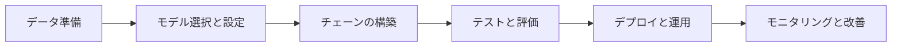
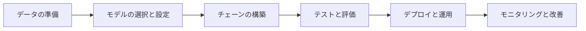
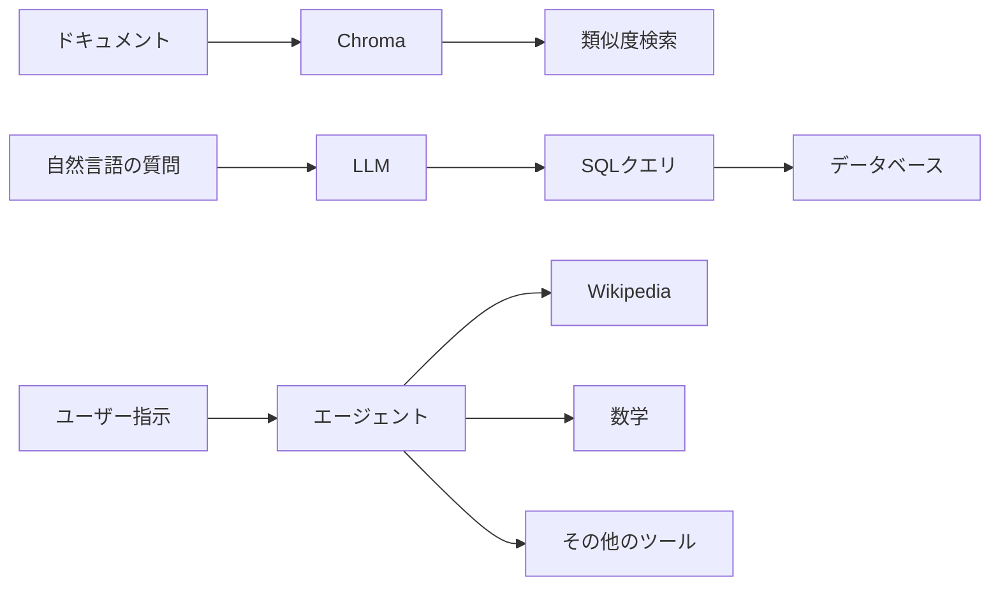
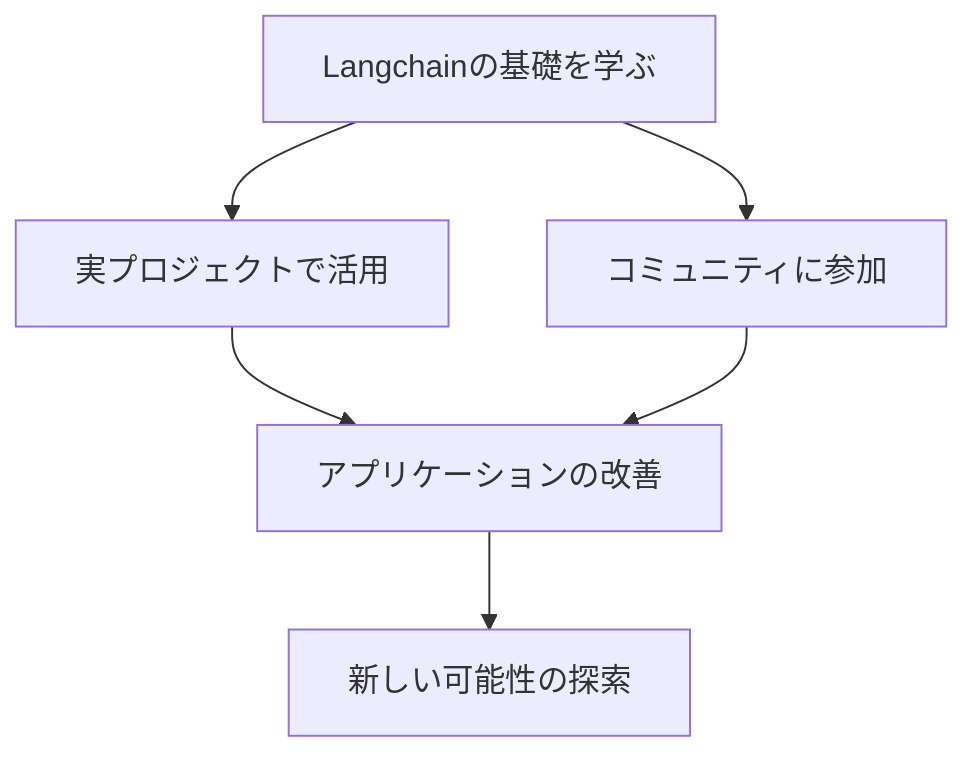

## 1. Langchain概要

Langchainは、OpenAIやAnthropicなどが提供する大規模言語モデル（LLM）を活用してAIアプリケーションを開発するためのPythonライブラリです。自然言語処理、知識ベース構築、会話システムなど、さまざまな分野でLangchainが使われています。

Langchainが提供する主な機能は以下の通りです:

1. LLMとのインターフェース: OpenAIのAPIを通じてGPT-3やGPT-4などの言語モデルを簡単に利用できます。
2. データローダーとテキスト処理: ドキュメントローダーを使ってテキストデータを読み込み、テキストスプリッターでチャンクに分割できます。
3. ベクトル化とデータベース: エンベッディングを使ってテキストデータをベクトル化し、Chromaなどのベクトルストアに保存して高速に検索できます。
4. 対話型AIの構築: チェーンを使って複数の処理ステップを連結し、ユーザー入力に応答する対話型のAIアプリを作れます。

Langchainを使うメリットは、従来のルールベースのアプローチと比べて柔軟で高度な自然言語処理が実現できることです。また、最先端のLLMを活用できるため、少ないコーディング量で強力なAIアプリが開発できます。

以下の図は、Langchainを使ったAIアプリ開発の全体像を示しています。



各フェーズの詳細は後の章で説明しますが、この図からLangchainアプリ開発の大まかな流れを掴むことができます。

次の章では、Langchainの重要な用語について、より詳しく見ていきましょう。

## 2. Langchainの重要用語

### 2.1 ドキュメントローダー

ドキュメントローダーは、テキストデータ、PDFファイル、Webページなどのデータをロードして前処理するコンポーネントです。Langchainは、TextLoader、PDFLoader、WebBaseLoaderなど、様々なタイプのローダーを提供しています。

例えば、TextLoaderを使ってテキストファイルを読み込む場合は、以下のように実装します。

```python
from langchain.document_loaders import TextLoader

loader = TextLoader('example.txt')
documents = loader.load()
```

TextLoaderのコンストラクタにファイルパスを渡すことで、テキストファイルを読み込むことができます。load()メソッドを呼び出すと、読み込んだテキストデータがドキュメントのリストとして返されます。

PDFLoaderやWebBaseLoaderも同様に、PDFファイルやWebページのURLを指定することで、それぞれのデータを読み込むことができます。

### 2.2 テキストスプリッター

テキストスプリッターは、ロードしたドキュメントを小さなチャンク（断片）に分割するコンポーネントです。これにより、LLMの入力サイズ制限に合わせてテキストを処理できます。Langchainは、CharacterTextSplitter、RecursiveCharacterTextSplitterなどのスプリッターを提供しています。

例えば、CharacterTextSplitterを使ってドキュメントを分割する場合は、以下のように実装します。

```python
from langchain.text_splitter import CharacterTextSplitter

text_splitter = CharacterTextSplitter(chunk_size=1000, chunk_overlap=0)
texts = text_splitter.split_documents(documents)
```

CharacterTextSplitterのコンストラクタでは、chunk_sizeパラメータでチャンクの最大サイズを指定し、chunk_overlapパラメータでチャンク間のオーバーラップ（重複）の長さを指定します。split_documents()メソッドにドキュメントのリストを渡すと、指定したサイズでドキュメントが分割され、チャンクのリストが返されます。

RecursiveCharacterTextSplitterは、ドキュメントを再帰的に分割するスプリッターで、より細かい制御が可能です。

### 2.3 エンベディング

エンベディングは、テキストデータを数値ベクトルに変換する技術です。これにより、テキストの意味的な類似性を計算できます。LangchainはOpenAIやHuggingFaceなどの言語モデルを利用してエンベディングを生成できます。

例えば、OpenAIのAPIを使ってエンベディングを生成する場合は、以下のように実装します。

```python
from langchain.embeddings import OpenAIEmbeddings

embeddings = OpenAIEmbeddings()
text_embeddings = embeddings.embed_documents(texts)
```

OpenAIEmbeddingsのインスタンスを作成し、embed_documents()メソッドにテキストのリストを渡すことで、各テキストに対応するエンベディングベクトルのリストが返されます。

### 2.4 ベクトルストア

ベクトルストアは、エンベッディングを保存し、高速に類似度検索を行うためのデータベースです。Langchainは、Chroma、FAISS、Pineconeなど、様々なベクトルストアに対応しています。

例えば、Chromaを使ってエンベッディングを保存する場合は、以下のように実装します。

```python
from langchain.vectorstores import Chroma

db = Chroma.from_documents(texts, embeddings)
```

Chromaクラスのfrom_documents()メソッドに、テキストのリストとエンベッディングのインスタンスを渡すことで、テキストとそのエンベッディングがChromaデータベースに保存されます。

### 2.5 リトリーバー

リトリーバーは、ユーザーからの問い合わせに関連するドキュメントをベクトルストアから検索・取得するコンポーネントです。Langchainは、TF-IDFやBM25などの従来の検索アルゴリズムに加え、エンベッディングを利用した類似度検索もサポートしています。

例えば、Chromaベクトルストアを使って類似ドキュメントを検索する場合は、以下のように実装します。

```python
query = "What is the capital of France?"
docs = db.similarity_search(query)
```

similarity_search()メソッドに検索クエリを渡すことで、クエリに類似するドキュメントのリストが返されます。

### 2.6 プロンプトテンプレート

プロンプトテンプレートは、LLMへの指示（プロンプト）を効率的に構造化するための仕組みです。テンプレートにパラメータを埋め込むことで、動的にプロンプトを生成できます。これにより、LLMの出力品質を向上させつつ、コードの可読性と保守性を高められます。

例えば、以下のようなプロンプトテンプレートを定義できます。

```python
from langchain import PromptTemplate

template = """
Given the following extracted parts of a long document and a question, create a final answer with references ("SOURCES").

QUESTION: {question}
=========
{summaries}
=========
FINAL ANSWER:
"""

PROMPT = PromptTemplate(template=template, input_variables=["summaries", "question"])
```

プロンプトテンプレートは、テンプレート文字列とテンプレートパラメータ（input_variables）を指定して作成します。テンプレート文字列内の"question"や"summaries"は、実際の値に置き換えられます。

### 2.7 LLM（大規模言語モデル）

LLMは、GPT-3、GPT-4、ChatGPTなどの大規模な言語モデルを指します。これらのモデルは、大量のテキストデータを学習することで、高度な自然言語処理タスクを実行できます。Langchainは、OpenAIやAnthropicなどのLLMプロバイダーと連携し、これらのモデルを簡単に利用できるインターフェースを提供しています。

例えば、OpenAIのGPT-3.5モデルを使ってプロンプトに回答する場合は、以下のように実装します。

```python
from langchain.llms import OpenAI

llm = OpenAI(model_name="text-davinci-002")
final_answer = llm(PROMPT.format(summaries=docs, question=query))
```

OpenAIクラスのインスタンスを作成し、model_nameパラメータでモデルの名前を指定します。インスタンスを呼び出し可能オブジェクトとして使用し、プロンプトテンプレートにパラメータを渡すことで、LLMによる回答が生成されます。

### 2.8 チェーン

チェーンは、複数のコンポーネントを連結して高度なタスクを実行する仕組みです。例えば、ドキュメントを読み込み、関連する部分を抽出し、それらを要約して質問に回答するといった一連の処理をチェーンとして定義できます。Langchainは、シーケンシャルチェーン、MapReduceチェーンなど、様々なチェーンのパターンを提供しています。

例えば、ドキュメント検索と質問応答を行うチェーンは、以下のように実装できます。

```python
from langchain.chains import RetrievalQA

qa_chain = RetrievalQA.from_chain_type(
    llm=OpenAI(), chain_type="stuff", retriever=db.as_retriever()
)
result = qa_chain(query)
print(result["result"])
```

RetrievalQAクラスのfrom_chain_type()メソッドを使って、チェーンを作成します。llmパラメータにLLMのインスタンス、chain_typeパラメータにチェーンのタイプ、retrieverパラメータにリトリーバーを指定します。作成したチェーンインスタンスを呼び出し可能オブジェクトとして使用し、質問を渡すことで、回答が生成されます。

これらの重要な概念を理解することで、Langchainを使ったAIアプリケーション開発の基礎が身につきます。次の章では、これらの概念を組み合わせて、実際にLangchainアプリを開発する方法を見ていきます。

## 3. Langchainアプリのライフサイクル

この章では、Langchainを使ってAIアプリケーションを開発する一連の流れを見ていきます。以下の図は、Langchainアプリの典型的なライフサイクルを表しています。



### 3.1 データの準備

AIアプリ開発の第一歩は、必要なデータを集めて前処理することです。Langchainでは、ドキュメントローダーを使ってテキストデータを読み込みます。

例えば、PDFファイルを読み込む場合は、以下のように実装します。

```python
from langchain.document_loaders import PyPDFLoader

loader = PyPDFLoader("example.pdf")
pages = loader.load_and_split()
```

PyPDFLoaderを使ってPDFファイルを読み込み、load_and_split()メソッドでページごとにドキュメントに分割します。

### 3.2 モデルの選択と設定

次に、タスクに適したLLMとエンベッディングモデルを選択します。Langchainは、OpenAIやHuggingFaceなど、様々なモデルプロバイダーをサポートしています。

例えば、OpenAIのモデルを使う場合は、以下のように実装します。

```python
from langchain.embeddings import OpenAIEmbeddings
from langchain.llms import OpenAI

embeddings = OpenAIEmbeddings()
llm = OpenAI(model_name="text-davinci-002")
```

OpenAIEmbeddingsとOpenAIクラスを使って、エンベッディングモデルとLLMを設定します。

### 3.3 チェーンの構築

選択したモデルを組み合わせて、目的のタスクを実行するチェーンを構築します。

例えば、ドキュメント検索と質問応答のチェーンを構築する場合は、以下のように実装します。

```python
from langchain.chains import RetrievalQA

qa_chain = RetrievalQA.from_chain_type(
    llm=llm, chain_type="stuff", retriever=docsearch.as_retriever()
)
```

RetrievalQAクラスを使ってチェーンを作成し、LLM、チェーンのタイプ、リトリーバーを指定します。

### 3.4 テストと評価

構築したチェーンに対して、サンプル入力を与えて出力を確認します。必要に応じて、モデルのパラメータやチェーンの構成を調整します。

例えば、チェーンを実行してみる場合は、以下のように実装します。

```python
query = "What is the main topic of this document?"
result = qa_chain(query)
print(result["result"])
```

質問をチェーンに渡して実行し、結果を確認します。

### 3.5 デプロイと運用

チェーンが期待通りに動作することを確認したら、APIエンドポイントを作成してアプリケーションをデプロイします。Langchainは、FastAPIやFlaskなどの一般的なWebフレームワークと連携できます。

### 3.6 モニタリングと改善

デプロイしたアプリケーションのパフォーマンスを監視し、ユーザーフィードバックを収集します。必要に応じて、モデルやチェーンを更新・改善します。

以上が、Langchainアプリの典型的な開発フローです。

次の章では、より実践的な例を見ていきましょう。

## 4. Langchainの応用例

### 4.1 ChromaベクトルストアとOpenAIを使った知識ベース検索

Chromaベクトルストアとエンベッディングを使うと、大量のドキュメントから関連する情報を高速に検索できます。

```python
from langchain.embeddings import OpenAIEmbeddings
from langchain.vectorstores import Chroma

embeddings = OpenAIEmbeddings()
db = Chroma.from_documents(docs, embeddings)

query = "What are the main benefits of using Langchain?"
docs = db.similarity_search(query)
```

OpenAIのエンベッディングモデルを使ってドキュメントをベクトル化し、Chromaデータベースに保存します。その後、similarity_search()メソッドを使って類似度検索を行います。

### 4.2 LLMを使った自然言語からのSQL生成

LLMを使って、自然言語の質問をSQLクエリに変換できます。これにより、ユーザーがデータベースに直接クエリを書かなくても、必要な情報を取得できるようになります。

```python
from langchain import OpenAI, SQLDatabase, SQLDatabaseChain

db = SQLDatabase.from_uri("sqlite:///example.db")
llm = OpenAI(temperature=0)

db_chain = SQLDatabaseChain(llm=llm, database=db)

query = "What is the average age of employees in the sales department?"
result = db_chain.run(query)
print(result)
```

SQLDatabaseクラスを使ってデータベースに接続し、SQLDatabaseChainを使って自然言語の質問をSQLクエリに変換します。

### 4.3 エージェントを使ったタスク実行の自動化

Langchainのエージェントを使うと、複雑なタスクを自動的に分解・実行できます。例えば、ユーザーからの指示を解釈し、必要なツールを選択して、結果をまとめるといった一連の処理をエージェントに任せられます。

```python
from langchain.agents import initialize_agent
from langchain.agents import load_tools
from langchain.llms import OpenAI

llm = OpenAI(temperature=0)
tools = load_tools(["wikipedia", "llm-math"], llm=llm)

agent = initialize_agent(
    tools, llm, agent="zero-shot-react-description", verbose=True
)

query = "What is the population of the capital city of the country where Langchain was created?"
result = agent.run(query)
print(result)
```

initialize_agent()関数を使ってエージェントを初期化し、Wikipedia検索や数学計算などのツールを読み込みます。その後、エージェントにタスクを与えて実行します。

これらの例からわかるように、Langchainを使えば、比較的少ないコード量で高度なAIアプリケーションを開発できます。

以下は、これらの応用例の関係を表した図です。



次の章では、Langchainを使ったAIアプリ開発のポイントと今後の可能性について考察します。

## 5. まとめと展望

### 5.1 Langchainの重要概念の復習

Langchainは、大規模言語モデル（LLM）を用いたAIアプリケーション開発を支援するPythonライブラリです。主要な概念は以下の通りです：

1. ドキュメントローダー：テキストデータの読み込みと前処理
2. テキストスプリッター：ドキュメントの分割
3. エンベッディング：テキストデータのベクトル化
4. ベクトルストア：エンベッディングの保存と検索
5. リトリーバー：関連ドキュメントの検索
6. プロンプトテンプレート：LLMへの指示の構造化
7. LLM：GPT-3などの大規模言語モデル
8. チェーン：複数のコンポーネントの連結によるタスク実行
9. エージェント：目的指向のタスク自動化

### 5.2 Langchainの可能性と展望

Langchainは、自然言語処理や知識ベースの構築、会話システムの開発など、幅広い分野で活用できます。特に、以下のようなユースケースで大きな可能性を秘めています：

1. 企業内の情報検索と知識共有
2. カスタマーサポートの自動化
3. データ分析とレポート生成
4. 教育とトレーニングのパーソナライズ化
5. 創作活動（文章生成、アイデア出しなど）の支援

今後、Langchainがさらに発展し、より多くのユーザーに利用されるようになると、AIアプリケーション開発の民主化が進むでしょう。また、Langchainと他のオープンソースプロジェクトとの連携も期待されます。

### 5.3 参考資料と次のステップ

- 公式ドキュメント: [https://python.langchain.com/](https://python.langchain.com/)
- GitHub リポジトリ: [https://github.com/hwchase17/langchain](https://github.com/hwchase17/langchain)
- Twitter アカウント: [@LangChainAI](https://twitter.com/LangChainAI)

Langchainの基本的な使い方を理解したら、実際のプロジェクトで活用してみることをおすすめします。また、コミュニティに参加して他の開発者と知見を共有することで、さらなるスキルアップが期待できます。



以上で、Python Langchain入門の記事は終了です。Langchainを使ったAIアプリケーション開発に興味を持っていただけたら幸いです。
