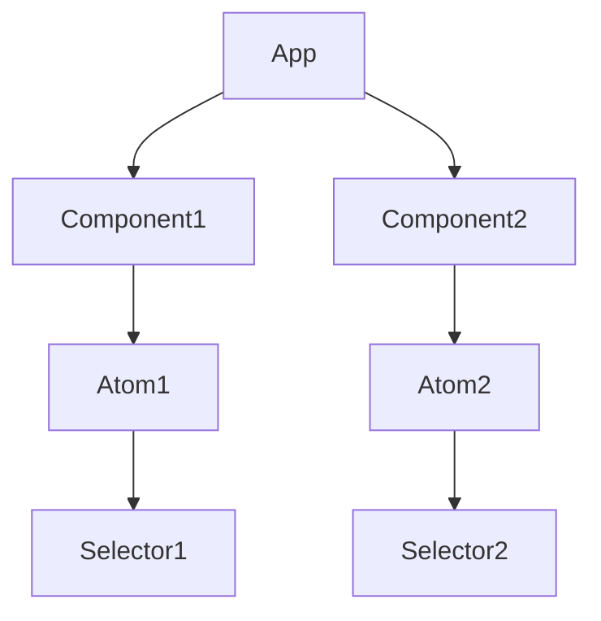
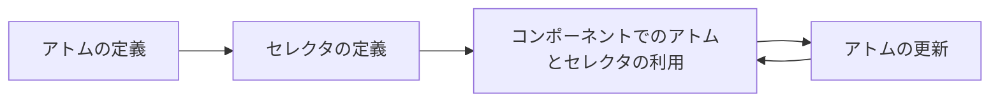
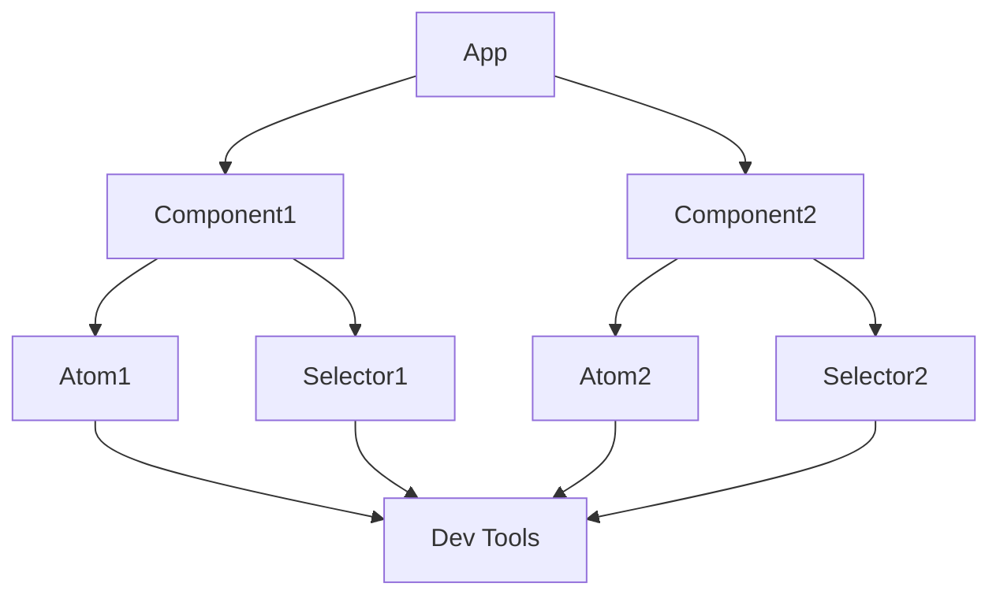

## Recoilとは

Recoilは、Facebookが開発したJavaScriptのステート管理ライブラリです。React向けに設計されており、グローバルなステート管理を簡単に行うことができます。

以下は、RecoilをReactプロジェクトにインストールするためのコマンドです。

```bash
npm install recoil
```

Recoilを使うことで、以下のような利点があります。

- コンポーネント間でステートを共有できる
- ステートの更新が簡単
- 非同期データの扱いが容易

## Recoilの特徴

### コンポーネント指向のステート管理

Recoilは、コンポーネント指向のステート管理を提供します。これにより、コンポーネントごとにステートを管理することができ、コードの可読性と保守性が向上します。

以下は、Recoilを使ったコンポーネント指向のステート管理を表すMermaid図です。



### 非同期データの扱いが容易

Recoilでは、非同期データの扱いが容易です。`selector`を使うことで、非同期データを簡単に管理することができます。

以下は、非同期データを取得するためのセレクタの例です。

```javascript
const userSelector = selector({
  key: "userSelector",
  get: async () => {
    const response = await fetch("https://api.example.com/user");
    return response.json();
  },
});
```

### 状態の永続化が可能

Recoilでは、`persistence`を使うことで状態の永続化が可能です。これにより、アプリケーションを再読み込みしても、ステートを保持することができます。

### デバッグツールが充実

Recoilには、充実したデバッグツールが用意されています。Recoil Dev Toolsを使うことで、ステートの可視化やTime Travel Debuggingが可能です。

以上が、Recoilの概要です。次の章では、Recoilのライフサイクルについて解説します。

# Recoilのライフサイクル

Recoilのライフサイクルは、以下の4つのステップで構成されています。

1. アトムの定義
2. セレクタの定義
3. コンポーネントでのアトムとセレクタの利用
4. アトムの更新によるコンポーネントの再レンダリング

以下は、Recoilのライフサイクルを表すMermaid図です。



## アトムの定義

Recoilでは、`atom`関数を使ってアトムを定義します。アトムは、グローバルなステートを表します。

以下は、アトムを定義する例です。

```javascript
const countAtom = atom({
  key: "countAtom",
  default: 0,
});
```

この例では、`countAtom`という名前のアトムを定義しています。初期値は0です。

## セレクタの定義

Recoilでは、`selector`関数を使ってセレクタを定義します。セレクタは、アトムから派生したステートを表します。また、非同期データの取得にも使えます。

以下は、セレクタを定義する例です。

```javascript
const doubledCountSelector = selector({
  key: "doubledCountSelector",
  get: ({ get }) => {
    const count = get(countAtom);
    return count * 2;
  },
});
```

この例では、`doubledCountSelector`という名前のセレクタを定義しています。このセレクタは、`countAtom`の値を2倍にして返します。

## コンポーネントでのアトムとセレクタの利用

コンポーネントでは、`useRecoilState`フックを使ってアトムを読み書きします。また、`useRecoilValue`フックを使ってセレクタの値を取得します。

以下は、コンポーネントでアトムとセレクタを利用する例です。

```jsx
function Counter() {
  const [count, setCount] = useRecoilState(countAtom);
  const doubledCount = useRecoilValue(doubledCountSelector);

  return (
    <div>
      <p>Count: {count}</p>
      <p>Doubled Count: {doubledCount}</p>
      <button onClick={() => setCount(count + 1)}>Increment</button>
    </div>
  );
}
```

この例では、`countAtom`と`doubledCountSelector`を利用しています。`count`の値を表示し、ボタンをクリックすると`count`の値が増加します。また、`doubledCount`の値も表示されます。

## アトムの更新によるコンポーネントの再レンダリング

アトムの値が更新されると、そのアトムを利用しているコンポーネントが自動的に再レンダリングされます。これにより、ステートの変更がUIに反映されます。

以上が、Recoilのライフサイクルの解説です。次の章では、Recoilの具体的な利用方法について説明します。

# Recoilの利用方法

この章では、Recoilの具体的な利用方法について説明します。

## アトムの定義

Recoilでは、`atom`関数を使ってアトムを定義します。アトムはグローバルなステートを表します。

以下は、アトムを定義する例です。

```javascript
import { atom } from "recoil";

const todoListAtom = atom({
  key: "todoListAtom",
  default: [],
});
```

この例では、`todoListAtom`という名前のアトムを定義しています。初期値は空の配列です。

## セレクタの定義

Recoilでは、`selector`関数を使ってセレクタを定義します。セレクタはアトムから派生したステートを表します。また、非同期データの取得にも使えます。

以下は、セレクタを定義する例です。

```javascript
import { selector } from "recoil";

const todoListStatsSelector = selector({
  key: "todoListStatsSelector",
  get: ({ get }) => {
    const todoList = get(todoListAtom);
    const totalNum = todoList.length;
    const completedNum = todoList.filter((todo) => todo.completed).length;

    return {
      totalNum,
      completedNum,
      completedRatio: totalNum === 0 ? 0 : completedNum / totalNum,
    };
  },
});
```

この例では、`todoListStatsSelector`という名前のセレクタを定義しています。このセレクタは、`todoListAtom`から派生したデータを計算して返します。具体的には、TODOの総数、完了したTODOの数、完了率を返します。

## コンポーネントでのRecoilの利用

コンポーネントでは、`useRecoilState`フックを使ってアトムを読み書きします。また、`useRecoilValue`フックを使ってセレクタの値を取得します。`useSetRecoilState`フックを使ってアトムを更新することもできます。

以下は、コンポーネントでRecoilを利用する例です。

```jsx
import { useRecoilState, useRecoilValue } from "recoil";

function TodoList() {
  const [todoList, setTodoList] = useRecoilState(todoListAtom);
  const stats = useRecoilValue(todoListStatsSelector);

  const addTodo = () => {
    const newTodo = {
      id: Date.now(),
      text: "New Todo",
      completed: false,
    };
    setTodoList([...todoList, newTodo]);
  };

  return (
    <div>
      <ul>
        {todoList.map((todo) => (
          <li key={todo.id}>{todo.text}</li>
        ))}
      </ul>
      <button onClick={addTodo}>Add Todo</button>
      <p>Total: {stats.totalNum}</p>
      <p>Completed: {stats.completedNum}</p>
      <p>Ratio: {stats.completedRatio}</p>
    </div>
  );
}
```

この例では、`todoListAtom`と`todoListStatsSelector`を利用しています。TODOの一覧を表示し、「Add Todo」ボタンをクリックすると新しいTODOが追加されます。また、TODOの総数、完了したTODOの数、完了率も表示されます。

## デバッグツールの活用

Recoilには、優れたデバッグツールが用意されています。Recoil Dev Toolsを使うことで、ステートの可視化やTime Travel Debuggingが可能です。

Recoil Dev Toolsを使うことで、アプリケーションのステートの変化を確認しながらデバッグすることができます。

以上が、Recoilの利用方法の解説です。次の章では、Recoilのユースケースについて説明します。

# Recoilのユースケース

この章では、Recoilの具体的なユースケースについて説明します。

## グローバルなステート管理

Recoilは、アプリケーション全体で共有するデータの管理に適しています。例えば、ユーザー情報やテーマ設定などのグローバルなステートを管理することができます。

以下は、ユーザー情報を管理するためのアトムとセレクタの例です。

```javascript
const userAtom = atom({
  key: "userAtom",
  default: null,
});

const userNameSelector = selector({
  key: "userNameSelector",
  get: ({ get }) => {
    const user = get(userAtom);
    return user ? user.name : "";
  },
});
```

この例では、`userAtom`でユーザー情報を管理しています。`userNameSelector`は、`userAtom`からユーザー名を取得するセレクタです。

## 非同期データの扱い

Recoilは、非同期データの扱いにも適しています。`selector`を使うことで、APIからのデータ取得とキャッシュ管理を簡単に行うことができます。

以下は、APIからデータを取得するセレクタの例です。

```javascript
const postsSelector = selector({
  key: "postsSelector",
  get: async ({ get }) => {
    const response = await fetch("https://api.example.com/posts");
    return response.json();
  },
});
```

この例では、`postsSelector`がAPIからデータを取得しています。取得したデータはRecoilによってキャッシュされるため、再度セレクタが呼び出されても、APIリクエストは発生しません。

また、Recoilを使えば、ページネーションや無限スクロールの実装も容易です。

## 複雑な状態の管理

Recoilは、複雑な状態の管理にも適しています。例えば、フォームの入力値の管理や、複数のフィルター条件を持つリストの管理などが簡単に行えます。

以下は、フォームの入力値を管理するためのアトムとセレクタの例です。

```javascript
const formAtom = atom({
  key: "formAtom",
  default: {
    name: "",
    email: "",
    message: "",
  },
});

const isFormValidSelector = selector({
  key: "isFormValidSelector",
  get: ({ get }) => {
    const form = get(formAtom);
    return form.name !== "" && form.email !== "" && form.message !== "";
  },
});
```

この例では、`formAtom`でフォームの入力値を管理しています。`isFormValidSelector`は、`formAtom`の値を元にフォームの入力が有効かどうかを判定するセレクタです。

以下は、フォームの例です。

```jsx
function ContactForm() {
  const [form, setForm] = useRecoilState(formAtom);
  const isFormValid = useRecoilValue(isFormValidSelector);

  const handleSubmit = (event) => {
    event.preventDefault();
    console.log(form);
    // フォームの送信処理
  };

  return (
    <form onSubmit={handleSubmit}>
      <input
        type="text"
        value={form.name}
        onChange={(event) => setForm({ ...form, name: event.target.value })}
      />
      <input
        type="email"
        value={form.email}
        onChange={(event) => setForm({ ...form, email: event.target.value })}
      />
      <textarea
        value={form.message}
        onChange={(event) => setForm({ ...form, message: event.target.value })}
      />
      <button type="submit" disabled={!isFormValid}>
        Submit
      </button>
    </form>
  );
}
```

この例では、`formAtom`を使ってフォームの入力値を管理しています。また、`isFormValidSelector`を使って、フォームの入力が有効かどうかを判定し、送信ボタンの有効/無効を切り替えています。

以上が、Recoilのユースケースの解説です。Recoilは、グローバルなステート管理、非同期データの扱い、複雑な状態の管理など、様々なシーンで活用することができます。

# まとめ

この記事では、Recoilについて、以下のような内容を説明しました。

- Recoilの概要

  - Recoilは、Facebookが開発したJavaScriptのステート管理ライブラリで、React向けに設計されている
  - コンポーネント指向のステート管理、非同期データの扱い、状態の永続化、デバッグツールなどの特徴がある

- Recoilのライフサイクル

  - アトムの定義、セレクタの定義、コンポーネントでのアトムとセレクタの利用、アトムの更新によるコンポーネントの再レンダリングという4つのステップで構成される

- Recoilの利用方法

  - `atom`関数を使ってアトムを定義し、`selector`関数を使ってセレクタを定義する
  - コンポーネントでは、`useRecoilState`、`useRecoilValue`、`useSetRecoilState`などのフックを使ってアトムとセレクタを利用する
  - Recoil Dev Toolsを使ってデバッグを行うことができる

- Recoilのユースケース
  - グローバルなステート管理、非同期データの扱い、複雑な状態の管理など、様々なシーンで活用できる

以上のように、Recoilは強力なステート管理ライブラリで、React開発におけるステート管理の悩みを解決してくれます。コンポーネント指向で使いやすく、非同期データや複雑な状態の管理にも適しています。また、デバッグツールが充実しているので、開発しやすいのも大きな利点です。

Recoilを使いこなすことで、Reactアプリケーションのステート管理を効率的に行うことができるでしょう。ぜひ、Recoilを活用して、より良いReactアプリケーションを開発してください。

以下は、Recoilを使ったReactアプリケーションの全体像を表すフローチャートです。



この図では、アプリケーションが複数のコンポーネントで構成され、各コンポーネントがアトムとセレクタを利用しています。また、Recoil Dev Toolsを使ってデバッグを行っています。

Recoilを使ったReactアプリケーションの開発が、より楽しく、効率的なものになることを願っています。

## 参考資料

- [公式ドキュメント](https://recoiljs.org/)
