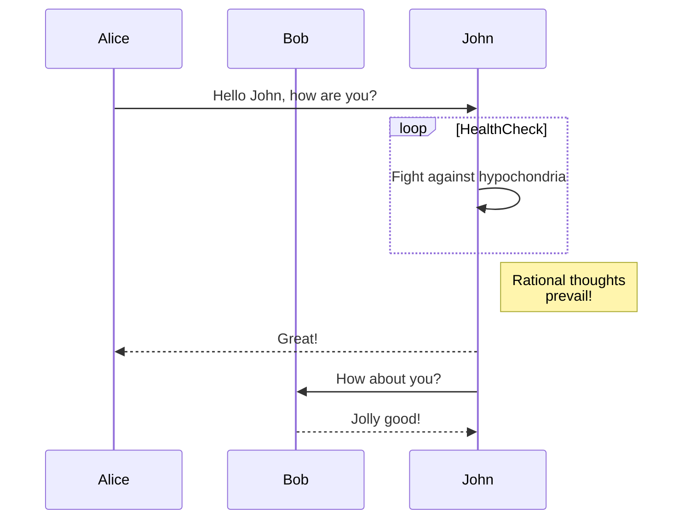
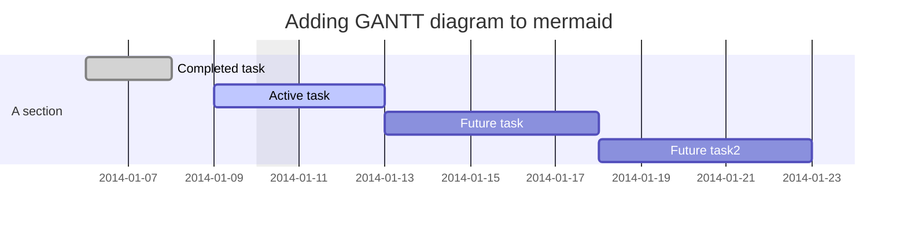
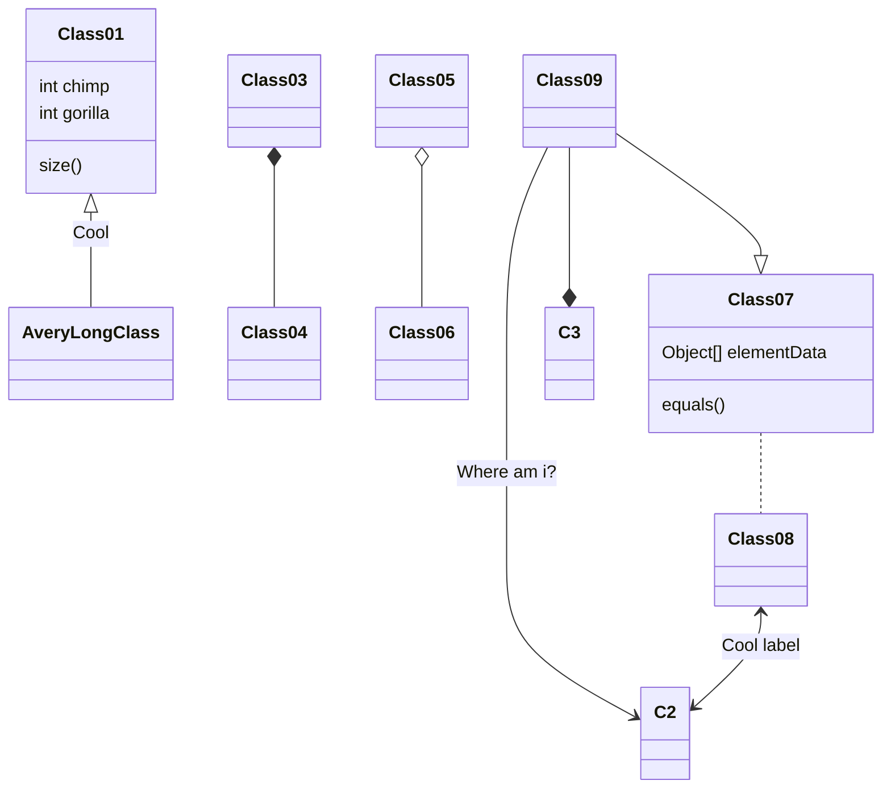
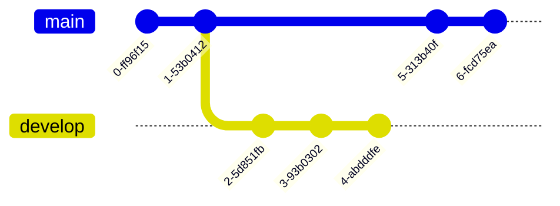
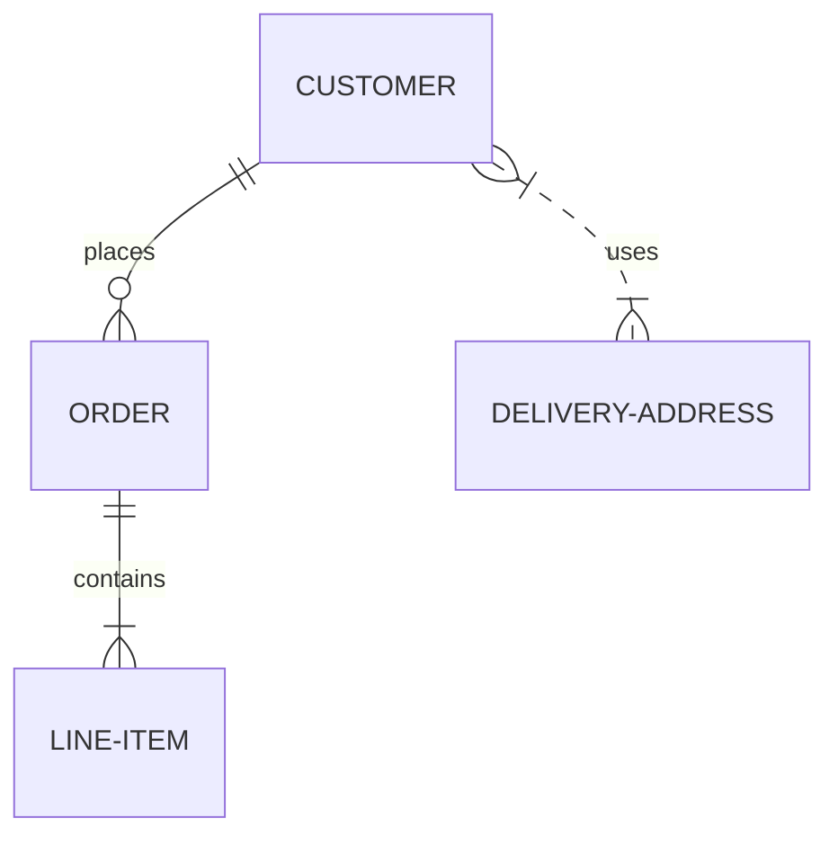
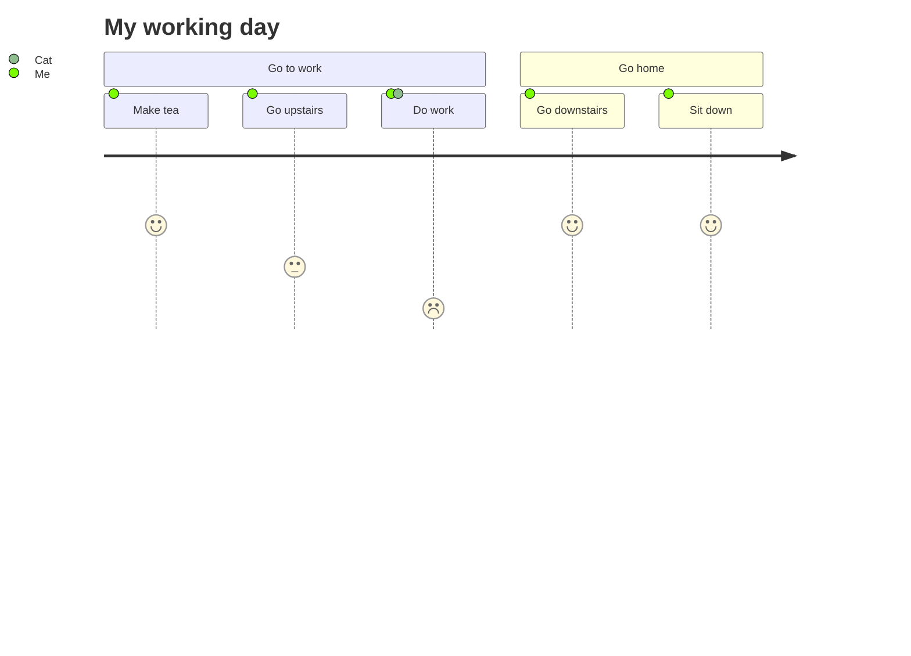
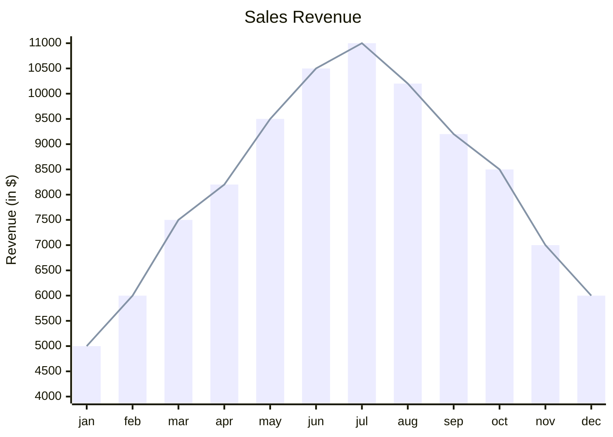

## 1. フローチャート (Flowchart)

フローチャートは、プロセスや手順を視覚的に表現するためのダイアグラムです。Mermaidでは、矢印を用いて要素間の関係性を示すことができ、条件分岐や繰り返しも表現可能です。

プログラムのアルゴリズムを説明したり、ビジネスプロセスの流れを示したりする際に活用できます。コードの理解を深めたり、業務の効率化を図ったりする上で、フローチャートは非常に有用なツールと言えるでしょう。

Mermaidでのフローチャートの書き方は非常にシンプルで、`graph`キーワードの後に方向を示す`TD`（Top-Down）や`LR`（Left-Right）などを記述し、ノードをつなぐ矢印を定義するだけです。例えば、以下のようなコードを書くことで、シンプルなフローチャートを作成できます。

```bash
graph TD;
    A-->B;
    A-->C;
    B-->D;
    C-->D;
```


このように、Mermaidを使えば、わずかなコードで見やすいフローチャートを簡単に作成することができます。プロセスの可視化や、アルゴリズムの説明など、様々な場面で活用してみてください。

## 2. シーケンス図 (Sequence Diagram)

シーケンス図は、オブジェクト間のメッセージのやり取りを時系列で表現するダイアグラムです。システムやコンポーネント間の相互作用を示すのに適しており、APIの呼び出しや、ユーザーとシステムのインタラクションを表現できます。

Mermaidでは、`sequenceDiagram`キーワードを使ってシーケンス図を定義します。登場人物（participant）を定義し、それぞれの間でメッセージをやり取りする流れを矢印で示していきます。以下は、シンプルなシーケンス図の例です。

```bash
sequenceDiagram
    participant Alice
    participant Bob
    Alice->>John: Hello John, how are you?
    loop HealthCheck
        John->>John: Fight against hypochondria
    end
    Note right of John: Rational thoughts <br/>prevail!
    John-->>Alice: Great!
    John->>Bob: How about you?
    Bob-->>John: Jolly good!

```



このように、Mermaidを使ってシーケンス図を作成することで、システムの振る舞いを視覚的に表現し、関係者間での理解を深めることができます。APIの設計やユーザーインターフェースの検討など、様々な場面で活用できるでしょう。

シーケンス図は、以下のようなケースで特に有効です。

- 複数のオブジェクトが関わる処理の流れを明確にしたいとき
- オブジェクト間のメッセージの受け渡しや、処理の順序を確認したいとき
- システムの振る舞いを関係者間で共有し、認識を合わせたいとき

Mermaidのシーケンス図は、シンプルなコードで表現力豊かなダイアグラムを作成できる点が魅力です。ぜひ、様々なシーンで活用してみてください。

## 3. ガントチャート (Gantt Diagram)

ガントチャートは、プロジェクトのタスクとスケジュールを視覚化するためのダイアグラムです。タスクの期間と依存関係を表現でき、プロジェクト管理や進捗状況の把握に適しています。

Mermaidでは、`gantt`キーワードを使ってガントチャートを定義します。`dateFormat`で日付の形式を指定し、`title`でチャートのタイトルを設定します。`section`ごとにタスクを記述し、タスクの開始日や期間、依存関係などを定義していきます。以下は、シンプルなガントチャートの例です。

```bash
gantt
dateFormat  YYYY-MM-DD
title Adding GANTT diagram to mermaid
excludes weekdays 2014-01-10

section A section
Completed task            :done,    des1, 2014-01-06,2014-01-08
Active task               :active,  des2, 2014-01-09, 3d
Future task               :         des3, after des2, 5d
Future task2              :         des4, after des3, 5d
```



このように、Mermaidを使ってガントチャートを作成することで、プロジェクトのスケジュールを一目で把握することができます。タスクの進捗状況や、全体のタイムラインを確認するのに役立ちます。

ガントチャートは、以下のようなケースで特に有効です。

- プロジェクトのタスクとスケジュールを可視化したいとき
- タスクの期間や依存関係を明確にしたいとき
- プロジェクトの進捗状況を関係者間で共有し、管理したいとき

Mermaidのガントチャートは、シンプルなコードでプロジェクトの全体像を表現できる点が魅力です。プロジェクト管理や、タスクの割り当て、スケジュールの調整など、様々な場面で活用してみてください。

## 4. クラス図 (Class Diagram)

クラス図は、オブジェクト指向設計におけるクラスの関係性を表現するためのダイアグラムです。クラスの属性やメソッド、継承関係などを示すことができ、システムの設計や構造を理解するのに役立ちます。

Mermaidでは、`classDiagram`キーワードを使ってクラス図を定義します。クラスを定義し、それぞれのクラス間の関係性を示す記号を用いて、継承や関連、集約などを表現します。以下は、シンプルなクラス図の例です。

```bash
classDiagram
Class01 <|-- AveryLongClass : Cool
Class03 *-- Class04
Class05 o-- Class06
Class07 .. Class08
Class09 --> C2 : Where am i?
Class09 --* C3
Class09 --|> Class07
Class07 : equals()
Class07 : Object[] elementData
Class01 : size()
Class01 : int chimp
Class01 : int gorilla
Class08 <--> C2: Cool label
```



このように、Mermaidを使ってクラス図を作成することで、システムの構造を視覚的に表現し、関係者間での理解を深めることができます。オブジェクト指向設計の検討や、コードの構造の説明など、様々な場面で活用できるでしょう。

クラス図は、以下のようなケースで特に有効です。

- システムのクラス構造を設計したいとき
- クラス間の関係性を明確にしたいとき
- オブジェクト指向設計を関係者間で共有し、議論したいとき

Mermaidのクラス図は、シンプルなコードでクラスの関係性を表現できる点が魅力です。システムの設計や、コードの構造の可視化など、様々なシーンで活用してみてください。

## 5. Git グラフ (Git Graph)

Git グラフは、Gitのブランチやコミットの履歴を視覚化するためのダイアグラムです。リポジトリの変更履歴を理解するのに役立ち、ブランチの分岐やマージの状況を把握することができます。

Mermaidでは、`gitGraph`キーワードを使ってGit グラフを定義します。`commit`でコミットを表現し、`branch`でブランチを作成します。`checkout`を使ってブランチの切り替えを表現することもできます。以下は、シンプルなGit グラフの例です。

```bash
gitGraph
   commit
   commit
   branch develop
   commit
   commit
   commit
   checkout main
   commit
   commit
```



このように、Mermaidを使ってGit グラフを作成することで、Gitリポジトリの変更履歴を視覚的に表現し、ブランチの状況を一目で把握することができます。チーム開発におけるコミュニケーションや、コードレビューの際の理解の助けになるでしょう。

Git グラフは、以下のようなケースで特に有効です。

- Gitリポジトリのブランチ構造を可視化したいとき
- コミットの履歴を視覚的に確認したいとき
- チームメンバー間でリポジトリの変更状況を共有したいとき

MermaidのGit グラフは、シンプルなコードでGitの履歴を表現できる点が魅力です。チーム開発におけるコミュニケーションや、リポジトリの管理など、様々な場面で活用してみてください。

## 6. エンティティ関連図 (Entity Relationship Diagram) - 実験的機能

エンティティ関連図（ER図）は、データベースの設計におけるエンティティ間の関係性を表現するためのダイアグラムです。エンティティの属性やリレーションシップを示すことができ、リレーショナルデータベースの設計や理解に役立ちます。

Mermaidでは、`erDiagram`キーワードを使ってER図を定義します。エンティティを定義し、それぞれのエンティティ間の関係性を示す記号を用いて、一対一、一対多、多対多などのリレーションシップを表現します。以下は、シンプルなER図の例です。

```bash
erDiagram
    CUSTOMER ||--o{ ORDER : places
    ORDER ||--|{ LINE-ITEM : contains
    CUSTOMER }|..|{ DELIVERY-ADDRESS : uses
```



このように、Mermaidを使ってER図を作成することで、データベースの構造を視覚的に表現し、関係者間での理解を深めることができます。データベース設計の検討や、システムの構造の説明など、様々な場面で活用できるでしょう。

ただし、現時点ではMermaidのER図はまだ実験的な機能であり、一部の表現力に制限がある点には注意が必要です。将来的には、より柔軟で表現力豊かなER図の作成が可能になることが期待されます。

ER図は、以下のようなケースで特に有効です。

- データベースのテーブル構造を設計したいとき
- エンティティ間の関係性を明確にしたいとき
- データベース設計を関係者間で共有し、議論したいとき

MermaidのER図は、シンプルなコードでエンティティの関係性を表現できる点が魅力です。データベース設計や、システムの構造の可視化など、様々なシーンで活用してみてください。ただし、現時点での制限にも留意しつつ、効果的に使用することが大切です。

## 7. ユーザージャーニー図 (User Journey Diagram)

ユーザージャーニー図は、ユーザーの行動や体験を時系列で表現するためのダイアグラムです。ユーザーがサービスやプロダクトを利用する際の一連の流れを可視化することで、ユーザーの視点に立ったサービス設計や改善点の発見に役立ちます。

Mermaidでは、`journey`キーワードを使ってユーザージャーニー図を定義します。`title`でダイアグラムのタイトルを設定し、`section`ごとにユーザーの行動や状態を記述していきます。以下は、シンプルなユーザージャーニー図の例です。

```bash
journey
    title My working day
    section Go to work
      Make tea: 5: Me
      Go upstairs: 3: Me
      Do work: 1: Me, Cat
    section Go home
      Go downstairs: 5: Me
      Sit down: 5: Me
```



このように、Mermaidを使ってユーザージャーニー図を作成することで、ユーザーの行動や体験を視覚的に表現し、サービスやプロダクトの改善点を見つけることができます。ユーザー中心設計やUXデザインの検討など、様々な場面で活用できるでしょう。

ユーザージャーニー図は、以下のようなケースで特に有効です。

- ユーザーの行動や体験を可視化したいとき
- サービスやプロダクトの課題や改善点を見つけたいとき
- ユーザーの視点に立ったデザインを検討したいとき

Mermaidのユーザージャーニー図は、シンプルなコードでユーザーの行動や体験を表現できる点が魅力です。UXデザインやサービス改善など、様々なシーンで活用してみてください。ユーザーの視点に立った気づきが得られるはずです。

## 8. 四象限チャート (Quadrant Chart)

四象限チャートは、2つの軸を用いてデータを4つのカテゴリに分類するためのダイアグラムです。各象限にはそれぞれ意味があり、データの特性に応じて適切な象限に配置することで、データの傾向や特徴を視覚的に捉えることができます。

Mermaidでは、`quadrantChart`キーワードを使って四象限チャートを定義します。`title`でチャートのタイトルを設定し、`x-axis`と`y-axis`で軸のラベルを指定します。各象限の名称は`quadrant-1`から`quadrant-4`で定義し、データポイントは`データ名: [x座標, y座標]`の形式で記述します。以下は、シンプルな四象限チャートの例です。

```bash
quadrantChart
    title Reach and engagement of campaigns
    x-axis Low Reach --> High Reach
    y-axis Low Engagement --> High Engagement
    quadrant-1 We should expand
    quadrant-2 Need to promote
    quadrant-3 Re-evaluate
    quadrant-4 May be improved
    Campaign A: [0.3, 0.6]
    Campaign B: [0.45, 0.23]
    Campaign C: [0.57, 0.69]
    Campaign D: [0.78, 0.34]
    Campaign E: [0.40, 0.34]
    Campaign F: [0.35, 0.78]
```


このように、Mermaidを使って四象限チャートを作成することで、データの傾向や特徴を視覚的に表現し、データの分析や意思決定に役立てることができます。マーケティングキャンペーンの評価や、製品の市場ポジショニングの検討など、様々な場面で活用できるでしょう。

四象限チャートは、以下のようなケースで特に有効です。

- データを2つの軸で分類し、傾向を把握したいとき
- データの特徴に応じて適切な対応を検討したいとき
- データの全体像を視覚的に捉え、関係者間で共有したいとき

Mermaidの四象限チャートは、シンプルなコードでデータの傾向や特徴を表現できる点が魅力です。データ分析やマーケティング戦略の検討など、様々なシーンで活用してみてください。データの全体像を視覚的に捉えることで、新たな気づきが得られるはずです。

## 9. XYチャート (XY Chart)

XYチャートは、2つの変数の関係性をグラフで表現するためのダイアグラムです。横軸と縦軸にそれぞれ変数を割り当て、データポイントをプロットすることで、変数間の相関関係や傾向を視覚的に捉えることができます。

Mermaidでは、`xychart`キーワードを使ってXYチャートを定義します。`title`でチャートのタイトルを設定し、`x-axis`と`y-axis`で軸のラベルと範囲を指定します。データポイントは`bar`または`line`で表現し、データ値を配列で指定します。以下は、シンプルなXYチャートの例です。

```bash
xychart-beta
    title "Sales Revenue"
    x-axis [jan, feb, mar, apr, may, jun, jul, aug, sep, oct, nov, dec]
    y-axis "Revenue (in $)" 4000 --> 11000
    bar [5000, 6000, 7500, 8200, 9500, 10500, 11000, 10200, 9200, 8500, 7000, 6000]
    line [5000, 6000, 7500, 8200, 9500, 10500, 11000, 10200, 9200, 8500, 7000, 6000]
```



このように、Mermaidを使ってXYチャートを作成することで、変数間の関係性を視覚的に表現し、データの傾向や特徴を分析することができます。売上データの推移や、変数間の相関関係の把握など、様々な場面で活用できるでしょう。

XYチャートは、以下のようなケースで特に有効です。

- 2つの変数の関係性を視覚的に捉えたいとき
- データの傾向や特徴を分析し、意思決定に役立てたいとき
- データの推移を時系列で表現し、関係者間で共有したいとき

MermaidのXYチャートは、シンプルなコードで変数間の関係性を表現できる点が魅力です。データ分析やレポーティングなど、様々なシーンで活用してみてください。変数間の関係性を視覚的に捉えることで、新たな洞察が得られるはずです。

以上が、Mermaidで利用できる主要なダイアグラムとその使用例についての説明です。Mermaidは、シンプルなコードで多様なダイアグラムを作成できるため、様々な場面で活用することができます。目的に応じて適切なダイアグラムを選択し、効果的に情報を可視化することで、コミュニケーションの改善やデータ分析の深化につなげていきましょう。
