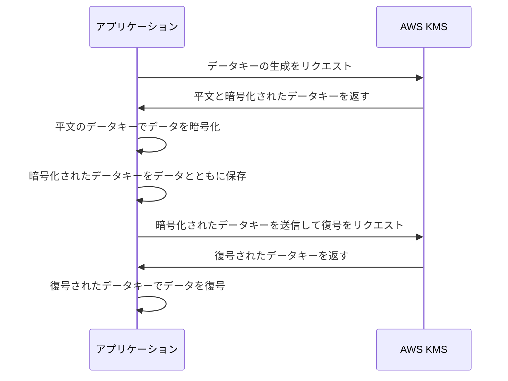
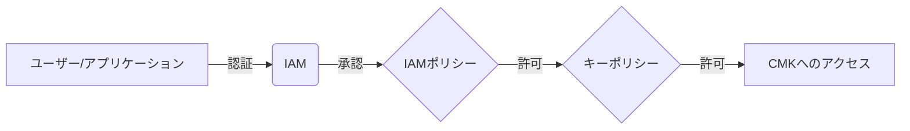
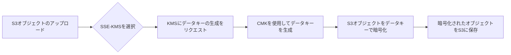
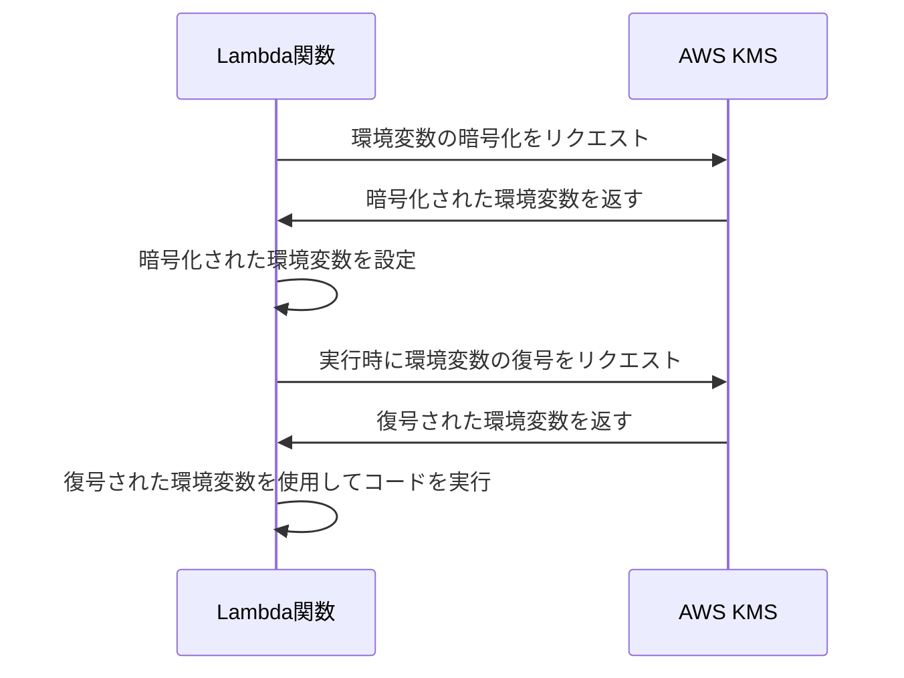
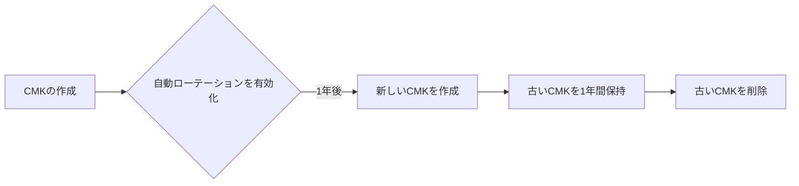
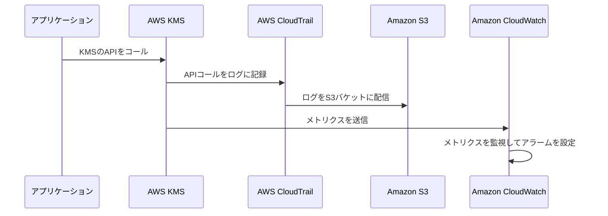

## 1. はじめに

近年、クラウドコンピューティングの普及に伴い、機密データをクラウド上で管理する機会が増えています。しかし、クラウド環境でデータを保護するためには、適切な暗号化とキー管理が不可欠です。この課題を解決するために、AWS (Amazon Web Services) はKey Management Service (KMS) を提供しています。

KMSは、暗号化キーの作成、管理、使用を簡素化し、セキュリティを強化するためのマネージドサービスです。KMSを使用することで、開発者はアプリケーションやサービスに暗号化を容易に統合でき、機密データを安全に保護することができます。

KMSの主な利点は以下の通りです：

1. 一元管理：暗号化キーをAWS KMSで一元管理できるため、キーの保護と監査が容易になります。

2. セキュリティ：ハードウェアセキュリティモジュール (HSM) を使用して、キーの生成と保護を行います。

3. 統合：他のAWSサービスとシームレスに統合できるため、S3オブジェクト、EBSボリューム、Lambdaの環境変数などを簡単に暗号化できます。

4. コンプライアンス：KMSは、FIPS 140-2などの業界標準に準拠しているため、規制要件を満たすことができます。

本記事では、KMSの基本概念、使用方法、ベストプラクティスについて詳しく説明します。これにより、開発者はKMSを効果的に活用し、アプリケーションやサービスのセキュリティを向上させることができるでしょう。

次の章では、KMSの基本概念である Customer Master Key (CMK)、データキー、エンベロープ暗号化について説明します。

## 2. KMSの基本概念

AWS KMSを効果的に使用するためには、以下の基本概念を理解する必要があります。

### 2.1 Customer Master Key (CMK)

Customer Master Key (CMK) は、KMSの中核となる暗号化キーです。CMKは、対称キーまたは非対称キーのペアで構成され、データキーの暗号化と復号に使用されます。CMKは、AWSが管理する AWS マネージドキー と、ユーザーが管理する カスタマーマネージドキー の2種類があります。

### 2.2 データキー

データキーは、CMKを使用して生成される一時的な対称暗号化キーです。データキーは、実際のデータの暗号化と復号に使用されます。KMSは、データキーを平文と暗号化された形式で返します。アプリケーションは、平文のデータキーを使用してデータを暗号化し、暗号化されたデータキーをデータとともに保存します。

### 2.3 エンベロープ暗号化

エンベロープ暗号化は、KMSにおける主要な暗号化手法です。この手法では、データキーを使用してデータを直接暗号化し、CMKを使用してデータキーを暗号化します。エンベロープ暗号化のプロセスは以下の通りです。

1. KMSにデータキーの生成をリクエストします。
2. KMSはCMKを使用してデータキーを生成し、平文と暗号化された形式で返します。
3. アプリケーションは、平文のデータキーを使用してデータを暗号化します。
4. 暗号化されたデータキーをデータとともに保存します。
5. 復号する際は、暗号化されたデータキーをKMSに送信し、CMKを使用して復号します。
6. 復号されたデータキーを使用して、暗号化されたデータを復号します。

以下は、エンベロープ暗号化のプロセスを示すシーケンス図です。



次の章では、KMSの主な機能について説明します。

## 3. KMSの主な機能

AWS KMSは、暗号化キーのライフサイクル管理、アクセスコントロール、監査などの機能を提供します。この章では、KMSの主な機能について説明します。

### 3.1 キーの作成と管理

KMSを使用すると、簡単に暗号化キーを作成および管理できます。AWS Management Console、AWS CLI、またはAWS SDKを使用して、CMKを作成、無効化、削除することができます。また、キーの詳細情報を表示したり、キーの使用状況を監視したりすることもできます。

### 3.2 キーポリシーとIAMポリシー

KMSでは、キーポリシーとIAMポリシーを使用して、CMKへのアクセスを制御します。キーポリシーは、CMKに直接アタッチされ、そのキーに対する詳細なアクセス権限を定義します。IAMポリシーは、ユーザー、グループ、ロールに関連付けられ、複数のCMKへのアクセスを制御します。

以下は、CMKへのアクセスを制御するためのキーポリシーとIAMポリシーの関係を示すフローチャートです。



### 3.3 キーの削除とローテーション

KMSでは、CMKを削除することができます。削除されたCMKは、削除後の猶予期間（7〜30日）が過ぎると完全に削除され、復元できなくなります。また、KMSはキーローテーションの機能も提供しており、定期的にCMKを自動的にローテーションすることができます。

次の章では、KMSを使用してデータを暗号化および復号する方法について、サンプルコードを交えて説明します。

## 4. KMSを使用したデータの暗号化と復号

この章では、AWS SDKを使用してKMSでデータを暗号化および復号する方法について説明します。また、KMSのAPIを直接呼び出す方法についても触れます。

### 4.1 AWS SDKを使用したサンプルコード

以下は、Pythonを使用してKMSでデータを暗号化および復号するサンプルコードです。

Python:

```python
import boto3
from base64 import b64encode, b64decode

kms = boto3.client('kms')

def encrypt_data(data, cmk_id):
    response = kms.generate_data_key(KeyId=cmk_id, KeySpec='AES_256')
    encrypted_data = b64encode(response['CiphertextBlob']).decode('utf-8')
    plaintext_data_key = response['Plaintext']
    return encrypted_data, plaintext_data_key

def decrypt_data(encrypted_data, encrypted_data_key):
    response = kms.decrypt(CiphertextBlob=b64decode(encrypted_data_key))
    plaintext_data_key = response['Plaintext']
    decrypted_data = b64decode(encrypted_data).decode('utf-8')
    return decrypted_data
```

### 4.2 KMSのAPIを直接呼び出す方法

AWS SDKを使用せずに、KMSのAPIを直接呼び出すこともできます。この場合、AWS Signature Version 4を使用してリクエストに署名する必要があります。APIの詳細については、AWS KMSのAPI リファレンスを参照してください。

次の章では、KMSの具体的なユースケースについて説明します。

## 5. KMSのユースケース

KMSは、AWSのさまざまなサービスやユーザーアプリケーションと統合することができます。この章では、KMSの代表的なユースケースについて説明します。

### 5.1 Amazon S3オブジェクトの暗号化

Amazon S3は、KMSを使用してオブジェクトを暗号化することができます。S3には、サーバー側の暗号化 (SSE) オプションが用意されており、SSE-KMSを選択することでCMKを使用したオブジェクトの暗号化が可能です。S3とKMSを連携させることで、オブジェクトの暗号化キーを一元管理でき、高いセキュリティを確保できます。

以下は、S3オブジェクトの暗号化プロセスを示すフローチャートです。



### 5.2 Amazon EBSボリュームの暗号化

Amazon EBS (Elastic Block Store) は、EC2インスタンスにアタッチできるブロックレベルのストレージサービスです。EBSボリュームは、KMSを使用して暗号化することができます。EBSボリュームを作成する際に、CMKを指定することで、ボリューム内のデータが自動的に暗号化されます。

### 5.3 AWS Lambdaの環境変数の暗号化

AWS Lambdaは、サーバーレスコンピューティングサービスであり、コードを実行するために環境変数を使用することがあります。これらの環境変数には、機密情報が含まれている場合があります。KMSを使用して、Lambda関数の環境変数を暗号化することができます。暗号化された環境変数は、Lambda関数の実行時に自動的に復号されます。

以下は、Lambda関数の環境変数を暗号化するプロセスを示すシーケンス図です。



次の章では、KMSを使用する際のベストプラクティスについて説明します。

## 6. KMSのベストプラクティス

KMSを使用する際は、セキュリティとコスト効率を最大化するために、以下のベストプラクティスを考慮することが重要です。

### 6.1 最小権限の原則

最小権限の原則に従い、ユーザーやアプリケーションには必要最小限のアクセス権限のみを付与します。IAMポリシーとキーポリシーを使用して、CMKへのアクセスを細かく制御します。また、CMKごとに異なるポリシーを設定することで、きめ細かなアクセスコントロールが可能です。

### 6.2 CMKの定期的なローテーション

セキュリティを強化するために、CMKを定期的にローテーションすることをお勧めします。KMSには、自動キーローテーションの機能があります。この機能を有効にすると、KMSは毎年新しいCMKを作成し、古いCMKは1年間保持された後に削除されます。

以下は、CMKの自動ローテーションプロセスを示すフローチャートです。



### 6.3 モニタリングとログ記録

KMSの使用状況を監視し、不審なアクティビティを検出するために、AWS CloudTrailを使用してKMSのAPIコールを記録することをお勧めします。CloudTrailは、KMSのAPIコールをログに記録し、それらのログをS3バケットに配信します。これらのログを定期的に分析することで、不正なアクセスや設定ミスを検出できます。

また、Amazon CloudWatchを使用してKMSのメトリクスをモニタリングすることもできます。CloudWatchは、KMSのAPIコールの回数、レイテンシー、エラー率などのメトリクスを収集し、異常な動作を検知するためのアラームを設定することができます。

以下は、KMSのモニタリングとログ記録のプロセスを示すシーケンス図です。



これらのベストプラクティスに従うことで、KMSを使用する際のセキュリティとコスト効率を最大化し、データを安全に保護することができます。

## 7. まとめ

AWS Key Management Service (KMS) は、クラウド環境におけるデータ保護に不可欠なサービスです。KMSを使用することで、暗号化キーの管理を簡素化し、セキュリティを強化することができます。

本記事では、以下の内容について説明しました。

1. KMSの基本概念：Customer Master Key (CMK)、データキー、エンベロープ暗号化について理解しました。

2. KMSの主な機能：キーの作成と管理、キーポリシーとIAMポリシー、キーの削除とローテーションについて学びました。

3. KMSを使用したデータの暗号化と復号：AWS SDKを使用したサンプルコードと、KMSのAPIを直接呼び出す方法について説明しました。

4. KMSのユースケース：Amazon S3オブジェクト、Amazon EBSボリューム、AWS Lambdaの環境変数の暗号化について学びました。

5. KMSのベストプラクティス：最小権限の原則、CMKの定期的なローテーション、モニタリングとログ記録の重要性について理解しました。

KMSを効果的に使用することで、組織はセキュリティとコンプライアンスの要件を満たしつつ、クラウド環境でデータを安全に保護することができます。開発者は、KMSを活用してアプリケーションやサービスに暗号化を容易に統合し、機密データを安全に管理することができます。

クラウドセキュリティの重要性が高まる中、KMSは今後もデータ保護戦略の中核を担うサービスであり続けるでしょう。開発者は、KMSの機能を十分に理解し、ベストプラクティスに従って活用することが求められます。

本記事が、読者のKMSに対する理解を深め、クラウドセキュリティの向上に寄与することを願っています。
