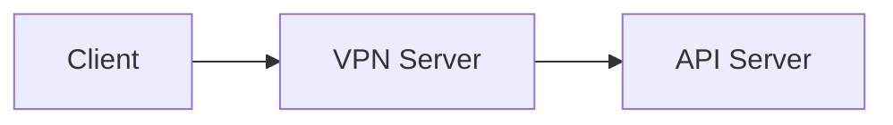
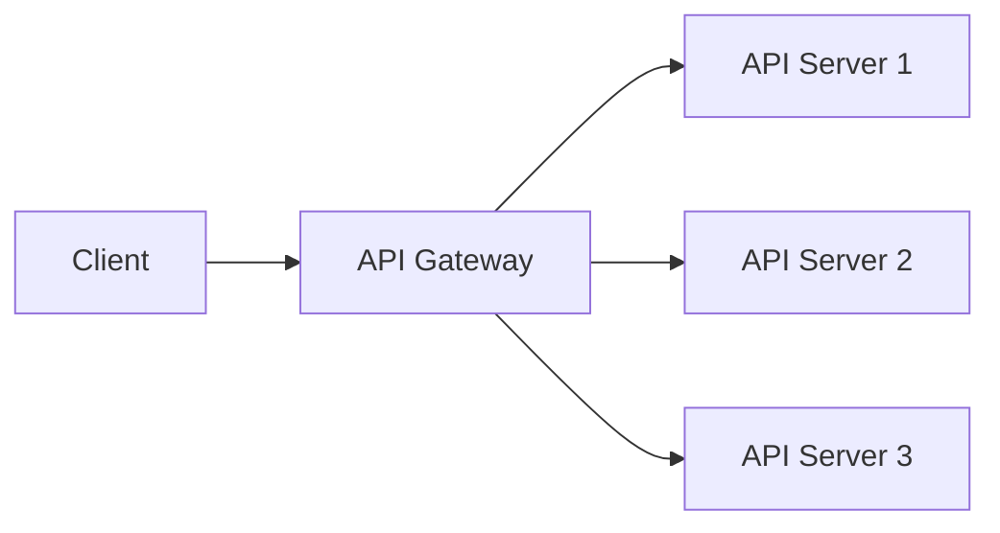
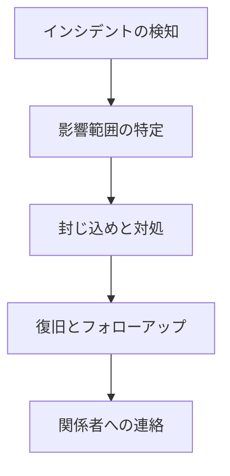

## 目次

1. [はじめに](#introduction)
2. [認証と認可](#authentication-and-authorization)
3. [通信のセキュリティ](#communication-security)
4. [入力データの検証とサニタイズ](#input-validation-and-sanitization)
5. [安全な処理と出力](#secure-processing-and-output)
6. [API ゲートウェイとサーバーサイドの保護](#api-gateway-and-server-side-protection)
7. [CI/CD とセキュリティテスト](#ci-cd-and-security-testing)
8. [監視とインシデント対応](#monitoring-and-incident-response)
9. [まとめ](#conclusion)

<a id="introduction"></a>
## 1. はじめに

### 1.1 API セキュリティの重要性

近年、APIの利用が急速に拡大しています。企業は自社のサービスやデータを外部に公開し、他社やデベロッパーとの連携を促進することで、ビジネスの成長を加速させています。しかし、APIの普及に伴い、APIを標的とした攻撃も増加しています。

APIは、アプリケーションやシステムの重要な入り口となるため、APIのセキュリティ対策は非常に重要です。APIに脆弱性があれば、データの漏洩や改ざん、不正アクセス、システムの停止など、深刻な被害につながる可能性があります。したがって、APIのセキュリティを確保することは、アプリケーションやシステム全体のセキュリティを維持する上で欠かせません。

### 1.2 脅威の増大と対策の必要性

APIに対する脅威は多岐にわたります。以下は、代表的なAPIの脅威です:

1. **不正なアクセスや権限昇格**

- 適切な認証や認可の仕組みが導入されていないと、攻撃者が不正にAPIにアクセスしたり、本来アクセスできないはずのリソースにアクセスしたりすることができてしまいます。

2. **データの漏洩や改ざん**

- APIを通じて機密情報や個人情報が流出したり、不正に改変されたりするリスクがあります。

3. **DDoS攻撃やリソース枯渇攻撃**

- 大量のリクエストを送信することで、APIサーバーに過剰な負荷をかけ、サービス不能状態に陥らせる攻撃があります。

4. **中間者攻撃やリプレイ攻撃**

- 通信経路上で情報を盗聴したり、通信内容を改ざんしたりする攻撃や、正規ユーザーの通信を傍受して不正に再利用する攻撃があります。

これらの脅威は、APIの設計や実装の段階から運用に至るまで、さまざまな局面で発生する可能性があります。したがって、APIのセキュリティを確保するためには、包括的なセキュリティ対策が必要不可欠です。

本ガイドでは、安全なAPIを設計、実装、運用するためのベストプラクティスを解説します。認証や認可、入力データの検証、暗号化、監視など、APIセキュリティに関する重要なトピックを網羅し、具体的な対策方法や実装例を提供します。このガイドを通じて、開発者や運用者が適切にAPIのセキュリティを確保し、安全で信頼性の高いAPIを構築できるようになることを目指します。

次の章では、APIセキュリティの中核となる「認証と認可」について詳しく説明します。

<a id="authentication-and-authorization"></a>
## 2. 認証と認可

APIセキュリティにおいて、認証と認可は極めて重要な役割を果たします。認証とは、ユーザーや他のシステムがそれらの主張どおりの相手であることを確認するプロセスです。一方、認可とは、認証されたユーザーやシステムに対して、適切な権限を付与し、リソースへのアクセスを制御するプロセスです。

適切な認証と認可の仕組みを導入することで、APIへの不正アクセスを防止し、データの機密性と完全性を保護することができます。

### 2.1 認証方式の選択

APIの認証には、さまざまな方式があります。それぞれの方式には一長一短があるため、APIの要件に応じて適切な認証方式を選択する必要があります。

#### 2.1.1 Basic認証 (非推奨)

Basic認証は、ユーザー名とパスワードをBase64でエンコードしてHTTPヘッダーに含める認証方式です。シンプルで実装が容易な反面、以下のような問題点があります:

- パスワードが平文で送信されるため、盗聴される危険性がある
- ログアウトの仕組みがない
- 認証情報がキャッシュされる可能性がある

そのため、Basic認証はセキュリティ要件の低いAPIでのみ使用し、機密性の高いAPIでは使用を避けるべきです。

#### 2.1.2 APIキー

APIキーは、ユーザーやアプリケーションに発行される一意の文字列で、APIへのアクセス時に提示することで認証を行います。APIキーには、以下のようなメリットがあります:

- シンプルで実装が容易
- パスワードに比べて漏洩のリスクが低い
- 必要に応じてキーの無効化や再発行が可能

ただし、APIキーは機密情報であるため、安全に管理する必要があります。また、APIキー単体では認証の強度が低いため、他の認証方式と組み合わせて使用することが推奨されます。

#### 2.1.3 JWT (JSON Web Token)

JWTは、JSON形式で表現されたトークンベースの認証方式です。JWTには、以下のような利点があります:

- ステートレスな認証が可能
- トークンに任意のクレームを含められる
- 署名によってトークンの改ざんを検知できる

JWTを使用する際は、以下の点に留意が必要です:

- トークンの有効期限を適切に設定する
- トークンを安全に保存し、漏洩を防ぐ
- トークンの署名検証を必ず行う

```python
# JWTの生成例
import jwt

payload = {
    'user_id': 123,
    'role': 'user'
}

secret_key = 'your-strong-secret-key'
token = jwt.encode(payload, secret_key, algorithm='HS256')
```

#### 2.1.4 OAuth 2.0

OAuth 2.0は、外部サービスの認可を得てリソースにアクセスするための標準プロトコルです。OAuth 2.0には、以下のような利点があります:

- ユーザーの認証情報を他のサービスに渡す必要がない
- 細かなアクセス権限の設定が可能
- 多くのサービスで採用されている

ただし、OAuth 2.0の実装には注意が必要です。不適切な実装は、かえってセキュリティリスクを高める可能性があります。OAuth 2.0を使用する際は、公式の仕様に従い、セキュリティベストプラクティスに則って実装することが重要です。

### 2.2 ログイン時のセキュリティ対策

APIにおけるログイン処理は、特に注意が必要です。ログイン時のセキュリティ対策を怠ると、不正アクセスやアカウントの乗っ取りなどの脅威にさらされる可能性があります。

#### 2.2.1 最大リトライ回数制限

ブルートフォース攻撃を防ぐために、ログイン失敗の最大リトライ回数を制限することが重要です。一定回数以上ログインに失敗した場合は、アカウントをロックするなどの対策を講じる必要があります。

```python
# 最大リトライ回数の制限とアカウントロックアウトの例 (Python)
MAX_RETRIES = 5
retry_count = 0

while retry_count < MAX_RETRIES:
    if authenticate(username, password):
        # 認証成功
        break
    else:
        retry_count += 1

if retry_count == MAX_RETRIES:
    # アカウントをロックアウト
    lock_account(username)
```

#### 2.2.2 アカウントロックの実装

アカウントのロックアウトは、不正アクセスを防ぐ効果的な手段です。ただし、ロックアウトの条件やロック解除の方法は慎重に設計する必要があります。以下は、アカウントロックの実装における留意点です:

- ロックアウトの条件 (失敗回数、期間など) を適切に設定する
- ロックアウトの通知をユーザーに送信する
- 一定期間経過後に自動的にロックを解除する
- 管理者によるロック解除の仕組みを用意する

### 2.3 機密データの暗号化

APIで扱う機密データは、安全に保護する必要があります。特に、以下のようなデータは暗号化が必須です:

- パスワード
- クレジットカード情報
- 個人情報
- アクセストークン

データの暗号化には、信頼性の高い暗号化アルゴリズムを使用します。また、暗号化キーの管理には十分な注意が必要です。

#### 2.3.1 パスワードのハッシュ化

パスワードをデータベースに保存する際は、平文ではなくハッシュ値を保存します。ハッシュ化には、十分に安全なアルゴリズム (bcrypt, PBKDF2など) を使用し、ソルトを付与することが推奨されます。

```python
# bcryptを用いたパスワードのハッシュ化例
import bcrypt

def hash_password(password):
  salt = bcrypt.gensalt()
  hashed_password = bcrypt.hashpw(password.encode('utf-8'), salt)
  return hashed_password.decode('utf-8')

def verify_password(password, hashed_password):
  return bcrypt.checkpw(password.encode('utf-8'), hashed_password.encode('utf-8'))

# パスワードのハッシュ化
password = 'my-secure-password'
hashed_password = hash_password(password)
print(f"Hashed password: {hashed_password}")

# パスワードの検証
input_password = 'my-secure-password'
if verify_password(input_password, hashed_password):
  print("Password is correct")
else:
  print("Password is incorrect")
```

#### 2.3.2 データの暗号化

機密データを暗号化する際は、以下の点に留意が必要です:

- 強力な暗号化アルゴリズムを使用する (AES, RSAなど)
- 暗号化キーを安全に管理する
- 初期化ベクトル (IV) を適切に使用する

```python
# PyCryptoを用いたデータの暗号化例 (Python)
from Crypto.Cipher import AES
from Crypto.Random import get_random_bytes

def encrypt_data(data, key):
    cipher = AES.new(key, AES.MODE_EAX)
    ciphertext, tag = cipher.encrypt_and_digest(data)
    return cipher.nonce + tag + ciphertext
```

### 2.4 JWTの適切な利用

JWTは、認証トークンとして広く使用されていますが、適切に利用しないとセキュリティリスクにつながる可能性があります。JWTを使用する際は、以下の点に留意が必要です:

#### 2.4.1 強力なシークレットキーの使用

JWTの署名には、十分に強力なシークレットキーを使用します。弱いキーを使用すると、トークンの改ざんが容易になってしまいます。

#### 2.4.2 トークンの有効期限設定

JWTには有効期限 (exp) を設定し、長期間有効なトークンの発行は避けるべきです。有効期限が長すぎると、トークンが漏洩した際の影響が大きくなります。

#### 2.4.3 ペイロードへの機密データ格納の回避

JWTのペイロードに機密データを含めることは避けるべきです。JWTは署名されているため改ざんは検知できますが、ペイロードの内容は簡単に復号化できてしまいます。

#### 2.4.4 ペイロードサイズの最小化

JWTのペイロードサイズが大きいと、ネットワークの負荷が増大します。ペイロードには必要最小限の情報のみを含めるようにします。

```python
# JWTの生成例
import jwt

payload = {
    'user_id': 123,
    'role': 'user'
}

secret_key = 'your-strong-secret-key'
token = jwt.encode(payload, secret_key, algorithm='HS256')
```

### 2.5 アクセス制御

適切なアクセス制御により、APIリソースに対する不正なアクセスを防ぐことができます。以下は、APIにおけるアクセス制御の主な手法です:

#### 2.5.1 リクエスト制限 (レートリミット)

APIに対する過剰なリクエストを防ぐために、リクエスト数を制限する必要があります。レートリミットを設定することで、DDoS攻撃やリソース枯渇攻撃のリスクを軽減できます。

```python
# レートリミットの例 (Python - Flask)
from flask import Flask
from flask_limiter import Limiter

app = Flask(__name__)
limiter = Limiter(app, default_limits=["100 per minute"])

@app.route('/api/resource')
@limiter.limit("50 per minute")
def api_resource():
    return "API Resource"
```

#### 2.5.2 ロールベースアクセス制御 (RBAC)

RBACは、ユーザーの役割 (ロール) に基づいてリソースへのアクセス権限を制御する手法です。ユーザーに適切なロールを割り当て、ロールごとにアクセス可能なリソースを定義することで、きめ細かなアクセス制御が可能になります。

```json
// RBACの例 (JSON)
{
  "roles": [
    {
      "name": "admin",
      "permissions": ["read", "write", "delete"]
    },
    {
      "name": "user",
      "permissions": ["read"]
    }
  ],
  "users": [
    {
      "id": 1,
      "name": "Alice",
      "role": "admin"
    },
    {
      "id": 2,
      "name": "Bob",
      "role": "user"
    }
  ]
}
```

#### 2.5.3 スコープの設定

OAuth 2.0では、アクセストークンにスコープを設定することで、APIリソースに対するアクセス権限を制限できます。スコープは、アプリケーションが必要とする最小限の権限のみを付与するように設計すべきです。

```json
// スコープの例 (JSON)
{
  "access_token": "eyJhbGciOiJIUzI1NiIsInR5cCI6IkpXVCJ9...",
  "token_type": "bearer",
  "expires_in": 3600,
  "scope": "read write"
}
```

認証と認可は、APIセキュリティの基盤となる重要な要素です。適切な認証方式の選択、ログイン時のセキュリティ対策、機密データの暗号化、JWTの適切な利用、アクセス制御の実装により、APIに対する不正アクセスを防ぎ、データの機密性と完全性を保護することができます。

次の章では、APIにおける通信のセキュリティについて詳しく説明します。

<a id="communication-security"></a>
## 3. 通信のセキュリティ

APIにおいて、通信のセキュリティを確保することは非常に重要です。通信経路上での情報の盗聴や改ざん、なりすましなどの脅威から、APIとクライアント間の通信を保護する必要があります。

### 3.1 HTTPSの利用

APIの通信は、必ずHTTPSを使用して暗号化します。HTTPSは、SSL/TLSプロトコルを用いて通信を暗号化し、以下のようなメリットがあります:

- 通信内容の盗聴を防止できる
- 通信内容の改ざんを検知できる
- サーバーの身元を検証できる

HTTPSを利用するためには、サーバーに SSL/TLS 証明書を設置する必要があります。証明書は、信頼できる認証局 (CA) から取得することが推奨されます。

```nginx
# Nginx での HTTPS 設定例
server {
  listen 443 ssl;
  server_name example.com;
  ssl_certificate /path/to/certificate.crt;
  ssl_certificate_key /path/to/private.key;

  location / {
    proxy_pass http://backend_server;
  }
}
```

### 3.2 HSTSヘッダー

HTTP Strict Transport Security (HSTS) は、Webサイトが常にHTTPS接続を使用するように強制する仕組みです。HSTSヘッダーをレスポンスに含めることで、ブラウザに対してHTTPSの使用を指示できます。

HSTSヘッダーには、以下のような属性を指定します:

- `max-age`: HSTSが有効な期間 (秒)
- `includeSubDomains`: サブドメインにもHSTSを適用するかどうか
- `preload`: HSTSプリロードリストに登録するかどうか

```
Strict-Transport-Security: max-age=31536000; includeSubDomains; preload
```

HSTSを適用することで、SSL Stripping攻撃を防ぐことができます。ただし、HSTSヘッダーは初回のHTTP接続では送信されないため、初回のリクエストが攻撃者に傍受される可能性があることに注意が必要です。

### 3.3 プライベートAPIのアクセス制限

社内システムや外部に公開しないAPIなど、プライベートなAPIには適切なアクセス制限を設ける必要があります。以下は、プライベートAPIのアクセス制限の例です:

#### 3.3.1 IP制限

APIへのアクセスを特定のIPアドレス範囲に限定することで、不特定多数からのアクセスを防ぐことができます。

```nginx
# Nginx での IP制限の例
location /api {
  allow 192.168.0.0/16;
  deny all;
}
```

#### 3.3.2 VPNによるアクセス制御

VPNを利用して、APIへのアクセスを社内ネットワークに限定することもできます。VPNを経由することで、インターネット上からのアクセスを遮断し、安全な通信環境を確保できます。



#### 3.3.3 アクセスログの監視

APIへのアクセスログを常に監視し、不審なアクセスパターンがないか確認することが重要です。アクセスログには、以下のような情報を記録します:

- リクエスト元のIPアドレス
- リクエストの日時
- リクエストのHTTPメソッド
- リクエストのパス
- レスポンスのHTTPステータスコード

アクセスログを分析することで、異常なアクセスや攻撃の兆候を早期に発見し、適切な対策を講じることができます。

```
# Nginx でのアクセスログの例
192.168.0.1 - - [01/Jan/2023:00:00:00 +0900] "GET /api/users HTTP/1.1" 200 1234
```

APIの通信を安全に保護するためには、HTTPSの利用、HSTSヘッダーの設定、プライベートAPIのアクセス制限が欠かせません。これらのセキュリティ対策により、通信の機密性、完全性、真正性を確保し、APIに対する攻撃リスクを大幅に軽減することができます。

次の章では、APIの入力データの検証とサニタイズについて説明します。適切な入力検証は、インジェクション攻撃などの脆弱性を防ぐために非常に重要です。

<a id="input-validation-and-sanitization"></a>
## 4. 入力データの検証とサニタイズ

APIの入力データを適切に検証し、サニタイズすることは、APIセキュリティにおいて非常に重要です。APIに対する悪意のある入力データは、SQLインジェクションやクロスサイトスクリプティング（XSS）などの脆弱性を引き起こす可能性があります。

### 4.1 HTTPメソッドの適切な利用

APIでは、HTTPメソッドを適切に使い分けることが重要です。一般的に、以下のようなHTTPメソッドが使用されます：

- GET：リソースの取得
- POST：新しいリソースの作成
- PUT：既存のリソースの更新
- DELETE：リソースの削除

各メソッドは、APIの設計に基づいて適切に選択し、実装する必要があります。

### 4.2 Content-Typeの検証

APIに送信されるデータの形式は、Content-Typeヘッダーで指定されます。APIでは、想定されるContent-Typeのみを受け入れるように設定し、それ以外のContent-Typeは拒否するべきです。

```python
# Content-Typeの検証例（Python Flask）
from flask import Flask, request, jsonify

app = Flask(__name__)

@app.route('/api/data', methods=['POST'])
def receive_data():
    if request.headers['Content-Type'] != 'application/json':
        return jsonify({'error': 'Invalid Content-Type'}), 400

    data = request.json
    # データの処理...

    return jsonify({'message': 'Data received successfully'})
```

### 4.3 ユーザー入力の検証とサニタイズ

ユーザーが入力したデータは、常に検証し、サニタイズする必要があります。入力データの検証には、以下のような手法があります：

#### 4.3.1 入力値の型チェック

入力データの型が想定通りであることを確認します。例えば、数値が期待される場合は、文字列ではなく数値型であることを検証します。

```javascript
// 入力値の型チェック例（JavaScript）
function processData(data) {
  if (typeof data !== "number") {
    throw new Error("Invalid data type. Expected a number.");
  }
  // データの処理...
}
```

#### 4.3.2 入力値の範囲チェック

入力データが許容される範囲内であることを確認します。例えば、年齢が0以上120以下の範囲内であることを検証します。

```python
# 入力値の範囲チェック例（Python）
def process_age(age):
    if age < 0 or age > 120:
        raise ValueError('Invalid age. Must be between 0 and 120.')
    # 年齢の処理...
```

#### 4.3.3 入力値のサニタイズ

入力データから潜在的に危険な文字や要素を取り除くことをサニタイズと呼びます。サニタイズの手法は、データの種類や用途によって異なります。

- HTMLやXMLの場合：`<`、`>`、`&`などの特殊文字をエスケープする
- SQLクエリの場合：クエリパラメータをプレースホルダで置き換える（クエリパラメータのバインド）
- ファイル名の場合：`../`などの相対パスや、`/`などの区切り文字を取り除く

```python
# HTMLのサニタイズ例
from flask import escape

def sanitize_html(input):
    return escape(input)
```

### 4.4 機密データ送信時の注意点

機密データをAPIに送信する際は、以下の点に注意が必要です：

- HTTPS（SSL/TLS）を使用して通信を暗号化する
- 機密データをHTTPボディに含める（クエリパラメータには含めない）
- 認証トークンは、Authorizationヘッダーで送信する（クエリパラメータやHTTPボディには含めない）

```
# 機密データ送信の例（curl）
curl -X POST -H "Content-Type: application/json" -H "Authorization: Bearer TOKEN" -d '{"secret": "confidential"}' https://api.example.com/data
```

APIの入力データを適切に検証し、サニタイズすることで、多くの一般的な脆弱性を防ぐことができます。入力検証は、APIセキュリティにおける重要な第一歩です。

次の章では、APIにおける安全な処理と出力について説明します。データの処理や保存、レスポンスの生成においても、セキュリティに配慮することが求められます。

<a id="secure-processing-and-output"></a>
## 5. 安全な処理と出力

APIの処理と出力においても、セキュリティに配慮することが重要です。不適切な処理や出力は、情報漏洩やセキュリティ脆弱性につながる可能性があります。

### 5.1 エンドポイントの認証保護

APIの全てのエンドポイントに対して、適切な認証を実装する必要があります。認証されていないリクエストは、エラーレスポンスを返すようにします。

```python
# エンドポイントの認証保護例（Python Flask）
from flask import Flask, request, jsonify
from functools import wraps

app = Flask(__name__)

def require_auth(f):
    @wraps(f)
    def decorated(*args, **kwargs):
        auth = request.headers.get('Authorization')
        if not auth or not check_auth(auth):
            return jsonify({'error': 'Unauthorized'}), 401
        return f(*args, **kwargs)
    return decorated

@app.route('/api/protected')
@require_auth
def protected_resource():
    return jsonify({'message': 'Access granted'})
```

### 5.2 個人情報の扱い

APIで個人情報を扱う場合は、特に慎重な対応が求められます。個人情報の取り扱いには、以下のような点に留意します：

- 個人情報の収集は必要最小限にとどめる
- 個人情報の保存は暗号化するなどの対策を講じる
- 個人情報の利用目的を明確にし、目的外の利用は避ける
- 個人情報の第三者提供には、本人の同意を得る
- 個人情報の削除や更新の要求には速やかに対応する

```python
# 個人情報の暗号化例
from cryptography.fernet import Fernet

def encrypt_personal_info(info):
  key = Fernet.generate_key()
  fernet = Fernet(key)
  encrypted_info = fernet.encrypt(info.encode('utf-8'))
  return encrypted_info.decode('utf-8'), key.decode('utf-8')

def decrypt_personal_info(encrypted_info, key):
  fernet = Fernet(key.encode('utf-8'))
  decrypted_info = fernet.decrypt(encrypted_info.encode('utf-8'))
  return decrypted_info.decode('utf-8')

# 個人情報の暗号化
personal_info = '{"name": "John Doe", "email": "john@example.com", "phone": "1234567890"}'
encrypted_info, key = encrypt_personal_info(personal_info)
print(f"Encrypted info: {encrypted_info}")
print(f"Encryption key: {key}")

# 個人情報の復号化
decrypted_info = decrypt_personal_info(encrypted_info, key)
print(f"Decrypted info: {decrypted_info}")
```

### 5.3 IDの生成方法

APIでリソースのIDを生成する際は、自動増分（オートインクリメント）よりもUUID（Universally Unique Identifier）の使用が推奨されます。UUIDは予測が困難であり、IDの衝突リスクも低いためです。

```python
# UUIDの生成例（Python）
import uuid

def generate_resource_id():
    return str(uuid.uuid4())
```

### 5.4 XML処理時の注意点

XMLを処理する際は、XML外部実体（XXE）攻撃に注意が必要です。XXE攻撃を防ぐために、以下のような対策を講じます：

- XMLパーサーでDTDの処理を無効にする
- XMLパーサーでエンティティの展開を無効にする
- XMLパーサーでリモートソースからのスキーマ読み込みを無効にする

```php
// XXE対策例（PHP）
libxml_disable_entity_loader(true);

$xmlElement = simplexml_load_string($xmlString, 'SimpleXMLElement', LIBXML_NOENT);
```

### 5.5 ファイルアップロードの扱い

APIでファイルアップロードを受け付ける場合は、以下のようなセキュリティ対策が必要です：

- アップロード可能なファイルの種類を制限する（ホワイトリスト方式）
- アップロードされたファイルの保存場所を制限する（アプリケーション外のディレクトリに保存する）
- アップロードされたファイルの名前を変更する（ユーザー入力をそのまま使わない）
- アップロードされたファイルのウイルスチェックを行う

```python
# ファイルアップロードの制限例（Flask）
from flask import Flask, request, jsonify
import os

app = Flask(__name__)

ALLOWED_EXTENSIONS = {'jpg', 'jpeg', 'png', 'gif'}
UPLOAD_FOLDER = 'uploads'

def allowed_file(filename):
  return '.' in filename and \
          filename.rsplit('.', 1)[1].lower() in ALLOWED_EXTENSIONS

@app.route('/upload', methods=['POST'])
def upload_file():
  if 'file' not in request.files:
    return jsonify({'error': 'No file part'}), 400

  file = request.files['file']

  if file.filename == '':
    return jsonify({'error': 'No selected file'}), 400

  if not allowed_file(file.filename):
    return jsonify({'error': 'Invalid file type'}), 400

  filename = file.filename
  file_path = os.path.join(UPLOAD_FOLDER, filename)
  file.save(file_path)

  return jsonify({'message': 'File uploaded successfully'})
```

### 5.6 デバッグモードの管理

APIの開発中は、デバッグモードを有効にすることがありますが、本番環境では必ずデバッグモードを無効にする必要があります。デバッグモードが有効だと、エラー時に詳細な情報が露出してしまう可能性があります。

```python
# デバッグモードの管理例（Flask）
from flask import Flask

app = Flask(__name__)

if app.config['ENV'] == 'production':
  app.config['DEBUG'] = False
  app.config['TESTING'] = False
  app.config['PROPAGATE_EXCEPTIONS'] = False
else:
  app.config['DEBUG'] = True
  app.config['TESTING'] = True
  app.config['PROPAGATE_EXCEPTIONS'] = True

@app.route('/')
def index():
  return 'Hello, World!'

if __name__ == '__main__':
  app.run()
```

### 5.7 セキュリティヘッダーの設定

APIのレスポンスには、適切なセキュリティヘッダーを設定することが推奨されます。主なセキュリティヘッダーには以下のようなものがあります：

- X-Content-Type-Options: nosniff
  - ブラウザによるMIMEタイプのスニッフィングを防止する
- X-Frame-Options: DENY
  - ページのフレーム内への読み込みを禁止する
- X-XSS-Protection: 1; mode=block
  - ブラウザのXSSフィルターを有効にする
- Strict-Transport-Security: max-age=31536000; includeSubDomains
  - HTTPS接続を強制する

```apache
# セキュリティヘッダーの設定例（Apache）
<IfModule mod_headers.c>
    Header set X-Content-Type-Options "nosniff"
    Header set X-Frame-Options "DENY"
    Header set X-XSS-Protection "1; mode=block"
    Header set Strict-Transport-Security "max-age=31536000; includeSubDomains"
</IfModule>
```

### 5.8 フィンガープリンティング対策

フィンガープリンティングとは、サーバーソフトウェアやフレームワークのバージョン情報などを収集することで、攻撃の糸口を探る手法です。APIではサーバー情報の露出を最小限に抑える必要があります。

- サーバーレスポンスヘッダーからバージョン情報を削除する
- エラーメッセージからフレームワークの情報を削除する
- 不要なHTTPヘッダーを送信しない

```nginx
# フィンガープリンティング対策例（Nginx）
server_tokens off;
```

### 5.9 レスポンスの適切な処理

APIのレスポンスには、以下のような点に注意が必要です：

- 機密情報をレスポンスに含めない（パスワード、APIキーなど）
- エラーメッセージから詳細な情報を削除する
- レスポンスのContent-Typeを明示する
- キャッシュ制御ヘッダーを適切に設定する

```python
# レスポンスの適切な処理例（Python Flask）
from flask import Flask, jsonify

app = Flask(__name__)

@app.route('/api/error')
def error_response():
    return jsonify({'error': 'An error occurred'}), 500

@app.after_request
def add_headers(response):
    response.headers['Content-Type'] = 'application/json'
    response.headers['Cache-Control'] = 'no-store'
    return response
```

APIの処理と出力においてセキュリティに配慮することで、情報漏洩やセキュリティ脆弱性のリスクを最小限に抑えることができます。次の章では、APIゲートウェイとサーバーサイドの保護について説明します。

<a id="api-gateway-and-server-side-protection"></a>
## 6. APIゲートウェイとサーバーサイドの保護

APIゲートウェイとサーバーサイドのセキュリティ対策は、APIの安全性を確保する上で非常に重要です。適切な保護機能を導入することで、APIに対する攻撃を防ぎ、サーバーリソースを効率的に管理することができます。

### 6.1 APIゲートウェイの活用

APIゲートウェイは、APIの入り口となるコンポーネントであり、以下のような機能を提供します：

- 認証と認可
- リクエストの検証とフィルタリング
- レート制限とスロットリング
- ロードバランシング
- キャッシュ
- モニタリングとロギング

APIゲートウェイを導入することで、バックエンドのAPIサーバーの保護と管理を集中的に行うことができます。



#### 6.1.1 認証と認可

APIゲートウェイで認証と認可を集中管理することで、バックエンドのAPIサーバーの負担を軽減できます。APIゲートウェイは、JWTやOAuth2などの標準的な認証・認可プロトコルをサポートしています。

```yaml
# API Gatewayでの認証設定例（AWS API Gateway）
securityDefinitions:
  MyAuth:
    type: apiKey
    name: Authorization
    in: header
    x-amazon-apigateway-authtype: oauth2
    x-amazon-apigateway-authorizer:
      type: jwt
      jwtConfiguration:
        audience:
          - "https://api.example.com"
        issuer: "https://cognito-idp.us-east-1.amazonaws.com/us-east-1_abc123"
```

#### 6.1.2 レート制限とスロットリング

APIゲートウェイでレート制限とスロットリングを設定することで、APIに対する過剰なリクエストを防ぎ、サーバーリソースを保護することができます。レート制限は、一定期間内のリクエスト数を制限し、スロットリングは、同時リクエスト数を制限します。

```xml
<!-- レート制限の設定例（Google Cloud Endpoints）-->
<quota name="default">
  <limit name="queries_per_minute" value="1000" />
  <limit name="queries_per_day" value="100000" />
</quota>
```

#### 6.1.3 キャッシュ

APIゲートウェイでレスポンスをキャッシュすることで、バックエンドのAPIサーバーの負荷を軽減し、レスポンス時間を短縮することができます。よく使われるデータや変更頻度の低いデータは、キャッシュに適しています。

```python
# キャッシュの設定例（Flask）
from flask import Flask, jsonify
from cachetools import cached, TTLCache

app = Flask(__name__)
cache = TTLCache(maxsize=100, ttl=60)

@app.route('/api/data')
@cached(cache)
def get_data():
    data = fetch_data_from_database()
    return jsonify(data)
```

### 6.2 サーバーサイドの保護

APIサーバー自体のセキュリティ対策も重要です。以下のような点に注意が必要です：

#### 6.2.1 最新のセキュリティパッチの適用

APIサーバーのOSやミドルウェア、ライブラリなどを常に最新の状態に保ち、既知の脆弱性を解消することが重要です。定期的にセキュリティパッチを適用する必要があります。

#### 6.2.2 不要なサービスの無効化

APIサーバーでは、APIに必要なサービスのみを有効にし、不要なサービスは無効にすることが推奨されます。これにより、攻撃対象となる領域を最小限に抑えることができます。

#### 6.2.3 ネットワークレベルの保護

APIサーバーへのネットワークアクセスを適切に制御することが重要です。ファイアウォールやセキュリティグループを使用して、信頼できるIPアドレスやポートのみを許可するようにします。

```bash
# ファイアウォールの設定例（iptables）
iptables -A INPUT -p tcp --dport 443 -j ACCEPT
iptables -A INPUT -j DROP
```

#### 6.2.4 暗号化の適用

APIサーバーでは、重要なデータを暗号化して保存することが推奨されます。また、APIサーバーとデータベース間の通信も暗号化することが重要です。

```python
# データの暗号化例
from cryptography.fernet import Fernet
import base64

def generate_key():
  return Fernet.generate_key()

def encrypt_data(data, key):
  f = Fernet(key)
  encrypted_data = f.encrypt(data.encode('utf-8'))
  return base64.b64encode(encrypted_data).decode('utf-8')

def decrypt_data(encrypted_data, key):
  f = Fernet(key)
  decoded_data = base64.b64decode(encrypted_data.encode('utf-8'))
  decrypted_data = f.decrypt(decoded_data)
  return decrypted_data.decode('utf-8')

# 暗号化キーの生成
key = generate_key()
print(f"Encryption Key: {key.decode('utf-8')}")

# データの暗号化
data = "Sensitive data"
encrypted_data = encrypt_data(data, key)
print(f"Encrypted Data: {encrypted_data}")

# データの復号化
decrypted_data = decrypt_data(encrypted_data, key)
print(f"Decrypted Data: {decrypted_data}")
```

APIゲートウェイとサーバーサイドのセキュリティ対策は、APIの安全性を確保する上で欠かせません。多層的なセキュリティアプローチにより、APIに対する脅威を効果的に防ぐことができます。

次の章では、CI/CDとセキュリティテストについて説明します。継続的なセキュリティ評価と改善が、APIの長期的な安全性を維持するために重要です。

<a id="ci-cd-and-security-testing"></a>
## 7. CI/CDとセキュリティテスト

継続的インテグレーション（CI）と継続的デリバリー（CD）は、ソフトウェア開発プロセスにおいて重要な役割を果たします。CI/CDパイプラインにセキュリティテストを組み込むことで、APIの継続的なセキュリティ評価と改善が可能になります。

### 7.1 ユニット/統合テストの実施

APIの機能を検証するために、ユニットテストと統合テストを実施することが重要です。テストでは、以下のような項目を確認します：

- 入力データの検証
- エラーハンドリング
- 境界値のテスト
- 認証と認可の動作
- レスポンスの整合性

テストは自動化し、CI/CDパイプラインに組み込むことが推奨されます。

```python
# APIのユニットテスト例（Python - pytest）
import pytest
from flask import Flask
from yourapi import create_app

@pytest.fixture
def client():
  app = create_app()
  with app.test_client() as client:
    yield client

def test_get_users(client):
  response = client.get('/api/users')
  assert response.status_code == 200
  assert b'users' in response.data

def test_unauthorized_access(client):
  response = client.get('/api/users')
  assert response.status_code == 401

def test_create_user(client):
  user_data = {
    'name': 'John Doe',
    'email': 'john@example.com'
  }
  response = client.post('/api/users', json=user_data)
  assert response.status_code == 201
  assert b'userId' in response.data

def test_get_user(client):
  response = client.get('/api/users/1')
  assert response.status_code == 200
  assert b'name' in response.data
  assert b'email' in response.data

def test_update_user(client):
  updated_user_data = {
    'name': 'Updated Name',
    'email': 'updated@example.com'
  }
  response = client.put('/api/users/1', json=updated_user_data)
  assert response.status_code == 200
  assert b'name' in response.data
  assert b'email' in response.data

def test_delete_user(client):
  response = client.delete('/api/users/1')
  assert response.status_code == 204
```

### 7.2 コードレビューの徹底

コードレビューは、コードの品質とセキュリティを維持する上で重要なプラクティスです。レビューでは、以下のような点に注意します：

- コーディング規約の遵守
- 脆弱性の有無
- 機密情報の取り扱い
- エラーハンドリングの適切性
- パフォーマンスの問題

コードレビューをCI/CDパイプラインに組み込み、自動化することも可能です。

### 7.3 継続的なセキュリティ分析

APIのソースコードに対して、継続的にセキュリティ分析を行うことが推奨されます。スタティックコード分析ツールを使用することで、潜在的なセキュリティ問題を早期に発見することができます。

- SonarQube
- Checkmarx
- Veracode
- Fortify

これらのツールをCI/CDパイプラインに統合し、定期的に実行することが重要です。

```yaml
# セキュリティ分析の例（GitHub Actions）
name: Security Scan

on:
  push:
    branches: [main]
  pull_request:
    branches: [main]

jobs:
  sonarqube:
    runs-on: ubuntu-latest

    steps:
      - uses: actions/checkout@v2
      - name: SonarQube Scan
        uses: sonarsource/sonarqube-scan-action@master
        env:
          SONAR_TOKEN: ${{ secrets.SONAR_TOKEN }}
          SONAR_HOST_URL: ${{ secrets.SONAR_HOST_URL }}
```

### 7.4 依存関係の脆弱性チェック

APIプロジェクトが使用するライブラリやフレームワークには、既知の脆弱性が存在する可能性があります。依存関係の脆弱性をチェックするツールを使用して、リスクを早期に特定することが重要です。

- npm audit
- OWASP Dependency Check
- Snyk
- Retire.js

これらのツールをCI/CDパイプラインに組み込み、定期的に実行することが推奨されます。

```bash
# 依存関係の脆弱性チェック例（npm audit）
npm audit --audit-level=moderate

# 脆弱性が見つかった場合はビルドを失敗させる
npm audit --audit-level=moderate || exit 1
```

### 7.5 脆弱性スキャンの実施

APIのエンドポイントに対して、定期的に脆弱性スキャンを実施することが重要です。脆弱性スキャナは、既知の攻撃パターンをシミュレートし、潜在的なセキュリティ問題を検出します。

- OWASP ZAP
- Burp Suite
- Acunetix
- Nessus

これらのツールを使用して、APIの脆弱性を定期的にチェックすることが推奨されます。

```bash
# OWASP ZAPの実行例
docker run -v $(pwd):/zap/wrk/:rw -t owasp/zap2docker-stable zap-api-scan.py -t https://api.example.com/ -f openapi -r report.html
```

CI/CDパイプラインにセキュリティテストを組み込むことで、APIの継続的なセキュリティ評価と改善が可能になります。自動化されたテストとスキャンにより、セキュリティ問題を早期に発見し、対処することができます。

次の章では、APIの監視とインシデント対応について説明します。運用段階でのセキュリティ監視と迅速な対応が、APIの安全性を維持する上で重要な役割を果たします。

<a id="monitoring-and-incident-response"></a>
## 8. 監視とインシデント対応

APIの運用段階では、継続的なセキュリティ監視とインシデント対応が重要です。異常な動作や攻撃の兆候を早期に検知し、迅速に対処することで、被害を最小限に抑えることができます。

### 8.1 ログ管理

APIの動作を把握し、問題の原因を特定するために、ログの収集と管理が不可欠です。以下のような情報をログに記録することが推奨されます：

- リクエストとレスポンスの詳細
- 認証と認可の情報
- エラーとその原因
- パフォーマンス関連の情報

ログは一元的に管理し、検索やフィルタリングができるようにします。

```python
# ロギングの例
import logging

logger = logging.getLogger(__name__)
logger.setLevel(logging.INFO)

handler = logging.FileHandler('app.log')
handler.setLevel(logging.INFO)

formatter = logging.Formatter('%(asctime)s - %(name)s - %(levelname)s - %(message)s')
handler.setFormatter(formatter)

logger.addHandler(handler)

logger.info('API request received')
logger.error('An error occurred', exc_info=True)
```

### 8.2 リクエストとレスポンスの監視

APIに対するリクエストとレスポンスを常に監視し、異常なパターンがないかチェックすることが重要です。監視では、以下のような点に注目します：

- リクエスト数の急激な増加
- 異常に大きなサイズのリクエストやレスポンス
- 認証失敗の頻発
- エラーレスポンスの増加

これらの異常を検知したら、速やかに調査し、必要な対策を講じます。

### 8.3 セキュリティアラートの設定

重大なセキュリティイベントが発生した場合に備えて、アラートを設定しておくことが推奨されます。アラートは、以下のような条件で発行します：

- 不正アクセスの検知
- 大量のリクエスト（DDoS攻撃の疑い）
- 機密情報へのアクセス
- 重大なエラーの発生

アラートは、メール、チャット、SMS などの手段で通知し、迅速に対応できるようにします。

```python
# セキュリティアラートの例
import smtplib
from email.mime.text import MIMEText

def send_security_alert(subject, message):
    msg = MIMEText(message)
    msg['Subject'] = subject
    msg['From'] = 'your-email@gmail.com'
    msg['To'] = 'security-team@example.com'

    smtp_server = 'smtp.gmail.com'
    smtp_port = 587
    smtp_username = 'your-email@gmail.com'
    smtp_password = 'your-email-password'

    with smtplib.SMTP(smtp_server, smtp_port) as server:
        server.starttls()
        server.login(smtp_username, smtp_password)
        server.sendmail(msg['From'], msg['To'], msg.as_string())

# 不正アクセスを検知した場合のアラート
if is_unauthorized_access(request):
    send_security_alert('不正アクセスを検知しました', f"IPアドレス: {request.remote_addr}")
```

### 8.4 インシデント対応計画

セキュリティインシデントが発生した場合に備えて、インシデント対応計画を準備しておくことが重要です。対応計画では、以下のような点を明確にします：

- インシデントの検知と評価
- 影響範囲の特定
- 封じ込めと対処
- 復旧とフォローアップ
- 関係者への連絡

対応手順を文書化し、定期的に訓練することで、インシデント発生時に速やかに行動できるようにします。



### 8.5 フォレンジック調査

インシデント発生時には、原因究明のためにフォレンジック調査を行うことが重要です。調査では、以下のような情報を収集・分析します：

- ログとトラフィックデータ
- マルウェアやデータの痕跡
- 攻撃者の手口と目的
- 侵入経路と影響範囲

調査結果をもとに、再発防止策を講じ、セキュリティ体制を強化します。

APIの運用段階では、監視とインシデント対応に継続的に取り組むことが求められます。ログ管理、異常検知、アラート設定など、多層的なアプローチにより、APIのセキュリティを維持・向上させることができます。

<a id="conclusion"></a>
## 9. まとめ

本ガイドでは、安全なAPIを設計、実装、運用するための包括的なアプローチを解説しました。APIセキュリティの重要性を理解し、認証と認可、入力検証、暗号化、監視など、多岐にわたるセキュリティ対策を講じることが求められます。

### 9.1 APIセキュリティの要点

- 適切な認証と認可の仕組みを導入する
- 入力データを検証し、サニタイズする
- 機密データを暗号化して保護する
- 通信を保護し、APIの露出を最小限に抑える
- 継続的にセキュリティテストと分析を行う
- ログを管理し、異常を監視する
- インシデント対応計画を準備する

### 9.2 継続的なセキュリティ向上

APIセキュリティは、一度確立すれば完了というものではありません。新たな脅威や脆弱性が次々と登場する中で、継続的にセキュリティを評価し、改善していく必要があります。

- 定期的にセキュリティ監査を実施する
- 最新のセキュリティ動向を把握し、対策を更新する
- 開発者のセキュリティ意識を高め、教育を行う
- セキュリティコミュニティと情報を共有する

APIセキュリティは、開発者、運用者、セキュリティ専門家が協力して取り組むべき課題です。組織全体でセキュリティ文化を醸成し、継続的な改善サイクルを回していくことが重要です。

本ガイドが、読者のAPIセキュリティ向上の一助となれば幸いです。安全で信頼されるAPIを構築し、ビジネスの成功につなげていきましょう。

## 10. 参考
- (API Security Best Practices)[https://roadmap.sh/best-practices/api-security]
