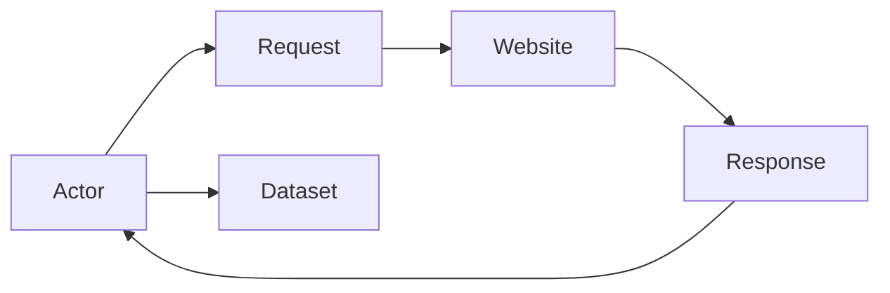
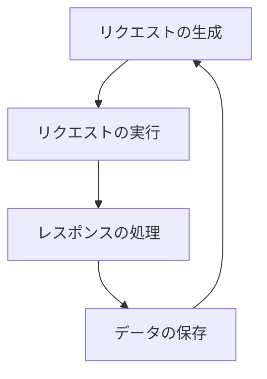

## はじめに

### crawleeとは何か

Crawleeは、Webスクレイピングを効率化するためのオープンソースライブラリです。Node.jsで書かれており、Webサイトからデータを抽出し、構造化されたデータとして保存することができます。Crawleeは、Apifyが開発・メンテナンスしているライブラリで、以前はApify SDKとして知られていました。

### crawleeの特徴と利点

Crawleeには以下のような特徴と利点があります。

- シンプルで直感的なAPI
- リクエストの管理とエラーハンドリングの自動化
- データの保存と構造化の容易さ
- 並列処理によるパフォーマンスの向上
- 豊富な設定オプションとカスタマイズ性

これらの特徴により、Crawleeを使用することで、Webスクレイピングの開発と保守に関する作業を大幅に減らすことができます。

## crawleeの基本概念

Crawleeには、以下のような基本概念があります。

### Actor

Actorは、Crawleeの中心的な概念で、Webスクレイピングのロジックを定義するクラスです。Actorは、リクエストの生成、リクエストの実行、レスポンスの処理、データの保存などの一連の処理を行います。

### Request

Requestは、Webサイトに対して送信するHTTPリクエストを表すオブジェクトです。URLやHTTPメソッド、ヘッダー、ペイロードなどの情報を含みます。

### Response

Responseは、Webサイトからの応答を表すオブジェクトです。ステータスコード、ヘッダー、ボディなどの情報を含みます。

### Dataset

Datasetは、スクレイピングしたデータを保存するための構造化されたストレージです。JSON、CSV、XMLなどの形式でデータを保存することができます。

以下は、これらの概念の関係を示すMermaidの図解です。



この図は、Actorがリクエストを生成し、Webサイトに送信することを示しています。Webサイトからのレスポンスは、Actorによって処理され、データはDatasetに保存されます。

## crawleeのライフサイクル

Crawleeのライフサイクルは、以下の手順で構成されています。

### リクエストの生成

Actorは、スクレイピング対象のURLを指定して、Requestオブジェクトを生成します。このRequestオブジェクトには、URLの他にHTTPメソッドやヘッダー、ペイロードなどの情報を含めることができます。

### リクエストの実行

生成されたRequestオブジェクトは、Crawleeのリクエストキューに追加されます。Crawleeは、リクエストキューからRequestを取り出し、Webサイトに対してHTTPリクエストを送信します。

### レスポンスの処理

Webサイトからのレスポンスは、Responseオブジェクトとして受け取られます。Actorは、このResponseオブジェクトからHTMLや JSONなどのデータを抽出し、必要な情報を取り出します。

### データの保存

抽出されたデータは、Datasetに保存されます。Datasetは、JSON、CSV、XMLなどの形式でデータを保存することができます。

以下は、Crawleeのライフサイクルを示すMermaidの図解です。



この図は、リクエストの生成から始まり、リクエストの実行、レスポンスの処理、データの保存の順に進み、再びリクエストの生成に戻ることを示しています。

## crawleeの利用方法

### インストール方法

Crawleeは、npmを使ってインストールすることができます。以下のコマンドを実行してください。

```bash
npm install crawlee
```

### プロジェクトの作成

新しいNode.jsプロジェクトを作成し、先ほどインストールしたcrawleeをプロジェクトに追加します。

```bash
mkdir my-crawler
cd my-crawler
npm init -y
npm install crawlee
```

### Actorの定義

Actorを定義するには、crawleeのCheerioCrawlerクラスを継承します。以下は、シンプルなActorの例です。

```javascript
const { CheerioCrawler } = require("crawlee");

class MyActor extends CheerioCrawler {
  async requestHandler({ $, request, enqueueLinks }) {
    const title = $("title").text();
    console.log(`Title of ${request.url}: ${title}`);
    await enqueueLinks({
      selector: "a",
      baseUrl: request.loadedUrl,
    });
  }
}

module.exports = MyActor;
```

このActorは、Webページのタイトルを抽出し、コンソールに出力します。また、ページ内の全てのリンクを抽出し、リクエストキューに追加します。

### リクエストの生成と実行

Actorを定義したら、リクエストを生成して実行します。

```javascript
const { Actor } = require("crawlee");
const MyActor = require("./my-actor");

(async () => {
  const actor = new MyActor({
    startUrls: ["https://www.example.com"],
  });

  await actor.run();
})();
```

このコードは、MyActorインスタンスを作成し、startUrlsオプションで指定されたURLからクローリングを開始します。

### レスポンスの処理とデータの保存

レスポンスの処理とデータの保存は、Actorの requestHandler メソッド内で行います。以下は、レスポンスからデータを抽出し、JSONファイルに保存する例です。

```javascript
const { CheerioCrawler, Dataset } = require("crawlee");

class MyActor extends CheerioCrawler {
  async requestHandler({ $, request }) {
    const title = $("title").text();
    const description = $('meta[name="description"]').attr("content");

    const dataset = await Dataset.open("my-dataset");
    await dataset.pushData({
      url: request.url,
      title,
      description,
    });
  }
}

module.exports = MyActor;
```

このActorは、Webページのタイトルとメタディスクリプションを抽出し、URLと一緒にDatasetに保存します。

## より詳細なトピック

### リクエストキューの管理

Crawleeは、リクエストキューを自動的に管理しますが、必要に応じてキューの動作をカスタマイズすることができます。例えば、リクエストの優先度を設定したり、同時実行するリクエストの数を制限したりすることができます。

```javascript
const { RequestQueue } = require("crawlee");

const requestQueue = await RequestQueue.open();
await requestQueue.addRequest({ url: "https://www.example.com", priority: 1 });
await requestQueue.addRequest({ url: "https://www.example.org", priority: 0 });
```

このコードは、2つのリクエストをキューに追加し、priorityオプションを使って優先度を設定しています。

### エラーハンドリング

Crawleeは、リクエストの実行中に発生したエラーを自動的に処理しますが、必要に応じてエラーハンドリングのロジックをカスタマイズすることができます。

```javascript
const { CheerioCrawler } = require("crawlee");

class MyActor extends CheerioCrawler {
  async requestHandler({ request }) {
    try {
      // リクエストの処理
    } catch (error) {
      console.error(`Error processing ${request.url}: ${error.message}`);
    }
  }
}

module.exports = MyActor;
```

このActorは、requestHandlerメソッド内でtry-catch文を使ってエラーをキャッチし、エラーメッセージをコンソールに出力します。

### 並列処理

Crawleeは、複数のリクエストを並列に実行することができます。並列処理を有効にするには、ActorのmaxConcurrencyオプションを設定します。

```javascript
const { Actor } = require("crawlee");
const MyActor = require("./my-actor");

(async () => {
  const actor = new MyActor({
    startUrls: ["https://www.example.com"],
    maxConcurrency: 10,
  });

  await actor.run();
})();
```

このコードは、maxConcurrencyオプションを10に設定し、最大10個のリクエストを同時に実行します。

### プロキシの設定

Crawleeは、プロキシサーバーを使ってリクエストを送信することができます。プロキシを設定するには、ActorのproxyConfigurationオプションを使用します。

```javascript
const { Actor } = require("crawlee");
const MyActor = require("./my-actor");

(async () => {
  const actor = new MyActor({
    startUrls: ["https://www.example.com"],
    proxyConfiguration: {
      useApifyProxy: true,
      apifyProxyGroups: ["RESIDENTIAL"],
    },
  });

  await actor.run();
})();
```

このコードは、Apifyが提供するResidentialプロキシを使用してリクエストを送信します。

## まとめ

### crawleeの利点のまとめ

- シンプルで直感的なAPI
- リクエストの管理とエラーハンドリングの自動化
- データの保存と構造化の容易さ
- 並列処理によるパフォーマンスの向上
- 豊富な設定オプションとカスタマイズ性

### crawleeを使ったWebスクレイピングの可能性

Crawleeを使うことで、Webスクレイピングに関する多くの作業を自動化し、効率化することができます。データ収集や分析、モニタリングなど、様々な用途でCrawleeを活用することができるでしょう。

## 参考資料

- 公式ドキュメント: [https://crawlee.dev/](https://crawlee.dev/)
- GitHub リポジトリ: [https://github.com/apify/crawlee](https://github.com/apify/crawlee)
- Apify プラットフォーム: [https://apify.com/](https://apify.com/)
