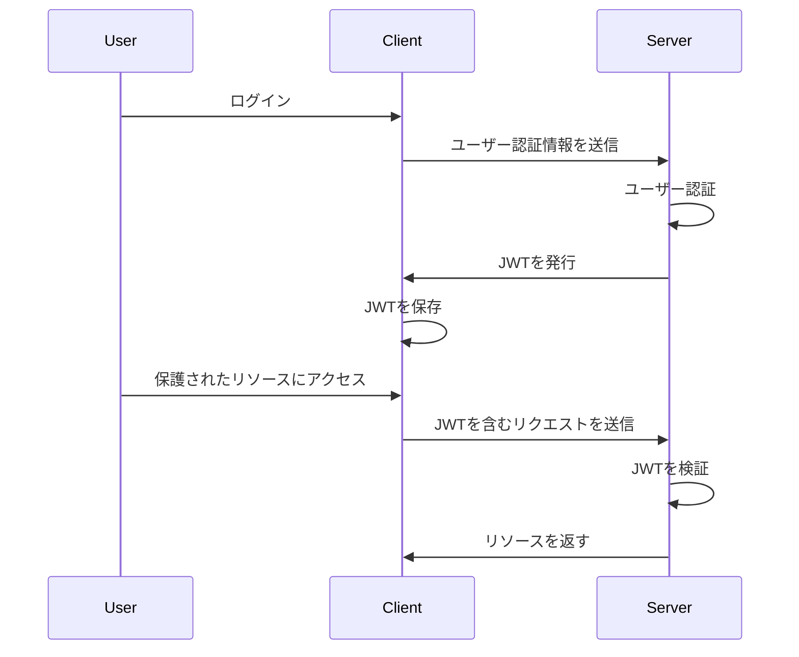
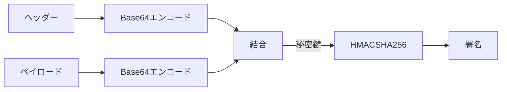
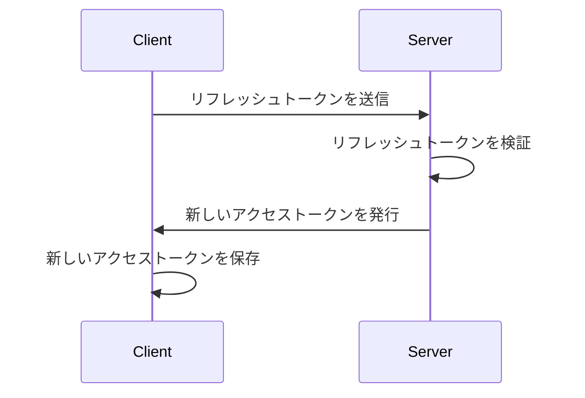
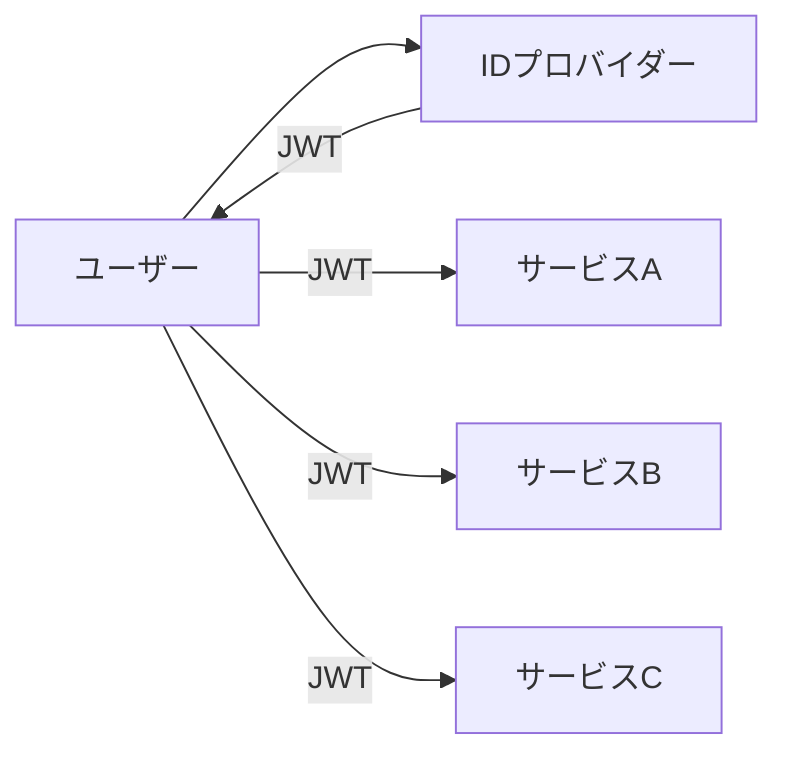
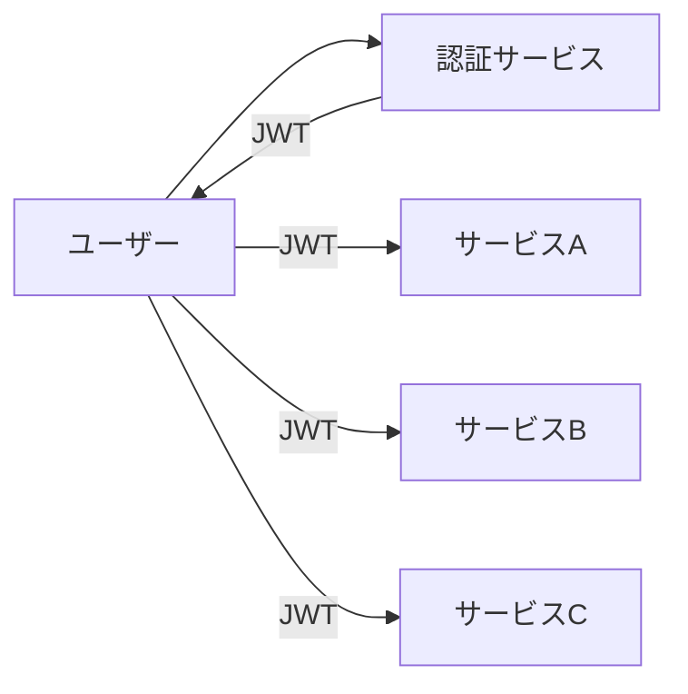
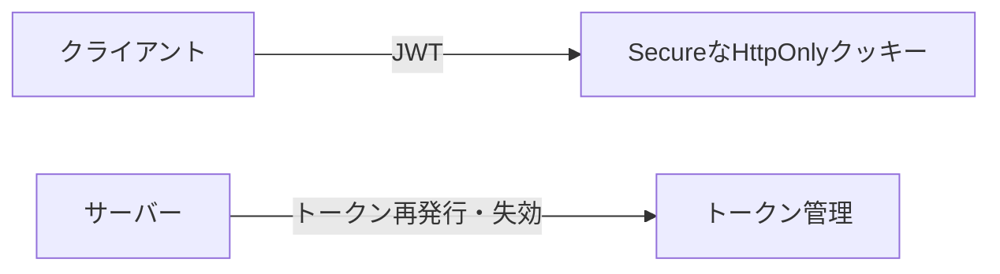

## 1. JWTとは

### 1.1. JWTの定義と概要

JWT（JSON Web Token）は、JSON形式で安全に情報を表現するための業界標準規格（RFC 7519）です。JWTは、認証や情報交換の手段として広く使われています。

JWTは、トークンベースの認証を実現するための仕組みで、以下のような特徴があります。

- 自己完結型：JWTトークンは、認証に必要な情報を全て含んでいます。
- ステートレス：サーバー側でセッション情報を保持する必要がありません。
- 検証可能：JWTトークンは、改ざんされていないことを確認できます。

### 1.2. JWTの特徴と利点

JWTには以下のような利点があります。

1. ステートレス認証：サーバー側でセッション情報を保持する必要がないため、スケーラビリティに優れています。

2. 複数サービス間での認証：JWTを使うことで、異なるサービス間でユーザー認証情報を共有できます。

3. モバイルフレンドリー：JWTはコンパクトなサイズであるため、モバイルアプリケーションでの使用に適しています。

4. パフォーマンス：JWTを使った認証は、セッションベースの認証と比べて、サーバーへの負荷が少なくなります。

JWTの認証フローを図示すると以下のようになります。



以下は、PythonでJWTを生成するサンプルコードです。

```python
import jwt

# JWTに含める情報（ペイロード）
payload = {
    'user_id': 123,
    'username': 'johndoe',
    'email': 'johndoe@example.com'
}

# 秘密鍵
secret_key = 'your-secret-key'

# JWTの生成
token = jwt.encode(payload, secret_key, algorithm='HS256')

print(token)
```

このように、JWTは現代のウェブ認証において重要な役割を果たしています。次の章では、JWTの構造について詳しく見ていきましょう。

## 2. JWTの構造

JWTは、ドット（.）で区切られた3つの部分から構成されています。

1. ヘッダー（Header）
2. ペイロード（Payload）
3. 署名（Signature）

JWTの構造は以下のように表すことができます。

```
xxxxx.yyyyy.zzzzz
```

### 2.1. ヘッダー（Header）

ヘッダーは、トークンのタイプとハッシュアルゴリズムを指定するJSON形式のオブジェクトです。

例：

```json
{
  "alg": "HS256",
  "typ": "JWT"
}
```

- `alg`：署名に使用するアルゴリズム（HMAC SHA256やRSA）
- `typ`：トークンのタイプ（JWTを指定）

### 2.2. ペイロード（Payload）

ペイロードは、トークンに含めたい情報（クレーム）を持つJSON形式のオブジェクトです。クレームには、予約された名前（registered）、公開されている名前（public）、およびカスタムの名前（private）の3種類があります。

例：

```json
{
  "sub": "1234567890",
  "name": "John Doe",
  "admin": true
}
```

- `sub`：件名（subject）。トークンの対象となるユーザーやシステムを識別する
- `name`：ユーザー名
- `admin`：ユーザーの管理者権限の有無

### 2.3. 署名（Signature）

署名は、ヘッダーとペイロードを結合した文字列をBase64形式でエンコードし、秘密鍵で署名したものです。この署名により、トークンの改ざんを防ぐことができます。

署名の生成プロセスを図示すると以下のようになります。



以下は、PythonでJWTの署名を検証するサンプルコードです。

```python
import jwt

# JWT
token = 'xxxxx.yyyyy.zzzzz'

# 秘密鍵
secret_key = 'your-secret-key'

try:
    # JWTの検証
    decoded_payload = jwt.decode(token, secret_key, algorithms=['HS256'])
    print(decoded_payload)
except jwt.ExpiredSignatureError:
    print('トークンの有効期限が切れています')
except jwt.InvalidTokenError:
    print('無効なトークンです')
```

JWTの構造を理解することで、トークンの内容を適切に設計し、セキュアな認証システムを構築することができます。次の章では、JWTを用いた認証フローについて説明します。

## 3. JWTの認証フロー

JWTを用いた認証は、以下のような流れで行われます。

### 3.1. JWTを用いた認証の仕組み

1. ユーザーがログイン情報（メールアドレスとパスワードなど）を入力し、サーバーに送信します。
2. サーバーはユーザーを認証し、JWTを生成して返します。
3. クライアントは、受け取ったJWTをローカルストレージやCookieに保存します。
4. 以降のリクエストでは、クライアントはJWTをAuthorizationヘッダに含めてサーバーに送信します。
5. サーバーは、受け取ったJWTを検証し、リクエストを処理します。

### 3.2. アクセストークンとリフレッシュトークン

JWTには、アクセストークンとリフレッシュトークンの2種類があります。

- アクセストークン：リソースへのアクセスに使用されるトークン。有効期限が短い（数分から数時間）。
- リフレッシュトークン：新しいアクセストークンを取得するために使用されるトークン。有効期限が長い（数日から数週間）。

アクセストークンの有効期限が切れた場合、リフレッシュトークンを使って新しいアクセストークンを取得することができます。これにより、ユーザーは再度ログインすることなく、継続的にサービスを利用できます。

以下は、リフレッシュトークンを使った新しいアクセストークンの取得フローを図示したものです。



### 3.3. ステートレス認証の利点

JWTを用いたステートレス認証には、以下のような利点があります。

1. サーバー側でセッション情報を保持する必要がないため、サーバーのリソースを節約できます。
2. 水平スケーリングが容易になります。セッション情報を共有する必要がないため、複数のサーバー間で負荷分散ができます。
3. クライアント側で認証情報を持つため、サーバー側での認証処理が簡略化されます。

以下は、PythonでJWTを用いた認証を実装するサンプルコードです。

```python
from flask import Flask, request, jsonify
import jwt

app = Flask(__name__)

# 秘密鍵
secret_key = 'your-secret-key'

@app.route('/login', methods=['POST'])
def login():
    # ログイン処理（ユーザー認証）
    # ...

    # JWTの生成
    token = jwt.encode({'user_id': user_id}, secret_key, algorithm='HS256')

    return jsonify({'token': token})

@app.route('/protected', methods=['GET'])
def protected():
    # JWTの検証
    token = request.headers.get('Authorization').split(' ')[1]
    try:
        decoded_token = jwt.decode(token, secret_key, algorithms=['HS256'])
        user_id = decoded_token['user_id']
    except:
        return jsonify({'message': 'Invalid token'}), 401

    # 保護されたリソースへのアクセス
    # ...

    return jsonify({'message': 'Access granted'})
```

JWTを用いた認証フローを理解することで、セキュアでスケーラブルな認証システムを設計・実装することができます。次の章では、JWTの具体的な使用例について見ていきましょう。

## 4. JWTの使用例

JWTは様々な場面で活用されています。ここでは、代表的な使用例を紹介します。

### 4.1. シングルサインオン（SSO）

シングルサインオン（SSO）は、1回の認証で複数のサービスやアプリケーションにアクセスできる仕組みです。JWTを使ったSSOでは、以下のような流れになります。

1. ユーザーがIDプロバイダー（IdP）で認証します。
2. IdPはJWTを発行し、ユーザーに返します。
3. ユーザーは、JWTを使って他のサービスやアプリケーションにアクセスします。
4. サービスやアプリケーションは、JWTを検証し、ユーザーを認証します。

以下は、JWTを使ったSSOの概略図です。



### 4.2. APIの認証

JWTは、APIの認証にも広く使われています。APIの認証フローは以下のようになります。

1. クライアントがユーザー認証情報を使ってAPIサーバーにリクエストを送信します。
2. APIサーバーは、ユーザーを認証し、JWTを発行します。
3. クライアントは、以降のリクエストでJWTを含めてAPIサーバーに送信します。
4. APIサーバーは、JWTを検証し、リクエストを処理します。

以下は、PythonでJWTを使ったAPIの認証を実装するサンプルコードです。

```python
from flask import Flask, request, jsonify
import jwt

app = Flask(__name__)

# 秘密鍵
secret_key = 'your-secret-key'

@app.route('/api/login', methods=['POST'])
def login():
    # ログイン処理（ユーザー認証）
    # ...

    # JWTの生成
    token = jwt.encode({'user_id': user_id}, secret_key, algorithm='HS256')

    return jsonify({'token': token})

@app.route('/api/protected', methods=['GET'])
def protected():
    # JWTの検証
    token = request.headers.get('Authorization').split(' ')[1]
    try:
        decoded_token = jwt.decode(token, secret_key, algorithms=['HS256'])
        user_id = decoded_token['user_id']
    except:
        return jsonify({'message': 'Invalid token'}), 401

    # 保護されたリソースへのアクセス
    # ...

    return jsonify({'message': 'Access granted'})
```

### 4.3. マイクロサービスアーキテクチャでの活用

マイクロサービスアーキテクチャでは、JWTを使って各サービス間の認証を行うことができます。

1. ユーザーが認証サービスで認証します。
2. 認証サービスはJWTを発行し、ユーザーに返します。
3. ユーザーは、JWTを使って他のマイクロサービスにアクセスします。
4. 各マイクロサービスは、JWTを検証し、ユーザーを認証します。

以下は、JWTを使ったマイクロサービス間の認証フローを図示したものです。



JWTを適切に活用することで、シームレスでセキュアな認証システムを構築することができます。次の章では、JWTのセキュリティ対策について説明します。

## 5. JWTのセキュリティ対策

JWTは強力な認証手段ですが、適切に使用しないとセキュリティ上の問題が発生する可能性があります。ここでは、JWTを安全に使用するためのセキュリティ対策を紹介します。

### 5.1. トークンの有効期限設定

JWTには有効期限を設定することが重要です。有効期限が長すぎると、トークンが漏洩した場合の影響が大きくなります。一方、有効期限が短すぎると、ユーザーは頻繁に再認証が必要になります。適切な有効期限を設定することで、セキュリティとユーザービリティのバランスを取ることができます。

以下は、PythonでJWTの有効期限を設定するサンプルコードです。

```python
import jwt
import datetime

# 有効期限を設定（1時間）
expiration = datetime.datetime.utcnow() + datetime.timedelta(hours=1)

# JWTに含める情報（ペイロード）
payload = {
    'user_id': 123,
    'username': 'johndoe',
    'exp': expiration
}

# 秘密鍵
secret_key = 'your-secret-key'

# JWTの生成
token = jwt.encode(payload, secret_key, algorithm='HS256')
```

### 5.2. セキュアな署名アルゴリズムの選択

JWTの署名には、セキュアなアルゴリズムを使用する必要があります。現在推奨されているのは、HMAC SHA-256（HS256）以上またはRSA SHA-256（RS256）以上です。弱いアルゴリズムを使用すると、トークンの改ざんが容易になります。

以下は、PythonでHS256とRS256を使用してJWTを生成するサンプルコードです。

```python
import jwt

# HS256を使用してJWTを生成
hs256_token = jwt.encode(payload, secret_key, algorithm='HS256')

# RS256を使用してJWTを生成
rs256_token = jwt.encode(payload, private_key, algorithm='RS256')
```

### 5.3. トークンの適切な保存と管理

クライアント側でJWTを保存する際は、安全な方法を使用する必要があります。推奨される方法は、SecureなHttpOnlyクッキーに保存することです。ローカルストレージやセッションストレージに保存すると、クロスサイトスクリプティング（XSS）攻撃によってトークンが漏洩する可能性があります。

また、サーバー側でもトークンを適切に管理する必要があります。トークンの再発行や失効の仕組みを実装し、不正なトークンの使用を防ぐ必要があります。

以下は、JWTの適切な保存と管理を図示したものです。



JWTのセキュリティ対策を適切に行うことで、安全で信頼性の高い認証システムを構築することができます。次の章では、JWTの実装方法について説明します。

## 6. JWTの実装方法

JWTの実装は、サーバーサイドとクライアントサイドの両方で行います。ここでは、それぞれの実装方法について説明します。

### 6.1. サーバーサイドでのJWT生成と検証

サーバーサイドでは、ユーザー認証後にJWTを生成し、クライアントに返します。また、クライアントから受け取ったJWTを検証し、リクエストを処理します。

以下は、Node.jsとExpressを使用してJWTを生成・検証するサンプルコードです。

```javascript
const express = require("express");
const jwt = require("jsonwebtoken");

const app = express();

// 秘密鍵
const secretKey = "your-secret-key";

// JWTの生成
app.post("/login", (req, res) => {
  const user = { id: 1, username: "johndoe" };
  const token = jwt.sign(user, secretKey);
  res.json({ token });
});

// JWTの検証
app.get("/protected", (req, res) => {
  const token = req.headers.authorization;
  try {
    const decoded = jwt.verify(token, secretKey);
    res.json({ message: "Access granted", user: decoded });
  } catch (error) {
    res.status(401).json({ message: "Invalid token" });
  }
});

app.listen(3000, () => console.log("Server started on port 3000"));
```

### 6.2. クライアントサイドでのJWTの取り扱い

クライアントサイドでは、サーバーから受け取ったJWTを安全に保存し、以降のリクエストでJWTを含めて送信します。

以下は、JavaScriptでJWTをセキュアなHttpOnlyクッキーに保存し、リクエストに含めるサンプルコードです。

```javascript
// JWTをクッキーに保存
function saveToken(token) {
  document.cookie = `token=${token}; HttpOnly; Secure`;
}

// クッキーからJWTを取得
function getToken() {
  const cookies = document.cookie.split("; ");
  for (let i = 0; i < cookies.length; i++) {
    const cookie = cookies[i].split("=");
    if (cookie[0] === "token") {
      return cookie[1];
    }
  }
  return null;
}

// リクエストにJWTを含める
async function fetchProtectedData() {
  const token = getToken();
  const response = await fetch("/protected", {
    headers: {
      Authorization: token,
    },
  });
  const data = await response.json();
  console.log(data);
}
```

### 6.3. 言語とフレームワークごとのJWTライブラリ

JWTの実装には、言語やフレームワークごとに様々なライブラリが用意されています。代表的なライブラリを以下に紹介します。

- Node.js: jsonwebtoken
- Python: PyJWT
- Java: JJWT
- PHP: firebase/php-jwt
- Ruby: jwt
- Go: dgrijalva/jwt-go

これらのライブラリを使用することで、JWTの生成や検証を簡単に行うことができます。

JWTの実装方法を理解し、適切なライブラリを使用することで、効率的かつセキュアにJWTを活用できます。次の章では、JWTの課題と留意点について説明します。

## 7. JWTの課題と留意点

JWTは優れた認証手段ですが、いくつかの課題と留意点があります。ここでは、それらについて説明します。

### 7.1. トークンサイズの問題

JWTは、ペイロードに多くの情報を含めることができます。しかし、トークンサイズが大きくなると、ネットワーク帯域幅の消費が増え、パフォーマンスが低下する可能性があります。したがって、ペイロードには必要最小限の情報のみを含めるようにしましょう。

以下は、トークンサイズを最小限に抑えるためのヒントです。

- ペイロードには、必要不可欠な情報のみを含める
- クレームの名前を短くする（例：`user_id`を`uid`に）
- クレームの値を短くする（例：UUIDの代わりに整数のIDを使用）

### 7.2. トークン失効の管理

JWTは、一度発行されるとサーバー側で失効させることができません。これは、JWTがステートレスであるためです。トークンの失効を管理するためには、以下のような方法があります。

1. トークンの有効期限を短く設定し、定期的に再発行する
2. ブラックリストを使用して、失効したトークンを管理する
3. データベースにトークンのホワイトリストを保存し、有効なトークンのみを許可する

以下は、Node.jsとRedisを使用してブラックリストを実装するサンプルコードです。

```javascript
const express = require("express");
const jwt = require("jsonwebtoken");
const redis = require("redis");

const app = express();
const redisClient = redis.createClient();

// 秘密鍵
const secretKey = "your-secret-key";

// ブラックリストにトークンを追加
function addToBlacklist(token) {
  redisClient.set(token, "blacklisted");
}

// トークンがブラックリストに含まれているかチェック
function isBlacklisted(token) {
  return new Promise((resolve, reject) => {
    redisClient.get(token, (err, result) => {
      if (err) {
        reject(err);
      } else {
        resolve(result === "blacklisted");
      }
    });
  });
}

// JWTの検証とブラックリストチェック
app.get("/protected", async (req, res) => {
  const token = req.headers.authorization;
  try {
    const decoded = jwt.verify(token, secretKey);
    const blacklisted = await isBlacklisted(token);
    if (blacklisted) {
      res.status(401).json({ message: "Token is blacklisted" });
    } else {
      res.json({ message: "Access granted", user: decoded });
    }
  } catch (error) {
    res.status(401).json({ message: "Invalid token" });
  }
});
```

### 7.3. リプレイ攻撃への対策

JWTは、トークンを盗まれた場合、攻撃者がそのトークンを使い続けることができるという問題があります。この問題への対策として、以下のような方法があります。

1. トークンの有効期限を短く設定する
2. ワンタイムトークンを使用する
3. リフレッシュトークンを使用し、アクセストークンを定期的に更新する

以下は、リフレッシュトークンを使用してアクセストークンを更新するフローを図示したものです。


これらの課題と留意点を理解し、適切な対策を講じることで、JWTをより安全に活用することができます。

## 8. まとめ

本記事では、JWTについて以下の点を詳しく説明しました。

- JWTの基本概念と特徴
- JWTの構造（ヘッダー、ペイロード、署名）
- JWTの認証フローとステートレス認証の利点
- JWTの使用例（SSO、API認証、マイクロサービスアーキテクチャ）
- JWTのセキュリティ対策（トークンの有効期限、セキュアな署名アルゴリズム、トークンの適切な保存と管理）
- JWTの実装方法（サーバーサイドとクライアントサイド）
- JWTの課題と留意点（トークンサイズ、トークン失効の管理、リプレイ攻撃への対策）

### 8.1. JWTの役割と重要性

JWTは、現代のウェブ認証において重要な役割を果たしています。JWTを使用することで、以下のようなメリットがあります。

- ステートレス認証による、サーバーのリソース節約とスケーラビリティの向上
- シングルサインオン（SSO）の実現
- APIの認証とマイクロサービスアーキテクチャでの活用

### 8.2. エンジニアがJWTを理解することの意義

エンジニアがJWTを深く理解することは、以下の点で重要です。

1. セキュアな認証システムの設計と実装ができる
2. JWTを適切に使用し、セキュリティリスクを最小限に抑えられる
3. 認証に関する問題のトラブルシューティングがスムーズに行える

JWTは、エンジニアにとって必須の知識の1つです。本記事で得た知識を活かし、安全で効率的な認証システムを構築していきましょう。
