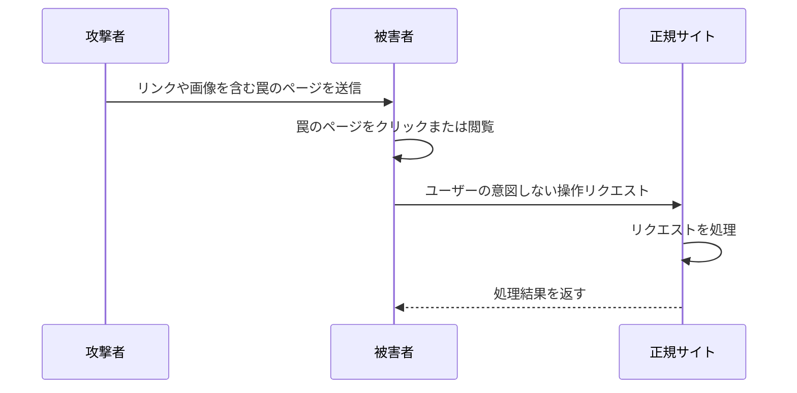
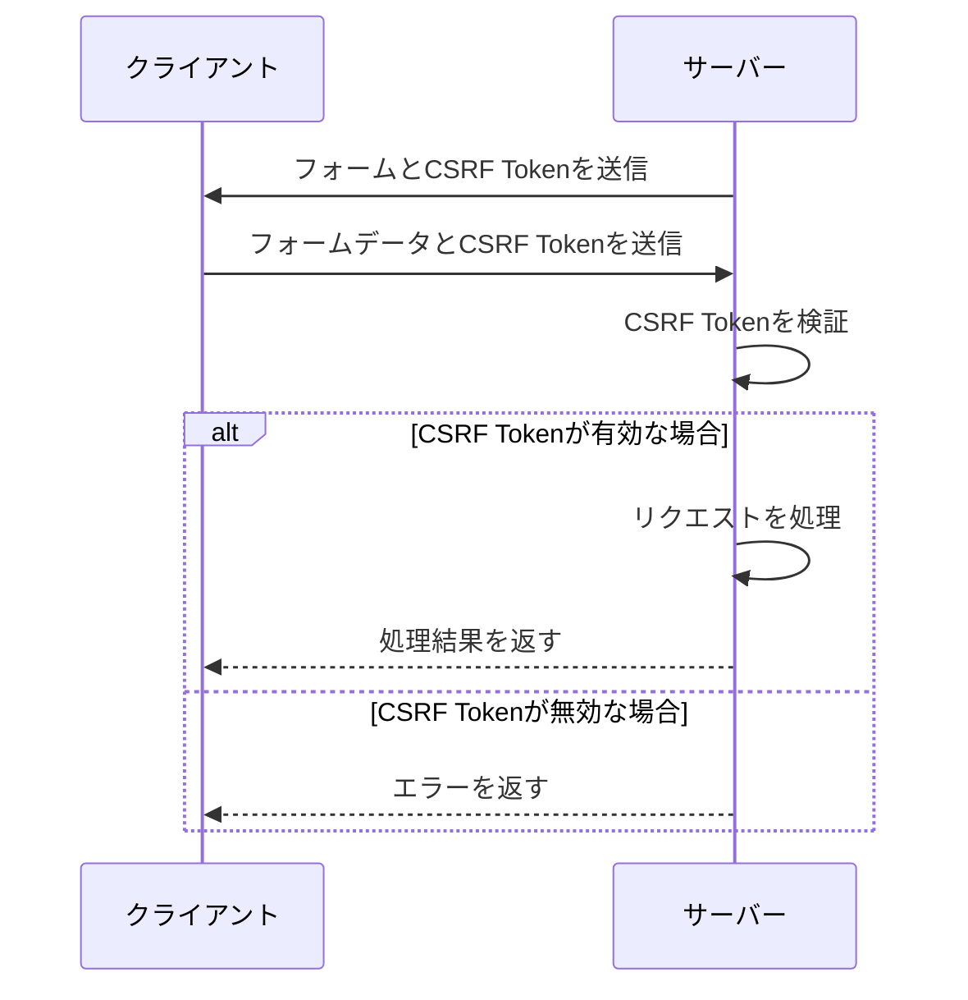

## はじめに

近年、Webアプリケーションは私たちの生活に欠かせない存在となっています。一方で、Webアプリケーションの普及に伴い、さまざまなセキュリティ上の脅威も増えています。その中でも、CSRF（Cross-Site Request Forgery）攻撃は特に注意が必要な脅威の一つです。

CSRF攻撃は、ユーザーが気づかないうちに、不正なリクエストを送信させられてしまう攻撃です。この攻撃が成功すると、ユーザーの権限で意図しない操作が実行されてしまう可能性があります。例えば、ユーザーの知らないうちに、アカウント情報の変更や、不正な金銭取引が行われてしまうことがあります。

そこで、このような攻撃を防ぐために使われるのが、CSRF Tokenです。この記事では、CSRF Tokenの仕組みや役割について、初心者にもわかりやすく解説していきます。

## CSRFとは

CSRF（Cross-Site Request Forgery）は、日本語では「クロスサイトリクエストフォージェリ」と呼ばれる攻撃手法です。この攻撃は、ユーザーが現在ログインしているWebサイトとは別のサイトから、ユーザーの意図しないリクエストを送信させることで、不正な操作を実行させてしまう攻撃です。

以下は、CSRFの攻撃の仕組みを簡単に示した図です。



この図では、攻撃者が被害者に罠のページを送信し、被害者がそのページをクリックや閲覧することで、被害者の意図しない操作リクエストが正規サイトに送信されてしまう流れを示しています。

具体的には、以下のような手順で攻撃が行われます。

1. 攻撃者は、被害者がログイン中の正規サイトを分析し、ユーザーの権限で実行可能な操作を特定します。
2. 攻撃者は、その操作を実行するためのリクエストを自動的に送信する罠のページを作成します。
3. 攻撃者は、被害者に罠のページのリンクを送信したり、そのページに誘導したりします。
4. 被害者が罠のページをクリックや閲覧すると、そのページに仕込まれたJavaScriptなどによって、自動的に正規サイトへ不正なリクエストが送信されます。
5. 正規サイトは、そのリクエストを被害者からの正規のリクエストと判断し、要求された操作を実行してしまいます。

このようにCSRF攻撃では、ユーザーが気づかないうちに不正な操作を行われてしまうため、Webアプリケーションのセキュリティ上、大きな脅威となります。

## CSRF Tokenとは

CSRF Token（Cross-Site Request Forgery Token）は、CSRF攻撃を防ぐために使われるセキュリティ対策の一つです。CSRF Tokenは、Webアプリケーションが生成する一意な文字列で、リクエストの送信元が正規のWebサイトであることを確認するために使用されます。

以下は、CSRF Tokenを使ったCSRF攻撃の防止の仕組みを簡単に示した図です。



この図では、以下のような流れでCSRF攻撃が防止されています。

1. サーバーは、クライアントにフォームを送信する際に、CSRF Tokenを生成してフォームに埋め込みます。
2. クライアントは、フォームを送信する際に、フォームデータとともにCSRF Tokenをサーバーに送信します。
3. サーバーは、受け取ったCSRF Tokenが正しいものかどうかを検証します。
4. CSRF Tokenが有効な場合、サーバーはリクエストを処理し、処理結果をクライアントに返します。
5. CSRF Tokenが無効な場合、サーバーはエラーをクライアントに返します。

つまり、CSRF Tokenを使うことで、サーバーはリクエストが正規のWebサイトから送信されたものかどうかを確認することができます。攻撃者が罠のページを作成しても、そのページではCSRF Tokenを知ることができないため、不正なリクエストを送信することが困難になります。

CSRF Tokenは通常、ユーザーごとに一意な文字列が生成され、セッションに紐づけられます。これにより、別のユーザーのCSRF Tokenを使って不正なリクエストを送信することができなくなります。

## CSRF Tokenの実装方法（Ruby on Railsの例）

ここでは、Ruby on Railsを使ったWebアプリケーションでのCSRF Tokenの実装方法について説明します。

Ruby on Railsでは、デフォルトでCSRF対策が有効になっています。Railsは、フォームを生成する際に自動的にCSRF Tokenを埋め込み、リクエストを処理する際にそのTokenを検証します。

以下は、RailsでCSRF Tokenを使ったフォームの例です。

```erb
<%= form_with(url: "/users", method: :post) do |form| %>
  <%= form.text_field :name %>
  <%= form.submit "Create" %>
<% end %>
```

この例では、`form_with`ヘルパーを使ってフォームを生成しています。Railsは自動的にCSRF Tokenを生成し、`hidden`フィールドとしてフォームに埋め込みます。生成されるHTMLは以下のようになります。

```html
<form action="/users" method="post">
  <input type="hidden" name="authenticity_token" value="..." />
  <input type="text" name="name" />
  <input type="submit" value="Create" />
</form>
```

`authenticity_token`が、RailsがフォームにデフォルトでembedするCSRF tokenです。

サーバー側では、Railsのコントローラーがリクエストを処理する際に、このCSRF Tokenを自動的に検証します。検証に失敗した場合、`ActionController::InvalidAuthenticityToken`例外が発生します。

ただし、以下のようなケースではCSRF Tokenの検証をスキップしたい場合があります。

- APIエンドポイントなど、フォーム以外からのリクエストを受け付ける場合
- 外部サイトからのリクエストを受け付ける必要がある場合

このような場合は、コントローラーの`protect_from_forgery`メソッドを使って、CSRF保護を制御することができます。

```ruby
class ApiController < ApplicationController
  protect_from_forgery with: :null_session
end
```

この例では、`protect_from_forgery`メソッドに`:null_session`オプションを渡すことで、APIコントローラーではCSRF Tokenの検証をスキップしています。

ただし、CSRF保護を無効にする場合は、他の方法で不正なリクエストを防ぐ必要があります。たとえば、リクエストに含まれるトークンを使って、リクエストの正当性を確認するなどの対策が必要です。

## CSRF Tokenの注意点

CSRF Tokenは、CSRF攻撃を防ぐための有効な手段ですが、いくつか注意点があります。

1. CSRF Tokenの生成と検証は、サーバー側で行う必要があります。クライアント側でCSRF Tokenを生成したり、検証したりしてはいけません。

2. CSRF Tokenは、ユーザーごとに一意である必要があります。同じTokenを複数のユーザーで共有すると、CSRF攻撃を防ぐことができません。

3. CSRF Tokenは、セッションに紐づける必要があります。ユーザーがログアウトしたり、セッションが切れたりした場合は、新しいCSRF Tokenを生成する必要があります。

4. CSRF Tokenは、適切に管理する必要があります。たとえば、CSRFTokenをURLのパラメータに含めたり、ログに出力したりすると、攻撃者にTokenが漏れる可能性があります。

5. CSRF Tokenだけでは、すべての攻撃を防ぐことはできません。たとえば、XSS（クロスサイトスクリプティング）攻撃によって、攻撃者がCSRF Tokenを盗み出す可能性があります。そのため、CSRF対策だけでなく、他のセキュリティ対策も行う必要があります。

## その他のCSRF対策

CSRF Tokenは、CSRF攻撃を防ぐための有効な手段ですが、他にもいくつかのCSRF対策があります。

1. Same-Site Cookieの利用: Same-Site Cookieを使うことで、別のサイトからのリクエストにCookieを送信しないようにすることができます。これにより、CSRF攻撃を防ぐことができます。

2. Refererヘッダーの検証: リクエストのRefererヘッダーを検証することで、リクエストが正規のサイトから送信されたものかどうかを確認することができます。ただし、Refererヘッダーは、ユーザーがブラウザの設定で無効にすることができるため、完全な対策とはいえません。

3. ユーザー操作の確認: 重要な操作を行う際に、ユーザーに再度パスワードを入力させたり、二段階認証を要求したりすることで、不正なリクエストを防ぐことができます。

これらの対策を組み合わせることで、より強固なCSRF対策を行うことができます。

## まとめ

この記事では、CSRF攻撃とCSRF Tokenについて解説しました。CSRF攻撃は、ユーザーが気づかないうちに不正なリクエストを送信させられてしまう攻撃であり、Webアプリケーションのセキュリティ上、重大な脅威となります。

CSRF Tokenは、このようなCSRF攻撃を防ぐための有効な手段の一つです。サーバーがCSRF Tokenを生成し、フォームに埋め込むことで、正規のサイトから送信されたリクエストかどうかを確認することができます。

Ruby on Railsでは、デフォルトでCSRF対策が有効になっており、簡単にCSRF Tokenを使うことができます。ただし、CSRF Tokenの管理には注意が必要であり、他のセキュリティ対策と組み合わせることで、より強固なセキュリティを確保することができます。

Webアプリケーションを開発する際は、CSRF攻撃をはじめとするさまざまな脅威を理解し、適切なセキュリティ対策を行うことが重要です。CSRF Tokenを正しく使うことで、Webアプリケーションのセキュリティを高め、ユーザーの安全を守ることができます。
