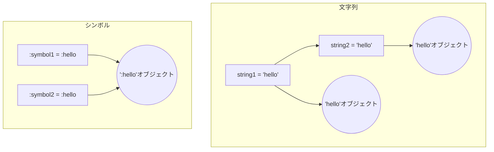

## はじめに

Rubyを使っていると、文字列とシンボルを頻繁に目にします。一見似ていますが、この2つには重要な違いがあります。基本的な違いとしては、文字列がミュータブル（変更可能）であるのに対し、シンボルはイミュータブル（変更不可）であるという点が挙げられます。また、同じ値の文字列は別のオブジェクトとして扱われるのに対し、同じ値のシンボルは同一のオブジェクトとして扱われます。

しかし、これらの違いを深く理解することは、Rubyを使ったプログラミングにおいて非常に重要です。適切に使い分けることで、バグを防ぎ、パフォーマンスを向上させ、コードの可読性と保守性を高めることができます。本記事では、文字列とシンボルの違いについて深掘りしていきます。

## 文字列とシンボルのメモリ管理

文字列とシンボルのメモリ管理の方法は異なります。

文字列は、新しい文字列が作成されるたびに、メモリ上に新しいオブジェクトが割り当てられます。これは、文字列がミュータブルであるため、各文字列オブジェクトが独自の状態を持つ必要があるためです。したがって、多数の文字列を扱う場合、メモリ使用量が増大する可能性があります。

一方、シンボルは、同じ値のシンボルが複数回使用されても、メモリ上には一度だけオブジェクトが割り当てられます。これは、シンボルがイミュータブルであるため、同じ値のシンボルは状態を共有できるためです。その結果、シンボルはメモリ使用量を削減できます。

以下の図は、文字列とシンボルのメモリ割り当ての違いを示しています。



また、文字列はガベージコレクションの対象となりますが、シンボルはガベージコレクションの対象外です。これは、シンボルがプログラムの実行中に動的に作成されることが少ないためです。

メモリ管理の違いは、パフォーマンスにも影響を与えます。一般的に、シンボルの方が文字列よりも高速に処理できます。ただし、シンボルを大量に作成すると、メモリ使用量が増大する可能性があるため、注意が必要です。

次の章では、イミュータブルとミュータブルの意味について詳しく説明します。

## イミュータブルとミュータブルの意味

オブジェクトがイミュータブルであるとは、その状態を変更できないことを意味します。一方、ミュータブルなオブジェクトは、状態を変更できます。Rubyにおいて、シンボルはイミュータブルで、文字列はミュータブルです。

イミュータブルであることの利点は、以下のようなものがあります。

1. 予期しない変更を防ぐことができる
2. 複数のスレッドから同時にアクセスしても安全（スレッドセーフ）
3. キャッシュやハッシュキーとして使いやすい

サンプルコード（Ruby）:

```ruby
string = "hello"
string << " world"
puts string #=> "hello world"

symbol = :hello
symbol << :world #=> NoMethodError: undefined method `<<' for :hello:Symbol
```

ミュータブルであることの利点は、以下のようなものがあります。

1. オブジェクトの状態を動的に変更できる
2. メモリの再利用が可能

サンプルコード（Ruby）:

```ruby
string = "hello"
string << " world"
puts string #=> "hello world"
```

スレッドセーフティについては、イミュータブルなオブジェクトの方が有利です。複数のスレッドが同時にイミュータブルなオブジェクトにアクセスしても、状態が変更されないため、競合状態が発生しません。一方、ミュータブルなオブジェクトを複数のスレッドが同時に変更しようとすると、予期しない結果を引き起こす可能性があります。

## シンボルと文字列の相互変換

Rubyではシンボルと文字列を相互に変換するためのメソッドが用意されています。

シンボルを文字列に変換するには、`to_s`メソッドを使用します。

サンプルコード（Ruby）:

```ruby
symbol = :hello
string = symbol.to_s
puts string #=> "hello"
```

文字列をシンボルに変換するには、`to_sym`メソッドを使用します。

サンプルコード（Ruby）:

```ruby
string = "hello"
symbol = string.to_sym
puts symbol #=> :hello
```

ただし、文字列からシンボルへの変換は、新しいシンボルオブジェクトを作成するため、メモリ使用量が増大する可能性があります。したがって、文字列をシンボルに変換する際は、必要性をよく検討する必要があります。

また、`to_sym`メソッドを使用する際は、文字列の内容が有効なシンボルであることを確認する必要があります。有効でない文字列をシンボルに変換しようとすると、`ArgumentError`が発生します。

サンプルコード（Ruby）:

```ruby
invalid_string = "hello world"
symbol = invalid_string.to_sym #=> ArgumentError: invalid symbol name
```

次の章では、ハッシュのキーとしての文字列とシンボルについて説明します。

## ハッシュのキーとしての文字列とシンボル

Rubyのハッシュでは、文字列とシンボルの両方をキーとして使用できます。ただし、文字列キーとシンボルキーには違いがあります。

文字列キーを使用する場合、同じ値の文字列であっても別のオブジェクトとして扱われます。

サンプルコード（Ruby）:

```ruby
hash = { "key" => "value" }
puts hash["key"] #=> "value"
```

一方、シンボルキーを使用する場合、同じ値のシンボルは同一のオブジェクトとして扱われます。

サンプルコード（Ruby）:

```ruby
hash = { :key => "value" }
puts hash[:key] #=> "value"
```

Railsにおいては、ハッシュのキーにシンボルを使用することが推奨されています。これは、Railsの多くの部分でシンボルキーが使用されているためです。

パフォーマンスとメモリ使用量の比較については、以下のようなベンチマークを実行して確認できます。

サンプルコード（Ruby）:

```ruby
require 'benchmark'

string_hash = {}
symbol_hash = {}

Benchmark.bm do |x|
  x.report("String keys") do
    10000000.times { |i| string_hash["key#{i}"] = i }
  end

  x.report("Symbol keys") do
    10000000.times { |i| symbol_hash["key#{i}".to_sym] = i }
  end
end
```

上記のベンチマークを実行すると、以下のような結果が得られることがあります。

```
       user     system      total        real
String keys  5.610000   0.430000   6.040000 (  6.046228)
Symbol keys 21.230000   1.670000  22.900000 ( 23.615576)
```

この結果だけを見ると、シンボルキーの方が文字列キーよりも遅いように見えます。これは、ベンチマークコードにおいて、シンボルキーを使用する部分で`to_sym`メソッドを呼び出しているためです。`to_sym`メソッドは文字列をシンボルに変換するメソッドですが、この変換処理自体にオーバーヘッドがあります。

ここで、ベンチマークの結果について説明します。

- user: ユーザー CPU 時間。コードの実行にかかったユーザー CPU 時間を示します。
- system: システム CPU 時間。コードの実行にかかったシステム CPU 時間を示します。
- total: トータル CPU 時間。ユーザー CPU 時間とシステム CPU 時間の合計を示します。
- real: 実経過時間。コードの実行開始から終了までの実際の経過時間を示します。

しかし、以下のように、あらかじめシンボルを作成しておき、ループ内では`to_sym`メソッドを呼び出さないようにすると、シンボルキーの方が高速になります。

サンプルコード（Ruby）:

```ruby
require 'benchmark'

string_hash = {}
symbol_hash = {}

symbols = 10000000.times.map { |i| "key#{i}".to_sym }

Benchmark.bm do |x|
  x.report("String keys") do
    10000000.times { |i| string_hash["key#{i}"] = i }
  end

  x.report("Symbol keys") do
    10000000.times { |i| symbol_hash[symbols[i]] = i }
  end
end
```

この修正されたベンチマークコードを実行すると、以下のような結果が得られます。

```
       user     system      total        real
String keys 10.795819   0.920129  11.715948 ( 11.882210)
Symbol keys  5.338033   0.122643   5.460676 (  5.487418)
```

この結果から、シンボルキーの方が文字列キーよりも高速であることがわかります。ただし、シンボルキーを使用する場合は、シンボルを動的に生成するのではなく、あらかじめシンボルを作成しておくことが重要です。動的にシンボルを生成すると、`to_sym`メソッドのオーバーヘッドが発生し、パフォーマンスが低下する可能性があります。

次の章では、フリーズした文字列とシンボルについて説明します。

## フリーズした文字列とシンボル

Rubyでは、`freeze`メソッドを使用してオブジェクトをフリーズ（凍結）できます。フリーズしたオブジェクトは、変更不可能になります。

サンプルコード（Ruby）:

```ruby
string = "hello"
string.freeze
string << " world" #=> FrozenError: can't modify frozen String
```

フリーズした文字列とシンボルは、どちらもイミュータブルであるという点で似ています。ただし、シンボルはデフォルトでイミュータブルであるのに対し、文字列は`freeze`メソッドを呼び出すことでイミュータブルになります。

また、フリーズした文字列とシンボルでは、メモリ使用量に違いがあります。シンボルは同じ値のオブジェクトが共有されるのに対し、フリーズした文字列は別のオブジェクトとして扱われます。

次の章では、Railsにおける文字列とシンボルの使い分けについて説明します。

## Railsにおける文字列とシンボルの使い分け

Railsでは、文字列とシンボルを適切に使い分けることが重要です。以下に、モデル、コントローラー、ビューでの使用例を示します。

### モデル

モデルでは、アソシエーションやバリデーションの定義にシンボルを使用します。

サンプルコード（Ruby）:

```ruby
class User < ApplicationRecord
  has_many :posts, dependent: :destroy
  validates :name, presence: true
end
```

### コントローラー

コントローラーでは、アクション名やストロングパラメータの指定にシンボルを使用します。

サンプルコード（Ruby）:

```ruby
class UsersController < ApplicationController
  def show
    @user = User.find(params[:id])
  end

  private

  def user_params
    params.require(:user).permit(:name, :email)
  end
end
```

### ビュー

ビューでは、リンクヘルパーやフォームヘルパーの引数にシンボルを使用します。

サンプルコード（ERB）:

```erb
<%= link_to 'Show', user_path(@user) %>
<%= form_with(model: @user, local: true) do |form| %>
  <%= form.text_field :name %>
  <%= form.submit %>
<% end %>
```

### ルーティング

ルーティングでは、コントローラーとアクションの指定にシンボルを使用します。

サンプルコード（Ruby）:

```ruby
Rails.application.routes.draw do
  resources :users, only: [:show, :edit, :update]
end
```

Railsにおけるベストプラクティスとしては、以下のようなものがあります。

1. アソシエーション、バリデーション、コールバックの定義にはシンボルを使用する
2. パラメータやオプションの指定にはシンボルを使用する
3. 文字列の連結が必要な場合を除き、文字列ではなくシンボルを使用する

## シンボルを使うことによる問題

シンボルを使うことによる問題の一つに、シンボル DOS 攻撃があります。これは、大量のシンボルを動的に作成することで、サーバーのメモリを枯渇させる攻撃です。

対策としては、以下のようなベストプラクティスがあります。

1. ユーザー入力をシンボルに変換しない
2. シンボルを動的に作成する際は、数に制限を設ける
3. シンボルガーベッジコレクションを有効にする

サンプルコード（Ruby）:

```ruby
# 悪い例
user_input = params[:user_input]
symbol = user_input.to_sym

# 良い例
ALLOWED_SYMBOLS = [:symbol1, :symbol2, :symbol3]
user_input = params[:user_input]
symbol = user_input.to_sym if ALLOWED_SYMBOLS.include?(user_input)
```

## まとめ

本記事では、Rubyの文字列とシンボルの違いについて深掘りしました。以下のようなポイントを説明しました。

1. 文字列とシンボルのメモリ管理の違い
2. イミュータブルとミュータブルの意味
3. シンボルと文字列の相互変換
4. ハッシュのキーとしての文字列とシンボル
5. フリーズした文字列とシンボル
6. Railsにおける文字列とシンボルの使い分け
7. シンボルを使うことによる問題

文字列とシンボルの違いを理解し、適切に使い分けることで、パフォーマンスとメモリ使用量を最適化できます。また、シンボルを適切に使用することで、コードの可読性と保守性を向上できます。

Rubyを使ったプログラミングでは、文字列とシンボルの違いを理解することが非常に重要です。本記事が、読者の理解を深める一助となれば幸いです。
