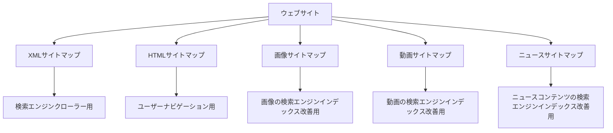
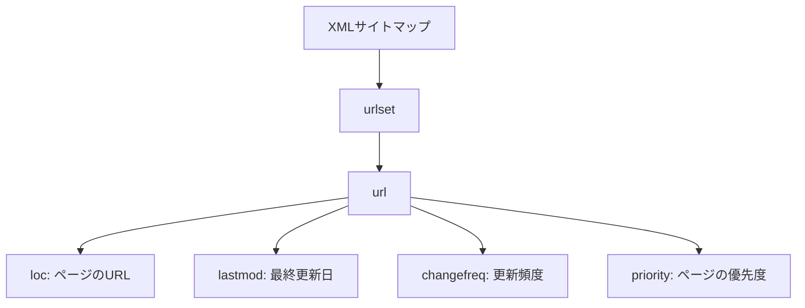
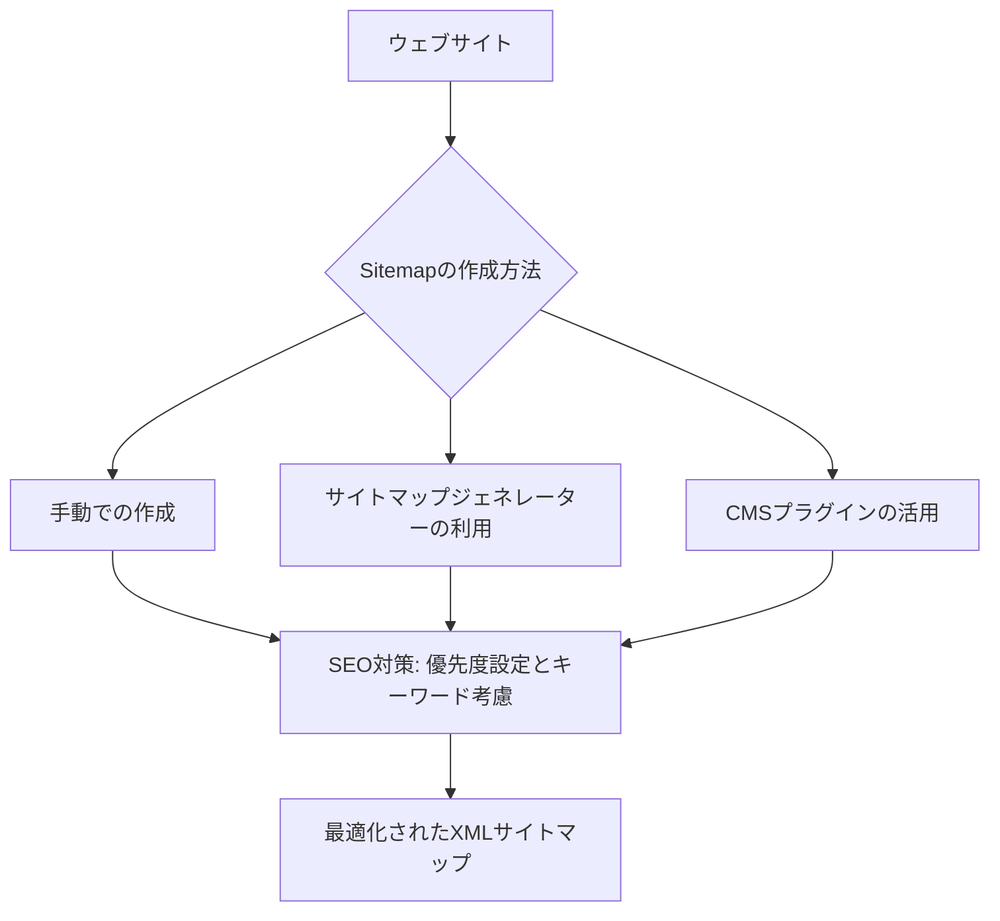
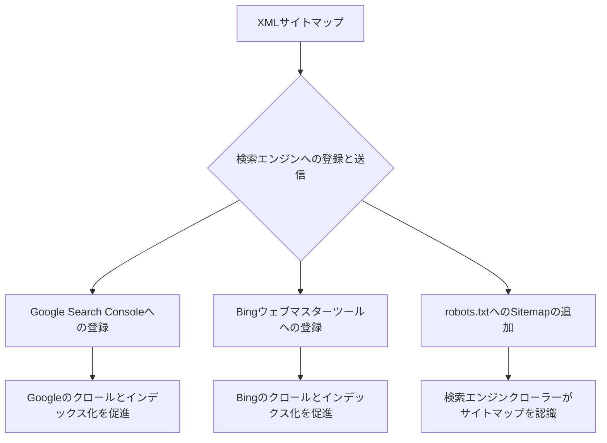
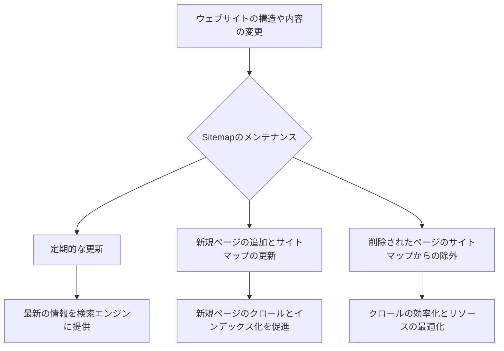

## 1. Sitemapの概要

Sitemapは、ウェブサイトのページ構造を階層的に示したファイルやページのことを指します。検索エンジンのクローラーがウェブサイトを効率的にクロールできるように、サイト内のURLを一覧化したものです。Sitemapを作成し、検索エンジンに提出することで、ウェブサイトのインデックス化を促進し、検索結果での表示順位を向上させることができます。

Sitemapの主な目的は以下の通りです：

1. 検索エンジンクローラーにウェブサイトの構造を伝える
2. 新しいページや更新されたページを検索エンジンに通知する
3. クロール頻度の調整とページの優先度を設定する
4. ウェブサイトのナビゲーションを改善し、ユーザーエクスペリエンスを向上させる

Sitemapは、ウェブサイトのSEO対策において非常に重要な役割を果たします。検索エンジンクローラーがサイト内のページを発見しやすくなるため、インデックス化が促進され、検索結果での表示順位が向上する可能性があります。また、Sitemapを通じてページの優先度を設定することで、重要なページにクローラーのリソースを集中させることができます。

以下にSitemapとSEOの関係を示す図解を示します：


Sitemapを効果的に活用することで、ウェブサイトのSEOパフォーマンスを向上させることができます。次の章では、Sitemapの種類と用途について詳しく説明します。


## 2. Sitemapの種類と用途

Sitemapには様々な種類があり、それぞれ異なる用途で使用されます。以下に主なSitemapの種類とその用途を説明します。

1. XMLサイトマップ：
  - 検索エンジンのクローラー専用のサイトマップ
  - ウェブサイトの全ページのURLを含む
  - ページの優先度やクロール頻度などのメタデータを提供
  - 検索エンジンのインデックス化を促進し、クロール効率を改善

2. HTMLサイトマップ：
  - ユーザー向けのサイトマップ
  - ウェブサイトの構造をわかりやすく視覚化
  - ユーザーナビゲーションを改善し、目的のページへの到達を容易にする
  - インターナルリンク構造を強化し、SEOにも寄与

3. 画像サイトマップ：
  - ウェブサイト内の画像情報を検索エンジンに提供
  - 画像の検索エンジンインデックス化を改善
  - 画像の関連情報（タイトル、説明、ライセンスなど）を含む

4. 動画サイトマップ：
  - ウェブサイト内の動画情報を検索エンジンに提供
  - 動画の検索エンジンインデックス化を改善
  - 動画の関連情報（タイトル、説明、再生時間など）を含む

5. ニュースサイトマップ：
  - ニュースコンテンツを検索エンジンに提供
  - Googleニュースなどのニュース専用検索エンジンのインデックス化を促進
  - 記事の公開日時や見出しなどの情報を含む

以下にSitemapの種類と用途の関係を示す図解を示します：



それぞれのSitemapを適切に作成し、活用することで、ウェブサイトのSEOパフォーマンスを向上させることができます。次の章では、XMLサイトマップの構造とSEO効果について詳しく説明します。


## 3. XMLサイトマップの構造とSEO効果

XMLサイトマップは、検索エンジンクローラー専用のサイトマップであり、ウェブサイトのすべてのページのURLを含む構造化されたファイルです。XMLサイトマップの基本構造は以下のようになっています：

```xml
<?xml version="1.0" encoding="UTF-8"?>
<urlset xmlns="http://www.sitemaps.org/schemas/sitemap/0.9">
  <url>
    <loc>https://www.example.com/page1.html</loc>
    <lastmod>2023-04-01</lastmod>
    <changefreq>daily</changefreq>
    <priority>0.8</priority>
  </url>
  <url>
    <loc>https://www.example.com/page2.html</loc>
    <lastmod>2023-03-28</lastmod>
    <changefreq>weekly</changefreq>
    <priority>0.6</priority>
  </url>
</urlset>
```

以下にXMLサイトマップの構造を示す図解を示します：



XMLサイトマップには、各ページのURLに加えて、以下のようなメタデータを含めることができます：

1. `<lastmod>`：ページの最終更新日
2. `<changefreq>`：ページの更新頻度（毎日、毎週、毎月など）
3. `<priority>`：ページの優先度（0.0〜1.0の範囲で指定）

これらのメタデータを適切に設定することで、検索エンジンクローラーにページの重要性や更新頻度を伝えることができます。

XMLサイトマップのSEO効果は以下の通りです：

1. クロールの効率化：検索エンジンクローラーがサイト内のページを発見しやすくなる
2. インデックス化の促進：新しいページや更新されたページが速やかにインデックス化される
3. クロール頻度の調整：更新頻度の高いページは、より頻繁にクロールされる
4. ページの優先度設定：重要なページにクローラーのリソースを集中させることができる

XMLサイトマップを効果的に活用することで、ウェブサイトのSEOパフォーマンスを向上させることができます。次の章では、Sitemapの作成方法とSEO対策について詳しく説明します。


## 4. Sitemapの作成方法とSEO対策

Sitemapの作成方法は、ウェブサイトの規模やプラットフォームによって異なります。以下に、それぞれの方法とSEO対策について説明します。

1. 手動での作成（小規模サイトに適した方法）：
  - XMLエディタやテキストエディタを使用してXMLサイトマップを手動で作成
  - すべてのページのURLを手動で入力
  - ページの優先度や更新頻度を手動で設定
  - SEO対策：重要なページにより高い優先度を設定し、キーワードを含むページを優先的にクロールさせる

2. サイトマップジェネレーターの利用（大規模サイトに適した方法）：
  - XMLサイトマップを自動生成するツールを使用（例：Screaming Frog、Yoast SEO）
  - ウェブサイトのURLを自動的にクロールし、XMLサイトマップを生成
  - ページの優先度や更新頻度を自動的に設定
  - SEO対策：ツールの設定を調整し、重要なページを優先的にクロールさせる

3. CMSプラグインの活用（WordPressなどのCMSを使用している場合）：
  - CMSのサイトマッププラグインを使用（例：Google XML Sitemaps、Yoast SEO）
  - プラグインの設定を通じて、XMLサイトマップを自動生成
  - ページの優先度や更新頻度を設定
  - SEO対策：プラグインの設定を最適化し、重要なページとSEOキーワードを考慮してサイトマップを生成

Sitemapを作成する際は、以下のSEO対策を考慮することが重要です：

1. ページの優先度付け：重要なページにより高い優先度を設定する
2. SEOキーワードの考慮：ターゲットキーワードを含むページを優先的にクロールさせる
3. 更新頻度の設定：頻繁に更新されるページには、より高い更新頻度を設定する
4. 不要なページの除外：検索エンジンにインデックスされる必要のないページ（管理画面、重複ページなど）はサイトマップから除外する

以下に、Sitemapの作成方法とSEO対策の関係を示す図解を示します：



適切な方法でSitemapを作成し、SEO対策を施すことで、検索エンジンクローラーによるインデックス化を促進し、ウェブサイトのSEOパフォーマンスを向上させることができます。次の章では、Sitemapの登録と送信方法について詳しく説明します。


## 5. Sitemapの登録と送信方法

Sitemapを作成した後は、検索エンジンに登録し、送信する必要があります。以下に、主要な検索エンジンへのSitemapの登録と送信方法を説明します。

1. Google Search Consoleへの登録：
  - Google Search Consoleにログインし、ウェブサイトのプロパティを追加
  - 「インデックス」>「サイトマップ」からサイトマップのURLを送信
  - Googleのクロールとインデックス化が促進される
  - SEO対策：定期的にサイトマップを更新し、Google Search Consoleで送信する

2. Bingウェブマスターツールへの登録：
  - Bingウェブマスターツールにログインし、ウェブサイトを追加
  - 「サイトマップ」タブからサイトマップのURLを送信
  - Bingのクロールとインデックス化が促進される
  - SEO対策：定期的にサイトマップを更新し、Bingウェブマスターツールで送信する

3. robots.txtへのSitemapの追加：
  - ウェブサイトのルートディレクトリにrobots.txtファイルを作成
  - robots.txtファイルにサイトマップのURLを追加（例：`Sitemap: https://www.example.com/sitemap.xml`）
  - 検索エンジンクローラーがrobots.txtを読み取り、サイトマップのURLを認識する
  - SEO対策：robots.txtでクロールのガイドラインを設定し、不要なページをクロールから除外する

以下に、Sitemapの登録と送信方法の関係を示す図解を示します：



主要な検索エンジンにSitemapを登録し、送信することで、ウェブサイトのクロールとインデックス化を促進し、SEOパフォーマンスを向上させることができます。次の章では、Sitemapのメンテナンスとその重要性について詳しく説明します。

## 6. SitemapのメンテナンスとSEO

Sitemapは作成して検索エンジンに送信するだけでなく、定期的にメンテナンスを行うことが重要です。ウェブサイトの構造や内容が変更された場合、Sitemapも適宜更新する必要があります。以下に、Sitemapのメンテナンスとその重要性について説明します。

1. 定期的な更新の重要性：
  - ウェブサイトの構造や内容が変更された際は、Sitemapを更新する
  - 新しいコンテンツのクロールとインデックス化を促進
  - 古いページや不要なページをSitemapから除外
  - SEO対策：定期的にサイトマップを更新することで、検索エンジンに最新の情報を提供する

2. 新規ページの追加とサイトマップの更新：
  - 新しいページを公開した際は、SitemapにそのページのURLを追加
  - 新規ページのクロールとインデックス化を促進
  - 新規ページのSEOパフォーマンス向上に寄与
  - SEO対策：新規ページのURLをタイムリーにサイトマップに追加し、検索エンジンに通知する

3. 削除されたページのサイトマップからの除外：
  - 不要になったページやURLが変更されたページをサイトマップから除外
  - クロールの効率化とリソースの最適化
  - 不要なページがインデックスされることを防ぐ
  - SEO対策：サイトマップから不要なページを除外することで、検索エンジンのクロールを最適化する

以下に、Sitemapのメンテナンスとサイト構造の変更の関係を示す図解を示します：



Sitemapを定期的にメンテナンスし、ウェブサイトの構造や内容の変更に合わせて更新することで、検索エンジンのクロールとインデックス化を最適化し、SEOパフォーマンスを向上させることができます。

## 7. まとめ

Sitemapは、ウェブサイトのSEO対策において非常に重要な役割を果たします。Sitemapを適切に作成、登録、メンテナンスすることで、検索エンジンクローラーによるウェブサイトのクロールとインデックス化を促進し、検索結果での表示順位を向上させることができます。

以下に、Sitemapの重要ポイントとSEO効果をまとめます：

1. Sitemapは、ウェブサイトの構造を検索エンジンに伝える重要なツールである
2. XMLサイトマップは、検索エンジンクローラー専用のサイトマップであり、ページの優先度や更新頻度などのメタデータを提供する
3. Sitemapを作成する際は、ページの優先度付けやSEOキーワードを考慮することが重要である
4. 作成したSitemapは、主要な検索エンジン（Google、Bing）に登録し、送信する必要がある
5. ウェブサイトの構造や内容が変更された際は、Sitemapを適宜更新し、メンテナンスを行う
6. Sitemapを活用することで、クロールの効率化、インデックス化の促進、検索順位の向上などのSEO効果が期待できる

サイトのSEO対策において、Sitemapは不可欠な要素です。ウェブサイトの規模や構造に合わせて適切なSitemapを作成し、定期的にメンテナンスを行うことで、検索エンジンからの評価を高め、ウェブサイトのSEOパフォーマンスを向上させることができます。

Sitemapについて理解を深め、効果的に活用することで、ウェブサイトの検索エンジン最適化戦略をより強固なものにしていきましょう。
