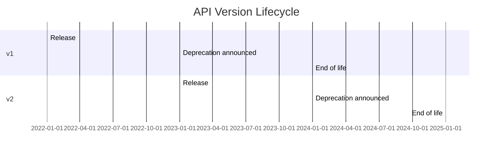
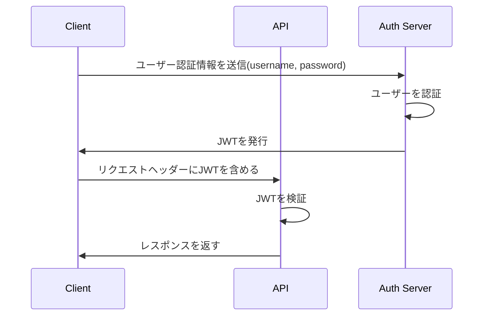
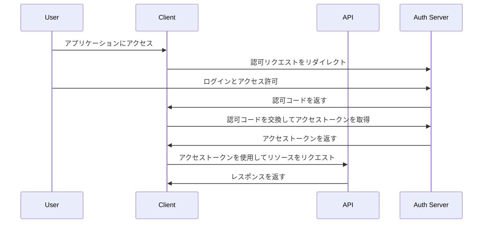

## 1. RESTful APIの原則

RESTful APIは、Webサービスを設計するための一連の原則です。これらの原則に従うことで、スケーラブルで保守性の高いAPIを開発することができます。この章では、RESTful APIの主要な概念について説明し、実際の例を交えながら、APIの設計方法を詳しく見ていきます。

### 1.1 リソースベースの設計

RESTful APIの中核となるのは、リソースベースの設計です。リソースは、APIを通じて操作される情報の基本的な単位です。例えば、ユーザー、商品、注文などがリソースに該当します。各リソースには一意の識別子（通常はID）が割り当てられ、URLを通じてアクセスされます。

```python
# ユーザーリソースの例
/users/123
```

### 1.2 適切なHTTPメソッドの選択

RESTful APIでは、HTTPメソッドを使用してリソースに対する操作を表現します。主要なHTTPメソッドとその用途は以下の通りです。

- GET：リソースの取得
- POST：新しいリソースの作成
- PUT：既存のリソースの更新（全体の置き換え）
- PATCH：既存のリソースの部分的な更新
- DELETE：リソースの削除

以下は、ユーザーリソースに対する操作の例です。

```python
GET /users/123 # ユーザー123の情報を取得
POST /users # 新しいユーザーを作成
PUT /users/123 # ユーザー123の情報を更新（全体の置き換え）
PATCH /users/123 # ユーザー123の情報を部分的に更新
DELETE /users/123 # ユーザー123を削除
```

### 1.3 直感的なURL設計

RESTful APIでは、URLを使用してリソースを表現します。URLは階層構造を持ち、リソース間の関係を表現することができます。以下は、ユーザーと関連するリソースのURL設計例です。

```
/users # ユーザーリソースのコレクション
/users/123 # ID123のユーザーリソース
/users/123/orders # ユーザー123の注文リソースのコレクション
/users/123/orders/456 # ユーザー123の注文ID456の注文リソース
```

### 1.4 ステートレスな通信

RESTful APIでは、サーバーはクライアントの状態を保持せず、各リクエストは独立して処理されます。これにより、APIのスケーラビリティと信頼性が向上します。必要な情報はすべてリクエストに含められ、サーバーはレスポンスを返すだけです。

### 1.5 HATEOASの活用

HATEOAS（Hypermedia as the Engine of Application State）は、APIレスポンスにリソース間のリンクを含めることで、クライアントがAPIの構造を動的に発見できるようにする概念です。これにより、APIの使いやすさと柔軟性が向上します。

```json
{
  "id": 123,
  "name": "John Doe",
  "email": "john@example.com",
  "_links": {
    "self": { "href": "/users/123" },
    "orders": { "href": "/users/123/orders" }
  }
}
```

上記の例では、`_links`プロパティを使用して、ユーザーリソース自身へのリンクと、関連する注文リソースへのリンクを提供しています。

以上が、RESTful APIの主要な原則です。これらの原則に従うことで、柔軟で拡張性の高いAPIを設計することができます。次の章では、APIのバージョニング戦略について詳しく説明します。

## 2. バージョニング戦略

APIを運用していく上で、バージョニングは重要な役割を果たします。新しい機能の追加や既存の機能の変更など、APIは時間とともに進化していきます。適切なバージョニング戦略を採用することで、APIの変更によるクライアントへの影響を最小限に抑えることができます。

### 2.1 URLベースのバージョニング

URLベースのバージョニングでは、APIのバージョンをURLに含めます。これにより、異なるバージョンのAPIを同時に運用することができます。以下は、URLベースのバージョニングの例です。

```
https://api.example.com/v1/users
https://api.example.com/v2/users
```

### 2.2 リクエストヘッダーベースのバージョニング

リクエストヘッダーベースのバージョニングでは、クライアントがリクエストヘッダーを使用してAPIのバージョンを指定します。これにより、URLはバージョンに依存せず、よりクリーンな設計が可能になります。

```
GET /users HTTP/1.1
Host: api.example.com
Accept: application/vnd.example.v1+json
```

### 2.3 バージョニングの適用例

バージョニングを適用する際は、APIの変更内容に応じて適切な方法を選択する必要があります。以下は、バージョニングの適用例です。

1. 後方互換性のある変更（例：新しいフィールドの追加）
   - バージョンアップは不要
2. 後方互換性のない変更（例：既存のフィールドの削除）
   - 新しいバージョンを作成し、古いバージョンは一定期間維持
3. 大幅な変更（例：APIの構造自体の変更）
   - 新しいバージョンを作成し、古いバージョンは段階的に廃止

### 2.4 移行期間とサポート期間の設定

バージョンアップの際は、クライアントが新しいバージョンに移行できるように十分な期間を設ける必要があります。また、古いバージョンのサポート期間を明確に定め、クライアントに周知する必要があります。

以下は、APIバージョンの移行期間とサポート期間の設定例です。



上記の例では、v1は2022年1月にリリースされ、2023年1月に非推奨化が発表され、2024年1月にサポートが終了します。v2は2023年1月にリリースされ、2024年1月に非推奨化が発表され、2025年1月にサポートが終了します。

バージョニング戦略を適切に実装することで、APIの進化と安定性のバランスを取ることができます。次の章では、エラーハンドリングとHTTPステータスコードについて詳しく説明します。

## 3. エラーハンドリングとHTTPステータスコード

APIを設計する際、適切なエラーハンドリングとHTTPステータスコードの使用は非常に重要です。エラーが発生した場合、クライアントに適切なフィードバックを提供することで、問題の特定と解決が容易になります。

### 3.1 一般的なHTTPステータスコードの使用

HTTPステータスコードは、リクエストの結果をクライアントに伝えるために使用されます。以下は、APIで一般的に使用されるHTTPステータスコードです。

- 200 OK：リクエストが成功した場合
- 201 Created：新しいリソースが作成された場合
- 400 Bad Request：リクエストが無効な場合
- 401 Unauthorized：認証が必要な場合
- 403 Forbidden：アクセスが禁止されている場合
- 404 Not Found：リソースが見つからない場合
- 500 Internal Server Error：サーバー内でエラーが発生した場合

### 3.2 エラーレスポンスのフォーマット

エラーが発生した場合、レスポンスには適切なHTTPステータスコードとともに、エラーの詳細を含める必要があります。以下は、エラーレスポンスのフォーマット例です。

```json
{
  "error": {
    "code": "invalid_parameter",
    "message": "The 'email' field is required.",
    "details": [
      {
        "field": "email",
        "message": "This field is required."
      }
    ]
  }
}
```

上記の例では、`error`オブジェクトを使用してエラーの詳細を提供しています。`code`はエラーの種類を表すマシンリーダブルなコード、`message`はエラーの概要を説明する人間可読なメッセージ、`details`は個々のエラーの詳細を含む配列です。

### 3.3 エラーコードとエラーメッセージの設計

エラーコードとエラーメッセージは、APIの利用者にとって理解しやすく、一貫性のあるものである必要があります。エラーコードは、エラーの種類を一意に識別するために使用され、エラーメッセージは、エラーの原因と解決方法を明確に伝える必要があります。

以下は、エラーコードとエラーメッセージの設計例です。

```python
ERROR_CODES = {
    'invalid_parameter': 'リクエストパラメータが無効です。',
    'resource_not_found': 'リソースが見つかりません。',
    'authentication_failed': '認証に失敗しました。',
    # ...
}
```

上記の例では、`ERROR_CODES`定数を使用してエラーコードとエラーメッセージのマッピングを定義しています。これにより、APIの実装全体で一貫したエラーハンドリングが可能になります。

### 3.4 例外処理とログ記録

APIの実装では、適切な例外処理とログ記録が重要です。例外が発生した場合、適切なHTTPステータスコードとエラーレスポンスを返すとともに、エラーの詳細をログに記録する必要があります。これにより、問題の特定と解決が容易になります。

以下は、Pythonでの例外処理とログ記録の例です。

```python
import logging

logger = logging.getLogger(__name__)

try:
    # APIの処理
    # ...
except ResourceNotFoundError as e:
    logger.error(f"Resource not found: {str(e)}")
    return jsonify(error=error_response('resource_not_found', str(e))), 404
except AuthenticationError as e:
    logger.error(f"Authentication failed: {str(e)}")
    return jsonify(error=error_response('authentication_failed', str(e))), 401
except Exception as e:
    logger.exception("An unexpected error occurred.")
    return jsonify(error=error_response('internal_server_error', "An unexpected error occurred.")), 500
```

上記の例では、`try`ブロック内でAPIの処理を行い、発生した例外に応じて適切なエラーレスポンスとHTTPステータスコードを返しています。また、`logger`を使用してエラーの詳細をログに記録しています。

適切なエラーハンドリングとHTTPステータスコードの使用は、APIの利用者にとって重要です。次の章では、リクエストとレスポンスの設計について詳しく説明します。

## 4. リクエストとレスポンスの設計

APIのリクエストとレスポンスの設計は、APIの使いやすさと効率性に大きな影響を与えます。適切なデータ形式の選択、明確なデータ構造、および一貫性のある命名規則を使用することで、APIの利用者は容易にAPIを理解し、効果的に使用することができます。

### 4.1 JSONとXMLの選択

APIのデータ形式として、JSONとXMLが広く使用されています。JSONは、その単純さ、読みやすさ、およびJavaScriptとの親和性から、現在の多くのAPIで選択されています。一方、XMLは、その構造化された形式と豊富なツールサポートから、エンタープライズシステムで使用されることがあります。

APIのデータ形式は、APIの要件と利用者のニーズに基づいて選択する必要があります。ほとんどの場合、JSONが適切な選択肢となります。

### 4.2 データの構造化と命名規則

APIのリクエストとレスポンスでは、データを明確に構造化し、一貫性のある命名規則を使用する必要があります。以下は、ユーザーリソースのJSONレスポンス例です。

```json
{
  "id": 123,
  "firstName": "John",
  "lastName": "Doe",
  "email": "john.doe@example.com",
  "createdAt": "2023-03-31T10:30:00Z",
  "updatedAt": "2023-03-31T10:30:00Z"
}
```

上記の例では、各フィールドの名前はキャメルケース（`firstName`、`lastName`など）を使用し、日付と時刻の値はISO 8601形式を使用しています。

データの構造と命名規則を設計する際は、以下の点に留意してください。

- 一貫性のある命名規則を使用する（キャメルケース、スネークケースなど）
- わかりやすく、説明的な名前を使用する
- ネストされたオブジェクトを使用して関連データを構造化する
- 日付と時刻の値にはISO 8601形式を使用する
- エンベロープオブジェクトを使用してメタデータとデータを分離する

### 4.3 ページネーションとフィルタリング

大量のデータを扱うAPIでは、ページネーションとフィルタリングを実装することで、APIのパフォーマンスと使いやすさを向上させることができます。

ページネーションにより、データを小さなチャンクに分割し、一度に取得するデータ量を減らすことができます。以下は、ページネーションを実装したAPIレスポンスの例です。

```json
{
  "data": [
    {
      "id": 1,
      "name": "Alice"
    },
    {
      "id": 2,
      "name": "Bob"
    }
  ],
  "pagination": {
    "currentPage": 1,
    "perPage": 10,
    "totalPages": 5,
    "totalCount": 50
  }
}
```

上記の例では、`data`フィールドにはリソースの配列が含まれ、`pagination`オブジェクトにはページネーションに関するメタデータが含まれています。

フィルタリングにより、データをクライアントの要件に基づいて抽出することができます。以下は、フィルタリングを実装したAPIリクエストの例です。

```
GET /users?age=30&sort=name&order=asc
```

上記の例では、`age`パラメータを使用して30歳のユーザーに絞り込み、`sort`と`order`パラメータを使用して名前の昇順で結果をソートしています。

### 4.4 部分レスポンスと条件付きリクエスト

部分レスポンスにより、クライアントは必要なフィールドのみを取得することができます。これにより、ネットワーク帯域幅の使用量が削減され、APIのパフォーマンスが向上します。以下は、部分レスポンスを実装したAPIリクエストの例です。

```
GET /users/123?fields=id,firstName,lastName
```

上記の例では、`fields`パラメータを使用して、`id`、`firstName`、および`lastName`フィールドのみを取得しています。

条件付きリクエストにより、クライアントはキャッシュされたデータを効果的に利用することができます。以下は、条件付きリクエストを実装したAPIリクエストの例です。

```
GET /users/123
If-None-Match: "abc123"
```

上記の例では、`If-None-Match`ヘッダーを使用して、クライアントが保持するETagの値を指定しています。サーバー側でETagの値が一致する場合、`304 Not Modified`レスポンスを返すことで、データの転送を省略できます。

リクエストとレスポンスの設計は、APIの使いやすさと効率性に大きな影響を与えます。適切なデータ形式、明確な構造、一貫性のある命名規則、ページネーション、フィルタリング、部分レスポンス、および条件付きリクエストを適切に実装することで、APIの利用者にとって優れたエクスペリエンスを提供することができます。

次の章では、APIの認証と認可の実装について詳しく説明します。

## 5. 認証と認可の実装

APIのセキュリティを確保するために、適切な認証と認可のメカニズムを実装することが重要です。認証は、ユーザーの身元を確認するプロセスであり、認可は、ユーザーがリソースにアクセスする権限を持っているかどうかを決定するプロセスです。

### 5.1 JWTベースの認証

JSON Web Token（JWT）は、APIの認証に広く使用されているトークンベースの認証メカニズムです。JWTは、ユーザーの身元を表すクレームを含む暗号化されたトークンです。APIは、JWTを検証することでユーザーの身元を確認し、適切なアクセス権限を付与します。

以下は、JWTベースの認証フローの例です。



上記の例では、クライアントはまず認証サーバーにユーザー認証情報を送信します。認証が成功すると、認証サーバーはJWTを発行します。クライアントは、以降のAPIリクエストのヘッダーにJWTを含めます。APIは、JWTを検証し、ユーザーの身元を確認します。

### 5.2 OAuth 2.0の活用

OAuth 2.0は、APIの認可に広く使用されているプロトコルです。OAuth 2.0を使用することで、ユーザーは自分のアカウントへのアクセス権限を第三者のアプリケーションに付与することができます。これにより、APIはユーザーのプライバシーを保護しつつ、第三者のアプリケーションにリソースへのアクセスを許可することができます。

以下は、OAuth 2.0の認可コードグラントフローの例です。



上記の例では、ユーザーはまずクライアントアプリケーションにアクセスします。アプリケーションは、ユーザーを認可サーバーにリダイレクトして認可リクエストを行います。ユーザーは認可サーバーでログインし、アプリケーションへのアクセスを許可します。認可サーバーは認可コードをアプリケーションに返します。アプリケーションは認可コードを使用してアクセストークンを取得し、APIへのリクエストにアクセストークンを含めます。

### 5.3 ロールベースアクセス制御（RBAC）

ロールベースアクセス制御（RBAC）は、ユーザーの役割に基づいてリソースへのアクセス権限を管理する手法です。RBACを実装することで、APIはユーザーの役割に応じて適切なアクセス制御を行うことができます。

以下は、RBACの例です。

```python
from flask import Flask, request, jsonify
from functools import wraps

app = Flask(__name__)

def requires_role(role):
    def decorator(f):
        @wraps(f)
        def decorated(*args, **kwargs):
            # JWTからユーザーの役割を取得
            user_roles = get_user_roles_from_jwt(request)
            if role not in user_roles:
                return jsonify({"error": "Unauthorized"}), 403
            return f(*args, **kwargs)
        return decorated
    return decorator

@app.route('/api/admin')
@requires_role('admin')
def admin_endpoint():
    return jsonify({"message": "Admin endpoint accessed"})

@app.route('/api/user')
@requires_role('user')
def user_endpoint():
    return jsonify({"message": "User endpoint accessed"})
```

上記の例では、`requires_role`デコレーターを使用して、エンドポイントへのアクセスを特定の役割に制限しています。`/api/admin`エンドポイントには`admin`役割が必要であり、`/api/user`エンドポイントには`user`役割が必要です。

### 5.4 認証と認可のフロー

APIの認証と認可のフローは、アプリケーションの要件に応じて設計する必要があります。以下は、一般的な認証と認可のフローの例です。

1. ユーザーがクライアントアプリケーションにログインします。
2. クライアントアプリケーションは、ユーザーの認証情報を認証サーバーに送信します。
3. 認証サーバーはユーザーを認証し、アクセストークン（JWT）を発行します。
4. クライアントアプリケーションは、APIリクエストにアクセストークンを含めます。
5. APIは、アクセストークンを検証し、ユーザーの身元と権限を確認します。
6. APIは、ユーザーの権限に基づいてリソースへのアクセスを許可または拒否します。

適切な認証と認可のメカニズムを実装することで、APIのセキュリティを強化し、ユーザーのデータを保護することができます。

次の章では、APIドキュメンテーションの重要性と作成方法について説明します。

## 6. APIドキュメンテーション

APIドキュメンテーションは、APIの利用者がAPIの機能を理解し、効果的に使用するために不可欠です。適切なドキュメンテーションがあれば、開発者は簡単にAPIを理解し、アプリケーションにAPIを統合することができます。

### 6.1 OpenAPIとSwaggerの活用

OpenAPI（旧称Swagger）は、APIを記述するための標準的な仕様です。OpenAPIを使用することで、APIの構造、エンドポイント、パラメータ、レスポンスなどを詳細に定義することができます。OpenAPIの仕様に基づいてAPIドキュメンテーションを作成することで、APIの利用者に一貫性のある明確な情報を提供することができます。

以下は、OpenAPIを使用したAPIエンドポイントの定義例です。

```yaml
paths:
  /users:
    get:
      summary: ユーザー一覧の取得
      description: 全ユーザーの一覧を取得します。
      parameters:
        - name: page
          in: query
          description: ページ番号
          required: false
          schema:
            type: integer
            default: 1
        - name: per_page
          in: query
          description: 1ページあたりのユーザー数
          required: false
          schema:
            type: integer
            default: 10
      responses:
        "200":
          description: 成功レスポンス
          content:
            application/json:
              schema:
                $ref: "#/components/schemas/UserList"
```

上記の例では、`/users`エンドポイントのGETメソッドを定義しています。エンドポイントの概要、説明、パラメータ、レスポンスが詳細に記述されています。

### 6.2 ドキュメントの自動生成

OpenAPIの仕様に基づいてAPIを実装することで、ドキュメンテーションの自動生成が可能になります。Swaggerツールを使用することで、APIの実装からOpenAPIの仕様を生成し、そこからドキュメンテーションを自動的に作成することができます。

以下は、PythonでFastAPIを使用してAPIを実装し、Swaggerでドキュメンテーションを自動生成する例です。

```python
from fastapi import FastAPI

app = FastAPI()

@app.get("/users", tags=["Users"])
async def get_users(page: int = 1, per_page: int = 10):
    # ユーザー一覧を取得するロジックを実装
    return {"users": [...]}

# Swagger UIのエンドポイントを追加
from fastapi.openapi.docs import get_swagger_ui_html
from fastapi.openapi.utils import get_openapi

@app.get("/docs", include_in_schema=False)
async def get_documentation():
    openapi_url = app.openapi_url
    return get_swagger_ui_html(openapi_url=openapi_url, title="API Documentation")

@app.get("/openapi.json", include_in_schema=False)
async def get_openapi_json():
    return get_openapi(title=app.title, version=app.version, routes=app.routes)
```

上記の例では、FastAPIを使用してAPIを実装しています。`/users`エンドポイントを定義し、Swaggerの`tags`パラメータを使用してドキュメンテーションのセクションを指定しています。また、`/docs`エンドポイントを追加して、Swagger UIを表示するようにしています。

### 6.3 ドキュメントの管理と更新

APIドキュメンテーションは、APIの変更に合わせて継続的に更新する必要があります。APIの仕様が変更された場合、それに応じてドキュメンテーションを更新することが重要です。

ドキュメンテーションの管理には、以下のようなベストプラクティスがあります。

- ドキュメンテーションをバージョン管理する
- APIの変更とドキュメンテーションの更新を同期する
- 自動化されたドキュメンテーションの生成プロセスを確立する
- ドキュメンテーションのレビューと承認プロセスを設ける

適切なAPIドキュメンテーションを作成し、継続的に更新することで、APIの利用者に最新の情報を提供し、APIの導入と使用を促進することができます。

次の章では、APIのテスティングとデプロイメントについて説明します。

## 7. テスティングとデプロイメント

APIの信頼性と品質を確保するために、適切なテスト戦略とデプロイメントプロセスを確立することが重要です。APIのテストでは、単体テスト、統合テスト、自動化されたテストを実施し、APIの機能と性能を検証します。また、APIのデプロイメントでは、ステージング環境とプロダクション環境を適切に管理し、継続的インテグレーションと継続的デプロイメント（CI/CD）のプラクティスを適用します。

### 7.1 単体テストと統合テスト

単体テストでは、APIの個々のコンポーネントやメソッドが正しく機能することを検証します。各エンドポイントや機能に対して、さまざまな入力値や条件をテストし、期待される出力と実際の出力を比較します。単体テストを徹底的に行うことで、APIの個々の部分の正確性を確保できます。

統合テストでは、APIのコンポーネントが相互に正しく連携して機能することを検証します。複数のエンドポイントやサービスを組み合わせてテストを行い、APIが全体として期待通りに動作することを確認します。統合テストにより、APIの異なる部分間の相互作用やデータフローの問題を発見できます。

以下は、Pythonでの単体テストの例です。

```python
import unittest
from myapi import app

class TestMyAPI(unittest.TestCase):
    def setUp(self):
        self.client = app.test_client()

    def test_get_users(self):
        response = self.client.get('/users')
        self.assertEqual(response.status_code, 200)
        self.assertIsInstance(response.json['users'], list)

    def test_create_user(self):
        user_data = {'name': 'John Doe', 'email': 'john@example.com'}
        response = self.client.post('/users', json=user_data)
        self.assertEqual(response.status_code, 201)
        self.assertIn('id', response.json)

if __name__ == '__main__':
    unittest.main()
```

上記の例では、`unittest`モジュールを使用して単体テストを定義しています。`setUp`メソッドでテスト用のクライアントを初期化し、`test_get_users`と`test_create_user`メソッドでエンドポイントの動作をテストしています。

### 7.2 自動化されたAPIテスト

APIのテストを自動化することで、リグレッションを防ぎ、APIの品質を継続的に維持することができます。自動化されたテストでは、APIのエンドポイントに対して定義されたテストケースを自動的に実行し、結果を検証します。

APIの自動テストには、以下のようなツールや手法を活用できます。

- Postman：APIの手動テストと自動テストを行うためのツール
- Swagger Codegen：OpenAPIの仕様からテストコードを自動生成
- Continuous Integration（CI）ツール：Jenkins、CircleCI、GitLab CIなど

自動化されたテストを実施することで、APIの変更によるリグレッションを早期に発見し、APIの品質を維持することができます。

### 7.3 ステージング環境とプロダクション環境

APIのデプロイメントでは、ステージング環境とプロダクション環境を適切に管理することが重要です。ステージング環境は、本番環境に近い設定で動作する環境であり、新しい機能やバグ修正を本番環境にリリースする前にテストするために使用されます。プロダクション環境は、実際のユーザーに提供される本番環境です。

ステージング環境とプロダクション環境の管理には、以下のようなプラクティスがあります。

- 環境の分離：ステージング環境とプロダクション環境を明確に分離する
- 設定の管理：環境ごとの設定を適切に管理する（環境変数、設定ファイルなど）
- データの管理：テスト用のデータとプロダクションデータを分離する
- アクセス制御：ステージング環境へのアクセスを制限する

### 7.4 継続的インテグレーションと継続的デプロイメント（CI/CD）

継続的インテグレーション（CI）と継続的デプロイメント（CD）は、APIの開発とデプロイメントを自動化するプラクティスです。CIでは、コードの変更が頻繁に統合され、自動的にビルドとテストが実行されます。CDでは、CIのプロセスを拡張し、検証済みのコードを自動的にステージング環境やプロダクション環境にデプロイします。

CI/CDを実装するには、以下のようなツールや手法を活用できます。

- CI/CDツール：Jenkins、CircleCI、GitLab CI/CD、AWS CodePipelineなど
- コンテナ化技術：Docker、Kubernetesを使用してデプロイメントを自動化
- インフラストラクチャのコード化：Terraform、AWS CloudFormationなどを使用して環境のプロビジョニングを自動化

CI/CDを適用することで、APIの開発からデプロイメントまでのプロセスを自動化し、リリースサイクルを短縮することができます。また、品質の高いAPIを安定的に提供することができます。

適切なテスト戦略とデプロイメントプロセスを確立することで、APIの信頼性と品質を確保し、ユーザーに価値を提供し続けることができます。

次の章では、APIのパフォーマンスとスケーラビリティについて説明します。

## 8. パフォーマンスとスケーラビリティ

APIのパフォーマンスとスケーラビリティは、ユーザーエクスペリエンスと APIの成功に大きな影響を与えます。レスポンスタイムが長すぎたり、トラフィックの増加に対応できなかったりすると、ユーザーの満足度が低下し、APIの利用が敬遠されてしまいます。そのため、APIのパフォーマンスを最適化し、スケーラビリティを確保することが重要です。

### 8.1 キャッシングの適用

キャッシングは、APIのパフォーマンスを向上させるための効果的な手法です。頻繁にアクセスされるデータや計算結果をキャッシュに保存しておくことで、リクエストに対する応答時間を短縮できます。キャッシングは、サーバー側とクライアント側の両方で実装できます。

サーバー側のキャッシングでは、以下のような手法があります。

- データベースクエリ結果のキャッシング
- APIレスポンスのキャッシング
- Redisなどのインメモリデータストアの活用

クライアント側のキャッシングでは、以下のような手法があります。

- HTTPヘッダーを使用したブラウザキャッシング（`Cache-Control`、`ETag`など）
- ローカルストレージやセッションストレージの活用

キャッシングを適切に実装することで、APIの応答時間を短縮し、サーバーの負荷を軽減できます。

### 8.2 非同期処理とバックグラウンドタスク

APIのパフォーマンスを向上させるもう一つの手法は、非同期処理とバックグラウンドタスクの活用です。リクエストの処理に時間がかかる場合、同期的に処理を行うとレスポンスタイムが長くなってしまいます。そこで、非同期処理を適用し、リクエストの処理をバックグラウンドで実行することで、レスポンスを早く返すことができます。

非同期処理を実装するには、以下のようなアプローチがあります。

- マルチスレッディングやマルチプロセッシングの活用
- イベントループベースの非同期フレームワーク（Node.js、Python asyncioなど）の使用
- メッセージキュー（RabbitMQ、Apache Kafkaなど）を介した非同期タスクの実行

バックグラウンドタスクを管理するには、以下のようなツールを活用できます。

- Celery（Python）
- Sidekiq（Ruby）
- Resque（Ruby）

非同期処理とバックグラウンドタスクを適切に活用することで、APIの応答性を維持しつつ、リソース集約的な処理を効率的に実行できます。

### 8.3 ロードバランシングと水平スケーリング

トラフィックの増加に対応するために、ロードバランシングと水平スケーリングを適用することが重要です。ロードバランシングは、複数のサーバーにトラフィックを分散することで、個々のサーバーの負荷を軽減します。水平スケーリングは、サーバーの台数を増やすことで、システム全体の処理能力を向上させます。

ロードバランシングを実装するには、以下のようなツールや手法があります。

- ソフトウェアロードバランサー（NGINX、HAProxyなど）
- クラウドプロバイダのロードバランサー（AWS ELB、Google Cloud Load Balancingなど）
- コンテナオーケストレーションプラットフォーム（Kubernetes、Docker Swarmなど）

水平スケーリングを実現するには、以下のようなアプローチがあります。

- オートスケーリングの設定（AWS Auto Scaling、Kubernetes Horizontal Pod Autoscalerなど）
- コンテナ化技術の活用（Docker、Kubernetes）
- サーバーレスアーキテクチャの採用（AWS Lambda、Google Cloud Functions）

ロードバランシングと水平スケーリングを適切に組み合わせることで、トラフィックの変動に柔軟に対応し、APIのパフォーマンスを維持することができます。

### 8.4 パフォーマンスモニタリングと最適化

APIのパフォーマンスを継続的に監視し、ボトルネックを特定して最適化することが重要です。パフォーマンスモニタリングでは、以下のような指標を収集し、分析します。

- レスポンスタイム
- リクエスト率とエラー率
- CPU使用率とメモリ使用率
- データベースクエリのパフォーマンス

パフォーマンスモニタリングには、以下のようなツールを活用できます。

- APMツール（New Relic、Datadog、AppDynamicsなど）
- ログ分析ツール（ELK Stack、Splunkなど）
- クラウドプロバイダのモニタリングサービス（AWS CloudWatch、Google Stackdriverなど）

パフォーマンスの問題が特定されたら、以下のような最適化手法を適用できます。

- アルゴリズムとデータ構造の最適化
- データベースインデックスの適切な設定
- キャッシングの適用
- 非同期処理の活用
- リソースの垂直スケーリング（CPU、メモリの増強）

継続的なパフォーマンスモニタリングと最適化により、APIのパフォーマンスを高い水準に維持し、ユーザーエクスペリエンスを向上させることができます。

APIのパフォーマンスとスケーラビリティは、ユーザーの満足度と APIの成功に直結する重要な要素です。キャッシング、非同期処理、ロードバランシング、水平スケーリング、パフォーマンスモニタリングといった手法を適切に活用することで、高性能で拡張性の高いAPIを構築することができます。

次の章では、APIのセキュリティのベストプラクティスについて説明します。

## 9. セキュリティのベストプラクティス

APIのセキュリティは、機密データの保護とシステムの安全性を確保するために非常に重要です。APIは、インターネットを介してアクセス可能であるため、さまざまな脅威にさらされています。適切なセキュリティ対策を講じることで、データの漏洩や不正アクセスを防止し、APIの信頼性を維持することができます。

### 9.1 HTTPSの適用

APIの通信は、機密情報を含むことが多いため、常にHTTPS（SSL/TLS）を使用して暗号化する必要があります。HTTPSを適用することで、通信内容を盗聴や改ざんから保護できます。APIサーバーでは、信頼できる証明書を取得し、適切に設定する必要があります。

HTTPSを適用する際は、以下の点に注意が必要です。

- 信頼できる認証局（CA）から証明書を取得する
- 強力な暗号化アルゴリズムを使用する（TLS 1.2以上）
- 証明書の有効期限を定期的にチェックし、更新する
- HSTS（HTTP Strict Transport Security）を有効にしてHTTPからHTTPSへのリダイレクトを強制する

### 9.2 入力バリデーションとサニタイズ

APIに対する入力データは、常に検証し、サニタイズする必要があります。不適切な入力データは、SQLインジェクションやクロスサイトスクリプティング（XSS）などの脆弱性につながる可能性があります。入力バリデーションでは、データの型、長さ、形式などを検証し、不正な値を拒否します。サニタイズでは、危険な文字やコードを適切にエスケープまたは削除します。

入力バリデーションとサニタイズを実装する際は、以下の点に注意が必要です。

- ホワイトリストベースのバリデーションを使用する（許可されている値のみを受け入れる）
- パラメータバインディングを使用してSQLインジェクションを防止する
- 出力エンコーディングを適用してXSSを防止する
- ライブラリやフレームワークの提供するバリデーション機能を活用する

### 9.3 レート制限とスロットリング

APIに対する過度なリクエストは、サービス拒否攻撃（DoS攻撃）や不正な利用につながる可能性があります。レート制限とスロットリングを適用することで、APIの濫用を防止し、リソースの枯渇を防ぐことができます。レート制限では、一定期間内のリクエスト数に制限を設け、制限を超えた場合はエラーレスポンスを返します。スロットリングでは、リクエストの処理速度を調整し、サーバーの負荷を制御します。

レート制限とスロットリングを実装する際は、以下の点に注意が必要です。

- ユーザーやIPアドレスごとにレート制限を設定する
- レート制限の情報をレスポンスヘッダーに含める（`X-RateLimit-Limit`、`X-RateLimit-Remaining`など）
- スロットリングのアルゴリズムを適切に選択する（トークンバケット、リークバケットなど）
- 一時的なトラフィックの増加に対応できるようにする

### 9.4 セキュリティヘッダーの設定

APIレスポンスには、適切なセキュリティヘッダーを設定することで、クライアント側のセキュリティを強化できます。以下は、一般的に使用されるセキュリティヘッダーです。

- `X-Content-Type-Options: nosniff` - MIMEタイプのスニッフィングを防止する
- `X-Frame-Options: DENY` - クリックジャッキング攻撃を防止する
- `X-XSS-Protection: 1; mode=block` - ブラウザのXSS保護機能を有効にする
- `Strict-Transport-Security: max-age=31536000; includeSubDomains` - HTTPS接続を強制する
- `Content-Security-Policy: default-src 'self'` - コンテンツの読み込み元を制限する

これらのセキュリティヘッダーを適切に設定することで、クライアント側の脆弱性を軽減し、APIの安全性を高めることができます。

APIのセキュリティは、データの機密性と完全性を維持するために欠かせません。HTTPS、入力バリデーション、レート制限、セキュリティヘッダーなどの対策を講じることで、APIを安全に運用することができます。セキュリティは継続的なプロセスであり、定期的な脆弱性スキャンやセキュリティ監査を実施し、常に最新の脅威に対応していくことが重要です。

次の章では、APIのエラー処理と監視について説明します。

## 10. エラー処理と監視

APIを安定的に運用するためには、適切なエラー処理と監視が不可欠です。エラー処理では、発生したエラーを適切にハンドリングし、クライアントに分かりやすいエラーメッセージを提供します。監視では、APIのパフォーマンスや可用性を継続的に追跡し、問題の早期発見と解決に役立てます。

### 10.1 エラーログとモニタリング

APIで発生したエラーは、詳細なログに記録し、モニタリングすることが重要です。エラーログには、エラーの種類、発生時刻、関連する情報（リクエストデータ、スタックトレースなど）を含めます。これにより、エラーの原因特定と修正が容易になります。

エラーログとモニタリングを実装する際は、以下の点に注意が必要です。

- ログレベル（DEBUG、INFO、WARNING、ERROR）を適切に設定する
- ログのフォーマットを統一し、機械可読性を確保する
- 機密情報（パスワード、APIキーなど）をログに含めないようにする
- ログ管理システム（ELK Stack、Splunkなど）を活用する
- エラー率やエラーパターンを監視し、異常を検知する

### 10.2 アラートとエスカレーション

重大なエラーが発生した場合や、APIのパフォーマンスが低下した場合は、速やかにアラートを発信し、適切なエスカレーションを行う必要があります。アラートは、メール、SMS、チャットツールなどを通じて関係者に通知します。エスカレーションでは、問題の重大度に応じて対応方法を定義し、適切な人員に対処を依頼します。

アラートとエスカレーションを設定する際は、以下の点に注意が必要です。

- 重大度に応じたアラートの閾値を設定する
- アラートの受信者と連絡方法を明確に定義する
- エスカレーション手順を文書化し、関係者に周知する
- アラート疲れを防ぐために、アラートの優先度を適切に設定する

### 10.3 障害対応とインシデント管理

APIで障害が発生した場合は、迅速に対応し、インシデントを適切に管理する必要があります。障害対応では、問題の切り分け、原因特定、修正、検証を行います。インシデント管理では、障害の影響範囲や対応状況を追跡し、ステークホルダーに適宜報告します。

障害対応とインシデント管理を効果的に行うには、以下の点に注意が必要です。

- インシデント管理ツール（Jira、ServiceNowなど）を活用する
- 障害の影響範囲と重大度を評価する
- 障害対応の手順を文書化し、定期的に訓練する
- 復旧後に根本原因分析（RCA）を実施し、再発防止策を講じる

### 10.4 ポストモーテム分析と改善

障害対応が完了した後は、ポストモーテム分析を実施し、教訓を得ることが重要です。ポストモーテム分析では、以下の点を検討します。

- 障害の原因と影響
- 対応の適切性と効果
- 検知と通知の適切性
- 復旧までのタイムライン
- 再発防止策と改善点

ポストモーテム分析の結果は、文書化し、関係者で共有します。得られた教訓を活かし、APIの信頼性と回復力を継続的に向上させていくことが重要です。

エラー処理と監視は、APIの安定運用に欠かせない要素です。適切なログ記録、アラート設定、障害対応、ポストモーテム分析を通じて、APIの可用性と信頼性を高めることができます。また、これらの活動を通じて得られた知見を継続的に改善に活かしていくことが重要です。

## まとめ

本記事では、APIを設計・開発する際の実践的なベストプラクティスについて詳しく解説しました。以下のトピックについて説明しました。

1. RESTful APIの原則
2. バージョニング戦略
3. エラーハンドリングとHTTPステータスコード
4. リクエストとレスポンスの設計
5. 認証と認可の実装
6. APIドキュメンテーション
7. テスティングとデプロイメント
8. パフォーマンスとスケーラビリティ
9. セキュリティのベストプラクティス
10. エラー処理と監視

これらのベストプラクティスを適用することで、堅牢で信頼性が高く、ユーザーフレンドリーなAPIを開発することができます。ただし、APIの設計と開発は継続的なプロセスであり、常に改善の余地があることを忘れてはいけません。新しい技術や手法を取り入れ、フィードバックを得ながら、APIを進化させていくことが重要です。

開発者の皆様が、本記事で紹介したベストプラクティスを参考にしながら、素晴らしいAPIを設計・開発されることを願っています。
