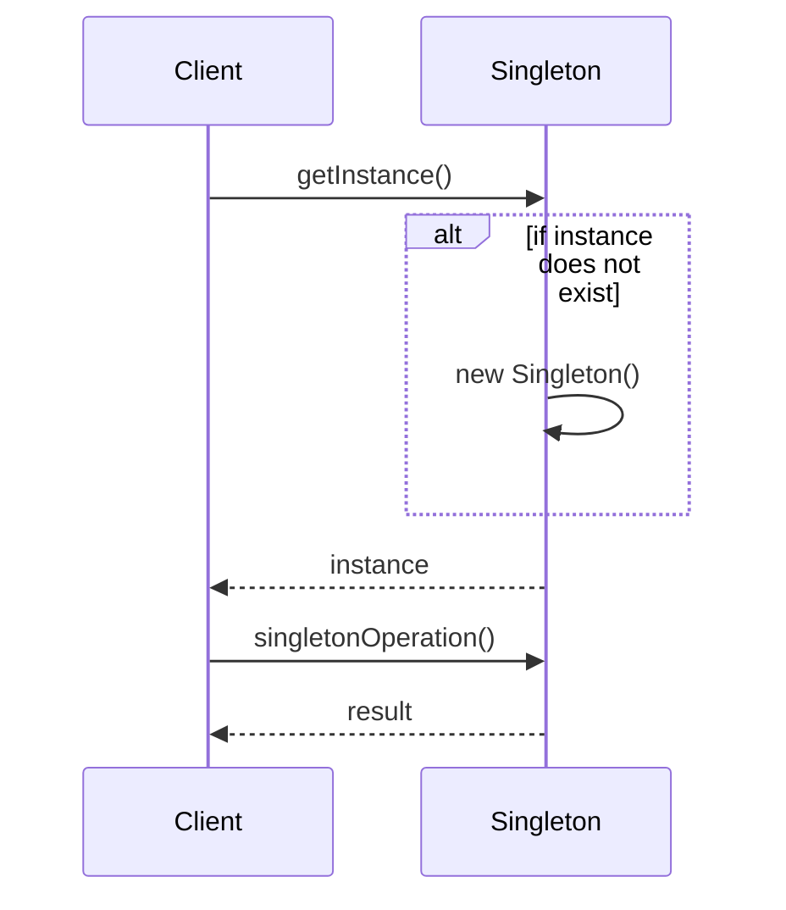

## 1. はじめに

近年、オブジェクト指向プログラミング（OOP）は、ソフトウェア開発において不可欠な手法となっています。OOPでは、データと関連する操作をオブジェクトにカプセル化することで、コードの再利用性、拡張性、および保守性を向上させることができます。この手法を効果的に活用するために、デザインパターンと呼ばれる、よく知られた設計の解決策が存在します。

デザインパターンは、ソフトウェア開発における特定の問題に対する再利用可能な解決策を提供します。これらのパターンは、経験豊富な開発者によって識別され、命名され、説明されてきました。デザインパターンを理解し、適切に適用することで、開発者はより効率的にソフトウェアを設計し、コードの品質を向上させることができます。

本記事では、オブジェクト指向プログラミングにおける重要なデザインパターンの1つである「Singletonパターン」に焦点を当てます。Singletonパターンは、クラスのインスタンスを1つだけ存在させ、そのインスタンスへのグローバルなアクセスポイントを提供するために使用されます。このパターンは、設定情報の管理、ロギングシステム、データベース接続の管理など、さまざまな場面で活用されています。

本記事では、以下の内容について詳しく説明します。

1. Singletonパターンの定義と目的
2. RubyとRailsでのSingletonパターンの実装方法
3. サンプルコードと図解による説明
4. Singletonパターンの活用シーン
5. 注意点と代替案

記事を通して、Singletonパターンの理解を深め、RubyやRailsでの実装方法を学ぶことで、より効果的にオブジェクト指向プログラミングを行えるようになることを目指します。

## 2. Singletonパターンとは

Singletonパターンは、クラスのインスタンスを1つだけ存在させ、そのインスタンスへのグローバルなアクセスポイントを提供するためのデザインパターンです。このパターンを適用することで、クラスのインスタンスが1つしか存在しないことを保証し、メモリ使用量を削減し、グローバルな状態を維持することができます。

Singletonパターンの主な目的は以下の通りです。

1. クラスのインスタンスを1つだけ存在させる
2. グローバルなアクセスポイントを提供する
3. メモリ使用量を削減する
4. グローバルな状態を維持する

Singletonパターンを実装するには、以下の要件を満たす必要があります。

1. コンストラクタをprivateにし、外部からのインスタンス化を防ぐ
2. クラスメソッドを使用して、唯一のインスタンスを返す
3. 唯一のインスタンスを保持するための変数を用意する

これらの要件を満たすことで、クラスのインスタンスが1つだけ存在することを保証し、グローバルなアクセスポイントを提供することができます。

以下は、Singletonパターンを実装したクラスの一般的な構造です。

```ruby
class Singleton
  private_class_method :new

  def self.instance
    @instance ||= new
  end

  # その他のメソッドやプロパティ
end
```

上記の例では、`new`メソッドをprivateにし、外部からのインスタンス化を防いでいます。`instance`クラスメソッドを使用して、唯一のインスタンスを返しています。`@instance`変数は、唯一のインスタンスを保持するために使用されます。

Singletonパターンを適用することで、以下のようなメリットが得られます。

1. グローバルな状態を維持できる
2. メモリ使用量を削減できる
3. クラスの複雑性を隠蔽できる
4. アクセスの集中化により、変更の影響範囲を限定できる

ただし、Singletonパターンの乱用は、グローバル変数の乱用につながる可能性があるため、注意が必要です。また、テストの難しさや並行性の問題など、いくつかの欠点もあります。これらの点については、後の章で詳しく説明します。

## 3. Singletonパターンの特徴

### 3.1. インスタンスの生成を制御する

Singletonパターンでは、クラスのコンストラクタをprivateにすることで、外部からのインスタンス化を防ぎます。これにより、クラスの内部でのみインスタンスを生成できるようになり、インスタンスの生成を制御することができます。

### 3.2. グローバルなアクセスポイントを提供する

Singletonパターンでは、クラスメソッドを使用して、唯一のインスタンスを返します。これにより、グローバルなアクセスポイントを提供することができます。クライアントコードは、このクラスメソッドを通じて、唯一のインスタンスにアクセスすることができます。

### 3.3. 遅延初期化（lazy initialization）をサポートする

Singletonパターンでは、インスタンスの生成を必要になるまで遅らせることができます。これを遅延初期化（lazy initialization）と呼びます。遅延初期化を行うことで、メモリ使用量を削減し、パフォーマンスを向上させることができます。

以下は、遅延初期化を行うSingletonクラスの例です。

```ruby
class Singleton
  private_class_method :new

  def self.instance
    @instance ||= new
  end

  # その他のメソッドやプロパティ
end
```

上記の例では、`||=`演算子を使用して、`@instance`変数がnilの場合にのみ、新しいインスタンスを生成しています。これにより、最初にインスタンスが必要になるまで、インスタンスの生成を遅らせることができます。

## 4. RubyでのSingletonパターンの実装方法

Rubyでは、Singletonパターンを実装するために、以下の方法があります。

### 4.1. クラスメソッドを使った実装

クラスメソッドを使った実装は、最も一般的なSingletonパターンの実装方法です。以下は、その例です。

```ruby
class Singleton
  private_class_method :new

  def self.instance
    @instance ||= new
  end

  # その他のメソッドやプロパティ
end
```

この方法では、`new`メソッドをprivateにし、`instance`クラスメソッドを使用して、唯一のインスタンスを返しています。

### 4.2. モジュールを使った実装

Rubyでは、モジュールを使ってSingletonパターンを実装することもできます。以下は、その例です。

```ruby
module Singleton
  def self.included(base)
    base.extend ClassMethods
    base.send :private_class_method, :new
  end

  module ClassMethods
    def instance
      @instance ||= new
    end
  end
end

class MyClass
  include Singleton

  # その他のメソッドやプロパティ
end
```

この方法では、`Singleton`モジュールを定義し、`included`メソッドを使用して、クラスにSingletonパターンの機能を追加しています。`ClassMethods`モジュールには、`instance`メソッドを定義し、唯一のインスタンスを返しています。

クラスで`Singleton`モジュールをインクルードすることで、そのクラスはSingletonパターンを実装することができます。

### 4.3. スレッドセーフな実装

マルチスレッド環境では、複数のスレッドが同時にSingletonクラスにアクセスする可能性があります。この場合、通常の実装では、複数のインスタンスが生成されてしまう可能性があります。これを防ぐために、スレッドセーフな実装が必要です。

以下は、Rubyでのスレッドセーフな実装の例です。

```ruby
require 'thread'

class Singleton
  private_class_method :new

  def self.instance
    return @instance if @instance

    @mutex.synchronize do
      @instance ||= new
    end

    @instance
  end

  @mutex = Mutex.new

  # その他のメソッドやプロパティ
end
```

この実装では、`Mutex`クラスを使用して、`instance`メソッドへのアクセスを同期化しています。これにより、複数のスレッドが同時にインスタンスを生成することを防ぐことができます。

以上が、RubyでのSingletonパターンの実装方法です。次の章では、RailsアプリケーションでのSingletonパターンの活用方法について説明します。

## 5. RailsアプリケーションでのSingletonパターンの活用

Railsアプリケーションにおいて、Singletonパターンは以下のようなシーンで活用されています。

### 5.1. 設定情報の管理

Railsアプリケーションでは、設定情報を一元管理するために、Singletonパターンを使用することができます。以下は、アプリケーション固有の設定情報を管理するSingletonクラスの例です。

```ruby
class AppConfig
  include Singleton

  attr_accessor :api_key, :api_secret, :smtp_settings

  def initialize
    @api_key = ENV['API_KEY']
    @api_secret = ENV['API_SECRET']
    @smtp_settings = {
      address: ENV['SMTP_ADDRESS'],
      port: ENV['SMTP_PORT'],
      user_name: ENV['SMTP_USER_NAME'],
      password: ENV['SMTP_PASSWORD']
    }
  end
end
```

この例では、`AppConfig`クラスは、APIキーやSMTP設定など、アプリケーション固有の設定情報を管理しています。`Singleton`モジュールをインクルードすることで、`AppConfig`クラスはSingletonパターンを実装しています。

設定情報にアクセスする場合は、以下のように`instance`メソッドを使用します。

```ruby
app_config = AppConfig.instance
api_key = app_config.api_key
smtp_settings = app_config.smtp_settings
```

### 5.2. ロギングシステム

Railsアプリケーションでは、ロギングシステムを一元管理するために、Singletonパターンを使用することができます。以下は、カスタムロガーを管理するSingletonクラスの例です。

```ruby
class CustomLogger
  include Singleton

  def initialize
    @logger = Logger.new('log/custom.log')
    @logger.level = Logger::INFO
  end

  def info(message)
    @logger.info(message)
  end

  def warn(message)
    @logger.warn(message)
  end

  def error(message)
    @logger.error(message)
  end
end
```

この例では、`CustomLogger`クラスは、カスタムログファイルへのログ出力を管理しています。`Singleton`モジュールをインクルードすることで、`CustomLogger`クラスはSingletonパターンを実装しています。

ログを出力する場合は、以下のように`instance`メソッドを使用します。

```ruby
logger = CustomLogger.instance
logger.info('Info message')
logger.warn('Warning message')
logger.error('Error message')
```

### 5.3. データベース接続の管理

Railsアプリケーションでは、データベース接続を一元管理するために、Singletonパターンを使用することができます。以下は、カスタムデータベース接続を管理するSingletonクラスの例です。

```ruby
class CustomDatabaseConnection
  include Singleton

  def initialize
    @connection = establish_connection
  end

  def execute(query)
    @connection.execute(query)
  end

  private

  def establish_connection
    # データベース接続を確立する処理
  end
end
```

この例では、`CustomDatabaseConnection`クラスは、カスタムデータベース接続を管理しています。`Singleton`モジュールをインクルードすることで、`CustomDatabaseConnection`クラスはSingletonパターンを実装しています。

データベースクエリを実行する場合は、以下のように`instance`メソッドを使用します。

```ruby
db_connection = CustomDatabaseConnection.instance
result = db_connection.execute('SELECT * FROM users')
```

以上が、RailsアプリケーションでのSingletonパターンの活用例です。次の章では、サンプルコードを使って、RubyとRailsでのSingletonパターンの実装方法を詳しく説明します。

## 6. サンプルコード（Ruby）

以下は、RubyでのSingletonパターンの実装例です。

### 6.1. クラスメソッドを使ったSingletonの実装例

```ruby
class Logger
  private_class_method :new

  def self.instance
    @instance ||= new
  end

  def log(message)
    puts "LOG: #{message}"
  end
end

logger1 = Logger.instance
logger2 = Logger.instance

logger1.log('This is a log message')
logger2.log('Another log message')
```

この例では、`Logger`クラスは、`new`メソッドをprivateにし、`instance`クラスメソッドを使用して、唯一のインスタンスを返しています。`logger1`と`logger2`は、同じインスタンスを参照していることがわかります。

### 6.2. モジュールを使ったSingletonの実装例

```ruby
module Singleton
  def self.included(base)
    base.extend ClassMethods
    base.send :private_class_method, :new
  end

  module ClassMethods
    def instance
      @instance ||= new
    end
  end
end

class Configuration
  include Singleton

  attr_accessor :host, :port, :username, :password

  def initialize
    @host = 'localhost'
    @port = 80
    @username = 'admin'
    @password = 'password'
  end
end

config1 = Configuration.instance
config2 = Configuration.instance

config1.host = 'example.com'
puts config2.host # Output: example.com
```

この例では、`Singleton`モジュールを定義し、`Configuration`クラスで`Singleton`モジュールをインクルードすることで、Singletonパターンを実装しています。`config1`と`config2`は、同じインスタンスを参照していることがわかります。

### 6.3. スレッドセーフなSingletonの実装例

```ruby
require 'thread'

class Counter
  private_class_method :new

  def self.instance
    return @instance if @instance

    @mutex.synchronize do
      @instance ||= new
    end

    @instance
  end

  def increment
    @mutex.synchronize do
      @count += 1
    end
  end

  def count
    @mutex.synchronize do
      @count
    end
  end

  def initialize
    @count = 0
    @mutex = Mutex.new
  end
end

counter = Counter.instance

threads = (1..5).map do
  Thread.new do
    10.times do
      counter.increment
    end
  end
end

threads.each(&:join)

puts counter.count # Output: 50
```

この例では、`Counter`クラスは、`Mutex`クラスを使用して、インスタンスメソッドへのアクセスを同期化しています。これにより、複数のスレッドが同時にインスタンスメソッドにアクセスしても、正しくカウントが行われることが保証されます。

以上が、RubyでのSingletonパターンの実装例です。次の章では、RailsでのSingletonパターンの実装例を説明します。

## 7. サンプルコード（Rails）

以下は、RailsでのSingletonパターンの実装例です。

### 7.1. アプリケーション設定のSingleton化

```ruby
# config/initializers/app_config.rb
require 'singleton'

class AppConfig
  include Singleton

  attr_accessor :smtp_settings

  def initialize
    @smtp_settings = {
      address: ENV['SMTP_ADDRESS'],
      port: ENV['SMTP_PORT'],
      user_name: ENV['SMTP_USER_NAME'],
      password: ENV['SMTP_PASSWORD']
    }
  end
end
```

この例では、`AppConfig`クラスは、アプリケーション固有の設定情報を管理しています。`config/initializers/app_config.rb`ファイルで定義することで、アプリケーション起動時に自動的にロードされます。

設定情報にアクセスする場合は、以下のように`instance`メソッドを使用します。

```ruby
smtp_settings = AppConfig.instance.smtp_settings
```

### 7.2. カスタムロガーのSingleton化

```ruby
# app/services/custom_logger.rb
require 'singleton'

class CustomLogger
  include Singleton

  def initialize
    @logger = Logger.new('log/custom.log')
    @logger.level = Logger::INFO
  end

  def info(message)
    @logger.info(message)
  end

  def warn(message)
    @logger.warn(message)
  end

  def error(message)
    @logger.error(message)
  end
end
```

この例では、`CustomLogger`クラスは、カスタムログファイルへのログ出力を管理しています。`app/services`ディレクトリ内に定義することで、アプリケーション全体から利用可能になります。

ログを出力する場合は、以下のように`instance`メソッドを使用します。

```ruby
logger = CustomLogger.instance
logger.info('Info message')
logger.warn('Warning message')
logger.error('Error message')
```

以上が、RailsでのSingletonパターンの実装例です。次の章では、Singletonパターンの図解を行います。

## 8. Singletonパターンのシーケンス



このシーケンス図では、以下の流れを表現しています。

1. クライアントが`getInstance()`メソッドを呼び出します。
2. `Singleton`クラスは、インスタンスがまだ存在しない場合、新しいインスタンスを作成します。
3. `Singleton`クラスは、インスタンスをクライアントに返します。
4. クライアントは、`singletonOperation()`メソッドを呼び出します。
5. `Singleton`クラスは、結果をクライアントに返します。

## 9. Singletonパターンの注意点

Singletonパターンは便利なデザインパターンですが、いくつかの注意点があります。

### 9.1. グローバル変数の乱用につながる可能性がある

Singletonパターンを乱用すると、グローバル変数の乱用につながる可能性があります。グローバル変数は、コードの複雑性を増し、保守性を低下させる可能性があります。Singletonパターンを使用する際は、本当に必要な場合のみに限定することが重要です。

### 9.2. テストの難しさ

Singletonパターンを使用したクラスは、テストが難しくなる可能性があります。Singletonインスタンスは、テスト間で状態を共有するため、テストの独立性が損なわれる可能性があります。この問題に対処するには、テスト用のインターフェースを提供したり、状態をリセットするメソッドを用意したりすることが必要です。

### 9.3. 並行性の問題

マルチスレッド環境では、Singletonパターンを使用する際に並行性の問題が発生する可能性があります。複数のスレッドが同時にSingletonインスタンスにアクセスすると、データの不整合が発生する可能性があります。この問題に対処するには、適切な同期化メカニズムを使用する必要があります。

以上の注意点を理解し、適切に対処することで、Singletonパターンを効果的に使用することができます。次の章では、Singletonパターンの代替案について説明します。

## 10. Singletonパターンの代替案

Singletonパターンには、いくつかの代替案があります。

### 10.1. 依存性の注入（Dependency Injection）

依存性の注入は、オブジェクトの依存関係を外部から注入することで、コードの結合度を下げる手法です。Singletonパターンの代わりに、依存性の注入を使用することで、テスト可能性と柔軟性が向上します。

### 10.2. ファクトリーパターン

ファクトリーパターンは、オブジェクトの生成を専用のクラスに委譲することで、オブジェクトの生成を制御する手法です。Singletonパターンの代わりに、ファクトリーパターンを使用することで、オブジェクトの生成を柔軟に制御できます。

### 10.3. フライウェイトパターン

フライウェイトパターンは、多数のオブジェクトを効率的に管理するためのパターンです。Singletonパターンと似ていますが、複数のインスタンスを共有することで、メモリ使用量を削減できます。

これらの代替案を状況に応じて使い分けることで、Singletonパターンの欠点を補うことができます。

## 11. まとめ

本記事では、Singletonパターンについて詳しく説明しました。Singletonパターンは、クラスのインスタンスを1つに制限し、グローバルなアクセスポイントを提供するデザインパターンです。RubyやRailsでのSingletonパターンの実装方法、サンプルコード、図解、注意点、代替案などを紹介しました。

Singletonパターンは、適切に使用することで、コードの保守性や効率性を向上させることができます。一方で、乱用すると、グローバル変数の乱用やテストの難しさ、並行性の問題などが発生する可能性があります。

Singletonパターンに限らず、デザインパターンを理解することは、オブジェクト指向プログラミングにおいて重要です。デザインパターンを適切に使用することで、コードの品質を向上させ、開発者間のコミュニケーションを円滑にすることができます。

今後も、他のデザインパターンについて学び、実際のプロジェクトに活用していくことをおすすめします。デザインパターンを適材適所で使いこなすことで、より効果的なオブジェクト指向プログラミングが可能になるでしょう。
