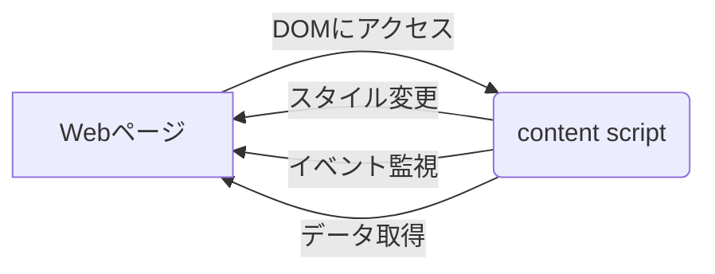
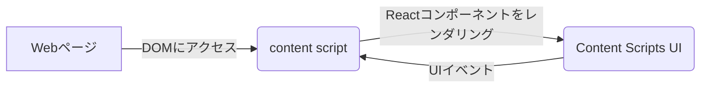
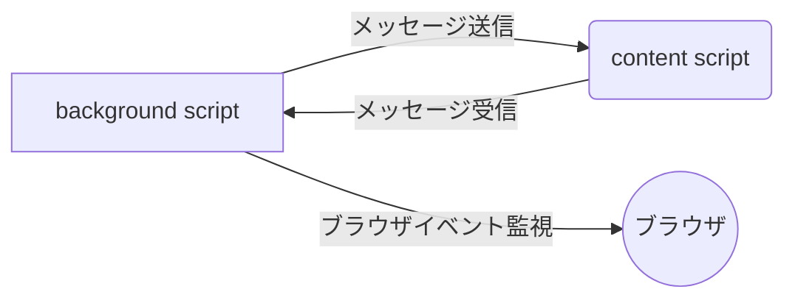
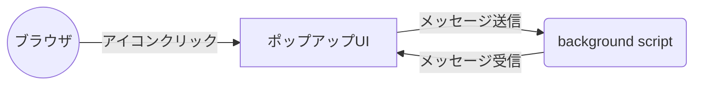
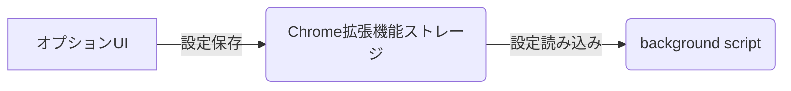

## 1. はじめに

Plasmoは、Chrome拡張機能の開発を簡単かつ効率的に行うためのフレームワークです。React、TypeScript、Webpackなどの最新のWeb開発技術を使用しており、開発者はこれらの技術に精通していれば、簡単にChrome拡張機能の開発を始めることができます。

Plasmoを使うメリットは以下の通りです。

- 開発環境のセットアップが簡単
- Reactを使ったUIの構築が可能
- TypeScriptによる型安全性の向上
- Webpackによるバンドルとコード最適化
- ホットリローディングによる開発効率の向上
- クロスブラウザ対応の拡張機能開発が可能

## 2. Plasmoの基本構成

Plasmoプロジェクトは、以下のような構造を持っています。

```
my-extension/
├── .plasmo/
├── assets/
├── contents/
│   └── [name]/
│       ├── index.ts
│       ├── index.tsx
│       └── style.css
├── background/
│   └── index.ts
├── popup/
│   ├── index.tsx
│   └── style.css
├── options/
│   ├── index.tsx
│   └── style.css
├── plasmo.json
├── package.json
└── tsconfig.json
```

各ファイル・ディレクトリの役割は以下の通りです。

- `.plasmo/`: Plasmoの内部ファイル
- `assets/`: 拡張機能で使用する静的ファイル（画像など）
- `contents/`: content scriptを含むディレクトリ
- `background/`: background scriptを含むディレクトリ
- `popup/`: ポップアップUIを含むディレクトリ
- `options/`: オプションUIを含むディレクトリ
- `plasmo.json`: Plasmo拡張機能の設定ファイル
- `package.json`: プロジェクトの依存関係と実行スクリプトを定義するファイル
- `tsconfig.json`: TypeScriptの設定ファイル

次の章では、`plasmo.json`の役割と設定方法について詳しく説明します。

## 3. plasmo.json

`plasmo.json`は、Plasmo拡張機能の設定を定義するファイルです。拡張機能のメタデータ、権限、リソースファイルなどを指定します。

以下は、`plasmo.json`の主要な設定項目です。

- `manifest_version`: マニフェストファイルのバージョン（通常は2）
- `name`: 拡張機能の名前
- `version`: 拡張機能のバージョン
- `description`: 拡張機能の説明
- `permissions`: 拡張機能が必要とする権限
- `host_permissions`: 拡張機能がアクセスできるホストの権限
- `icons`: 拡張機能のアイコン画像
- `browser_action`: ブラウザのツールバーに表示されるアイコンとポップアップ
- `background`: バックグラウンドスクリプトの設定
- `content_scripts`: コンテンツスクリプトの設定
- `options_ui`: オプションUIの設定

以下は、`plasmo.json`のサンプルコードです。

```json
{
  "manifest_version": 2,
  "name": "My Extension",
  "version": "1.0.0",
  "description": "A sample Plasmo extension",
  "permissions": ["storage", "tabs"],
  "host_permissions": ["https://*/*"],
  "icons": {
    "16": "assets/icon-16.png",
    "48": "assets/icon-48.png",
    "128": "assets/icon-128.png"
  },
  "browser_action": {
    "default_icon": "assets/icon-16.png",
    "default_popup": "popup/index.html"
  },
  "background": {
    "service_worker": "background/index.ts"
  },
  "content_scripts": [
    {
      "matches": ["https://*/*"],
      "js": ["contents/example/index.ts"],
      "css": ["contents/example/style.css"]
    }
  ],
  "options_ui": {
    "page": "options/index.html",
    "open_in_tab": true
  }
}
```

## 4. contents

`contents`ディレクトリには、content scriptを含むファイルを配置します。content scriptは、Webページに直接インジェクトされ、ページのDOMにアクセスしてインタラクションを行うことができます。

以下は、content scriptの実装例です。

```typescript
// contents/example/index.ts

console.log("Content script loaded");

document.body.style.backgroundColor = "yellow";
```

この例では、content scriptがページに挿入されたときに、コンソールにメッセージを出力し、ページの背景色を黄色に変更しています。

content scriptとWebページの関係を図解すると以下のようになります。



次の章では、`Content Scripts UI`について説明します。

## 5. Content Scripts UI

`Content Scripts UI`は、Plasmoにおける新しい機能で、content scriptにUIコンポーネントを直接埋め込むことができます。この機能により、content scriptとUIの間のメッセージングが不要になり、コードがシンプルになります。

以下は、`Content Scripts UI`の実装例です。

```typescript
// contents/example/index.tsx

import React from "react";
import { render } from "react-dom";
import { ContentScriptUI } from "@plasmohq/messaging/content-script";
import "./style.css";

const App: React.FC = () => {
  return (
    <ContentScriptUI>
      <div className="overlay">
        <h1>Hello, Plasmo!</h1>
        <button onClick={() => alert("Button clicked")}>Click me</button>
      </div>
    </ContentScriptUI>
  );
};

render(<App />, document.getElementById("root"));
```

この例では、`ContentScriptUI`コンポーネントを使用して、Reactコンポーネントをcontent script内に直接レンダリングしています。`ContentScriptUI`は、Plasmoが提供するコンポーネントで、UIとcontent scriptの間の通信を自動的に処理します。

`Content Scripts UI`とcontent scriptの関係を図解すると以下のようになります。



## 6. backend

`backend`ディレクトリには、background scriptを含むファイルを配置します。background scriptは、拡張機能のバックグラウンドで実行され、ブラウザイベントの監視や他のスクリプトとのメッセージングを行います。

以下は、background scriptの実装例です。

```typescript
// background/index.ts

chrome.runtime.onInstalled.addListener(() => {
  console.log("Extension installed");
});

chrome.tabs.onUpdated.addListener((tabId, changeInfo, tab) => {
  if (
    changeInfo.status === "complete" &&
    tab.url.startsWith("https://www.example.com")
  ) {
    chrome.tabs.sendMessage(tabId, { type: "EXAMPLE_MESSAGE" });
  }
});
```

この例では、拡張機能のインストール時にコンソールにメッセージを出力し、特定のURLを持つタブの更新が完了したときに、そのタブにメッセージを送信しています。

background scriptとcontent scriptの関係を図解すると以下のようになります。



次の章では、`popup`について説明します。

## 7. popup

`popup`ディレクトリには、拡張機能のツールバーアイコンをクリックした際に表示されるポップアップウィンドウのUIを含むファイルを配置します。ポップアップUIは、ReactとTypeScriptを使って開発されます。

以下は、`popup`の実装例です。

```typescript
// popup/index.tsx

import React from "react";
import ReactDOM from "react-dom";
import "./style.css";

const App: React.FC = () => {
  const [count, setCount] = React.useState(0);

  return (
    <div className="popup">
      <h1>Popup Example</h1>
      <p>Count: {count}</p>
      <button onClick={() => setCount(count + 1)}>Increment</button>
    </div>
  );
};

ReactDOM.render(<App />, document.getElementById("root"));
```

この例では、`popup`内でReactコンポーネントを定義し、状態管理にはuseStateフックを使用しています。ボタンをクリックすると、カウントが増加します。

ポップアップUIとbackground scriptの関係を図解すると以下のようになります。



## 8. options

`options`ディレクトリには、拡張機能のオプションページのUIを含むファイルを配置します。オプションページは、拡張機能の設定を変更するためのインターフェースを提供します。オプションUIも、ReactとTypeScriptを使って開発されます。

以下は、`options`の実装例です。

```typescript
// options/index.tsx

import React from "react";
import ReactDOM from "react-dom";
import "./style.css";

const App: React.FC = () => {
  const [apiKey, setApiKey] = React.useState("");

  const handleSave = () => {
    chrome.storage.sync.set({ apiKey }, () => {
      alert("API key saved");
    });
  };

  return (
    <div className="options">
      <h1>Options</h1>
      <label>
        API Key:
        <input type="text" value={apiKey} onChange={(e) => setApiKey(e.target.value)} />
      </label>
      <button onClick={handleSave}>Save</button>
    </div>
  );
};

ReactDOM.render(<App />, document.getElementById("root"));
```

この例では、オプションページ内でAPIキーを入力するためのフォームを提供しています。保存ボタンをクリックすると、APIキーがChrome拡張機能のストレージに保存されます。

オプションUIとbackground scriptの関係を図解すると以下のようになります。



これで、Plasmoの主要なコンポーネントについて説明が完了しました。

## 9. まとめ

この記事では、Plasmoを使ったChrome拡張機能開発について、初学者向けに解説しました。Plasmoは、最新のWeb開発技術を活用し、効率的に拡張機能を開発するためのフレームワークです。

Plasmoを使う主なメリットは以下の通りです。

- Reactを使ったUIの構築
- TypeScriptによる型安全性の向上
- Webpackによるバンドルとコード最適化
- ホットリローディングによる開発効率の向上
- クロスブラウザ対応の拡張機能開発

Plasmoプロジェクトは、`contents`、`contents-ui`、`backend`、`popup`、`options`などのディレクトリで構成され、それぞれが拡張機能の異なる部分を担当します。`plasmo.json`は、拡張機能の設定を定義するファイルです。

- `contents`: content scriptを含むディレクトリ
- `Content Scripts UI`: content scriptにUIを直接埋め込むための機能
- `backend`: background scriptを含むディレクトリ
- `popup`: ポップアップUIを含むディレクトリ
- `options`: オプションUIを含むディレクトリ

Plasmoを使いこなすことで、Chrome拡張機能開発の生産性を大幅に向上させることができます。

参考資料とリンク：

- Plasmo公式サイト: https://plasmo.com/
- Plasmoドキュメンテーション: https://docs.plasmo.com/
- Plasmo GitHub リポジトリ: https://github.com/PlasmoHQ/plasmo
- Chrome拡張機能開発ドキュメント: https://developer.chrome.com/docs/extensions/

以上で、Plasmoについての初学者向けの記事が完成しました。Plasmoを使ってChrome拡張機能開発に挑戦してみてください。
