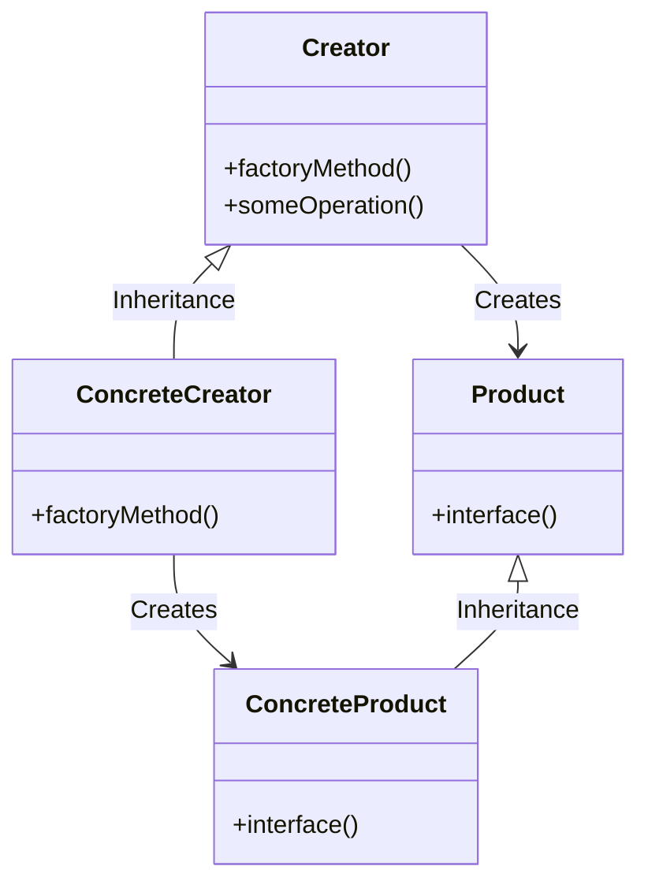

## 1. はじめに

ソフトウェア開発において、柔軟性と拡張性を備えたコードを書くことは非常に重要です。特に、大規模なプロジェクトや長期的なメンテナンスが必要な場合、適切な設計パターンを使用することで、コードの品質を高め、将来の変更に対応しやすくすることができます。

デザインパターンとは、ソフトウェア設計における共通の問題に対する再利用可能な解決策のことを指します。Gang of Fourによって提唱された23のパターンは、オブジェクト指向プログラミングにおける基本的な設計パターンとして知られています。

本記事で取り上げるFactory Methodパターンは、オブジェクト生成に関するパターンの一つです。このパターンを使用することで、オブジェクトの生成をサブクラスに任せ、柔軟性と拡張性を向上させることができます。

Ruby on Railsは、オブジェクト指向プログラミングとデザインパターンの概念を積極的に取り入れているWebアプリケーションフレームワークです。本記事では、Ruby on RailsでのFactory Methodパターンの実装例を交えながら、このパターンの目的、メリット、デメリットを探っていきます。

Factory Methodパターンを理解し、適切に活用することで、より柔軟で拡張性の高いコードを書くことができるでしょう。それでは、まずはFactory Methodパターンの詳細な説明から始めましょう。

## 2. Factory Methodパターンの説明

### 2.1 目的と適用場面
Factory Methodパターンは、オブジェクト生成の責任をサブクラスに委ねることで、柔軟性と拡張性を向上させることを目的としています。このパターンは、以下のような場面で特に有効です。

- オブジェクトの生成が複雑で、生成ロジックを切り離したい場合
- オブジェクトの種類を動的に決定したい場合
- 将来的に新しいオブジェクトの種類を追加する可能性がある場合

### 2.2 クラス図
以下は、Factory Methodパターンのクラス図です。



### 2.3 登場する役割
- Creator: 製品を生成するためのインターフェースを定義する抽象クラス。
- ConcreteCreator: 具体的な製品を生成するサブクラス。
- Product: 生成される製品のインターフェースを定義する抽象クラス。
- ConcreteProduct: 具体的な製品を表すサブクラス。

Creator クラスでは、製品を生成するための抽象メソッド（factoryMethod）を定義します。また、factoryMethod を使用して製品を生成する具体的な操作（someOperation）を実装します。

ConcreteCreator クラスでは、factoryMethod を実装し、具体的な製品を生成します。

Product クラスは、生成される製品のインターフェースを定義し、ConcreteProduct クラスはその具体的な実装を提供します。

次に、Ruby on Rails での Factory Method パターンの実装例を見ていきましょう。

## 3. Ruby on Railsでの実装例

以下は、Ruby on Railsを使用してFactory Methodパターンを実装した例です。この例では、様々な種類の通知（Notification）を生成するためにFactory Methodパターンを使用しています。

```ruby
# app/models/notification.rb
class Notification
  def initialize(message)
    @message = message
  end

  def send
    raise NotImplementedError, "#{self.class} has not implemented method '#{__method__}'"
  end
end

# app/models/email_notification.rb
class EmailNotification < Notification
  def send
    # メールで通知を送信する処理
    puts "Sending email notification: #{@message}"
  end
end

# app/models/sms_notification.rb
class SmsNotification < Notification
  def send
    # SMSで通知を送信する処理
    puts "Sending SMS notification: #{@message}"
  end
end

# app/models/notification_factory.rb
class NotificationFactory
  def self.create(type, message)
    case type
    when :email
      EmailNotification.new(message)
    when :sms
      SmsNotification.new(message)
    else
      raise ArgumentError, "Invalid notification type: #{type}"
    end
  end
end

# 使用例
notification = NotificationFactory.create(:email, "This is an email notification")
notification.send

notification = NotificationFactory.create(:sms, "This is an SMS notification")
notification.send
```

この例では、以下の役割を持つクラスが登場します。

- Creator: NotificationFactory
- ConcreteCreator: NotificationFactory
- Product: Notification
- ConcreteProduct: EmailNotification, SmsNotification

NotificationFactoryクラスは、通知の種類とメッセージを受け取り、適切な通知オブジェクトを生成します。このような実装により、通知の生成ロジックを一箇所にまとめ、新しい通知の種類を追加する際の変更を最小限に抑えることができます。

次に、Factory Methodパターンのメリットについて説明しましょう。

## 4. Factory Methodパターンのメリット

### 4.1 柔軟性の向上
Factory Methodパターンを使用することで、オブジェクトの生成をサブクラスに委ねることができます。これにより、オブジェクトの生成方法を柔軟に変更することが可能になります。例えば、通知の送信方法を変更する場合、新しいサブクラスを作成するだけで対応できます。

### 4.2 拡張性の向上
新しいオブジェクトの種類を追加する際、既存のコードを修正することなく、新しいサブクラスを作成するだけで対応できます。これにより、システムの拡張性が向上します。

### 4.3 コードの再利用性の向上
Factory Methodパターンを使用することで、オブジェクトの生成ロジックを一箇所にまとめることができます。これにより、コードの重複を避け、再利用性を高めることができます。

## 5. Factory Methodパターンのデメリット

### 5.1 クラス数の増加
Factory Methodパターンを使用すると、新しいオブジェクトの種類を追加するたびに、新しいサブクラスを作成する必要があります。これにより、クラス数が増加し、コードの複雑性が高まる可能性があります。

### 5.2 コードの複雑性の増加
オブジェクトの生成ロジックが複雑になると、Factory Methodパターンを使用したコードも複雑になる可能性があります。特に、オブジェクトの生成に多くの条件分岐が必要な場合、コードの可読性が低下する可能性があります。

## 6. 他のデザインパターンとの比較

### 6.1 Abstract Factoryパターン
Abstract Factoryパターンは、関連するオブジェクトのファミリーを生成するためのインターフェースを提供します。Factory Methodパターンが単一のオブジェクトの生成に焦点を当てているのに対し、Abstract Factoryパターンは複数のオブジェクトの生成を扱います。

### 6.2 Builderパターン
Builderパターンは、複雑なオブジェクトの構築過程を抽象化することを目的としています。Factory Methodパターンがオブジェクトの生成に焦点を当てているのに対し、Builderパターンはオブジェクトの構築過程に焦点を当てています。

次に、まとめに移りましょう。


## 7. まとめ

本記事では、デザインパターンの一つであるFactory Methodパターンについて、Ruby on Railsでの実装例を交えながら説明しました。

Factory Methodパターンは、オブジェクト生成の責任をサブクラスに委ねることで、柔軟性と拡張性を向上させることを目的としています。このパターンを適用することで、以下のようなメリットが得られます。

- オブジェクトの生成方法を柔軟に変更できる
- 新しいオブジェクトの種類を追加する際の変更を最小限に抑えられる
- オブジェクトの生成ロジックを一箇所にまとめ、コードの重複を避けられる

一方で、Factory Methodパターンにはデメリットもあります。クラス数の増加やコードの複雑性の増加が懸念されます。

他のデザインパターンとの比較では、Abstract Factoryパターンは関連するオブジェクトのファミリーを生成するのに対し、Factory Methodパターンは単一のオブジェクトの生成に焦点を当てています。また、Builderパターンはオブジェクトの構築過程に焦点を当てています。

Factory Methodパターンは、以下のような場面で特に有効です。

- オブジェクトの生成が複雑で、生成ロジックを切り離したい場合
- オブジェクトの種類を動的に決定したい場合
- 将来的に新しいオブジェクトの種類を追加する可能性がある場合

適切な場面でFactory Methodパターンを活用することで、より柔軟で拡張性の高いコードを書くことができるでしょう。ただし、パターンの適用には注意が必要です。必要以上に複雑になることを避け、コードの可読性を維持することが重要です。

オブジェクト指向プログラミングとデザインパターンは、ソフトウェア開発において欠かせない概念です。Factory Methodパターンをはじめとする様々なパターンを理解し、適切に活用することで、より良いソフトウェアを開発できるでしょう。
