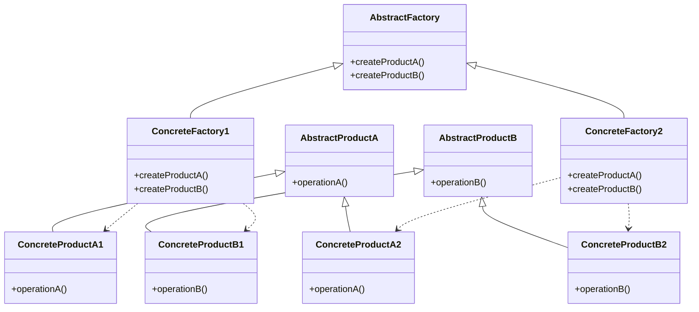

# 1. はじめに

## デザインパターンとは

デザインパターンとは、ソフトウェア設計における共通の問題に対する再利用可能な解決策のことです。オブジェクト指向プログラミングにおいて、頻繁に発生する設計上の問題を解決するための best practice（ベストプラクティス）の集合であると言えます。デザインパターンを活用することで、ソフトウェアの柔軟性、拡張性、保守性を高めることができます。

## アブストラクトファクトリーパターンの概要

アブストラクトファクトリーパターンは、GoF（Gang of Four）によって定義された生成パターンの1つです。このパターンは、関連するオブジェクトのファミリーを、その具体的な実装に依存せずに生成するためのインターフェースを提供します。つまり、抽象的な工場（ファクトリー）を定義し、具体的な工場がそれを実装することで、オブジェクトの生成を切り替えることができます。

Railsアプリケーションにおいて、アブストラクトファクトリーパターンは以下のような場面で活用できます。

- 複数の決済ゲートウェイを切り替える
- マルチテナント環境でテナント固有の設定を管理する
- 異なるデータベース接続を切り替える
- テーマやスキンを動的に変更する

本記事では、アブストラクトファクトリーパターンの構造や実装方法を詳しく解説し、Railsでの実践的なユースケースを示します。サンプルコードと図解を交えながら、このパターンの活用方法を理解していきましょう。

# 2. アブストラクトファクトリーパターンとは

## 目的と適用場面

アブストラクトファクトリーパターンの主な目的は、関連するオブジェクトのファミリーを柔軟に切り替えることです。このパターンは、以下のような場面で適用されます。

- システムが複数の製品ファミリーを扱う必要がある場合
- 製品ファミリーが頻繁に変更される可能性がある場合
- 製品の具体的な実装を隠蔽し、インターフェースを通じて操作したい場合

アブストラクトファクトリーパターンを適用することで、製品ファミリーの切り替えを容易にし、システムの拡張性と保守性を高めることができます。

## 関連するパターン

アブストラクトファクトリーパターンは、他のいくつかのデザインパターンと関連しています。

- ファクトリーメソッドパターン：オブジェクトの生成を担うメソッドを定義します。アブストラクトファクトリーパターンは、ファクトリーメソッドパターンを複数の製品に適用したものと考えることができます。

- シングルトンパターン：クラスのインスタンスが1つしか存在しないことを保証します。アブストラクトファクトリーパターンで生成されるオブジェクトは、しばしばシングルトンとして実装されます。

これらのパターンを組み合わせることで、より柔軟で拡張性の高いシステムを設計することができます。

# 3. アブストラクトファクトリーパターンの構造

## 登場するクラスとその役割

アブストラクトファクトリーパターンには、以下のクラスが登場します。

- AbstractFactory：具体的な工場クラスの共通インターフェースを定義します。
- ConcreteFactory：AbstractFactoryインターフェースを実装し、具体的な製品を生成します。
- AbstractProduct：製品の共通インターフェースを定義します。
- ConcreteProduct：AbstractProductインターフェースを実装し、具体的な製品の機能を提供します。

## クラス図（Mermaid）

以下は、アブストラクトファクトリーパターンのクラス図をMermaid記法で表現したものです。



このクラス図は、アブストラクトファクトリーパターンの基本的な構造を示しています。AbstractFactoryを継承した具体的な工場クラス（ConcreteFactory1、ConcreteFactory2）が、対応する具体的な製品（ConcreteProductA1、ConcreteProductB1、ConcreteProductA2、ConcreteProductB2）を生成します。

次のセクションでは、Railsでのアブストラクトファクトリーパターンの実装方法について説明します。

# 4. Railsでのアブストラクトファクトリーパターンの実装

Railsでアブストラクトファクトリーパターンを実装する場合、以下のようなディレクトリ構造を用いることが一般的です。

```
app/
  models/
    factories/
      abstract_factory.rb
      concrete_factory1.rb
      concrete_factory2.rb
    products/
      abstract_product_a.rb
      abstract_product_b.rb
      concrete_product_a1.rb
      concrete_product_a2.rb
      concrete_product_b1.rb
      concrete_product_b2.rb
```

## サンプルコード（Rails）

以下は、Railsでアブストラクトファクトリーパターンを実装したサンプルコードです。

```ruby
# app/models/factories/abstract_factory.rb
module Factories
  class AbstractFactory
    def create_product_a
      raise NotImplementedError, "#{self.class}##{__method__} must be implemented"
    end

    def create_product_b
      raise NotImplementedError, "#{self.class}##{__method__} must be implemented"
    end
  end
end

# app/models/factories/concrete_factory1.rb
module Factories
  class ConcreteFactory1 < AbstractFactory
    def create_product_a
      Products::ConcreteProductA1.new
    end

    def create_product_b
      Products::ConcreteProductB1.new
    end
  end
end

# app/models/factories/concrete_factory2.rb
module Factories
  class ConcreteFactory2 < AbstractFactory
    def create_product_a
      Products::ConcreteProductA2.new
    end

    def create_product_b
      Products::ConcreteProductB2.new
    end
  end
end

# app/models/products/abstract_product_a.rb
module Products
  class AbstractProductA
    def operation_a
      raise NotImplementedError, "#{self.class}##{__method__} must be implemented"
    end
  end
end

# app/models/products/abstract_product_b.rb
module Products
  class AbstractProductB
    def operation_b
      raise NotImplementedError, "#{self.class}##{__method__} must be implemented"
    end
  end
end

# app/models/products/concrete_product_a1.rb
module Products
  class ConcreteProductA1 < AbstractProductA
    def operation_a
      "ConcreteProductA1#operation_a"
    end
  end
end

# app/models/products/concrete_product_a2.rb
module Products
  class ConcreteProductA2 < AbstractProductA
    def operation_a
      "ConcreteProductA2#operation_a"
    end
  end
end

# app/models/products/concrete_product_b1.rb
module Products
  class ConcreteProductB1 < AbstractProductB
    def operation_b
      "ConcreteProductB1#operation_b"
    end
  end
end

# app/models/products/concrete_product_b2.rb
module Products
  class ConcreteProductB2 < AbstractProductB
    def operation_b
      "ConcreteProductB2#operation_b"
    end
  end
end
```

## コードの説明

このサンプルコードでは、`Factories`モジュールと`Products`モジュールを使用して、アブストラクトファクトリーパターンの構造を表現しています。

`Factories::AbstractFactory`クラスは、具体的な工場クラスの共通インターフェースを定義します。`create_product_a`メソッドと`create_product_b`メソッドは、それぞれ対応する製品を生成するためのメソッドです。

`Factories::ConcreteFactory1`クラスと`Factories::ConcreteFactory2`クラスは、`AbstractFactory`クラスを継承し、具体的な製品を生成するメソッドを実装しています。

`Products`モジュールには、製品の抽象クラス（`AbstractProductA`、`AbstractProductB`）と具体的な製品クラス（`ConcreteProductA1`、`ConcreteProductA2`、`ConcreteProductB1`、`ConcreteProductB2`）が定義されています。

この実装により、具体的な工場クラスを切り替えることで、関連する製品ファミリーを柔軟に切り替えることができます。

# 5. Railsでのアブストラクトファクトリーパターンのユースケース

次に、Railsアプリケーションにおけるアブストラクトファクトリーパターンの具体的なユースケースを2つ紹介します。

## ユースケース1: 複数の決済ゲートウェイの切り替え

Railsアプリケーションで複数の決済ゲートウェイを使用する場合、アブストラクトファクトリーパターンを適用することで、決済ゲートウェイの切り替えを容易にすることができます。

```ruby
# app/models/factories/abstract_payment_gateway_factory.rb
module Factories
  class AbstractPaymentGatewayFactory
    def create_payment_gateway
      raise NotImplementedError, "#{self.class}##{__method__} must be implemented"
    end

    def create_payment_processor
      raise NotImplementedError, "#{self.class}##{__method__} must be implemented"
    end
  end
end

# app/models/factories/stripe_payment_gateway_factory.rb
module Factories
  class StripePaymentGatewayFactory < AbstractPaymentGatewayFactory
    def create_payment_gateway
      Products::StripePaymentGateway.new
    end

    def create_payment_processor
      Products::StripePaymentProcessor.new
    end
  end
end

# app/models/factories/paypal_payment_gateway_factory.rb
module Factories
  class PaypalPaymentGatewayFactory < AbstractPaymentGatewayFactory
    def create_payment_gateway
      Products::PaypalPaymentGateway.new
    end

    def create_payment_processor
      Products::PaypalPaymentProcessor.new
    end
  end
end

# app/models/products/abstract_payment_gateway.rb
module Products
  class AbstractPaymentGateway
    def process_payment(amount)
      raise NotImplementedError, "#{self.class}##{__method__} must be implemented"
    end
  end
end

# app/models/products/abstract_payment_processor.rb
module Products
  class AbstractPaymentProcessor
    def validate_payment(payment)
      raise NotImplementedError, "#{self.class}##{__method__} must be implemented"
    end
  end
end

# app/models/products/stripe_payment_gateway.rb
module Products
  class StripePaymentGateway < AbstractPaymentGateway
    def process_payment(amount)
      # Stripe決済処理の実装
    end
  end
end

# app/models/products/stripe_payment_processor.rb
module Products
  class StripePaymentProcessor < AbstractPaymentProcessor
    def validate_payment(payment)
      # Stripe決済の検証処理の実装
    end
  end
end

# app/models/products/paypal_payment_gateway.rb
module Products
  class PaypalPaymentGateway < AbstractPaymentGateway
    def process_payment(amount)
      # PayPal決済処理の実装
    end
  end
end

# app/models/products/paypal_payment_processor.rb
module Products
  class PaypalPaymentProcessor < AbstractPaymentProcessor
    def validate_payment(payment)
      # PayPal決済の検証処理の実装
    end
  end
end
```

このサンプルコードでは、StripeとPayPalの2つの決済ゲートウェイを切り替えるためのアブストラクトファクトリーパターンを実装しています。`AbstractPaymentGatewayFactory`クラスは、決済ゲートウェイと決済処理クラスを生成するためのインターフェースを定義します。`StripePaymentGatewayFactory`クラスと`PaypalPaymentGatewayFactory`クラスは、それぞれ対応する具体的な決済ゲートウェイと決済処理クラスを生成します。

この実装により、決済ゲートウェイを切り替える際に、工場クラスを変更するだけで済むようになります。

## ユースケース2: マルチテナント環境でのテナント固有の設定の管理

マルチテナント環境では、各テナントごとに異なる設定を適用する必要があります。アブストラクトファクトリーパターンを使用することで、テナント固有の設定を管理しやすくなります。

```ruby
# app/models/factories/abstract_tenant_settings_factory.rb
module Factories
  class AbstractTenantSettingsFactory
    def create_authentication_settings
      raise NotImplementedError, "#{self.class}##{__method__} must be implemented"
    end

    def create_notification_settings
      raise NotImplementedError, "#{self.class}##{__method__} must be implemented"
    end
  end
end

# app/models/factories/tenant1_settings_factory.rb
module Factories
  class Tenant1SettingsFactory < AbstractTenantSettingsFactory
    def create_authentication_settings
      Products::Tenant1AuthenticationSettings.new
    end

    def create_notification_settings
      Products::Tenant1NotificationSettings.new
    end
  end
end

# app/models/factories/tenant2_settings_factory.rb
module Factories
  class Tenant2SettingsFactory < AbstractTenantSettingsFactory
    def create_authentication_settings
      Products::Tenant2AuthenticationSettings.new
    end

    def create_notification_settings
      Products::Tenant2NotificationSettings.new
    end
  end
end

# app/models/products/abstract_authentication_settings.rb
module Products
  class AbstractAuthenticationSettings
    def authentication_method
      raise NotImplementedError, "#{self.class}##{__method__} must be implemented"
    end
  end
end

# app/models/products/abstract_notification_settings.rb
module Products
  class AbstractNotificationSettings
    def notification_channel
      raise NotImplementedError, "#{self.class}##{__method__} must be implemented"
    end
  end
end

# app/models/products/tenant1_authentication_settings.rb
module Products
  class Tenant1AuthenticationSettings < AbstractAuthenticationSettings
    def authentication_method
      "OAuth"
    end
  end
end

# app/models/products/tenant1_notification_settings.rb
module Products
  class Tenant1NotificationSettings < AbstractNotificationSettings
    def notification_channel
      "Email"
    end
  end
end

# app/models/products/tenant2_authentication_settings.rb
module Products
  class Tenant2AuthenticationSettings < AbstractAuthenticationSettings
    def authentication_method
      "SAML"
    end
  end
end

# app/models/products/tenant2_notification_settings.rb
module Products
  class Tenant2NotificationSettings < AbstractNotificationSettings
    def notification_channel
      "SMS"
    end
  end
end
```

このサンプルコードでは、2つのテナントに対して、認証設定と通知設定を切り替えるためのアブストラクトファクトリーパターンを実装しています。`AbstractTenantSettingsFactory`クラスは、認証設定と通知設定を生成するためのインターフェースを定義します。`Tenant1SettingsFactory`クラスと`Tenant2SettingsFactory`クラスは、それぞれ対応するテナント固有の設定クラスを生成します。

この実装により、テナントごとに異なる設定を適用することができ、新しいテナントを追加する際にも、既存のコードを変更することなく拡張できます。

# 6. アブストラクトファクトリーパターンのメリットとデメリット

## メリット

- 関連するオブジェクトのファミリーを柔軟に切り替えることができる
- 具体的な実装を隠蔽し、インターフェースを通じて操作できる
- 新しい製品ファミリーを追加しやすい
- 製品間の整合性を保ちやすい

## デメリット

- クラスの数が増加し、コードが複雑になる可能性がある
- 新しい種類の製品を追加する際に、既存のコードを変更する必要がある
- パターンの適用が過剰になると、かえって可読性が低下する

アブストラクトファクトリーパターンは、適切に適用することで、システムの柔軟性と拡張性を高めることができます。ただし、過度な適用は避け、コードの可読性とメンテナンス性のバランスを考慮する必要があります。

# 7. 実際のアプリケーションでの活用例

## 例1: 複数のデータベース接続を切り替える

Railsアプリケーションで、環境ごとに異なるデータベース接続を使用する場合、アブストラクトファクトリーパターンを適用することで、データベース接続の切り替えを容易にすることができます。

## 例2: テーマやスキンの切り替え

ユーザーインターフェースのテーマやスキンを動的に切り替える際に、アブストラクトファクトリーパターンを使用することで、テーマやスキンに関連するオブジェクトのファミリーを柔軟に切り替えることができます。

# 8. まとめ

本記事では、Railsでのアブストラクトファクトリーパターンの実装方法とユースケースについて詳しく解説しました。アブストラクトファクトリーパターンは、関連するオブジェクトのファミリーを柔軟に切り替えることができるデザインパターンであり、Railsアプリケーションの設計において非常に有用です。

## アブストラクトファクトリーパターンの重要ポイント

- 関連するオブジェクトのファミリーを抽象化し、具体的な実装から分離する
- 製品ファミリーを切り替える際に、工場クラスを変更するだけで済むようにする
- インターフェースを通じて製品を操作することで、具体的な実装を隠蔽する

## パターンを適用する際の留意点

- 過度な適用は避け、コードの可読性とメンテナンス性のバランスを考慮する
- 新しい種類の製品を追加する際には、既存のコードへの影響を最小限に抑える
- パターンの適用が適切かどうかを慎重に検討し、必要に応じて他のパターンも検討する

アブストラクトファクトリーパターンを適切に活用することで、Railsアプリケーションの柔軟性と拡張性を高めることができます。ただし、パターンの適用は慎重に行い、コードの可読性とメンテナンス性を損なわないように注意しましょう。

本記事で紹介したサンプルコードや図解を参考に、実際のアプリケーション開発にアブストラクトファクトリーパターンを取り入れてみてください。関連するオブジェクトのファミリーを柔軟に切り替えられるようになり、よりメンテナンスしやすいコードを書けるようになるはずです。

デザインパターンは、ソフトウェア開発における共通の問題を解決するための強力なツールですが、それぞれのパターンには適切な適用場面があります。アブストラクトファクトリーパターンだけでなく、他のデザインパターンについても学び、状況に応じて最適なパターンを選択できるようになることが大切です。

継続的な学習と実践を通じて、デザインパターンを効果的に活用し、より高品質なソフトウェアを開発していきましょう。

# 9. 参考

- [アブストラクトファクトリ(Abstract Factory) | Ruby デザインパターン](https://morizyun.github.io/ruby/design-pattern-abstract-factory.html)
- [Abstract Factory を Ruby で](https://refactoring.guru/ja/design-patterns/abstract-factory/ruby/example)
