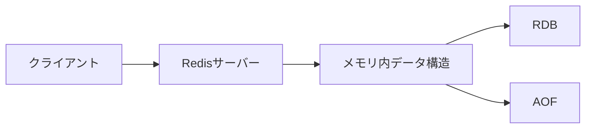

## 1. Redisの概要

### 1.1. Redisとは

Redisは、オープンソースの高性能なインメモリKey-Valueストアです。2009年にSalvatore Sanfilippo氏によって開発され、現在では多くの企業や開発者に愛用されています。Redisは、データをメモリ上に保持することで高速なデータアクセスを実現し、さまざまなデータ構造をサポートしています。

### 1.2. Redisの特徴

Redisには以下のような特徴があります。

- 高速性: メモリ上にデータを保持することで、非常に高速なデータの読み書きが可能です。
- 柔軟なデータ構造: 文字列、リスト、セット、ソート済みセット、ハッシュ、ビットマップ、HyperLogLogsなど、多様なデータ構造をサポートしています。
- シンプルなコマンドセット: Redisは簡潔で使いやすいコマンドセットを提供しており、開発者は容易にRedisを操作できます。
- パブリッシュ/サブスクライブ: Redisは、パブリッシュ/サブスクライブ機能を内蔵しており、リアルタイムアプリケーションの開発に適しています。
- 永続化オプション: スナップショットやAppend Only Fileを使用して、データをディスクに永続化できます。
- 高可用性: Redisは、マスター/スレーブレプリケーションとSentinelを使用して高可用性を実現できます。

### 1.3. Redisの利点

Redisを使用することで、以下のようなメリットが得られます。

- アプリケーションのパフォーマンス向上: 頻繁にアクセスされるデータをRedisにキャッシュすることで、アプリケーションの応答速度が大幅に向上します。
- スケーラビリティの向上: Redisは水平にスケールアウトできるため、アプリケーションの負荷に合わせて容易にスケールできます。
- 開発の生産性向上: Redisのシンプルで使いやすいコマンドセットにより、開発者は短時間でRedisを導入し、アプリケーションを開発できます。
- リアルタイムアプリケーションの実現: Redisのパブリッシュ/サブスクライブ機能を活用することで、リアルタイムなデータ配信が可能になります。

以上が、Redisの概要です。次の章では、Redisのユースケースについて詳しく見ていきましょう。

## 2. Redisのユースケース

Redisは、その高速性と柔軟性から、さまざまなユースケースで活用されています。ここでは、Railsアプリケーションにおける代表的なユースケースを見ていきます。

### 2.1. キャッシュ

キャッシングは、Redisの最も一般的なユースケースの1つです。頻繁にアクセスされるデータをRedisにキャッシュすることで、アプリケーションのパフォーマンスを大幅に向上させることができます。

#### 2.1.1. データのキャッシング

Railsアプリケーションでは、データベースへのクエリ結果をRedisにキャッシュすることで、リクエストのレスポンス時間を短縮できます。以下は、Railsでデータをキャッシュするサンプルコードです。

```ruby
class Post < ApplicationRecord
  def self.cached_find(id)
    Rails.cache.fetch("post:#{id}", expires_in: 1.hour) do
      find(id)
    end
  end
end
```

#### 2.1.2. ページのキャッシング

Railsでは、ActionPackのページキャッシュ機能を使用してレスポンス全体をキャッシュすることもできます。以下は、Railsでページをキャッシュするサンプルコードです。

```ruby
class PostsController < ApplicationController
  def show
    @post = Post.find(params[:id])

    if request.format == :html
      response.cache_control.merge!(expires_in: 1.hour, public: true)
    end
  end
end
```

#### 2.1.3. Railsでのキャッシュ実装例

以下は、Railsアプリケーションでキャッシングを実装する際の設定例です。

```ruby
# config/environments/production.rb
config.cache_store = :redis_cache_store, {
  url: ENV['REDIS_URL'],
  expires_in: 1.hour
}
```

### 2.2. セッション管理

Redisは、セッション管理にも広く使用されています。Redisをセッションストアとして使用することで、アプリケーションのスケーラビリティが向上し、セッションデータの永続性が確保されます。

#### 2.2.1. Redisを使ったセッション管理の利点

- スケーラビリティ: セッションデータがRedisに保存されるため、アプリケーションサーバーを複数台に増やしてもセッションデータを共有できます。
- パフォーマンス: Redisは高速なインメモリストアであるため、セッションデータへのアクセスが高速です。
- 永続性: Redisのデータは、永続化オプションを使用してディスクに保存できるため、アプリケーションサーバーが停止してもセッションデータが失われません。

#### 2.2.2. Railsでのセッション管理の実装例

Railsでは、`redis-rails`gemを使用してRedisをセッションストアとして設定できます。

```ruby
# Gemfile
gem 'redis-rails'

# config/initializers/session_store.rb
Rails.application.config.session_store :redis_store, {
  servers: ['redis://localhost:6379/0/session'],
  expire_after: 90.minutes,
  key: '_your_app_name_session'
}
```

### 2.3. リアルタイムデータ処理

Redisは、パブリッシュ/サブスクライブ機能を使ってリアルタイムデータ処理を実現できます。これにより、チャットアプリケーションやライブ更新機能など、リアルタイム性が求められるアプリケーションの開発が容易になります。

#### 2.3.1. Pub/Subパターン

Pub/Subパターンでは、パブリッシャーがチャンネルにメッセージを送信し、そのチャンネルをサブスクライブしているサブスクライバーがメッセージを受信します。Redisでは、`PUBLISH`と`SUBSCRIBE`コマンドを使用してPub/Subを実装します。

#### 2.3.2. Railsでのリアルタイムデータ処理の実装例

以下は、Railsアプリケーションでリアルタイムデータ処理を実装する例です。

```ruby
# app/controllers/messages_controller.rb
class MessagesController < ApplicationController
  def create
    message = Message.create!(content: params[:content])
    ActionCable.server.broadcast("chat_channel", message: render_message(message))
    head :ok
  end

  private

  def render_message(message)
    ApplicationController.render(
      partial: 'messages/message',
      locals: { message: message }
    )
  end
end

# app/javascript/channels/chat_channel.js
import consumer from "./consumer"

consumer.subscriptions.create("ChatChannel", {
  received(data) {
    const messagesContainer = document.getElementById('messages');
    messagesContainer.insertAdjacentHTML('beforeend', data.message);
  }
});
```

### 2.4. ランキングとリーダーボード

Redisのソート機能を利用すると、ランキングやリーダーボードを簡単に実装できます。これは、ゲームアプリケーションやeコマースサイトなどで活用されています。

#### 2.4.1. Redisのソート機能

Redisの`ZADD`コマンドを使用して、スコアとメンバーのペアをソート済みセットに追加できます。`ZRANGE`コマンドを使用して、ソート済みセットからスコアの昇順または降順でメンバーを取得できます。

#### 2.4.2. Railsでのランキング機能の実装例

以下は、Railsアプリケーションでランキング機能を実装する例です。

```ruby
# app/models/user.rb
class User < ApplicationRecord
  def self.leaderboard(limit = 10)
    redis = Redis.new
    scores = redis.zrevrange("leaderboard", 0, limit - 1, with_scores: true)
    scores.map { |user_id, score| [find(user_id), score.to_i] }
  end

  def update_leaderboard(score)
    redis = Redis.new
    redis.zadd("leaderboard", score, id)
  end
end

# app/controllers/leaderboard_controller.rb
class LeaderboardController < ApplicationController
  def index
    @leaderboard = User.leaderboard
  end
end
```

### 2.5. ジョブキュー

Redisは、ジョブキューの実装にも使用されます。バックグラウンドジョブを管理し、非同期タスクを処理するために、RedisをキューストアとしてSidekiqなどと組み合わせることができます。

#### 2.5.1. Redisを使ったジョブキューの仕組み

ジョブキューでは、アプリケーションがジョブをRedisにエンキューし、ワーカープロセスがジョブをデキューして実行します。これにより、リクエスト処理とバックグラウンドタスクを分離し、アプリケーションのレスポンス性を向上させることができます。

#### 2.5.2. Railsでのジョブキューの実装例

以下は、RailsアプリケーションでSidekiqを使用してジョブキューを実装する例です。

```ruby
# Gemfile
gem 'sidekiq'

# app/jobs/example_job.rb
class ExampleJob < ApplicationJob
  queue_as :default

  def perform(args)
    # ジョブの処理内容
  end
end

# コントローラーやモデルからジョブをエンキュー
ExampleJob.perform_later(args)
```

以上が、Redisのユースケースとそれぞれの実装例です。次の章では、Redisのアーキテクチャについて詳しく説明します。

## 3. Redisのアーキテクチャ

Redisのアーキテクチャを理解することは、Redisを効果的に活用し、パフォーマンスを最適化するために重要です。ここでは、Redisのアーキテクチャにおける主要な要素について説明します。

### 3.1. シングルスレッドモデル

Redisは、シングルスレッドモデルを採用しています。つまり、Redisは単一のスレッドでコマンドを処理し、クライアントからのリクエストに応答します。このモデルにより、Redisはロックやコンテキストスイッチのオーバーヘッドを回避し、高いパフォーマンスを実現しています。

### 3.2. メモリ内データ構造

Redisは、データをメモリ内に保持します。メモリアクセスは非常に高速であるため、Redisは低レイテンシーでデータの読み書きを行うことができます。Redisは、文字列、リスト、セット、ハッシュなどの多様なデータ構造をサポートしており、これらのデータ構造はすべてメモリ内で効率的に管理されます。

### 3.3. 永続化オプション

Redisは、データの永続化のために2つのオプションを提供しています：RDB（Redis Database）とAOF（Append Only File）です。

#### 3.3.1. RDB（Redis Database）

RDBは、指定した間隔でRedisのデータセットのスナップショットを作成します。スナップショットは、バックグラウンドで作成され、メインのRedisプロセスに影響を与えません。RDBは、データの完全なバックアップを提供し、リカバリ時間が短いという利点があります。

#### 3.3.2. AOF（Append Only File）

AOFは、Redisが受け取った各書き込みコマンドをログファイルに追記していく方式です。AOFファイルを使用すると、Redisはクラッシュ後の再起動時にログファイルを再生することで、データセットを復元できます。AOFは、データのより細かい粒度での永続化を提供しますが、RDBよりもディスク使用量が多くなる傾向があります。

### 3.4. Redisのアーキテクチャ図解

以下は、Redisのアーキテクチャを図解したものです。



## 4. Redisの運用

Redisを本番環境で運用する際には、適切な設定、モニタリング、セキュリティ対策が必要です。ここでは、Redisの運用に関する重要なポイントについて説明します。

### 4.1. Redisのインストールと設定

Redisは、公式ウェブサイトからダウンロードしてインストールできます。インストール後、`redis.conf`ファイルを編集してRedisのさまざまな設定を行います。重要な設定項目には、メモリ制限、永続化オプション、セキュリティ設定などがあります。

### 4.2. Redisのモニタリングとパフォーマンスチューニング

Redisのパフォーマンスを最適化し、問題を早期に発見するために、定期的にモニタリングを行う必要があります。以下のようなメトリクスを監視することが推奨されます：

- メモリ使用量
- CPU使用率
- クライアント接続数
- キャッシュヒット率
- レイテンシー

これらのメトリクスを監視するために、RedisInfoコマンドやPrometheusなどのモニタリングツールを使用できます。パフォーマンスの問題が見つかった場合は、設定の調整やデータモデルの最適化によって解決できます。

### 4.3. Redisのセキュリティ

Redisをセキュアに運用するために、以下のセキュリティ対策を実施することが重要です：

- 認証の有効化：Redisの認証機能を有効にし、強力なパスワードを設定します。
- ネットワークセキュリティ：Redisへのアクセスを信頼できるクライアントのみに制限し、SSLを使用して通信を暗号化します。
- 最小権限の原則：Redisのユーザーには、必要最小限の権限のみを付与します。
- 定期的なセキュリティ監査：Redisの設定とアクセスログを定期的にレビューし、セキュリティ上の問題がないか確認します。

### 4.4. Redisのスケーリング

Redisは、アプリケーションの負荷に合わせて水平にスケールアウトできます。スケーリングには、以下の手法を使用できます。

#### 4.4.1. レプリケーション

Redisのマスター/スレーブレプリケーションを使用して、読み取り負荷を分散できます。マスターノードがデータの書き込みを処理し、スレーブノードが読み取りリクエストに応答します。

#### 4.4.2. シャーディング

シャーディングは、データを複数のRedisインスタンスに分割する手法です。各インスタンスは、データセットの一部を担当し、負荷を分散します。シャーディングには、クライアント側のシャーディングとプロキシベースのシャーディングがあります。

#### 4.4.3. クラスタリング

Redisクラスタは、複数のRedisノードを組み合わせて、自動的にデータをシャーディングし、高可用性を実現します。Redisクラスタは、シャーディングとレプリケーションの両方の利点を兼ね備えています。

## 5. Redisエコシステム

Redisには、コアプロジェクトに加えて、多様なツールとライブラリからなる活発なエコシステムがあります。

### 5.1. Redis Modules

Redis Modulesは、Redisの機能を拡張するプラグインシステムです。サードパーティ開発者は、独自の機能をRedisに追加できます。人気のあるRedis Modulesには、RediSearch（全文検索）、RedisJSON（JSONデータ型）、RedisGraph（グラフデータベース）などがあります。

### 5.2. Redis Labs

Redis Labsは、Redisの開発とサポートを提供する企業です。Redis Labsは、Redis Enterpriseという商用版のRedisを提供しており、追加の機能とサポートが含まれています。

## 6. まとめ

### 6.1. Redisの活用により得られるメリット

- 高速なデータアクセス：Redisのインメモリデータ構造とシングルスレッドモデルにより、非常に高速なデータの読み書きが可能です。
- 柔軟性：Redisは、さまざまなデータ構造をサポートしており、多様なユースケースに適用できます。
- スケーラビリティ：レプリケーション、シャーディング、クラスタリングにより、Redisはアプリケーションの成長に合わせて水平にスケールアウトできます。
- 開発の生産性：Redisのシンプルなコマンドセットとクライアントライブラリにより、開発者は短時間でRedisを導入し、アプリケーションを開発できます。

### 6.2. アプリケーション開発におけるRedisの重要性

Redisは、現代のアプリケーション開発において不可欠なツールの1つです。キャッシング、セッション管理、リアルタイムデータ処理など、さまざまなユースケースでRedisを活用することで、アプリケーションのパフォーマンス、スケーラビリティ、ユーザーエクスペリエンスを向上させることができます。開発者がRedisの機能を十分に理解し、適切に運用することが、アプリケーションの成功につながります。

## 7. 参考資料

- [【Rails入門】Redisでセッションを高速化しよう！キャッシュも解説](https://www.sejuku.net/blog/58218)
- [Rails RedisでPVランキングを作ってみた](https://blog.seishin55.com/entry/2016/05/02/214513)
