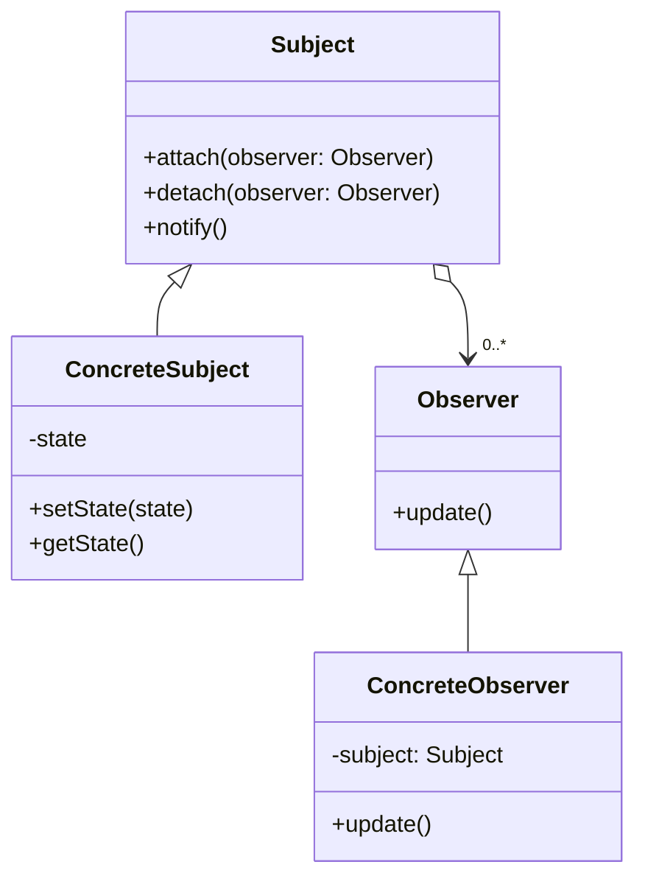

## 1. はじめに

### デザインパターンとは

デザインパターンとは、ソフトウェア開発における共通の問題に対する再利用可能な解決策のことを指します。オブジェクト指向設計の文脈では、デザインパターンは、クラス間の関係とインタラクションを構造化する方法を提供します。デザインパターンを適用することで、コードの可読性、柔軟性、メンテナンス性を向上させることができます。

### Observerパターンの概要

Observerパターンは、オブジェクト間の一対多の依存関係を定義するためのデザインパターンです。このパターンでは、あるオブジェクト（Subject）の状態が変化したときに、それに依存する複数のオブジェクト（Observer）に自動的に通知されます。Observerパターンを使用することで、Subjectの変更に応じてObserverが自動的に更新される仕組みを実現できます。

Observerパターンは、以下のような場面で特に有用です。

- オブジェクト間の結合度を下げたい場合
- イベント駆動型のシステムを設計する場合
- 複数のオブジェクトが他のオブジェクトの状態変化に関心を持つ場合

Rubyでは、Observerパターンを簡単に実装できるようにするため、`Observable`モジュールが標準ライブラリに含まれています。また、RailsではActiveRecord::Observerという仕組みを使って、モデルの変更を監視し、特定のイベントに反応することができます。

本記事では、Observerパターンの構造や実装方法を詳しく解説し、RubyとRailsでの具体的な活用例を紹介します。Observerパターンを理解し、適切に活用することで、イベント通知の柔軟性を実現し、よりメンテナンスしやすいコードを書くことができるでしょう。

## 2. Observerパターンとは

### 目的と適用場面

Observerパターンの主な目的は、オブジェクト間の一対多の依存関係を定義し、疎結合なイベント通知の仕組みを提供することです。このパターンを適用することで、以下のようなメリットが得られます。

- Subjectの変更に応じて、Observerが自動的に更新される
- SubjectとObserverが疎結合になり、互いに独立して変更できる
- 新しいObserverを追加しても、Subjectのコードを変更する必要がない

Observerパターンは、以下のような場面で適用されます。

- GUIアプリケーションでのイベント処理
- モデルの変更に応じたビューの更新
- ログ記録システム
- イベント駆動型のシステム設計

### 関連するパターン

Observerパターンは、他のいくつかのデザインパターンや概念と関連しています。

- Publish-Subscribe（Pub/Sub）パターン：Observerパターンの一種で、Subjectが不特定多数のObserverにイベントを通知する。メッセージキューシステムなどで使用される。
- Event-Driven Architecture（EDA）：Observerパターンを応用し、システム全体をイベント駆動型で設計する。マイクロサービスアーキテクチャとの親和性が高い。

これらのパターンや概念を理解することで、Observerパターンをより効果的に活用できるようになります。

## 3. Observerパターンの構造

### 登場するクラスとその役割

Observerパターンには、以下の2種類のクラスが登場します。

1. Subject（通知元）
   - Observerを登録・削除するためのインターフェースを提供する
   - 状態が変化したときに、登録されているObserverに通知する
2. Observer（通知先）
   - Subjectから通知を受け取るためのインターフェースを定義する
   - 通知を受け取ったときに、適切な処理を行う

### クラス図（Mermaid）

以下は、Observerパターンのクラス図をMermaid記法で表現したものです。



このクラス図では、以下の関係を表現しています。

- `Subject`は`Observer`のインターフェースを持つ
- `ConcreteSubject`は`Subject`を継承し、状態を管理する
- `ConcreteObserver`は`Observer`を実装し、`Subject`から通知を受け取る

## 4. Rubyでのオブザーバーパターンの実装

### サンプルコード（Ruby）

以下は、RubyでObserverパターンを実装した簡単なサンプルコードです。

```ruby
require 'observer'

class WeatherStation
  include Observable

  def initialize
    @temperature = 0
    @humidity = 0
  end

  def update_measurements(temperature, humidity)
    @temperature = temperature
    @humidity = humidity
    changed
    notify_observers(self)
  end

  attr_reader :temperature, :humidity
end

class Display
  def update(weather_station)
    puts "Temperature: #{weather_station.temperature}°C, Humidity: #{weather_station.humidity}%"
  end
end

weather_station = WeatherStation.new
display = Display.new

weather_station.add_observer(display)

weather_station.update_measurements(25, 60)
weather_station.update_measurements(27, 65)
```

```bash
[33] pry(main)> weather_station.update_measurements(27, 60)
Temperature: 27°C, Humidity: 60%
=> false
[34] pry(main)> weather_station.update_measurements(27, 65)
Temperature: 27°C, Humidity: 65%
=> false
```

### コードの説明

このサンプルコードでは、以下のようにObserverパターンを実装しています。

1. `WeatherStation`クラスが`Observable`モジュールをインクルードすることで、Observerパターンの機能を利用できるようになる。
2. `Display`クラスが`update`メソッドを実装することで、`WeatherStation`から通知を受け取る。
3. `WeatherStation`のインスタンスに`Display`のインスタンスをObserverとして登録する。
4. `WeatherStation`の状態が変化したときに、`changed`メソッドと`notify_observers`メソッドを呼び出すことで、登録されているObserverに通知が送られる。

このように、RubyではObservableモジュールを使うことで、簡単にObserverパターンを実装できます。

## 5. RailsでのObserverパターンの実装

### ActiveRecord::Observerの使い方

Railsでは、ActiveRecord::Observerという仕組みを使って、モデルの変更を監視し、特定のイベントに反応することができます。Observerは、モデルのライフサイクルイベント（作成、更新、削除など）をフックすることができ、イベントが発生したときに指定されたメソッドが呼び出されます。

Railsでのobserverの基本的な使い方は以下のとおりです。

1. `rails generate observer モデル名`コマンドを実行して、Observerのひな型を生成する。
2. 生成されたObserverクラスに、監視対象のイベントに対応するメソッドを定義する。
3. `config/application.rb`ファイルに、Observerを登録するための設定を追加する。

### サンプルコード（Rails）

以下は、RailsでActiveRecord::Observerを使ってObserverパターンを実装した簡単なサンプルコードです。

```ruby
# app/models/user.rb
class User < ApplicationRecord
  after_create :send_welcome_email

  private

  def send_welcome_email
    UserMailer.welcome_email(self).deliver_now
  end
end

# app/models/user_observer.rb
class UserObserver < ActiveRecord::Observer
  def after_create(user)
    AdminNotifier.new_user_notification(user).deliver_now
  end
end

# config/application.rb
config.active_record.observers = :user_observer
```

### コードの説明

このサンプルコードでは、以下のようにActiveRecord::Observerを使ってObserverパターンを実装しています。

1. `User`モデルに`after_create`コールバックを定義して、新しいユーザーが作成されたときにウェルカムメールを送信する。
2. `UserObserver`クラスを定義し、`after_create`メソッドを実装することで、新しいユーザーが作成されたときに管理者に通知メールを送信する。
3. `config/application.rb`ファイルに`config.active_record.observers = :user_observer`を追加して、`UserObserver`を登録する。

このように、RailsのActiveRecord::Observerを使うことで、モデルの変更を監視し、特定のイベントに反応するObserverを簡単に実装できます。

## 6. RailsでのObserverパターンのユースケース

ここでは、RailsでのObserverパターンの具体的なユースケースを2つ紹介します。

### ユースケース1: ユーザー登録後の通知メール送信

ユーザーが新規登録した後に、ユーザーにウェルカムメールを送信し、管理者に通知メールを送信するケースを考えてみましょう。

#### サンプルコード（Rails）

```ruby
# app/models/user.rb
class User < ApplicationRecord
  after_create_commit :send_welcome_email

  private

  def send_welcome_email
    UserMailer.welcome_email(self).deliver_later
  end
end

# app/observers/user_observer.rb
class UserObserver < ActiveRecord::Observer
  def after_create(user)
    AdminNotifier.new_user_notification(user).deliver_later
  end
end

# app/mailers/user_mailer.rb
class UserMailer < ApplicationMailer
  def welcome_email(user)
    @user = user
    mail(to: @user.email, subject: 'Welcome to Our Application')
  end
end

# app/mailers/admin_notifier.rb
class AdminNotifier < ApplicationMailer
  def new_user_notification(user)
    @user = user
    mail(to: 'admin@example.com', subject: 'New User Registered')
  end
end
```

#### コードの説明

1. `User`モデルに`after_create_commit`コールバックを定義して、ユーザー作成後にウェルカムメールを非同期で送信する。
2. `UserObserver`を定義し、`after_create`メソッドを実装して、ユーザー作成後に管理者に通知メールを非同期で送信する。
3. `UserMailer`と`AdminNotifier`を定義して、それぞれウェルカムメールと通知メールの内容を定義する。

### ユースケース2: モデルの変更を監視してキャッシュを更新

モデルの変更を監視し、変更があった場合にキャッシュを自動的に更新するケースを考えてみましょう。

#### サンプルコード（Rails）

```ruby
# app/models/product.rb
class Product < ApplicationRecord
  after_commit :flush_cache

  def flush_cache
    Rails.cache.delete("product_#{id}")
  end
end

# app/observers/product_observer.rb
class ProductObserver < ActiveRecord::Observer
  def after_update(product)
    product.flush_cache
  end
end

# config/application.rb
config.active_record.observers = :product_observer
```

#### コードの説明

1. `Product`モデルに`after_commit`コールバックを定義して、モデルの変更後にキャッシュを削除する。
2. `ProductObserver`を定義し、`after_update`メソッドを実装して、モデルの更新後にキャッシュを削除する。
3. `config/application.rb`ファイルに`ProductObserver`を登録する。

これらのユースケースは、RailsアプリケーションでのObserverパターンの活用方法の一部です。Observerパターンを適切に使うことで、モデルの変更に応じた処理を柔軟に実装できます。

## 7. Observerパターンのメリットとデメリット

### メリット

- Subjectの変更に応じて、Observerが自動的に更新されるため、イベント駆動型のシステムを実装しやすい。
- SubjectとObserverが疎結合になるため、互いに独立して変更できる。
- 新しいObserverを追加しても、Subjectのコードを変更する必要がない。

### デメリット

- Observerの数が増えると、通知の処理が複雑になり、パフォーマンスが低下する可能性がある。
- イベントの発生順序や依存関係を管理するのが難しくなる場合がある。
- デバッグが難しくなる可能性がある。

## 8. 実際のアプリケーションでの活用例

### 例1: ログ記録システム

アプリケーションの各部分からのイベントをログに記録する際に、Observerパターンを使って実装できます。各コンポーネントがSubjectとなり、ロガーがObserverとなります。コンポーネントの状態が変化したときに、ロガーがそのイベントを記録します。

### 例2: イベント駆動型のUI更新

ユーザーインターフェースの各部分を、Observerパターンを使って実装できます。モデルがSubjectとなり、ビューがObserverとなります。モデルの状態が変化したときに、ビューが自動的に更新されます。

## 9. まとめ

本記事では、Observerパターンについて詳しく解説しました。Observerパターンは、オブジェクト間の一対多の依存関係を定義し、イベント通知の柔軟性を実現するためのデザインパターンです。RubyやRailsでの実装方法、具体的なユースケース、メリットとデメリットについても説明しました。

### Observerパターンの重要ポイント

- SubjectとObserverを分離し、疎結合なイベント通知の仕組みを提供する。
- RubyではObservableモジュールを使って簡単に実装できる。
- RailsではActiveRecord::Observerを使ってモデルの変更を監視できる。

### パターンを適用する際の留意点

- Observerの数が増えすぎないように注意する。
- イベントの発生順序や依存関係を適切に管理する。
- デバッグしやすいコードを心がける。

Observerパターンを適切に活用することで、イベント駆動型のシステムを柔軟に設計できます。ただし、パターンの適用には注意が必要です。システムの要件や制約を考慮し、適切な場面でObserverパターンを使うことが大切です。

## 参考資料

- [Railsのオブザーバまとめ](https://www.techscore.com/blog/2012/12/25/rails%E3%81%AE%E3%82%AA%E3%83%96%E3%82%B6%E3%83%BC%E3%83%90%E3%81%BE%E3%81%A8%E3%82%81/)
- [オブザーバ(Observer) | Ruby デザインパターン](https://morizyun.github.io/ruby/design-pattern-observer.html)
- [rails/rails-observers](https://github.com/rails/rails-observers)

<div style="position: relative; padding-bottom: 56.25%;">
  <iframe
    style="position: absolute; top: 0; left: 0; width: 100%; height: 100%;"
    src="https://www.youtube.com/embed/9qyZJn5AmhU?si=dl5msrqUdKQ3YUaU"
    frameborder="0"
    allow="autoplay; encrypted-media"
    allowfullscreen
  ></iframe>
</div>
