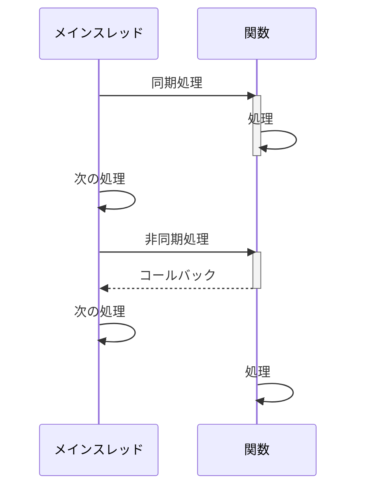
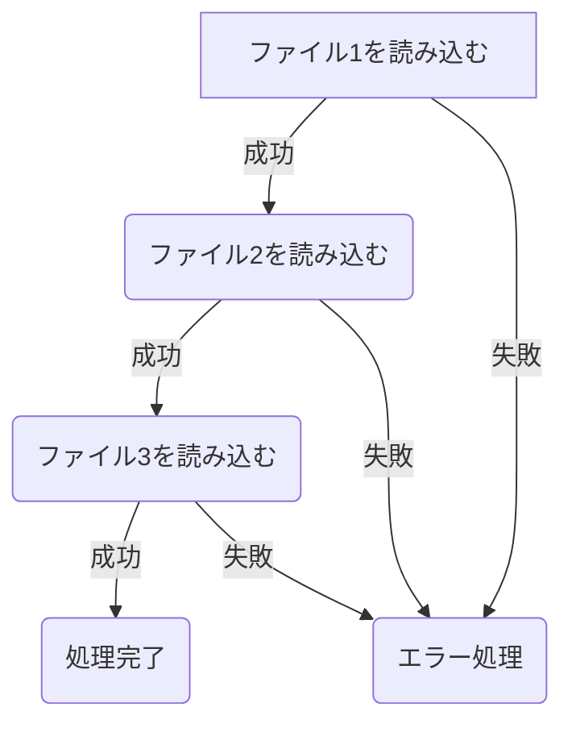
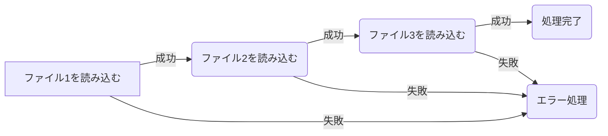
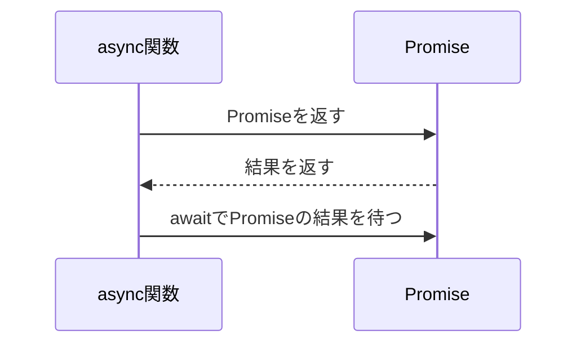
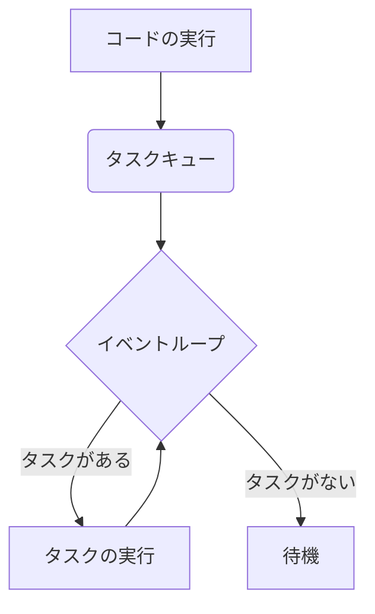

## 1. イントロダクション

### Node.jsとは何か

Node.jsは、ChromeのV8 JavaScriptエンジンをベースにした、サーバーサイドで動作するJavaScript実行環境です。Node.jsを使用することで、JavaScriptを使ってサーバーサイドアプリケーションを構築することができます。

Node.jsの特徴として、以下のような点が挙げられます。

- イベント駆動型のアーキテクチャ
- ノンブロッキングI/O
- 単一スレッドで動作
- 大規模なスケーラビリティ

これらの特徴により、Node.jsは高速で効率的なネットワーク処理を実現し、リアルタイムWebアプリケーションやAPIの構築に適しています。

### Node.jsの利点

Node.jsを使用する主な利点は以下の通りです。

1. 高速性: ノンブロッキングI/Oにより、高速な処理が可能です。
2. スケーラビリティ: イベント駆動型のアーキテクチャにより、大規模なアプリケーションに対応できます。
3. 開発効率: フロントエンドとバックエンドで同じ言語（JavaScript）を使用できるため、開発効率が向上します。
4. 豊富なエコシステム: npm（Node Package Manager）を通じて、多数のライブラリやパッケージを利用できます。

### 非同期処理の重要性

Node.jsでは、非同期処理が重要な役割を果たします。非同期処理を使用することで、I/O処理などの時間のかかる処理を行っている間も、他の処理を続けることができます。これにより、アプリケーションのパフォーマンスが向上し、効率的な処理が可能になります。

非同期処理を理解することは、Node.jsを使ったアプリケーション開発において必要不可欠です。この記事では、非同期処理の基本概念から応用まで、段階的に解説していきます。

## 2. 同期処理と非同期処理の違い

### 同期処理の概念と例

同期処理とは、一連の処理が順番に実行され、ある処理が完了するまで次の処理が開始されない処理方式です。つまり、処理がブロックされ、一つの処理が終わるまで他の処理は待機状態になります。

以下は、同期処理の例です。

```javascript
console.log("Start");

function sleep(ms) {
  const startTime = new Date().getTime();
  while (new Date().getTime() - startTime < ms) {}
}

sleep(3000);
console.log("End");
```

この例では、`sleep`関数が3秒間ブロックされ、その間は他の処理が実行されません。

### 非同期処理の概念と例

非同期処理とは、一つの処理が完了するのを待たずに、次の処理を開始する処理方式です。JavaScriptでは、非同期処理を実現するために、コールバック関数、Promise、async/awaitなどの機能が用意されています。

以下は、非同期処理の例です。

```javascript
console.log("Start");

setTimeout(() => {
  console.log("Timeout");
}, 3000);

console.log("End");
```

この例では、`setTimeout`関数を使用して、3秒後に`"Timeout"`が出力されるようにしています。ただし、`setTimeout`関数は非同期で実行されるため、`"End"`は`"Timeout"`の前に出力されます。

出力例

```bash
Start
End
Timeout
```

### 同期処理と非同期処理の比較

以下は、同期処理と非同期処理の違いを図解しています。



同期処理では、メインスレッドは関数の処理が完了するまで待機しますが、非同期処理では、メインスレッドは関数にコールバックを渡し、次の処理を続行します。関数の処理が完了すると、コールバックが実行されます。

非同期処理を使用することで、メインスレッドがブロックされずに効率的に処理を進めることができます。

## 3. コールバック関数

### コールバック関数の概念

コールバック関数は、他の関数の引数として渡される関数で、非同期処理が完了した後に実行されます。コールバック関数を使用することで、非同期処理の結果を処理することができます。

### コールバック関数の例

以下は、ファイルの読み込みにコールバック関数を使用する例です。

```javascript
const fs = require("fs");

fs.readFile("file.txt", "utf8", (err, data) => {
  if (err) {
    console.error(err);
    return;
  }
  console.log(data);
});
```

この例では、`fs.readFile`関数を使用して、`file.txt`を読み込んでいます。コールバック関数は、`err`（エラーオブジェクト）と`data`（ファイルの内容）を引数に取ります。エラーが発生した場合は`err`が存在し、エラー処理を行います。読み込みが成功した場合は、`data`にファイルの内容が格納されます。

### コールバック地獄の問題点

コールバック関数を多用すると、コードの可読性が低下し、「コールバック地獄」と呼ばれる状態になることがあります。以下は、コールバック地獄の例です。

```javascript
fs.readFile("file1.txt", "utf8", (err, data1) => {
  if (err) {
    console.error(err);
    return;
  }
  fs.readFile("file2.txt", "utf8", (err, data2) => {
    if (err) {
      console.error(err);
      return;
    }
    fs.readFile("file3.txt", "utf8", (err, data3) => {
      if (err) {
        console.error(err);
        return;
      }
      console.log(data1, data2, data3);
    });
  });
});
```

このようなコードは、読みにくく、エラー処理も複雑になります。



コールバック地獄を避けるために、Promise や async/await を使用することが推奨されています。

## 4. Promise

### Promise の概念

Promise は、非同期処理の結果を表すオブジェクトです。Promise を使用することで、コールバック地獄を避け、非同期処理を読みやすく記述することができます。

### Promise の状態（pending, fulfilled, rejected）

Promise には、以下の3つの状態があります。

1. pending（保留中）：初期状態、非同期処理が完了していない状態
2. fulfilled（成功）：非同期処理が成功した状態
3. rejected（失敗）：非同期処理が失敗した状態

### Promise の例

以下は、Promise を使用してファイルを読み込む例です。

```javascript
const fs = require("fs").promises;

fs.readFile("file.txt", "utf8")
  .then((data) => {
    console.log(data);
  })
  .catch((err) => {
    console.error(err);
  });
```

この例では、`fs.promises.readFile` 関数を使用して、`file.txt` を読み込んでいます。`then` メソッドで成功時の処理を、`catch` メソッドで失敗時の処理を記述します。

### Promise チェーン

複数の非同期処理を順番に実行する場合、Promise チェーンを使用することができます。

```javascript
fs.readFile("file1.txt", "utf8")
  .then((data1) => {
    console.log(data1);
    return fs.readFile("file2.txt", "utf8");
  })
  .then((data2) => {
    console.log(data2);
    return fs.readFile("file3.txt", "utf8");
  })
  .then((data3) => {
    console.log(data3);
  })
  .catch((err) => {
    console.error(err);
  });
```



Promise チェーンを使用することで、非同期処理の流れを明確に表現できます。

### Promise の限界

Promise は、非同期処理を扱いやすくしますが、いくつかの限界があります。

1. Promise チェーンが長くなると、コードの可読性が低下する可能性がある
2. エラー処理が複雑になる場合がある
3. 複数の非同期処理を並行して実行することが難しい

これらの限界を解決するために、async/await が導入されました。

## 5. async/await

### async/await の概念

async/await は、Promise をより簡潔に記述するための構文です。`async` 関数内で `await` を使用することで、Promise の結果を同期的に処理することができます。

### async/await の例

以下は、async/await を使用してファイルを読み込む例です。

```javascript
const fs = require("fs").promises;

async function readFiles() {
  try {
    const data1 = await fs.readFile("file1.txt", "utf8");
    console.log(data1);
    const data2 = await fs.readFile("file2.txt", "utf8");
    console.log(data2);
    const data3 = await fs.readFile("file3.txt", "utf8");
    console.log(data3);
  } catch (err) {
    console.error(err);
  }
}

readFiles();
```

この例では、`async` 関数内で `await` を使用して、ファイルを順番に読み込んでいます。エラー処理は、`try/catch` ブロックで行います。

### async/await と Promise の関係

async/await は、Promise の上に構築された構文糖衣（シンタックスシュガー）です。`async` 関数は、Promise を返し、`await` は Promise の結果を待ちます。



### エラーハンドリング（try/catch）

async/await を使用する場合、エラー処理には `try/catch` ブロックを使用します。

```javascript
async function readFile() {
  try {
    const data = await fs.readFile("file.txt", "utf8");
    console.log(data);
  } catch (err) {
    console.error(err);
  }
}
```

`try` ブロック内で発生したエラーは、`catch` ブロックで捕捉されます。

## 6. イベントループ

### イベントループの概念

Node.js は、シングルスレッドで動作しますが、非同期 I/O を使用することで、高い並行性を実現しています。この並行性を実現するための仕組みが、イベントループです。

### イベントループの仕組み

以下は、イベントループの仕組みを図解しています。



1. コードが実行され、非同期処理（コールバック、Promise、async/await）が登録される
2. 非同期処理は、タスクキューに追加される
3. イベントループは、タスクキューにタスクがあるかを確認する
4. タスクがある場合、イベントループはタスクを取り出し、実行する
5. タスクの実行が完了すると、再びイベントループはタスクキューを確認する
6. タスクがない場合、イベントループは待機状態になる

### タスクキューとジョブキュー

イベントループには、2種類のキューが存在します。

1. タスクキュー（マクロタスクキュー）：I/O処理、タイマー、イベントコールバックなどのタスクを格納する
2. ジョブキュー（マイクロタスクキュー）：Promiseのコールバック、process.nextTick() などのタスクを格納する

イベントループは、まずジョブキューのタスクを実行し、その後タスクキューのタスクを実行します。

### process.nextTick() と setImmediate()

process.nextTick() と setImmediate() は、どちらもタスクをキューに追加する関数ですが、動作に違いがあります。

- process.nextTick()：現在のフェーズが終了した後、次のフェーズが開始する前に実行される
- setImmediate()：現在のフェーズが終了した後、次のイベントループのイテレーションで実行される

以下は、process.nextTick() と setImmediate() の実行順序の例です。

```javascript
console.log("Start");

process.nextTick(() => {
  console.log("Process.nextTick");
});

setImmediate(() => {
  console.log("SetImmediate");
});

console.log("End");
```

出力結果：

```
Start
End
Process.nextTick
SetImmediate
```

## 7. 並行処理

### 並行処理の概念

Node.js は、シングルスレッドで動作しますが、非同期 I/O を利用することで、並行処理を実現しています。並行処理とは、複数のタスクを同時に進行させることを指します。

### 並行処理の例

以下は、並行処理の例です。

```javascript
const fs = require("fs").promises;

async function readFiles() {
  const [data1, data2, data3] = await Promise.all([
    fs.readFile("file1.txt", "utf8"),
    fs.readFile("file2.txt", "utf8"),
    fs.readFile("file3.txt", "utf8"),
  ]);

  console.log(data1);
  console.log(data2);
  console.log(data3);
}

readFiles();
```

この例では、Promise.all() を使用して、3つのファイルを並行して読み込んでいます。Promise.all() は、渡された Promise がすべて解決された時点で、解決された値の配列を返します。

### 並行処理の注意点

並行処理を行う際は、以下の点に注意が必要です。

1. 並行処理の結果が予測不可能になる場合がある
2. 共有リソースへのアクセスが競合する可能性がある
3. エラーハンドリングが複雑になる場合がある

これらの問題を回避するために、適切なエラーハンドリングとリソース管理が必要です。

## 8. ストリーム

### ストリームの概念

ストリームは、データを小さなチャンクに分割して処理する仕組みです。ストリームを使用することで、大量のデータを効率的に処理することができます。

Node.js では、以下の4種類のストリームが提供されています。

1. Readable（読み取り可能）：データを読み取るストリーム
2. Writable（書き込み可能）：データを書き込むストリーム
3. Duplex（双方向）：読み取りと書き込みが可能なストリーム
4. Transform（変換）：読み取ったデータを変換して書き込むストリーム

### 読み取りストリームと書き込みストリーム

以下は、読み取りストリームと書き込みストリームの例です。

```javascript
const fs = require("fs");

// 読み取りストリーム
const readStream = fs.createReadStream("input.txt", "utf8");

// 書き込みストリーム
const writeStream = fs.createWriteStream("output.txt", "utf8");

readStream.on("data", (chunk) => {
  writeStream.write(chunk);
});

readStream.on("end", () => {
  writeStream.end();
});
```

この例では、`input.txt` から読み取ったデータを、`output.txt` に書き込んでいます。

### パイプとチェーンチェーン

ストリームは、パイプを使用して連結することができます。以下は、パイプの例です。

```javascript
const fs = require("fs");
const zlib = require("zlib");

fs.createReadStream("input.txt")
  .pipe(zlib.createGzip())
  .pipe(fs.createWriteStream("output.txt.gz"));
```

この例では、`input.txt` から読み取ったデータを、gzip 圧縮して、`output.txt.gz` に書き込んでいます。


パイプを使用することで、ストリーム間のデータの流れを簡潔に表現できます。

### ストリームの例

以下は、HTTP サーバーでストリームを使用する例です。

```javascript
const fs = require("fs");
const http = require("http");

http
  .createServer((req, res) => {
    const readStream = fs.createReadStream("large-file.txt", "utf8");
    readStream.pipe(res);
  })
  .listen(3000);
```

この例では、`large-file.txt` をストリームで読み取り、HTTP レスポンスに書き込んでいます。これにより、大きなファイルを効率的に送信することができます。

## 9. 非同期処理のベストプラクティス

### エラーハンドリング

非同期処理では、適切なエラーハンドリングが重要です。以下は、エラーハンドリングのベストプラクティスです。

1. コールバック関数の第一引数は、エラーオブジェクトを受け取るようにする
2. Promise の catch メソッドを使用して、エラーをハンドリングする
3. async/await では、try/catch ブロックを使用してエラーをハンドリングする

### 可読性と保守性

非同期処理を使用する際は、可読性と保守性を考慮する必要があります。以下は、可読性と保守性を向上させるためのヒントです。

1. Promise や async/await を使用して、コールバック地獄を避ける
2. 関数を小さく保ち、単一の責任を持つようにする
3. 適切な変数名とコメントを使用して、コードの意図を明確にする

### パフォーマンスの最適化

非同期処理を使用する際は、パフォーマンスに注意が必要です。以下は、パフォーマンスを最適化するためのヒントです。

1. 不必要な非同期処理を避ける
2. I/O 処理は非同期で行う
3. CPU負荷の高い処理は、ワーカースレッドを使用して並列化する
4. メモリリークに注意する

## 10. まとめ

この記事では、Node.js の非同期処理について、以下の内容を説明しました。

1. 非同期処理の重要性
2. 同期処理と非同期処理の違い
3. コールバック関数
4. Promise
5. async/await
6. イベントループ
7. 並行処理
8. ストリーム
9. 非同期処理のベストプラクティス

Node.js での非同期処理は、アプリケーションのパフォーマンスと拡張性を向上させるために不可欠です。コールバック関数、Promise、async/await などを適切に使用することで、効率的で可読性の高いコードを書くことができます。

また、イベントループや並行処理の仕組みを理解することで、Node.js アプリケーションのパフォーマンスを最適化することができます。

ストリームを使用することで、大量のデータを効率的に処理できます。

非同期処理を使用する際は、エラーハンドリング、可読性、保守性、パフォーマンスに注意が必要です。適切なベストプラクティスに従うことで、これらの問題に対処することができます。

Node.js の非同期処理は、初心者にとって難しく感じることがありますが、この記事で説明した概念を理解することで、効果的に非同期処理を使いこなすことができるでしょう。

今後は、以下のようなトピックを学ぶことで、Node.js での非同期処理の理解を深めることができます。

1. ワーカースレッド
2. クラスターモジュール
3. 非同期イテレーション
4. ジェネレーター
5. RxJS などの非同期プログラミングライブラリ

Node.js の非同期処理は、アプリケーションの構築に欠かせない重要な概念です。この記事で得た知識を活かして、効率的で拡張性の高いアプリケーションを開発してください。

- [JavaScript Primer](https://jsprimer.net/basic/async/)
- [Promise](https://developer.mozilla.org/ja/docs/Web/JavaScript/Reference/Global_Objects/Promise)
- [とほほのPromise入門](https://www.tohoho-web.com/ex/promise.html)
