## 1. リバースエンジニアリングの概要

### 1.1 リバースエンジニアリングとは何か

リバースエンジニアリングとは、既存の製品やシステムを解析し、その設計や機能を理解することを目的とした工学的アプローチです。ソフトウェアの文脈では、バイナリ形式のプログラムを解析し、そのアルゴリズム、データ構造、および動作原理を解明するプロセスを指します。リバースエンジニアリングは、ブラックボックスのようなシステムに光を当て、その内部動作を明らかにする強力な手法です。

### 1.2 リバースエンジニアリングの目的と適用分野

リバースエンジニアリングは様々な目的で実施されます。セキュリティ分野では、マルウェアの解析や脆弱性の発見にリバースエンジニアリングが活用されます。レガシーシステムの移行や互換性の確保においても、既存のソフトウェアを解析することが不可欠です。また、競合他社の製品分析や、特許調査などの競争インテリジェンスにもリバースエンジニアリングが用いられます。さらに、学術的な目的で、アルゴリズムや技術の解明にもリバースエンジニアリングが役立ちます。

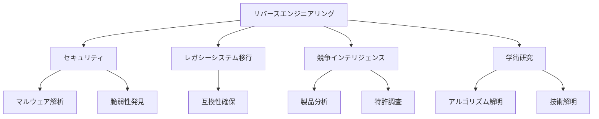

### 1.3 リバースエンジニアリングの歴史と発展

リバースエンジニアリングの歴史は、コンピュータの発明とほぼ同時期に始まりました。初期のプログラマたちは、限られたリソースを最大限に活用するために、既存のコードを解析し、最適化することが常でした。1980年代になると、パーソナルコンピュータの普及に伴い、コンピュータウイルスが出現し、リバースエンジニアリングはマルウェア解析の重要なツールとなりました。現在では、リバースエンジニアリングはサイバーセキュリティ、デジタルフォレンジック、ソフトウェア工学など、幅広い分野で活用されています。最新のツールやテクニックの登場により、リバースエンジニアリングはより高度かつ効率的になっています。

## 2. リバースエンジニアリングの基礎知識

### 2.1 コンピュータアーキテクチャとアセンブリ言語

リバースエンジニアリングを行うには、コンピュータアーキテクチャとアセンブリ言語の理解が不可欠です。コンピュータアーキテクチャは、CPUの構造、レジスタ、メモリ、I/Oシステムなど、コンピュータシステムの基本的な設計を指します。

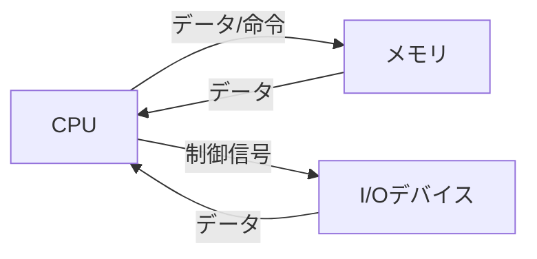

アセンブリ言語は、機械語に直接対応する低レベルのプログラミング言語であり、CPUの命令セットを人間が読み書きできる形式で表現します。リバースエンジニアは、アセンブリコードを読み解くことで、プログラムの動作を理解します。

### 2.2 オペレーティングシステムとファイルフォーマット

オペレーティングシステム（OS）は、ハードウェアとソフトウェアの間の仲介役として機能し、メモリ管理、プロセス管理、ファイルシステムなどの重要な役割を果たします。リバースエンジニアリングでは、OSの仕組みや、プログラムとOSの相互作用を理解することが重要です。また、実行ファイル（EXE）、ダイナミックリンクライブラリ（DLL）、ポータブル実行ファイル（PE）など、様々なファイルフォーマットの構造を把握することが必要です。

### 2.3 プログラミング言語とコンパイラの仕組み

リバースエンジニアリングの対象となるプログラムは、C、C++、Java、Pythonなど、様々なプログラミング言語で書かれています。これらの言語で書かれたソースコードは、コンパイラやインタプリタによって機械語に変換されます。リバースエンジニアは、コンパイラの動作原理や、各言語の特性を理解しておく必要があります。また、最適化やデバッグ情報の生成など、コンパイラのオプションが生成されるバイナリに与える影響についても知っておくことが重要です。

### 2.4 暗号化と難読化技術の概要

多くの商用ソフトウェアでは、不正コピーや解析を防ぐために、暗号化や難読化の技術が使われています。暗号化は、データを秘密鍵や公開鍵を用いて変換し、許可されたユーザーのみがアクセスできるようにする技術です。難読化は、プログラムのソースコードやバイナリを意図的に複雑にし、解析を困難にする技術です。リバースエンジニアは、これらの防御技術を理解し、必要に応じて解除することが求められます。

## 3. 静的解析の手法

### 3.1 バイナリファイルの構造解析

静的解析の第一歩は、バイナリファイルの構造を理解することです。実行ファイルやライブラリには、ヘッダ、セクション、シンボルテーブルなどの重要な情報が含まれています。

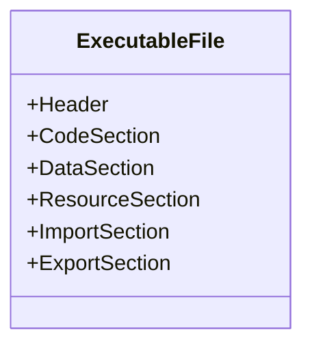

これらの情報を解析することで、プログラムのエントリーポイント、インポート/エクスポート関数、データ領域などを特定できます。ツールを使って、ファイルヘッダ、セクションヘッダ、インポートテーブル、エクスポートテーブルなどを読み取り、プログラムの全体像を把握します。

### 3.2 ディスアセンブリとコード解読

バイナリファイルを逆アセンブルし、アセンブリコードを生成することを「ディスアセンブリ」と呼びます。ディスアセンブラを使用して、バイナリコードをアセンブリ言語の命令に変換し、プログラムの制御フローや動作を理解します。リニアスイープ法やリカーシブトラバーサル法など、様々なディスアセンブリ手法があります。生成されたアセンブリコードを読み解き、命令の意味や引数、制御構造を理解することが重要です。

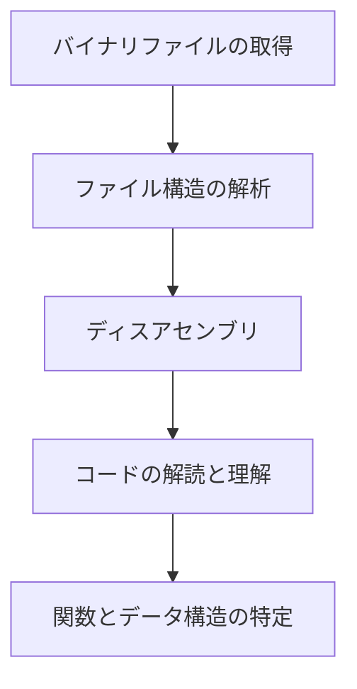

### 3.3 関数とデータ構造の特定

ディスアセンブリされたコードから、関数の境界やデータ構造を特定することが静的解析の重要なタスクです。関数のプロローグ（スタックフレームの設定）やエピローグ（スタックフレームの解放）、呼び出し規約などの特徴に着目することで、関数の開始位置と終了位置を見つけることができます。データ構造については、アクセスパターンや型情報から推測します。シンボル情報が残っている場合は、シンボル名からデータ構造を特定できることもあります。

### 3.4 静的解析ツールの紹介と使用方法

静的解析には、様々なツールが利用可能です。代表的なものとして、IDA Pro、Ghidra、Binary Ninjaなどがあります。これらのツールは、ディスアセンブリ、クロスリファレンス、型情報の推測、コメントやラベルの追加など、静的解析に必要な機能を提供します。各ツールの基本的な使い方を紹介し、実際のバイナリを解析する演習を行うことで、静的解析のスキルを身につけることができます。

## 4. 動的解析の手法

### 4.1 デバッガを用いたプログラムの実行追跡

動的解析では、プログラムを実際に実行しながら、その動作を観察し、解析します。デバッガは、プログラムの実行を制御し、メモリやレジスタの内容を検査するための強力なツールです。デバッガを使って、プログラムを1命令ずつ実行（ステップ実行）したり、特定の条件でプログラムを一時停止（ブレークポイント）したりすることができます。これにより、プログラムの動的な振る舞いを詳細に追跡することが可能になります。

### 4.2 ブレークポイントとウォッチポイントの設定

ブレークポイントは、プログラムの特定の位置で実行を一時停止するための機能です。コードの重要な部分や、興味深い関数の開始位置にブレークポイントを設定することで、その時点でのプログラムの状態を詳しく調べることができます。一方、ウォッチポイントは、特定のメモリ位置やレジスタの値が変更されたときに実行を停止する機能です。データの変更や特定の条件が満たされた瞬間を捉えるのに役立ちます。

### 4.3 メモリとレジスタの監視と操作

動的解析では、メモリとレジスタの内容を監視し、必要に応じて操作することが重要です。デバッガを使って、特定のメモリアドレスやレジスタの値を表示したり、変更したりすることができます。これにより、プログラムのデータフローを追跡し、変数の値がどのように計算され、使用されているかを理解することができます。また、メモリ上の構造体やオブジェクトのレイアウトを解明することもできます。

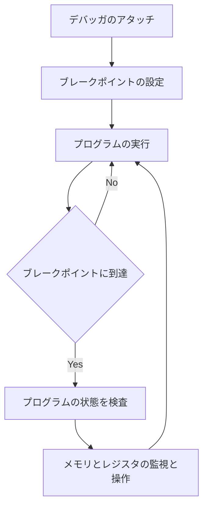

### 4.4 動的解析ツールの紹介と使用方法

動的解析には、様々なツールが利用可能です。代表的なものとして、GDB、OllyDbg、WinDbg、x64dbgなどがあります。これらのツールは、プログラムの実行制御、メモリ監視、ブレークポイント設定など、動的解析に必要な機能を提供します。各ツールの基本的な使い方を紹介し、実際のバイナリを解析する演習を行うことで、動的解析のスキルを身につけることができます。

## 5. バイナリ編集とパッチ当て

### 5.1 バイナリエディタの使用方法

バイナリ編集では、バイナリエディタを使ってバイナリファイルの内容を直接変更します。バイナリエディタは、ファイルをバイト単位で表示し、編集することができるツールです。16進数表示と ASCII 表示を切り替えながら、バイナリデータの構造を理解し、必要な変更を加えることができます。代表的なバイナリエディタとして、HxD、010 Editor、WinHex などがあります。

### 5.2 コードの改変とパッチ当てのテクニック

バイナリ編集の主な目的は、コードを改変し、プログラムの動作を変更することです。パッチ当ては、バイナリファイルの特定の部分を上書きし、新しいコードやデータを挿入するテクニックです。アセンブリ言語の知識を活かして、ジャンプ命令の変更、命令の置き換え、新しいコードの挿入などを行います。また、関数の引数やリターン値の変更、データの書き換えなども、バイナリ編集の対象になります。

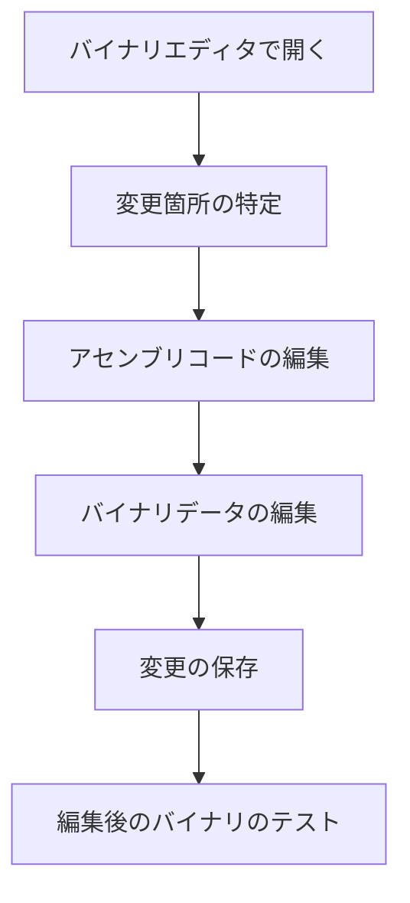

## 5. バイナリ編集とパッチ当て

### 5.1 バイナリエディタの使用方法

バイナリ編集では、バイナリエディタを使ってバイナリファイルの内容を直接変更します。バイナリエディタは、ファイルをバイト単位で表示し、編集することができるツールです。16進数表示と ASCII 表示を切り替えながら、バイナリデータの構造を理解し、必要な変更を加えることができます。代表的なバイナリエディタとして、HxD、010 Editor、WinHex などがあります。

### 5.2 コードの改変とパッチ当てのテクニック

バイナリ編集の主な目的は、コードを改変し、プログラムの動作を変更することです。パッチ当ては、バイナリファイルの特定の部分を上書きし、新しいコードやデータを挿入するテクニックです。アセンブリ言語の知識を活かして、ジャンプ命令の変更、命令の置き換え、新しいコードの挿入などを行います。また、関数の引数やリターン値の変更、データの書き換えなども、バイナリ編集の対象になります。

### 5.3 バイナリ編集の応用例

バイナリ編集は、様々な場面で応用することができます。例えば、ソフトウェアの機能制限を解除したり、バグを修正したりするために、バイナリにパッチを当てることがあります。また、マルウェア解析の際に、マルウェアの動作を変更し、解析を進めることもあります。さらに、ゲームのチート開発では、ゲームのバイナリを編集し、アイテムの無限化や無敵化などを実現することがあります。ただし、バイナリ編集には法的・倫理的な問題が伴う場合があるため、適切な目的で使用する必要があります。

## 6. リバースエンジニアリングの応用分野

### 6.1 マルウェア解析と防御

リバースエンジニアリングは、マルウェア解析に欠かせない手法です。マルウェアのバイナリを解析することで、その動作原理や感染経路、攻撃手法などを明らかにすることができます。これにより、適切な防御策を講じたり、マルウェア対策ソフトウェアを開発したりすることが可能になります。また、リバースエンジニアリングを通じて、新たなマルウェアの亜種や変種を発見し、未知の脅威に対処することもできます。

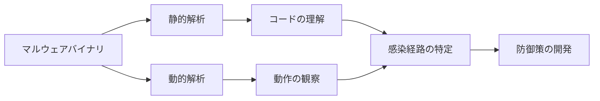

### 6.2 脆弱性の発見とエクスプロイト開発

ソフトウェアの脆弱性を発見し、修正するためにもリバースエンジニアリングが活用されます。バイナリを解析することで、バッファオーバーフローやメモリ破損などの脆弱性を特定し、それを悪用するエクスプロイトを開発することができます。このようなエクスプロイトは、脆弱性の実証（Proof of Concept）に用いられ、ベンダーに脆弱性の修正を促すことができます。また、脆弱性の発見と報告を通じて、ソフトウェアのセキュリティ向上に貢献することもできます。

### 6.3 レガシーソフトウェアの解析と移行

古いソフトウェアやレガシーシステムのメンテナンスには、リバースエンジニアリングが欠かせません。ソースコードが失われたり、開発者が離れたりした場合でも、バイナリを解析することで、システムの動作を理解し、必要な修正や機能追加を行うことができます。また、レガシーシステムを新しいプラットフォームに移行する際にも、リバースエンジニアリングが役立ちます。既存のバイナリを解析し、その機能を新しいシステムに再現することで、スムーズな移行を実現できます。

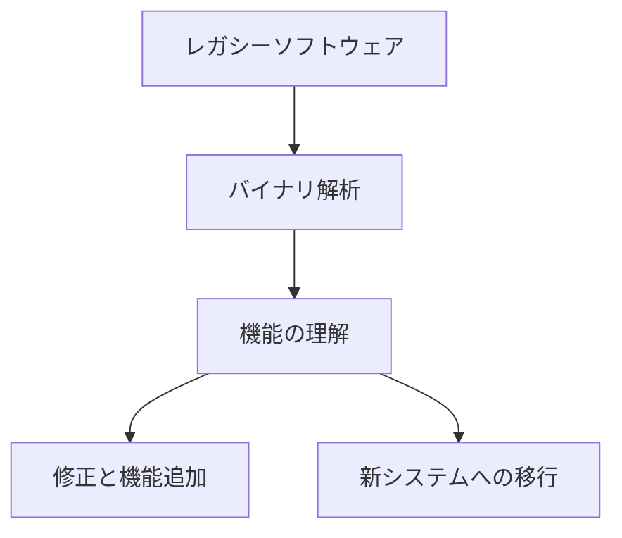

### 6.4 ゲームのモディフィケーションとチート開発

ゲーム業界では、リバースエンジニアリングがモディフィケーション（Mod）開発に利用されることがあります。ゲームのバイナリを解析し、新しい機能やコンテンツを追加することで、オリジナルとは異なる遊び方を提供することができます。一方で、リバースエンジニアリングはチート開発にも悪用される可能性があります。ゲームのバイナリを解析し、不正な方法でゲームを有利に進めるツールを開発することがあります。ゲーム開発者は、リバースエンジニアリングによるチート対策に取り組む必要があります。

## 7. リバースエンジニアリングのツールとリソース

### 7.1 ディスアセンブラとデバッガの詳細比較

リバースエンジニアリングを効果的に行うには、適切なツールの選択が重要です。ディスアセンブラとデバッガは、リバースエンジニアリングの中核をなすツールです。IDA Pro、Ghidra、Binary Ninjaなどのディスアセンブラや、GDB、OllyDbg、WinDbg、x64dbgなどのデバッガについて、その特徴や長所、短所を詳しく比較します。また、各ツールの使用例を示し、それぞれの適した用途を解説します。

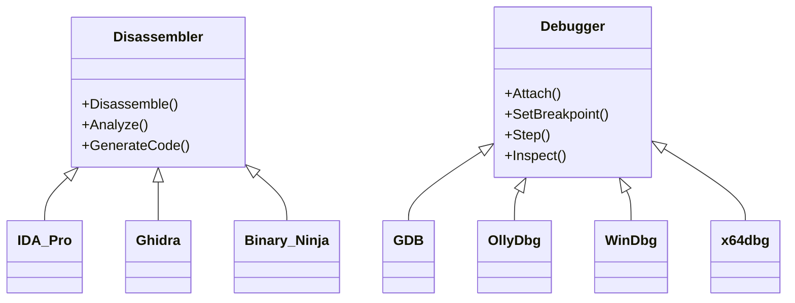

### 7.2 バイナリ解析フレームワークとプラグイン

ディスアセンブラやデバッガに加えて、バイナリ解析フレームワークやプラグインも重要なツールです。Radare2、Angr、Frida、IDAPythonなどのフレームワークやプラグインを紹介し、その使い方を説明します。これらのツールを活用することで、バイナリ解析の自動化や効率化を図ることができます。また、カスタムスクリプトの開発により、特定の用途に特化した解析ツールを作成することも可能です。

### 7.3 リバースエンジニアリングのコミュニティとフォーラム

リバースエンジニアリングの知識や経験を共有し、新しい技術を学ぶためには、コミュニティやフォーラムに参加することが有効です。Reddit、Stack Overflow、Reverse Engineering Stackexchange、Tuts 4 Youなどの一般的なフォーラムに加えて、リバースエンジニアリングに特化したフォーラムやコミュニティについても紹介します。これらのプラットフォームを通じて、他のリバースエンジニアと交流し、情報交換することで、スキルアップを図ることができます。

### 7.4 オンラインリソースと学習教材

リバースエンジニアリングのスキルを習得するには、オンラインリソースや学習教材を活用することが効果的です。書籍、チュートリアル、ビデオコース、CTF（Capture The Flag）イベントなど、様々な学習リソースについて紹介します。初心者向けの教材から、上級者向けの高度な内容まで、レベルに合わせた学習リソースを選ぶことができます。また、リバースエンジニアリングのブログや技術記事、カンファレンスの発表資料なども、有益な情報源となります。

## 8. リバースエンジニアリングの法的・倫理的側面

### 8.1 著作権法とリバースエンジニアリング

リバースエンジニアリングを行う際には、著作権法との関係を理解しておく必要があります。多くの国では、著作権法によってソフトウェアが保護されており、無断でリバースエンジニアリングを行うことが禁止されています。ただし、インターオペラビリティ（相互運用性）の確保や、セキュリティ上の欠陥の発見など、一定の条件の下でリバースエンジニアリングが認められる場合もあります。著作権法の概要と、リバースエンジニアリングに関する法的解釈について解説します。

### 8.2 ライセンス契約とエンドユーザー契約書（EULA）

ソフトウェアの利用には、ライセンス契約やエンドユーザー契約書（EULA）が適用されることがあります。これらの契約では、リバースエンジニアリングを明示的に禁止している場合があります。契約違反としてのリバースエンジニアリングは、法的な問題を引き起こす可能性があります。ライセンス契約やEULAの内容を確認し、リバースエンジニアリングが許可されているかどうかを確認することが重要です。

### 8.3 リバースエンジニアリングの倫理的責任

リバースエンジニアリングには、倫理的な責任も伴います。リバースエンジニアリングで得られた知識や技術を、違法行為や悪意のある目的に使用してはいけません。また、発見した脆弱性を適切に報告し、ベンダーが修正するための時間を与えることも重要です。リバースエンジニアの行動規範や倫理的ガイドラインについて議論し、責任ある行動を促します。

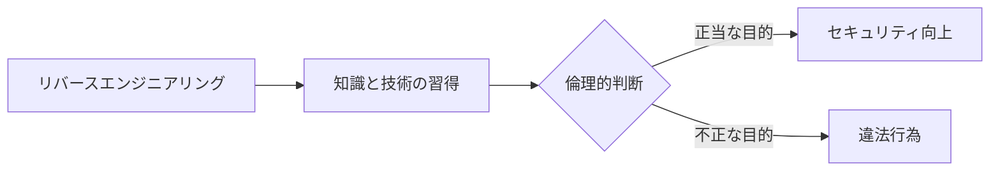

### 8.4 法的リスクの管理とコンプライアンス

リバースエンジニアリングを行う組織は、法的リスクを管理し、コンプライアンスを確保する必要があります。社内でのリバースエンジニアリングポリシーの策定、従業員教育、法的レビューの実施など、体系的なアプローチが求められます。また、オープンソースソフトウェアのライセンス遵守や、サードパーティ製ソフトウェアの使用に関する注意点についても触れます。

## 9. ケーススタディ: 実際のリバースエンジニアリングプロジェクト

### 9.1 マルウェアの解析と対策

実際のマルウェア解析プロジェクトを例に、リバースエンジニアリングの適用方法を示します。マルウェアのバイナリを入手し、静的解析と動的解析を組み合わせて、その動作原理や感染経路を解明します。さらに、マルウェアの検出や駆除のための対策を提案し、実装します。このケーススタディを通じて、リバースエンジニアリングがサイバーセキュリティの現場でどのように活用されているかを理解することができます。

### 9.2 クローズドソースドライバの解析と代替開発

クローズドソースのデバイスドライバを解析し、代替となるオープンソースドライバを開発するプロジェクトを取り上げます。バイナリ解析により、ドライバのインターフェースや動作を理解し、それをオープンソースで再現します。このプロジェクトでは、リバースエンジニアリングがハードウェアとソフトウェアの相互運用性の確保に役立つことを示します。また、コミュニティ主導の開発プロセスにおけるリバースエンジニアリングの役割についても議論します。

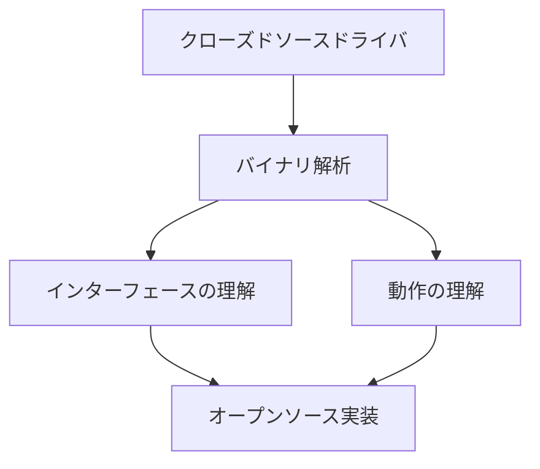

### 9.3 古いゲームの修正とエンハンスメント

古いゲームソフトウェアを修正し、現代のシステムで動作するようにする
