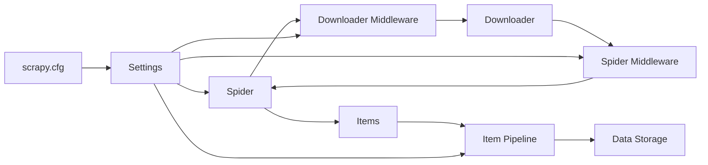

## 1. Scrapy の概要

### Scrapy とは何か

Scrapy は、Python で書かれた強力な Web クローリングおよびスクレイピングフレームワークです。Web サイトからデータを効率的に収集し、構造化されたデータとして抽出することができます。Scrapy は、大規模なクローリングプロジェクトに適しており、柔軟性と拡張性に優れています。

### Scrapy の特徴と利点

1. 高速性: Scrapy は、非同期ネットワーク処理を利用しているため、高速にクローリングを行うことができます。複数のリクエストを並行して処理することで、効率的にデータを収集できます。

2. 柔軟性: Scrapy は、柔軟なアーキテクチャを持っており、開発者はカスタムコンポーネントを簡単に追加・拡張できます。これにより、プロジェクトごとに異なる要件に対応することができます。

3. 強力なセレクター: Scrapy は、XPath と CSS セレクターをサポートしており、Web ページ内の特定の要素を簡単に抽出できます。これにより、目的のデータを正確に取得することができます。

4. リクエストの管理: Scrapy は、リクエストの管理機能を提供しており、リクエストの優先度付け、リトライ、クッキーの処理などを簡単に行うことができます。

5. ミドルウェアのサポート: Scrapy は、リクエストとレスポンスに対して処理を行うミドルウェアをサポートしています。これにより、データの前処理、エラー処理、認証などを柔軟に実装できます。

6. アイテムパイプライン: Scrapy は、抽出したデータを処理するためのアイテムパイプラインを提供しています。パイプラインを使用することで、データのクリーニング、検証、保存などを簡単に行うことができます。

7. 統合されたシェルと Web クローラー: Scrapy には、対話型のシェルと Web クローラーが統合されています。これにより、クローリングのデバッグやテストを簡単に行うことができます。

8. コミュニティのサポート: Scrapy は、活発なコミュニティを持っており、豊富なドキュメントや事例が提供されています。これにより、初心者でも簡単に学習を始めることができます。

## 2. Scrapy の主要コンポーネント

### コンポーネントの概要と関係性 (Mermaid フローチャート)



Scrapy は、いくつかの主要なコンポーネントで構成されています。これらのコンポーネントが連携して、Web クローリングとスクレイピングのプロセスを実現します。

### Spider

- Spider の役割と動作
  Spider は、Scrapy の中核となるコンポーネントです。Spider は、クロールする URL を定義し、ページから必要なデータを抽出するための解析ロジックを実装します。Spider は、レスポンスを処理し、新しいリクエストを生成することで、クローリングを継続的に行います。

- Spider のサンプルコード

  ```python
  import scrapy

  class MySpider(scrapy.Spider):
      name = 'myspider'
      start_urls = ['http://example.com']

      def parse(self, response):
          # ページから必要なデータを抽出
          title = response.css('h1::text').get()
          description = response.xpath('//p[@class="description"]/text()').get()

          # 抽出したデータをItemに格納
          item = MyItem()
          item['title'] = title
          item['description'] = description
          yield item

          # 次のページへのリンクを辿る
          next_page = response.css('a.next-page::attr(href)').get()
          if next_page is not None:
              yield response.follow(next_page, callback=self.parse)
  ```

### Items

- Items の役割と定義方法
  Items は、抽出したデータを構造化するためのコンテナです。Items を使用することで、データをフィールドごとに整理し、後処理を行うことができます。Items は、Python のクラスとして定義します。

- Items のサンプルコード

  ```python
  import scrapy

  class MyItem(scrapy.Item):
      title = scrapy.Field()
      description = scrapy.Field()
      price = scrapy.Field()
      image_urls = scrapy.Field()
  ```

### Middlewares

- Middlewares の種類と役割 (Mermaid フローチャート)

  ```mermaid
  graph LR
      A[Spider Middleware] --> B[Spider]
      B --> A
      C[Downloader Middleware] --> D[Downloader]
      D --> C
  ```

  Middlewares は、リクエストとレスポンスに対して処理を行うコンポーネントです。Downloader ミドルウェアは、リクエストの送信前とレスポンスの受信後に処理を行います。Spider ミドルウェアは、Spider の前後に処理を行います。

- Downloader ミドルウェアのサンプルコード

  ```python
  from scrapy import signals

  class MyDownloaderMiddleware:
      def process_request(self, request, spider):
          # リクエスト送信前の処理
          request.headers['User-Agent'] = 'MyCustomUserAgent'
          return None

      def process_response(self, request, response, spider):
          # レスポンス受信後の処理
          if response.status == 404:
              # 404エラーの場合の処理
              return None
          return response
  ```

- Spider ミドルウェアのサンプルコード

  ```python
  from scrapy import signals

  class MySpiderMiddleware:
      def process_spider_input(self, response, spider):
          # Spiderへのインプット処理
          return None

      def process_spider_output(self, response, result, spider):
          # Spiderからのアウトプット処理
          for item in result:
              if isinstance(item, dict):
                  # itemを加工する処理
                  item['custom_field'] = 'custom_value'
              yield item
  ```

### Pipelines

- Pipelines の役割と動作
  Pipelines は、Spider から抽出されたデータに対して処理を行うコンポーネントです。Pipelines を使用することで、データのクリーニング、検証、重複除去、データベースへの保存などを行うことができます。

- Pipelines のサンプルコード

  ```python
  from scrapy.exceptions import DropItem

  class MyPipeline:
      def process_item(self, item, spider):
          # itemに対する処理
          if item['price'] is None:
              # 価格が存在しない場合はitemを破棄
              raise DropItem("Missing price")
          item['price'] = float(item['price'])
          return item
  ```

### Settings

- Settings の役割と主要な設定項目
  Settings は、Scrapy の動作を制御するための設定ファイルです。Settings を使用することで、クローリングの動作、ミドルウェアの有効化、パイプラインの設定などを行うことができます。

- Settings のサンプルコード

  ```python
  # settings.py
  BOT_NAME = 'myproject'
  SPIDER_MODULES = ['myproject.spiders']
  NEWSPIDER_MODULE = 'myproject.spiders'

  ROBOTSTXT_OBEY = True

  ITEM_PIPELINES = {
      'myproject.pipelines.MyPipeline': 300,
  }

  DOWNLOAD_DELAY = 1
  ```

### scrapy.cfg

- scrapy.cfg の役割と設定方法
  scrapy.cfg は、Scrapy プロジェクトの設定ファイルです。プロジェクトの設定、デプロイ設定などを定義します。scrapy.cfg は、プロジェクトのルートディレクトリに配置します。

  ```ini
  [settings]
  default = myproject.settings

  [deploy]
  url = http://localhost:6800/
  project = myproject
  ```

## 3. バンを回避するためのテクニック

### バン回避の重要性

Web クローリングを行う際、一定の制限を超えてアクセスすると、Web サイトからバン（アクセス制限）される可能性があります。バンを回避することは、クローリングを継続的に行うために重要です。バンを回避するためには、IP アドレスの分散、User-Agent の変更、リクエストの間隔調整などのテクニックを用います。

### IP アドレスの分散

- IP アドレスを分散させる方法 (Mermaid シーケンス図)

  ```mermaid
  sequenceDiagram
      participant Scrapy
      participant Proxy1
      participant Proxy2
      participant Website

      Scrapy->>Proxy1: リクエスト
      Proxy1->>Website: リクエスト
      Website->>Proxy1: レスポンス
      Proxy1->>Scrapy: レスポンス

      Scrapy->>Proxy2: リクエスト
      Proxy2->>Website: リクエスト
      Website->>Proxy2: レスポンス
      Proxy2->>Scrapy: レスポンス
  ```

  IP アドレスを分散させるために、複数の Proxy サーバーを利用します。リクエストを Proxy サーバーを経由して送信することで、Web サイトからは異なる IP アドレスからのアクセスとして認識されます。

- Proxy の利用方法とサンプルコード

  ```python
  # settings.py
  ROTATING_PROXY_LIST = [
      'http://proxy1.example.com:8080',
      'http://proxy2.example.com:8080',
      'http://proxy3.example.com:8080',
  ]

  DOWNLOADER_MIDDLEWARES = {
      'rotating_proxies.middlewares.RotatingProxyMiddleware': 610,
      'rotating_proxies.middlewares.BanDetectionMiddleware': 620,
  }
  ```

  Scrapy-Rotating-Proxies というミドルウェアを使用することで、リクエストごとに Proxy を切り替えることができます。

### User-Agent の変更

- User-Agent を変更する理由
  User-Agent は、クライアントがサーバーに送信する HTTP リクエストヘッダーの一部で、クライアントのソフトウェアやバージョンを識別するために使用されます。デフォルトの User-Agent を使用すると、Web サイトからボットとして認識される可能性があります。User-Agent を変更することで、通常のブラウザからのアクセスに見せかけることができます。

- User-Agent を変更する方法とサンプルコード

  ```python
  # settings.py
  USER_AGENT = 'Mozilla/5.0 (Windows NT 10.0; Win64; x64) AppleWebKit/537.36 (KHTML, like Gecko) Chrome/93.0.4577.82 Safari/537.36'

  # middlewares.py
  from scrapy import signals

  class RotateUserAgentMiddleware:
      def process_request(self, request, spider):
          user_agent = 'Mozilla/5.0 (Windows NT 10.0; Win64; x64) AppleWebKit/537.36 (KHTML, like Gecko) Chrome/93.0.4577.82 Safari/537.36'
          request.headers['User-Agent'] = user_agent
  ```

  settings.py で User-Agent を設定するか、ミドルウェアでリクエストごとに User-Agent を変更することができます。

### リクエストの間隔調整

- リクエストの間隔を調整する理由
  一定期間に大量のリクエストを送信すると、Web サイトから過剰なアクセスとみなされ、バンされる可能性があります。リクエストの間隔を調整することで、アクセスの頻度を抑えることができます。

- リクエストの間隔を調整する方法とサンプルコード

  ```python
  # settings.py
  DOWNLOAD_DELAY = 1.5  # リクエスト間の遅延を1.5秒に設定
  RANDOMIZE_DOWNLOAD_DELAY = True  # 遅延をランダム化

  # spider.py
  import scrapy
  from random import randint

  class MySpider(scrapy.Spider):
      name = 'myspider'

      def parse(self, response):
          # ページの解析処理

          # 次のリクエストを遅延してスケジュール
          delay = randint(1, 3)  # 1~3秒の遅延をランダムに生成
          yield scrapy.Request(next_url, callback=self.parse, dont_filter=True, meta={'download_delay': delay})
  ```

  settings.py で DOWNLOAD_DELAY を設定することで、リクエスト間の遅延を設定できます。また、リクエストごとに遅延を設定することもできます。

## 4. Scrapy を使ったクローリングの流れ

### プロジェクトの作成

Scrapy を使ってクローリングを始めるには、まずプロジェクトを作成する必要があります。以下のコマンドを実行することで、新しい Scrapy プロジェクトを作成できます。

```
scrapy startproject myproject
```

このコマンドにより、`myproject`という名前のプロジェクトディレクトリが作成され、以下のようなファイル構成が生成されます。

```
myproject/
    scrapy.cfg
    myproject/
        __init__.py
        items.py
        middlewares.py
        pipelines.py
        settings.py
        spiders/
            __init__.py
            ...
```

### Spider の実装

Spider は、クローリングの起点となるコンポーネントです。Spider を実装するには、`spiders`ディレクトリ内に新しい Python ファイルを作成し、`scrapy.Spider`クラスを継承したクラスを定義します。

```python
import scrapy

class MySpider(scrapy.Spider):
    name = 'myspider'
    start_urls = ['http://example.com']

    def parse(self, response):
        # ページから必要なデータを抽出
        title = response.css('h1::text').get()
        description = response.xpath('//p[@class="description"]/text()').get()

        # 抽出したデータをItemに格納
        item = MyItem()
        item['title'] = title
        item['description'] = description
        yield item

        # 次のページへのリンクを辿る
        next_page = response.css('a.next-page::attr(href)').get()
        if next_page is not None:
            yield response.follow(next_page, callback=self.parse)
```

Spider では、`start_urls`にクローリングを開始する URL を指定します。`parse`メソッドは、各リクエストのレスポンスを処理するためのコールバック関数です。レスポンスからデータを抽出し、Item に格納して`yield`することで、パイプラインに渡すことができます。

### Items の定義

Items は、抽出したデータを構造化するためのコンテナです。`items.py`ファイルに Item クラスを定義します。

```python
import scrapy

class MyItem(scrapy.Item):
    title = scrapy.Field()
    description = scrapy.Field()
    price = scrapy.Field()
    image_urls = scrapy.Field()
```

Item クラスでは、抽出するデータのフィールドを定義します。これにより、データを整理し、後処理を行いやすくなります。

### Pipelines の実装

Pipelines は、Spider から生成された Item に対して処理を行うコンポーネントです。`pipelines.py`ファイルに Pipeline クラスを定義します。

```python
from scrapy.exceptions import DropItem

class MyPipeline:
    def process_item(self, item, spider):
        # Itemに対する処理
        if item['price'] is None:
            # 価格が存在しない場合はItemを破棄
            raise DropItem("Missing price")
        item['price'] = float(item['price'])
        return item
```

Pipeline では、`process_item`メソッドを実装し、Item に対する処理を行います。データのクリーニング、検証、変換などを行うことができます。

### Middlewares の設定

Scrapy では、リクエストとレスポンスに対して処理を行うためのミドルウェアを設定することができます。プロキシの設定や User-Agent の設定は、ミドルウェアを使って行います。

- プロキシの設定
  プロキシを使用することで、IP アドレスを分散させてバンを回避することができます。以下は、プロキシを設定するためのミドルウェアの例です。

  ```python
  # middlewares.py
  from scrapy import signals
  from scrapy.downloadermiddlewares.httpproxy import HttpProxyMiddleware
  from collections import defaultdict
  from random import choice

  class RotatingProxyMiddleware(HttpProxyMiddleware):
      def __init__(self, settings):
          self.proxies = settings.getlist('ROTATING_PROXY_LIST')
          self.stats = defaultdict(int)

      @classmethod
      def from_crawler(cls, crawler):
          return cls(crawler.settings)

      def process_request(self, request, spider):
          proxy = choice(self.proxies)
          request.meta['proxy'] = proxy
          self.stats[proxy] += 1

      def process_response(self, request, response, spider):
          if response.status != 200:
              proxy = request.meta['proxy']
              self.stats[proxy] = 0
              log.info(f'Removing failed proxy: {proxy}')
              try:
                  self.proxies.remove(proxy)
              except ValueError:
                  pass
          return response
  ```

  このミドルウェアでは、`ROTATING_PROXY_LIST`に設定されたプロキシのリストからランダムにプロキシを選択し、リクエストに設定します。また、レスポンスのステータスコードが 200 以外の場合は、失敗したプロキシを削除します。

- User-Agent の設定
  User-Agent を変更することで、Web サイトから通常のブラウザと認識されるようにすることができます。以下は、User-Agent を設定するためのミドルウェアの例です。

  ```python
  # middlewares.py
  from scrapy import signals
  from faker import Faker

  class RandomUserAgentMiddleware:
      def __init__(self):
          self.faker = Faker()

      @classmethod
      def from_crawler(cls, crawler):
          return cls()

      def process_request(self, request, spider):
          request.headers['User-Agent'] = self.faker.user_agent()
  ```

  このミドルウェアでは、`Faker`ライブラリを使用して、ランダムな User-Agent を生成し、リクエストのヘッダーに設定します。

これらのミドルウェアを有効にするには、`settings.py`ファイルで以下のように設定します。

```python
DOWNLOADER_MIDDLEWARES = {
    'myproject.middlewares.RotatingProxyMiddleware': 610,
    'myproject.middlewares.RandomUserAgentMiddleware': 620,
}

ROTATING_PROXY_LIST = [
    'http://proxy1.example.com:8080',
    'http://proxy2.example.com:8080',
    'http://proxy3.example.com:8080',
]
```

### Settings の設定

Settings は、Scrapy の動作を制御するための設定ファイルです。`settings.py`ファイルに必要な設定を記述します。

```python
BOT_NAME = 'myproject'
SPIDER_MODULES = ['myproject.spiders']
NEWSPIDER_MODULE = 'myproject.spiders'

ROBOTSTXT_OBEY = True

ITEM_PIPELINES = {
    'myproject.pipelines.MyPipeline': 300,
}

DOWNLOAD_DELAY = 1
```

Settings では、プロジェクトの名前、Spider のモジュール、パイプラインの有効化、ダウンロード遅延などを設定できます。

- クローリングの実行 (Mermaid アクティビティ図)

  ```mermaid
  graph TD
      A[スパイダーの起動] --> B[start_urlsからリクエスト]
      B --> C[レスポンスの取得]
      C --> D[レスポンスの解析]
      D --> E[データの抽出]
      E --> F[Itemの生成]
      F --> G[Itemのyield]
      G --> H[次のページへのリクエスト]
      H --> C
      G --> I[Itemのパイプライン処理]
      I --> J[データの保存・エクスポート]
  ```

  クローリングを実行するには、以下のコマンドを使用します。

  ```
  scrapy crawl myspider
  ```

  このコマンドにより、`myspider`という名前の Spider が起動されます。Spider は`start_urls`に指定された URL からリクエストを開始し、レスポンスを取得します。レスポンスは Spider の`parse`メソッドで解析され、データが抽出されて Item が生成されます。生成された Item はパイプラインに渡され、処理が行われます。また、次のページへのリンクが存在する場合は、新しいリクエストが生成され、クローリングが継続されます。

## 5. まとめ

### Scrapy の利点と適した用途

Scrapy は、Python で書かれた強力な Web クローリングおよびスクレイピングフレームワークであり、以下のような利点と適した用途があります。

1. 高速性と効率性
  Scrapy は、非同期ネットワーク処理を利用しており、高速かつ効率的にクローリングを行うことができます。複数のリクエストを並行して処理することで、大量のデータを短時間で収集できます。

2. 柔軟性と拡張性
  Scrapy は、柔軟なアーキテクチャを持っており、開発者は自由にコンポーネントを追加・拡張することができます。ミドルウェアやパイプラインを使ってクローリングの動作をカスタマイズできるため、様々な要件に対応することができます。

3. データの構造化
  Scrapy では、Item を使ってスクレイピングしたデータを構造化することができます。データをフィールドごとに整理することで、後処理や保存が容易になります。

4. 統合されたツール
  Scrapy には、Web クローラー、スパイダー、アイテムパイプラインなどの統合されたツールが用意されています。これらのツールを使うことで、クローリングに必要な機能を簡単に実装できます。

5. 大規模クローリングに適している
  Scrapy は、大規模なクローリングプロジェクトに適しています。並行処理や分散処理により、大量のページを効率的にクロールすることができます。

Scrapy は、以下のような用途に適しています。

- データ収集: Web サイトから情報を収集し、データ分析やマーケティングリサーチに活用する。
- 価格比較: 複数の EC サイトから製品の価格情報を収集し、価格比較サービスを提供する。
- ニュース収集: ニュースサイトから記事を収集し、ニュースアグリゲーションサービスを構築する。
- 不動産情報の収集: 不動産サイトから物件情報を収集し、不動産検索サービスを提供する。

### Scrapy を使う上での注意点

Scrapy を使ってクローリングを行う際は、以下の点に注意が必要です。

1. 著作権と利用規約
  クローリングを行う際は、対象の Web サイトの著作権や利用規約を確認し、違反しないように注意してください。無断でデータを収集することは避け、必要に応じて許可を得るようにしましょう。

2. アクセス頻度の制限
  Web サイトに過剰な負荷をかけないように、アクセス頻度を制限することが重要です。リクエストの間隔を適切に設定し、Web サイトのパフォーマンスに影響を与えないようにしてください。

3. IP アドレスのブロック対策
  大量のリクエストを短時間で送信すると、IP アドレスがブロックされる可能性があります。プロキシを使って IP アドレスを分散させたり、User-Agent を変更したりすることで、ブロックを回避することができます。

4. データの品質管理
  スクレイピングしたデータは、必ずしも完全ではありません。データの欠損や不整合がある場合があるため、データのクリーニングや検証が必要です。パイプラインを使ってデータの品質を管理しましょう。

5. Web サイトの変更への対応
  Web サイトのデザインや構造が変更された場合、スクレイピングのコードが動作しなくなることがあります。定期的にコードをメンテナンスし、変更に対応できるようにしておく必要があります。

Scrapy は、Web クローリングとスクレイピングを行う上で非常に強力なツールですが、適切に使用することが重要です。著作権や利用規約を遵守し、Web サイトに過剰な負荷をかけないように注意しながら、効率的にデータを収集していきましょう。
